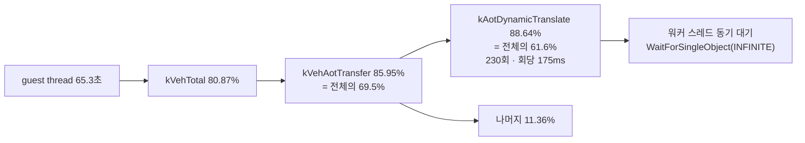

# 20260727-326 작업 로그: AOT transfer 해석부 재분해 / Work log

설계: [20260727-326-aot-transfer-resolution-decomposition.md](../design/20260727-326-aot-transfer-resolution-decomposition.md)

작업 지시: [20260727-326-aot-transfer-resolution-decomposition.md](../work-orders/20260727-326-aot-transfer-resolution-decomposition.md)

## 한국어

### 결론 요약

**60초 동안 단 230회의 동적 번역이 guest thread wall-clock의 61.6%를 소비합니다.**
호출당 평균은 `437,403,007 tick`, 2.5GHz 기준 약 **175ms**입니다.

Task 325 작업 로그에 미검증 가설로 적었던 `AccumulateAotResidency`는 **기각**됐습니다
(1.61%). `IsAotHleBoundaryAddress` 선형 탐색도 기각됐습니다(0.05%, 253,526회 호출에
호출당 243 tick).

전제를 코드로 재확인하는 과정에서 메커니즘이 드러났습니다.
`RequestAotDynamicTranslation`은 워커 스레드에 `SetEvent`를 보내고
`WaitForSingleObject(INFINITE)`로 **동기 대기**합니다. 따라서 측정된 175ms는 guest
thread가 **차단된 시간**이며, 실제 작업은 계측 범위 밖인 워커 스레드에서 일어납니다.

### 구현 개요

`ExecutionTimeBucket`에 두 축 10개 bucket을 append했습니다(기존 인덱스 보존).

* **handler 축** — `kAotWriteCompletion`, `kAotWriteFault`, `kAotReentry`,
  `kAotIndirect`, `kAotConditional`, `kAotReturn`. 각 handler 함수 최상단에 함수
  scope로 배치해 조기 `return`을 포함한 모든 경로를 덮습니다.
* **function 축** — `kAotTransferResolve`, `kAotHleBoundaryScan`,
  `kAotDynamicTranslate`, `kAotResidency`. 정의부에 계측해 모든 호출자를 한 bucket으로
  모읍니다.

`RequestAotDynamicTranslation`만 호출부 계측이며, 단축 평가 순서를 보존하기 위해
조건식을 지역 변수로 받은 뒤 분기합니다.

보고에서 두 축을 **서로 더하지 않습니다.** 각각 `kVehAotTransfer` 대비 비율로만
표현합니다. `kVehResidual` 계산 루프도 Task 326 bucket 앞에서 멈추도록 수정했습니다.
새 bucket은 `kVehAotTransfer`의 분해이므로 포함하면 과다 차감됩니다.

### 검증 결과

1. Win32 x86 Debug 전체 빌드 통과.
2. `repiu_aot_probe` 전체 통과. 신규 `execution_time_profile_nested_axes=true`와
   확장된 인덱스 안정성 검증 포함 11개 그룹 모두 `true`.
3. 60초 `aot-dbt` ON/OFF 각 1회. 두 실행 모두 정상 timeout, AOT legacy fallback 0,
   malformed dispatch 0, EEPROM SHA-256 `A1FC1D...52570` 일치.

이번 ON/OFF 처리량 차이는 progress `20,893 : 24,233`, heartbeat `321,690 : 357,421`로
약 -10%였습니다. Task 325의 같은 비교가 -64%였던 것은 계측 부담이 아니라 실행 간
편차였음이 이로써 확인됩니다.

### function 축 (`kVehAotTransfer` 대비)

`kVehAotTransfer = 113,492,914,525 tick`, 분모 `kGuestRunTotal = 163,275,848,719 tick`
(약 65.3초). `kVehAotTransfer`는 VEH의 85.95%, 전체의 69.5%입니다.

| bucket | count | TSC tick | transfer 대비 | 호출당 tick |
|---|---:|---:|---:|---:|
| `kAotTransferResolve` | 39,033 | 101,316,541,435 | 89.27% | 2,595,663 |
| **`kAotDynamicTranslate`** | **230** | **100,602,691,609** | **88.64%** | **437,403,007** |
| `kAotResidency` | 55,507 | 1,824,260,296 | 1.61% | 32,865 |
| `kAotHleBoundaryScan` | 253,526 | 61,688,471 | 0.05% | 243 |

`kAotTransferResolve`의 89.27%는 사실상 전부 `kAotDynamicTranslate`입니다. 즉
transfer 해석 자체는 싸고, **번역 대기만 비쌉니다.**

### handler 축 (`kVehAotTransfer` 대비)

| bucket | 비율 |
|---|---:|
| `kAotReentry` | 56.55% |
| `kAotIndirect` | 42.55% |
| `kAotReturn` | 14.11% |
| `kAotWriteCompletion` | 0.24% |
| `kAotWriteFault` | 0.02% |
| `kAotConditional` | 0.01% |

합계가 113.48%로 100%를 넘습니다. `HandleAotIndirectTransfer`와
`HandleAotReturnTransfer`가 DBT thunk adapter에서도 호출되어 `kVehAotTransfer` **밖**
호출까지 정의부 계측에 포함되기 때문입니다. 설계 3절이 예고한 현상이며, handler 축은
배타적 분해가 아니라 참고 지표로만 해석합니다.

### 판정

| gate | 관측 | 판정 |
|---|---:|---|
| `kAotResidency` >= 50% | 1.61% | **기각.** Task 325 가설 폐기 |
| `kAotDynamicTranslate` >= 50% | 88.64% | **성립** |
| `kAotHleBoundaryScan` >= 30% | 0.05% | 기각 |

gate가 전제한 인과를 코드로 재확인했고, 그 과정에서 **전제를 한 단계 수정해야 함**을
확인했습니다. gate 2는 "bucket이 실제 plan 생성/emit을 수행"을 전제했지만,
`RequestAotDynamicTranslation`은 생성을 **직접 수행하지 않고** 워커 스레드에 위임한 뒤
무한 대기합니다. 따라서 "번역 빈도를 줄인다"는 원래 후속 계획은 아직 확정할 수
없습니다. 대기 시간이 워커의 CPU 작업인지 스케줄링 지연인지에 따라 해법이 다릅니다.

### 미확정 / Unresolved

* **175ms의 정체가 미확정입니다.** 두 후보가 있습니다.
  * 워커 CPU 작업. 다만 `docs/analysis/aot-code-cache-emission.md`가 기록한 정적
    plan 생성 평균은 `7,847.2us`로 22배 차이가 납니다.
  * 스케줄링 지연. 이 기기는 2코어이고 guest thread, 워커, SDL 메인 스레드, 오디오,
    poll thread가 경합합니다.
  두 원인은 해법이 전혀 다르므로(전자는 번역 자체를 싸게/작게, 후자는 rendezvous
  제거나 비동기화) 계측 전에는 확정하지 않습니다.
* Task 323 이래의 계측은 **guest thread만** 봅니다. 워커 스레드 시간은 설계상 범위
  밖이며, 이번 결과는 그 경계를 넘어야 함을 처음으로 요구합니다.
* handler 축은 위 이유로 배타적이지 않습니다.
* Debug 빌드 측정입니다. 번역 작업량은 Release에서 줄어들지만 스케줄링 지연은
  빌드 구성과 무관합니다.

---

## English

### Summary

Just 230 dynamic translations consume 61.6% of guest-thread wall clock over 60 seconds,
averaging `437,403,007` ticks or about **175ms** each. The `AccumulateAotResidency`
hypothesis recorded in the Task 325 log is rejected at 1.61%, and the linear
`IsAotHleBoundaryAddress` scan is rejected at 0.05% despite 253,526 calls.

Re-checking the gate's causal premise against the code revealed the mechanism:
`RequestAotDynamicTranslation` signals a worker thread and then blocks in
`WaitForSingleObject(INFINITE)`. The measured 175ms is therefore guest-thread **blocked
time**, with the actual work happening on a worker thread that the instrumentation, which
covers only the guest thread, cannot see.

### Implementation

Ten buckets were appended across two axes, preserving existing indices. The handler axis
places a function-scope timer at the top of each of the six handlers; the function axis
instruments `ResolveAotTransferTarget`, `IsAotHleBoundaryAddress`, and
`AccumulateAotResidency` at their definitions so every caller is captured.
`RequestAotDynamicTranslation` is measured at its call site, with the condition taken into a
local first to preserve short-circuit ordering. Reporting never sums the two axes; each is a
share of `kVehAotTransfer` alone. The `kVehResidual` loop now stops before the Task 326
buckets, which would otherwise over-subtract since they decompose `kVehAotTransfer`.

### Verification

The full Win32 x86 Debug build and `repiu_aot_probe` passed, including the new
`execution_time_profile_nested_axes` check and extended index stability. Both 60-second
`aot-dbt` runs reached their timeout with zero AOT legacy fallback, zero malformed dispatch,
and a matching EEPROM SHA-256. Profiled versus unprofiled throughput differed by about 10%
this time (progress 20,893 against 24,233), confirming that Task 325's 64% gap was
run-to-run variance rather than instrumentation cost.

### Results

`kVehAotTransfer` held 85.95% of VEH time and 69.5% of the `163,275,848,719` tick
denominator. On the function axis, `kAotTransferResolve` took 89.27% across 39,033 calls and
`kAotDynamicTranslate` 88.64% across only 230 calls, so essentially all of transfer
resolution is the translation wait; resolution itself is cheap. `kAotResidency` took 1.61%
across 55,507 calls and `kAotHleBoundaryScan` 0.05% across 253,526.

On the handler axis, `kAotReentry` took 56.55%, `kAotIndirect` 42.55%, `kAotReturn` 14.11%,
and the rest under 0.3%. The shares sum to 113.48% because `HandleAotIndirectTransfer` and
`HandleAotReturnTransfer` are also called from the DBT thunk adapters outside
`kVehAotTransfer`, a consequence the design anticipated; the handler axis is therefore
indicative rather than an exclusive decomposition.

### Gates

`kAotDynamicTranslate` holds at 88.64%; `kAotResidency` and `kAotHleBoundaryScan` are
rejected. Re-checking the premise showed it needs amending: gate two assumed the bucket
performs plan construction and emission, but `RequestAotDynamicTranslation` delegates to a
worker and waits indefinitely instead. The originally planned follow-up of reducing
translation frequency therefore cannot be fixed yet, because the remedy differs depending on
what the wait consists of.

### Unresolved

The composition of the 175ms is unresolved between worker CPU work — though the static plan
build average recorded in `aot-code-cache-emission.md` is `7,847.2us`, a 22x difference — and
scheduling latency on this two-core machine where the guest thread, worker, SDL main thread,
audio, and poll thread contend. The remedies diverge completely, so neither is adopted before
measurement. All instrumentation since Task 323 observes only the guest thread, and this
result is the first to require crossing that boundary. The handler axis is non-exclusive for
the reason above. These are Debug-build figures; translation work shrinks in Release while
scheduling latency does not.
