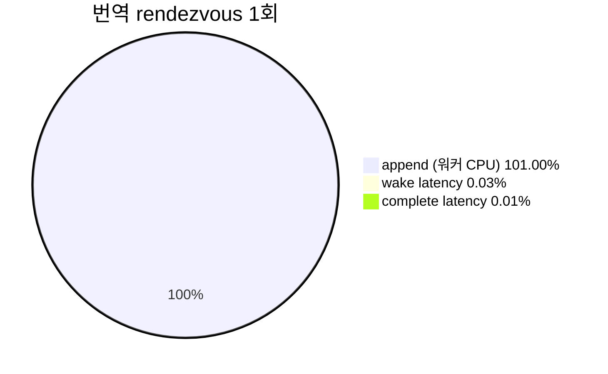

# 20260727-327 작업 로그: 번역 워커 타이밍 계측 / Work log

설계: [20260727-327-translation-worker-timing.md](../design/20260727-327-translation-worker-timing.md)

작업 지시: [20260727-327-translation-worker-timing.md](../work-orders/20260727-327-translation-worker-timing.md)

## 한국어

### 결론 요약

**스케줄링 지연은 아닙니다. 워커 CPU 작업입니다.**

rendezvous 전체 중 wake latency는 0.03%, complete latency는 0.01%로 합쳐서
**0.04%** 입니다. `AppendWin32DynamicAotTranslation` 하나가 사실상 전부입니다.
번역 1회 평균은 `648,258,796 tick`(2.5GHz 기준 약 **259ms**), 최댓값은
`1,756,401,133 tick`(약 **702ms**)입니다.

따라서 후속 방향은 rendezvous 제거가 아니라 **번역 자체를 싸게 또는 작게 만드는 것**
으로 확정됩니다.

### 구현 개요

1. 신규 모듈 `aot_worker_timing.{h,cpp}` — `Win32AotWorkerTimingProfile`과 누적
   helper. **원자 연산과 잠금을 쓰지 않습니다.** 측정 대상이 지연이므로 계측이
   지연을 바꾸면 안 되며, 정확성은 `SetEvent`/`WaitForSingleObject`가 이미 제공하는
   happens-before에 의존합니다.
2. `RequestAotDynamicTranslation` — `SetEvent(request)` **직전** `T0`,
   `WaitForSingleObject` 복귀 후 `T3`.
3. `AotTranslationWorkerProc` — 기상 직후 `T1`(다른 작업보다 먼저),
   `BuildWin32AotSegmentTable`과 `AppendWin32DynamicAotTranslation` 개별 계측,
   `SetEvent(complete)` **직전** `T2`. shutdown 경로는 누적하지 않습니다.
4. 비translate 작업(`kPatchInlineCache`, `kRetireGuestPage`)은 횟수만 셉니다.
5. loader summary와 신규 `aot_worker_timing_probe`.

### 검증 결과

1. Win32 x86 Debug 전체 빌드 통과.
2. `repiu_aot_probe` 전체 통과. 신규 `aot_worker_timing_all=true` 포함 12개 그룹 모두
   `true`. probe는 합성 타임스탬프로 rendezvous를 재현해 네 구간, TSC 역행 clamp,
   기타 작업 계수, null profile 무반응을 검증합니다.
3. 60초 `aot-dbt` ON/OFF 각 1회. 두 실행 모두 정상 timeout, malformed dispatch 0,
   EEPROM SHA-256 `A1FC1D...52570` 일치. OFF는 `enabled=false`, 카운터 0.

### rendezvous 분해 (60초, translate 155회)

| 구간 | TSC tick | `guest_total` 대비 |
|---|---:|---:|
| `wake_latency` | 29,370,957 | 0.03% |
| `segment_table` | 1,281,539 | 0.00% |
| **`append`** | **101,483,040,007** | **101.00%** |
| `complete_latency` | 8,426,364 | 0.01% |
| `guest_total` | 100,480,113,460 | 100% |

| 지표 | 값 | 환산 |
|---|---:|---|
| 번역당 `guest_total` 평균 | 648,258,796 tick | 약 259ms |
| 번역당 `append` 평균 | 654,729,290 tick | 약 262ms |
| `append` 최댓값 | 1,756,401,133 tick | 약 **702ms** |
| `wake_latency` 최댓값 | 8,519,045 tick | 약 3.4ms |
| 번역 요청 간격 평균 | 1,034,133,371 tick | 약 414ms |

### 판정

| gate | 관측 | 판정 |
|---|---:|---|
| `wake + complete latency` >= 50% | 0.04% | **기각.** rendezvous 제거는 답이 아님 |
| `append` >= 50% | 101.00% | **성립** |
| `segment_table` >= 20% | 0.00% | 기각 |
| 잔여 >= 30% | 0.00% | 기각 |

gate 전제를 코드로 재확인했습니다. `append`는 `AppendWin32DynamicAotTranslation`
호출만 감싸며 plan 생성·emit·placement·page protection을 실제로 수행합니다.

### 확인됨 / Confirmed

* 2코어 기기에서 5개 스레드가 경합함에도 워커 기상 지연은 평균 189,490 tick(약
  76us), 최대 3.4ms에 그칩니다. 스케줄링은 병목이 아닙니다.
* 정적 plan 생성 평균이 `7,847.2us`인데 런타임 번역은 평균 259ms로 **33배** 큽니다.
  정적 측정은 전체 이미지 1회 생성이고 런타임은 target별 동적 append이므로 같은
  작업이 아니지만, 이 격차 자체가 `append` 내부 재분해의 근거입니다.

### 미확정 / Unresolved

* `append` 내부에서 plan 생성·emit·placement·page protection의 비중은 아직
  나누지 않았습니다. 다음 작업 대상입니다.
* `append` 합계가 `guest_total`의 101.00%로 100%를 약간 넘습니다. 워커가 완료했지만
  guest가 재개하지 못한 rendezvous가 1~2회 있으면 이렇게 됩니다. 60초 timeout이
  대기 중인 guest thread를 정리하는 경로가 유력하지만 확인하지 않았습니다. 차이가
  1% 수준이므로 결론에는 영향이 없습니다.
* 비translate 작업이 **4,480회** 같은 event 쌍을 사용합니다. 이번 계측은 횟수만
  세고 그 rendezvous 비용은 재지 않았습니다. translate의 wake latency 평균을 그대로
  적용하면 무시할 수 없는 양이 될 수 있으므로 별도 확인이 필요합니다.
* 이번 ON/OFF는 progress `10,188 : 8,199`로 ON이 오히려 높았습니다. 실행 간 편차가
  크다는 Task 325~326의 관찰과 일치하며, 이 쌍도 계측 부담 측정에 쓰지 않습니다.
* Debug 빌드 측정입니다. `append`는 워커 CPU 작업이므로 Release에서 상당히 줄어들
   수 있습니다. 이 절대값을 Release 기준으로 인용하지 않습니다.

---

## English

### Summary

The 175ms is not scheduling latency; it is worker CPU work. Wake latency accounts for 0.03%
of the rendezvous and completion latency 0.01%, together 0.04%, while
`AppendWin32DynamicAotTranslation` accounts for essentially all of it. One translation
averages `648,258,796` ticks (about 259ms) and peaks at `1,756,401,133` (about 702ms). The
follow-up is therefore making translation cheaper or smaller, not removing the rendezvous.

### Implementation

A dedicated `aot_worker_timing` module accumulates the four intervals using no atomics and no
locks, because latency is the quantity under measurement and correctness already follows from
the happens-before that `SetEvent` and `WaitForSingleObject` provide. `T0` is taken
immediately before signalling the request and `T3` after the guest resumes; the worker takes
`T1` before anything else on wake, times the segment table build and the append separately,
and takes `T2` immediately before signalling completion. The shutdown path accumulates
nothing, and non-translate operations are counted only.

### Verification

The full Win32 x86 Debug build and `repiu_aot_probe` passed, twelve probe groups including the
new `aot_worker_timing_all`, whose synthetic replay covers the four intervals, the
backwards-TSC clamp, other-operation counting, and null tolerance. Both 60-second `aot-dbt`
runs reached their timeout with zero malformed dispatch and a matching EEPROM SHA-256, and the
off run reported the profile disabled with zero counters.

### Results and gates

Across 155 translations, `append` held 101.00% of `guest_total`, `wake_latency` 0.03%,
`complete_latency` 0.01%, and `segment_table` 0.00%. The second pre-registered gate holds and
the first is rejected: removing the rendezvous is not the answer. Worker wake latency averaged
189,490 ticks (about 76us) and peaked at 3.4ms even with five threads on two cores, so
scheduling is not the bottleneck. Runtime translation at 259ms average is 33x the `7,847.2us`
documented static plan build; the two are not the same operation, since one builds a whole
image once and the other appends per target, but the gap itself motivates decomposing
`append`.

### Unresolved

The split inside `append` between plan construction, emission, placement, and page protection
is the next target. The `append` total slightly exceeds `guest_total` at 101.00%, consistent
with one or two rendezvous whose worker side completed while the guest never resumed, most
likely the 60-second timeout tearing down a waiting guest thread, though this was not
confirmed; at roughly 1% it does not affect the conclusion. Non-translate operations use the
same event pair 4,480 times and only their count was recorded, so their rendezvous cost needs
separate measurement before being dismissed. This pair showed the profiled run ahead of the
unprofiled one, consistent with the run-to-run variance seen in Tasks 325 and 326, so it is
again not used to measure instrumentation cost. These are Debug-build figures, and `append`
being worker CPU work may shrink substantially in Release, so the absolute values are not
quoted as Release figures.
