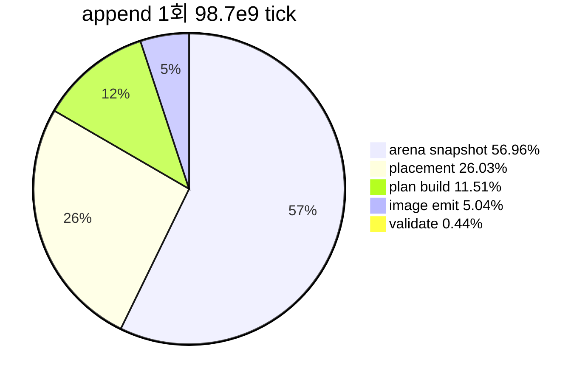

# 20260727-328 작업 로그: 동적 append 단계 분해 / Work log

설계: [20260727-328-dynamic-append-phase-decomposition.md](../design/20260727-328-dynamic-append-phase-decomposition.md)

작업 지시: [20260727-328-dynamic-append-phase-decomposition.md](../work-orders/20260727-328-dynamic-append-phase-decomposition.md)

## 한국어

### 결론 요약

**가설이 확인됐습니다.** guest arena 전체 스냅샷이 append의 **56.96%** 입니다.
placement 26.03%에는 같은 133.8MB 버퍼의 해제 비용이 포함되므로(아래 귀속 주의),
스냅샷 생애주기 전체는 **57~83%** 사이입니다.

규모 축은 두 번째 결론을 줍니다. 번역 1회는 평균 **명령 1,039개**를 다루고
**7,830바이트**를 emit하는데, 그걸 위해 **140,341,248바이트(133.8MB)** 를 복사합니다.
emit 바이트 대비 **17,924배**, 명령 하나당 135KB입니다.

따라서 **"번역 단위를 줄인다"는 역효과**입니다. 단위를 줄이면 번역 횟수가 늘고
스냅샷 133.8MB는 매번 그대로이므로 총 비용이 오히려 증가합니다. 고쳐야 할 것은
단위가 아니라 **스냅샷 범위**입니다.

### 검증 결과

1. Win32 x86 Debug 전체 빌드 통과.
2. `repiu_aot_probe` 전체 통과. 신규 `aot_worker_timing_append_phases=true` 포함
   12개 그룹 모두 `true`. probe는 완전 append와 조기 실패 append 두 표본으로
   부분 단계도 누적되는지 검증합니다.
3. 60초 `aot-dbt` ON/OFF 각 1회. 두 실행 모두 정상 timeout, malformed dispatch 0,
   EEPROM SHA-256 `A1FC1D...52570` 일치. OFF는 `enabled=false`, 카운터 0.
   progress는 `9,293 : 9,958`로 약 -6.7%였습니다.

### 단계 분해 (60초, append 139회)

`append` 총 `98,708,837,764 tick`.

| 단계 | TSC tick | `append` 대비 | 회당 평균 |
|---|---:|---:|---:|
| **`arena_snapshot`** | **56,228,955,541** | **56.96%** | 404,524,860 (약 162ms) |
| `placement` | 25,689,303,335 | 26.03% | 184,814,412 (약 74ms) |
| `plan_build` | 11,360,318,775 | 11.51% | 81,728,912 (약 33ms) |
| `image_emit` | 4,975,869,709 | 5.04% | 35,797,624 (약 14ms) |
| `validate` | 429,472,289 | 0.44% | 3,089,728 |
| residual | 24,918,115 | 0.03% | — |

스냅샷 1회 최댓값은 `578,038,551 tick`(약 **231ms**)입니다.

### 규모 축 (append 139회 평균)

| 항목 | 값 |
|---|---:|
| plan 블록 수 | 310 |
| plan 명령 수 | **1,039** |
| emit 바이트 | **7,830** |
| 스냅샷 바이트 | **140,341,248** |
| 최대 plan 명령 수 | 5,947 |

60초 동안 스냅샷으로만 약 **19.5GB**를 복사했고, zero-fill과 해제를 더하면 메모리
트래픽은 그 두세 배입니다.

### 판정

| gate | 관측 | 판정 |
|---|---:|---|
| `arena_snapshot` >= 50% | 56.96% | **성립** |
| `plan_build` >= 50% | 11.51% | 기각 |
| `image_emit` >= 50% | 5.04% | 기각 |
| `placement` >= 50% | 26.03% | 기각(단, 아래 귀속 주의) |
| 어느 것도 40% 미만 | 해당 없음 | — |

gate 전제를 코드로 재확인했습니다. `arena_snapshot` 구간은
`object.memory.resize(runtime_size)`와 `ReadProcessMemory` 두 호출만 감싸며,
`runtime_size`는 `placed_size = 0x085D7000`입니다.

### 귀속 주의 (착수 전 문서화)

`append_phase_commit`을 `snapshot`보다 **먼저** 선언했으므로 소멸 순서상 `snapshot`이
먼저 파괴됩니다. 즉 **133.8MB 벡터 해제 비용이 `placement`에 집계됩니다.** 이 사실은
측정 전에 확인해 기록했고, 측정을 오염시키지 않기 위해 해제를 앞당기는 수정은 하지
않았습니다(관측 전용 원칙).

따라서 `placement` 26.03% 중 상당 부분이 스냅샷 해제일 가능성이 높지만 **분리해
측정하지 않았으므로 확정하지 않습니다.** 스냅샷 생애주기 전체 비중은
`56.96% ~ 83%` 구간으로만 말할 수 있습니다.

### 확인됨 / Confirmed

* 이 비용은 **Debug 빌드 왜곡이 아닙니다.** 133.8MB zero-fill, `ReadProcessMemory`
  복사, 해제는 메모리 대역폭과 syscall 비용이므로 최적화 수준과 무관합니다. 이번
  측정 사슬에서 Debug 과대평가 우려가 적용되지 않는 유일한 항목입니다.
* 번역 단위(명령 1,039개)는 비정상적으로 크지 않습니다. 문제는 단위가 아니라
  단위와 무관하게 고정된 133.8MB 스냅샷입니다.

### 미확정 / Unresolved

* `placement` 26.03%의 내역. 스냅샷 해제와 실제 placement 작업(cache 복사, fixup,
  address map 등록, page protection)의 비중을 나누지 않았습니다.
* `plan_build` 11.51%(회당 33ms)로 명령 1,039개를 처리하는 것은 명령당 약 32us이며,
  이는 Zydis decode 비용으로 설명하기에 여전히 큽니다. 다만 현재 우선순위가 아닙니다.
* 실행 간 편차가 크므로(Task 325~327) 이번 ON/OFF 쌍도 계측 부담 측정에 쓰지
  않습니다.

---

## English

### Summary

The hypothesis is confirmed: the full guest-arena snapshot accounts for 56.96% of one append.
Because the same 133.8MB buffer's deallocation lands in `placement` (an attribution caveat
recorded before measurement), the snapshot's whole lifecycle is between 56.96% and 83%.

The scale axis gives a second conclusion. One translation handles an average of 1,039
instructions and emits 7,830 bytes, yet copies 140,341,248 bytes to do it — 17,924 times the
emitted size, or about 135KB snapshotted per translated instruction. Shrinking the translation
unit would therefore make things worse: more translations, each still copying the same 133.8MB.
The unit is not the problem; the snapshot range is.

### Verification

The full Win32 x86 Debug build and `repiu_aot_probe` passed, twelve groups including the new
`aot_worker_timing_append_phases`, whose two samples cover a complete append and an
early-failing one so partial phases are shown to accumulate. Both 60-second `aot-dbt` runs
reached their timeout with zero malformed dispatch and a matching EEPROM SHA-256, and the off
run reported the profile disabled with zero counters.

### Results

Across 139 appends totalling `98,708,837,764` ticks: `arena_snapshot` 56.96% (about 162ms
each, peaking at 231ms), `placement` 26.03%, `plan_build` 11.51%, `image_emit` 5.04%,
`validate` 0.44%, residual 0.03%. Average scale per append was 310 blocks, 1,039 instructions,
7,830 emitted bytes, and 140,341,248 snapshotted bytes, with a 5,947-instruction maximum. Over
60 seconds the snapshots alone copied about 19.5GB, several times that once zero-fill and
deallocation are included.

The first pre-registered gate holds and the others are rejected. The premise was re-checked:
the `arena_snapshot` region wraps only `object.memory.resize(runtime_size)` and
`ReadProcessMemory`, with `runtime_size` equal to the placed size `0x085D7000`.

### Attribution caveat, documented before measuring

`append_phase_commit` is declared before `snapshot`, so `snapshot` is destroyed first and the
133.8MB vector's deallocation is counted in `placement`. This was identified before the run and
deliberately left unfixed, since moving the free earlier would be a behavior change in an
observation-only task. A large share of `placement` is therefore probably that deallocation,
but it was not measured separately and is not claimed.

### Confirmed and unresolved

This cost is not a Debug artifact: a 133.8MB zero-fill, `ReadProcessMemory` copy, and free are
memory bandwidth and syscall costs, independent of optimization level. It is the one item in
this measurement chain to which the Debug-inflation caveat does not apply. The composition of
`placement` remains unsplit, and `plan_build` at 33ms for 1,039 instructions is about 32us per
instruction, still large for Zydis decoding but not the current priority. Run-to-run variance
means this on/off pair is again not used to measure instrumentation cost.
