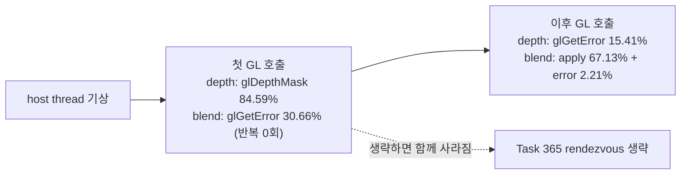

# 20260730-364 Glide setter 반복률/phase 귀속 작업 로그 / Work log

* 설계: [20260730-364-glide-setter-state-census.md](../design/20260730-364-glide-setter-state-census.md)
* 작업 지시: [20260730-364-glide-setter-state-census.md](../work-orders/20260730-364-glide-setter-state-census.md)
* 상위 계획: [20260730-363-glide-call-performance-plan.md](../design/20260730-363-glide-call-performance-plan.md)
* 측정 산출물: `build/benchmarks/glide-setter-census/20260730-133716/` (로컬, Git 제외)

## 한국어

### 결과 요약

기본 OFF 계측 두 개를 추가하고 동일 바이너리 Release 60초 control/profile 3회씩으로
측정했습니다. 최적화는 구현하지 않았고 dispatch 결과도 바꾸지 않았습니다.

| 항목 | 중앙값 | 3회 범위 |
|---|---:|---:|
| control 프레임 | 1,074 | 1,061~1,076 |
| profile 프레임 | 1,044 | 1,021~1,047 |
| 관측자 delta | **-2.79%** | — |
| setter 반복률(`same/calls`) | **90.71%** | 90.65~90.72% |
| 생략 상한 (wall 대비) | 4.55% | 4.42~5.03% |
| 생략 상한 (Glide gate 대비) | **25.11%** | 23.98~26.96% |

### 질문 1 — `grDepthMask`의 실제 상태 변경 횟수

**확인됨:** 이 장면에서 `grDepthMask`(ordinal 98)는 중앙값 5,418회 호출 중
**72.63%가 직전 성공 적용과 정확히 같은 상태**였습니다. 실제 변경은 2,032회이고
최대 연속 반복은 9회, 고유 인수는 2종(`0`/`1`)뿐입니다.

`grDepthMask`는 오히려 반복률이 **낮은** 쪽입니다. census 대상 20개 중 13개가 99%를
넘고, 최다 호출 setter인 `grColorMask`는 6,161회 중 **99.95%**가 동일 상태이며 최대
연속 반복이 6,158회입니다.

| ordinal | API | 호출(중앙값) | 반복률 | 최대 연속 | 고유 인수 |
|---:|---|---:|---:|---:|---:|
| 91 | `grColorMask` | 6,161 | **99.95%** | 6,158 | 1 |
| 92 | `grConstantColorValue` | 6,146 | 77.67% | 456 | 8+ |
| 98 | `grDepthMask` | 5,418 | 72.63% | 9 | 2 |
| 138 | `grTexSource` | 5,099 | **32.24%** | 3 | 8+ |
| 131 | `grTexClampMode` | 5,099 | 99.73% | 1,382 | 8+ |
| 134 | `grTexFilterMode` | 5,099 | 99.73% | 1,382 | 8+ |
| 101 | `grFogMode` | 4,679 | 99.96% | 4,676 | 1 |
| 89 | `grClipWindow` | 4,674 | 99.96% | 4,672 | 1 |
| 79 | `grAlphaBlendFunction` | 4,674 | 99.94% | 4,669 | 2 |

`grTexSource`가 32.24%로 최저입니다. texture generation을 key에 넣었기 때문에
texture download를 가로지르는 잘못된 동일 판정이 배제된 결과이며, 이 setter는 실제로
프레임마다 서로 다른 texture를 지정합니다.

failure 0회, unsupported 0회, key overflow 0회, ordinal overflow 0회입니다. 즉 대상
목록이 정확하고 모든 호출이 host에 성공적으로 적용됐습니다.

### 질문 2 — host-work가 `glDepthMask`인가 `glGetError`인가

**G2 기각.** `glGetError`가 아닙니다.

| setter | GL 구간 phase | 중앙값 | 3회 범위 |
|---|---|---:|---:|
| `grDepthMask` | `apply`(`glDepthMask`) | **84.59%** | 60.37~85.23% |
| `grDepthMask` | `error`(`glGetError`) | 15.41% | 14.77~39.63% |
| `grAlphaBlendFunction` | `drain`(선행 `glGetError`) | 30.66% | 28.45~30.70% |
| `grAlphaBlendFunction` | `apply`(`glEnable`+`glBlendFunc`) | **67.13%** | 67.00~69.60% |
| `grAlphaBlendFunction` | `error`(후속 `glGetError`) | 2.21% | 1.95~2.30% |

**확인됨(그리고 이 작업의 가장 중요한 발견):** alpha blend의 선행 drain loop는 세
실행 모두 **반복 0회**입니다. 즉 그 30.66%는 `GL_NO_ERROR`를 즉시 반환하는
`glGetError` **한 번**의 비용입니다. 같은 함수 안의 후속 `glGetError`는 2.21%뿐이므로
동일한 호출이 위치에 따라 약 **14배** 차이가 납니다.

`grDepthMask`도 같은 구조입니다. 첫 GL 호출인 `glDepthMask`가 84.59%, 두 번째인
`glGetError`가 15.41%입니다.

**따라서 지배 비용은 특정 GL 함수가 아니라 rendezvous 기상 직후의 "첫 GL 접촉"입니다.**
어느 호출이 먼저 오든 그 호출이 비용을 흡수합니다. 이는 `glGetError`를 제거하는
방향이 답이 아니라는 뜻이고, 동시에 Task 365의 rendezvous 생략이 이 first-touch
비용을 **통째로** 없앤다는 뜻입니다.

**미확정:** GL 구간은 ordinal host work의 **58.53~67.26%**만 덮습니다. 나머지
32.74~41.47%는 `is_open` 검사, `message_` 대입, lambda·dispatch 비용입니다. 이 잔여를
더 나누지는 않았습니다.

### 질문 3 — 절감 가능한 실측 상한

**G3는 wall 기준으로 기각(4.55% < 5%), Glide gate 기준으로는 25.11%입니다.**

상한은 setter별로 `same_count × (backend_total_cycles / rendezvous_count)`로
계산했습니다. 동일 상태를 생략하면 rendezvous 1회가 온전히 사라지지만 gate 진입
자체(AOT→HLE 예외 경계)는 남기 때문에 gate 전체 구간이 아니라 rendezvous 평균을
씁니다.

**중요 — 장면 의존성:** 이번 자동 60초 실행은 부팅부터 시작하므로 `grLfbLock` 304회를
포함하며, 그 gate가 `8.18e9 cycle`로 Glide gate를 지배합니다. 그래서 census 대상
setter의 gate 합은 wall의 약 **5.57%**뿐이고(Task 363 기준 장면은 20.59%) 상한도 그에
비례해 희석됩니다. 반면 **Glide gate 대비 25.11%는 장면 구성에 덜 민감한 값**입니다.
Task 363의 LFB 없는 gameplay 장면에서는 wall 기준 상한이 훨씬 큽니다.

따라서 G3 미달은 "생략의 가치가 없다"가 아니라 "이번 장면에서는 LFB가 더 크다"는
뜻입니다. 판정은 설계 §6대로 기대 이득을 축소해 기록하고, Task 365는 계속 진행합니다.

### 검증

| gate | 결과 |
|---|---|
| C1 관측자 ±5% | 통과 (-2.79%) |
| C2 completed <= handled ordinal | 통과 |
| C3 malformed/fatal/issue/overflow/clamp = 0 | 통과 (base script + 신규 검사) |
| C4 `first+same+changed+failure+unsupported == calls` | 통과 (3회 전부) |
| C5 `drain+apply+error == total` | 통과 (두 setter, 3회 전부) |
| C6 `key_overflow == 0` | 통과 |
| C7 census 호출 수 == ordinal count | 통과 |
| C8 EEPROM 격리 seed | 통과 (base script) |

* `scripts/build_win32_x86.bat`: 통과
* `scripts/build_win32_x86_release.bat`: 통과
* `repiu_aot_probe.exe`: 두 구성 모두 exit 0, 신규 probe 2개 전부 true
* `scripts/task364_glide_setter_state_census.ps1 -Runs 3 -DurationSeconds 60`: 통과
* `VERSION`: `0.0.113` 유지

`distinct_overflow`는 세 실행 모두 0이 아닙니다(좌표·색상 setter가 8종을 넘음).
설계 C6대로 실패가 아니며 기록만 합니다.

### 구현 중 확인된 사실

* **gate id와 export ordinal은 다른 번호 공간입니다.** `grDepthMask`는 gate id 34,
  export ordinal 98입니다. 측정 script가 처음 34로 조회해 빈 값을 얻었고, 이름
  기준 조회로 고쳤습니다.
* census entry는 ordinal당 수백 바이트이고 배열이 256칸이므로, 초기 설계의
  값 복사 snapshot은 복사마다 약 100KB를 스택에 올려 probe에서 stack overflow를
  일으켰습니다. snapshot을 집계 전용으로 바꾸고 per-ordinal 항목은 profile에서 직접
  읽도록 고쳤습니다. `Win32MinimalExecutionAttempt`도 같은 양만큼 커지지 않습니다.
* 20초 실행은 요약을 남기지 못하고 exit 255로 끝납니다(계측과 무관, 재현). 측정은
  60초 기준으로만 유효합니다.

### 미확정

* 파생 커널 전이 추정치가 control 6.80%에서 profile 14.60%로, guest 실행 추정이
  60.96%에서 54.06%로 움직였습니다. 프레임은 -2.79%뿐이므로 관측자 gate는
  통과하지만, 이 파생 축의 차이 원인은 측정하지 않았습니다. 예외 횟수 census가
  실행 간에 달라지는 phase 편차일 가능성이 높습니다(추정).
* GL 구간이 덮지 않는 host work 32.74~41.47%의 내부 구성.
* 이번 장면과 Task 363 기준 장면의 setter/LFB 비중 차이를 같은 실행에서 직접 비교하지
  않았습니다.

### 다음 작업

1. **Task 365 진행** — G1이 압도적으로 성립합니다(대상 20개 중 13개가 99% 초과,
   전체 90.71%). 반복률이 높고 고유 인수가 1~2종인 `grColorMask`, `grFogMode`,
   `grClipWindow`, `grCullMode`, `grAlphaTestFunction`, `grDepthBufferFunction`,
   `grAlphaBlendFunction`부터 작은 묶음으로 적용합니다. 생략 규칙은 census가 이미
   사용한 규칙(성공 적용만 기록, failure/unsupported·context·render-buffer 무효화,
   texture generation 포함)을 그대로 씁니다.
2. **`grTexSource`는 생략 대상에서 제외** — 반복률 32.24%이고 최대 연속 3회입니다.
   함께 호출되는 clamp/filter/mipmap은 99.73%이므로 그쪽만 대상으로 합니다.
3. **`glGetError` 제거는 추진하지 않습니다** — G2가 기각됐습니다. 비용은 error
   검사가 아니라 rendezvous 이후 첫 GL 접촉이며, Task 365가 그것을 함께 제거합니다.
4. **Task 367의 장면 대표성 조건 추가** — wall 기준 판정은 LFB 유무에 좌우되므로,
   축 재귀속에서 LFB 있는 장면과 없는 장면을 분리해 보고합니다.

---

## English

### Result

Two disabled-by-default instruments were added and measured with three
same-binary 60-second Release control/profile runs each. No optimization was
implemented and no dispatch result changed. Median frames moved from 1,074 to
1,044, a **-2.79%** observer delta inside the ±5% gate.

### Question 1: how much setter traffic is an exact repeat

**Confirmed:** 90.71% of all state-setter calls exactly repeat the previously
applied state (range 90.65-90.72%), across 20 active setter ordinals. Thirteen
of the twenty repeat at over 99%.

`grDepthMask` (export ordinal 98) is on the low side, not the high side: 72.63%
of its median 5,418 calls repeat, with only two distinct argument values and a
longest run of nine. The highest-volume setter, `grColorMask`, repeats 99.95%
of 6,161 calls with a longest run of 6,158. The lowest is `grTexSource` at
32.24% — correctly so, because its key carries the texture generation, which
prevents a false match across a download.

There were zero failures, zero unsupported arguments, and zero key or ordinal
overflows, so the target list is right and every call landed on the host.

### Question 2: `glDepthMask` or `glGetError`

**G2 is rejected — it is not `glGetError`.** In the depth-mask OpenGL interval,
`glDepthMask` holds 84.59% (range 60.37-85.23%) against 15.41% for the trailing
error check. In alpha blend, the leading drain holds 30.66%, the state
application 67.13%, and the trailing error check only 2.21%.

**The finding that matters:** the alpha-blend drain loop iterated zero times in
all three runs, so its 30.66% is the cost of a *single* `glGetError` returning
`GL_NO_ERROR` — about fourteen times the cost of the identical call later in
the same function. Depth mask shows the same shape. The dominant cost is
therefore not any particular GL function but the **first GL touch after the
rendezvous wake**, whichever call happens to be first. That both rules out
removing `glGetError` and means Task 365's rendezvous elision removes this
first-touch cost entirely.

**Unresolved:** the instrumented OpenGL interval covers only 58.53-67.26% of
the ordinal's measured host work; the rest is the open check, the message
assignment, and dispatch, which were not decomposed further.

### Question 3: the measured ceiling

The ceiling is `same_count x (backend_total / rendezvous_count)` per setter,
using the mean rendezvous rather than the whole gate interval because an elided
repeat removes the backend round trip while the AOT-to-HLE gate entry remains.
It came to **4.55% of wall time** (4.42-5.03%) and **25.11% of the Glide gate**
(23.98-26.96%), so **G3 fails on the wall threshold and holds comfortably
against the gate**.

That split is scene-dependent, and the difference is the point. This automated
run starts from boot and therefore includes 304 `grLfbLock` calls whose gate
holds `8.18e9` cycles, so the census setters hold only about 5.57% of wall here
against 20.59% in the Task 363 capture. The gate-relative 25.11% is the figure
that travels between scenes. G3 failing means LFB is larger in *this* scene,
not that elision is not worth doing.

### Verification

Gates C1 through C8 all passed: observer delta -2.79%, completed ordinals never
exceeding handled gates, zero malformed/fatal/implementation-issue/overflow/
clamp counts, the identity `first+same+changed+failure+unsupported == calls` in
all three runs, the identity `drain+apply+error == total` for both setters in
all three runs, zero key overflow, census call totals equal to the independent
ordinal counts, and an isolated EEPROM seed. Both builds pass and the probe
suite exits 0 in both configurations with both new probes green. `distinct_overflow`
is nonzero in every run because the coordinate and color setters exceed eight
distinct values, which the design records rather than fails. `VERSION` stays
`0.0.113`.

### Found while implementing

Gate ids and export ordinals are different numbering spaces — `grDepthMask` is
gate id 34 and export ordinal 98 — which the measurement script initially got
wrong and now resolves by name. A census entry is a few hundred bytes across a
256-wide array, so the original by-value snapshot put about 100KB on the stack
per copy and overflowed the probe's stack; the snapshot now carries aggregates
only and the reporting path reads per-ordinal entries from the profile. A
20-second run exits 255 without emitting the summary, reproducibly and
independently of this instrumentation, so measurement is valid only at 60
seconds.

### Unresolved

The derived kernel-transition estimate moved from 6.80% (control) to 14.60%
(profile) and the derived guest-execution estimate from 60.96% to 54.06%, while
frames moved only -2.79%. The observer gate passes on frames, but the cause of
that derived-axis movement was not measured; run-to-run phase variance in the
exception census is the likely explanation and remains inferred. The non-GL
remainder of setter host work was not decomposed, and this scene was not
directly compared against the Task 363 scene within one run.

### Next

Task 365 proceeds: G1 holds overwhelmingly. It should start with the
high-repetition, one-or-two-value setters — `grColorMask`, `grFogMode`,
`grClipWindow`, `grCullMode`, `grAlphaTestFunction`, `grDepthBufferFunction`,
and `grAlphaBlendFunction` — reusing exactly the rules the census already
applied. `grTexSource` is excluded at 32.24% repetition, while the clamp,
filter, and mipmap setters called alongside it repeat at 99.73% and are good
targets. Removing `glGetError` is not pursued, because G2 was rejected and the
cost is the post-rendezvous first GL touch that Task 365 removes anyway.
Task 367 additionally has to report scenes with and without LFB separately,
since wall-relative verdicts depend on which one was captured.
