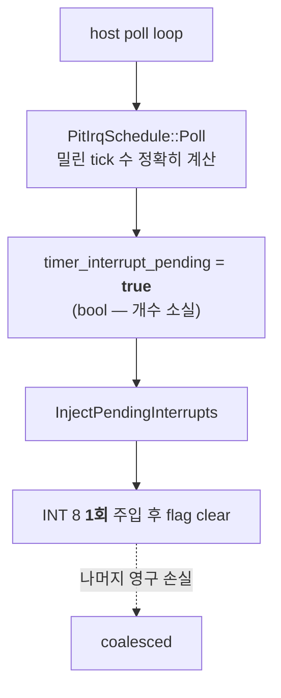

# 20260730-366 Timer tick 전달과 프레임 pacing 작업 로그 / Work log

* 설계: [20260730-366-timer-tick-delivery-and-frame-pacing.md](../design/20260730-366-timer-tick-delivery-and-frame-pacing.md)
* 작업 지시: [20260730-366-timer-tick-delivery-and-frame-pacing.md](../work-orders/20260730-366-timer-tick-delivery-and-frame-pacing.md)
* 근거: [Task 365 작업 로그](20260730-365-glide-setter-state-elision.md)
* 측정 산출물: `build/benchmarks/timer-tick-delivery/20260730-154554/` (로컬, Git 제외)

## 한국어

### 결론 요약

**가설 기각. 프레임은 timer tick 전달에 gated되지 않습니다.** 전달률을 올리자 프레임이
**오히려 16.4% 떨어졌습니다.** 사전 등록 판정 **T3**(따라잡기 불가)이 성립하고
T1·T2·T4는 모두 기각됐습니다.

| 항목 | backlog OFF (기본) | backlog ON | 판정 |
|---|---:|---:|---|
| 전달률 (`injected/due`) | **88.1%** | 91.8% | 올라감 |
| 프레임 중앙값 | **1,400** | 1,171 | **-16.36%** |
| 프레임 3회 범위 | 1,179~1,438 | 1,151~1,175 | 겹치지 않음 |
| 프레임당 tick | 8.06~8.67 | 10.17~10.30 | 더 줬는데 프레임은 감소 |
| 최대 backlog | 1 | **64 (상한)** | T3 |
| 상한 초과 폐기 | 96~111 | 1,029~1,076 | T3 |

### 새로 확인된 사실 — 기본 전달 결손

**확인됨: guest가 프로그램한 timer tick의 11.9%가 도달하지 않습니다**(3회 78.5/88.1/
88.2%, 중앙값 88.1%). guest는 divisor 4972 = 240Hz를 프로그램했고 schedule이 계산한
due는 216.9~219.4Hz인데(부팅 초반 저주파 구간이 평균을 낮춤) 실제 주입은
193.3~199.2Hz입니다.

이 값은 지금까지 한 번도 비교된 적이 없습니다. `last_timer_injection_ticks`가 누적
due를 갖고 있었지만 **종료 요약에 보고되지 않았기** 때문입니다.

### 손실 기전 (코드 감사로 확정)

`PitIrqSchedule::Poll`은 catch-up 방식이라 밀린 tick 수를 정확히 돌려주지만
`timer_interrupt_pending`이 `std::atomic<bool>`이므로 due가 3이든 10이든 guest는
`INT 8`을 한 번만 받습니다.

**항등식 M1은 6회 실행 모두 정확히 성립했습니다:**
`due == injected + coalesced + dropped + remaining`. 예: OFF run 1
`13,162 = 11,597 + 1,466 + 99 + 0`. 분해 경계가 옳습니다.

### 왜 더 주면 느려지는가 — 진짜 원인

전달률을 3.7%p 올리는 데 프레임 229개를 잃었습니다. 주입 자체가 그렇게 비쌀 수는
없으므로 원인을 확인했습니다.

| 지표 | OFF 중앙값 | ON 중앙값 | 변화 |
|---|---:|---:|---:|
| timer safe-point trap | 5,375 | 6,454 | **+20.1%** |
| breakpoint 중 timer trap 비중 | 2.53% | 3.34% | +0.81%p |
| 프레임당 예외 | 308.4 | 329.4 | **+6.8%** |

**확인됨: 비싼 것은 주입이 아니라 safe point가 상시 armed 상태로 유지되는 것입니다.**
기본 모드에서는 주입 직후 flag가 내려가 다음 poll(약 5ms 뒤)까지 safe point가 꺼져
있습니다. backlog 모드에서는 밀린 tick이 남아 있는 한 flag가 계속 서 있으므로
`ArmAotTimerSafePoint`가 사실상 상시 활성이고, guest가 그 hardware breakpoint를
계속 밟습니다.

즉 **이번 구현이 실패한 이유는 "tick을 더 준 것"이 아니라 "safe point를 계속 켜 둔
것"입니다.** 이 구분이 후속 설계에 중요합니다.

### 판정

* **T1 기각** — 전달률이 98%에 못 미쳤고 프레임도 오르지 않았습니다.
* **T2 기각** — 프레임이 5% 이상, 그것도 **아래로** 움직였습니다.
* **T3 성립** — backlog가 상한 64에 계속 붙고 1,029~1,076개가 폐기됐습니다. 호스트가
  240Hz를 따라잡지 못합니다.
* **T4 기각** — 기본 손실률이 11.9%로 존재합니다.

**따라서 Task 365가 연 질문 "무엇이 pacing하는가"에 대해 tick 전달은 답이 아닙니다.**
프레임당 tick이 8.06~8.67에서 10.17~10.30으로 늘었는데도 프레임이 줄었으므로, 게임이
tick을 프레임으로 환산한다는 관계는 **인과가 아니었습니다.**

### 검증

| gate | 결과 |
|---|---|
| M1 `due == injected + coalesced + dropped + remaining` | **통과 (6회 전부 정확히)** |
| M2 관측자 (counter만) | 통과 — counter는 상시 ON이고 기본 동작 불변 |
| M3 malformed/fatal/implementation issue = 0 | 통과 |
| M4 주입 1회의 의미 불변 | 통과 — push frame·IF/TF·미룸 조건 불변, 횟수만 변경 |
| M5 리듬 정확성 | **미수행** — 아래 미확정 참조 |
| M6 EEPROM 격리 | 통과 |

* `scripts/build_win32_x86.bat`, `scripts/build_win32_x86_release.bat`: 통과
* `repiu_aot_probe.exe`: 두 구성 exit 0, 신규 probe 8개 항목 전부 true
* `VERSION`: `0.0.113` 유지

### 코드 처리

counter는 **상시 유지**합니다. 실제 fidelity 결손을 재는 유일한 수단이고 비용이
무시할 수준입니다. backlog는 **기본 OFF opt-in으로 유지**하되 헤더에 측정 결과를
명시했습니다. 남긴 이유는 후속 설계(safe point를 켜 두지 않는 소진 방식)의 대조군이
필요하기 때문이며, **성능 향상을 기대하고 켜서는 안 됩니다.**

### 미확정

* **리듬 정확성(M5) — 우선순위 낮음으로 정정.** 사용자 관측에 따르면 **게임 타이밍의
  근거는 CD 재생 위치**입니다. CD 재생 위치가 없을 때 노트가 아예 움직이지 않는 것이
  과거에 관측됐습니다(Task 350이 실제 위치 전달을 구현한 배경). 따라서 노트 진행은
  `INT 8` 횟수가 아니라 CD 위치에 종속되며, **tick 손실 11.9%가 스텝-음악 어긋남의
  주원인일 가능성은 낮습니다.**

  다만 손실 자체는 확정 사실이고, `INT 8`이 관여하는 다른 항목(입력 polling 주기,
  애니메이션, 내부 timeout)에 대한 영향은 여전히 측정하지 않았습니다. 이 근거는
  사용자 관측이며 이번 작업에서 재측정하지 않았습니다.
* **무엇이 pacing하는가.** tick 전달이 아님은 확정됐지만 답은 여전히 없습니다.
* safe point를 상시 켜지 않고 backlog를 소진하는 설계가 가능한지.

### 다음 작업 제안

1. **safe-point 상시 arming 비용을 먼저 재는 것**이 값싸고 유망합니다. 이번 결과는
   safe point가 켜져 있는 시간에 비례해 예외가 늘어남을 보여줍니다(프레임당 예외
   +6.8%). Task 348 기계가 얼마를 쓰는지 자체를 귀속한 적은 없습니다.
2. **예외율 축**으로 돌아갑니다. 프레임당 예외가 308~331로 매우 높고, Task 336이
   TF/`INT3` 제거 상한을 1.38~1.44배로 잡았습니다. 두 번 연속 "비용을 줄여도 프레임이
   안 늘었다"가 나온 뒤 이번에 "예외를 늘리면 프레임이 준다"가 나왔으므로, **예외
   횟수가 현재 처리량과 직접 연동된 유일한 축**입니다.
3. 사용자 gameplay 캡처 결과를 받으면 Task 365 기본값과 함께 재판정합니다.

---

## English

### Result

**The hypothesis is rejected: frame rate is not gated by timer tick delivery.**
Raising delivery *lowered* frames by 16.4%. Pre-registered decision **T3** holds
and T1, T2, and T4 are all rejected.

Default delivery is 88.1% of owed ticks (78.5/88.1/88.2% across three runs), so
**11.9% of the timer ticks the guest programmed never reach it**. The guest
programmed divisor 4972 — 240 Hz — and the schedule owed 216.9-219.4 Hz once the
low-frequency boot period is averaged in, against 193.3-199.2 Hz actually
injected. These had never been compared before, because
`last_timer_injection_ticks` accumulated the owed count but was never reported at
exit.

Enabling the bounded backlog raised delivery to 91.8% and moved median frames from
1,400 to 1,171, with the two ranges (1,179-1,438 and 1,151-1,175) not overlapping.
Ticks per frame rose from 8.06-8.67 to 10.17-10.30 while frames fell, so the
apparent ticks-to-frames relationship was **not causal**. The backlog also pinned
at its cap of 64 with 1,029-1,076 ticks dropped, which is T3: the host cannot
sustain 240 Hz.

### The loss mechanism and the regression's real cause

`PitIrqSchedule::Poll` is a catch-up scheduler returning the exact number of ticks
owed, but `timer_interrupt_pending` is an `std::atomic<bool>`, so an owed count of
three or ten still produces one `INT 8`. The partition identity
`due == injected + coalesced + dropped + remaining` held exactly in all six runs
(for example `13,162 = 11,597 + 1,466 + 99 + 0`), confirming the decomposition.

Losing 229 frames to gain 3.7 points of delivery is far too expensive for the
injections themselves, and the counters say why: timer safe-point traps rose 20.1%
(5,375 to 6,454), their share of breakpoints rose from 2.53% to 3.34%, and
exceptions per frame rose 6.8% (308.4 to 329.4). **The cost is not delivering more
ticks; it is holding the safe point armed.** In the default mode the pending flag
clears after one injection and stays clear until the next poll about 5 ms later,
so the safe point is armed only briefly; with a backlog outstanding the flag stays
set, `ArmAotTimerSafePoint` is effectively always active, and the guest keeps
hitting that hardware breakpoint. That distinction matters for any follow-up.

### Verification

M1 passed exactly in all six runs; M2 holds because the counters are always on and
change no default behaviour; M3 and M6 passed; M4 holds because an injection's
meaning — pushed frame, IF and TF handling, deferral conditions — is unchanged and
only the count differs. **M5, rhythm accuracy, was not run.** Both builds pass and
the probe suite exits 0 in both configurations with all eight new checks green.
`VERSION` stays `0.0.113`.

The counters are kept always on as the only measure of the fidelity gap. The
backlog stays opt-in and default off, with the measured outcome recorded in its
header, retained as the control arm for a future drain that does not hold the safe
point armed — **not to be enabled expecting a speedup**.

### Unresolved

M5 is downgraded rather than left open. Per user observation, **game timing derives
from the CD playback position**: notes did not move at all when the playback
position was absent, which is what motivated Task 350's real-position delivery.
Note progression therefore depends on CD position rather than `INT 8` count, so the
11.9% tick loss is unlikely to be a principal cause of step-to-music drift. The
loss itself remains a confirmed fact, its effect on other `INT 8`-driven items —
input polling cadence, animation, internal timeouts — is still unmeasured, and this
rests on user observation rather than a measurement made here.

What paces the run remains unknown, now with tick delivery excluded, and whether a
backlog can be drained without holding the safe point armed is open.

### Next

Measuring what continuous safe-point arming costs is cheap and promising, since
this run shows exceptions scaling with how long it stays armed and the Task 348
machinery has never been attributed on its own. Beyond that the exception-rate axis
is now the strongest candidate: exceptions per frame are 308-331, Task 336 bounded
TF and `INT3` removal at 1.38-1.44x, and after two results where cutting cost did
not add frames, this one shows that *adding* exceptions removes them — making
exception count the one axis demonstrably coupled to throughput today.
