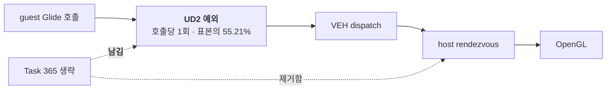

# 20260730-367 HLE boundary opcode 귀속 작업 로그 / Work log

* 설계: [20260730-367-hle-boundary-opcode-attribution.md](../design/20260730-367-hle-boundary-opcode-attribution.md)
* 작업 지시: [20260730-367-hle-boundary-opcode-attribution.md](../work-orders/20260730-367-hle-boundary-opcode-attribution.md)
* 근거: [Task 366 작업 로그](20260730-366-timer-tick-delivery-and-frame-pacing.md)
* 측정 산출물: `build/benchmarks/hle-boundary-opcodes/20260730-192730/` (로컬, Git 제외)

## 한국어

### 결론 한 줄

**최대 예외 인구는 guest 명령이 아니라 우리가 만든 Glide gate trap입니다.**
`0F 0B`(UD2)가 boundary 표본의 **55.21%** 이고, 그 횟수는 3회 실행 모두 **Glide gate
진입 횟수와 정확히 일치**했습니다. **Glide 호출 1회당 예외 1회**입니다.

### 무엇이 가려져 있었나

기존 census는 `bytes[0]`만 기록했습니다. 그런데 그 최다 항목 `0F`는 **두 바이트 opcode
escape**이고, 2·5위였던 `66`/`26`은 **prefix**입니다. 즉 상위 인구의 74%가 명령이
아니라 escape 바이트와 prefix로 집계되고 있었습니다.

prefix를 건너뛰고 `0F` 뒤 두 번째 바이트까지 기록하자 정체가 드러났습니다.

| opcode | 명령 | 중앙값 | 표본 대비 |
|---|---|---:|---:|
| **`0F 0B`** | **UD2 — Glide gate trap (우리 기계)** | **91,975** | **55.21%** |
| `8C` | `MOV r/m, Sreg` | 17,464 | 10.49% |
| `8E` | `MOV Sreg, r/m` | 16,009 | 9.62% |
| `ED` | `IN eAX, DX` | 11,841 | 7.11% |
| `EE` | `OUT DX, AL` | 5,381 | 3.23% |
| `CF` | `IRET` | 5,377 | 3.23% |
| `EF` | `OUT DX, eAX` | 4,681 | 2.81% |
| `88` | `MOV r/m8, r8` | 3,859 | 2.32% |

기계별로 묶으면 세 덩어리가 **88.5%** 입니다.

| 기계 | 표본 대비 | 성격 |
|---|---:|---|
| **Glide gate UD2** | **55.21%** | **우리 구현. 제거 가능성 있음** |
| segment register move (`8C`/`8E`) | 20.11% | guest 명령 |
| port I/O (`ED`/`EE`/`EF`) | 13.15% | guest 명령 |

### 결정적 확인 — UD2 == Glide gate 진입

| run | Glide gate 진입 | UD2 | 프레임 |
|---:|---:|---:|---:|
| 1 | 94,493 | 94,493 | 1,138 |
| 2 | 93,874 | 93,874 | 1,111 |
| 3 | 87,533 | 87,533 | 1,094 |

3회 모두 정확히 일치합니다. 앞선 단일 실행에서도 66,654 대 66,662(차이 8, 0.01%)로
일치했습니다. **Glide API 호출 하나가 예외 하나를 만듭니다.**

### 이것이 Task 365를 설명합니다

Task 365는 동일 상태 setter의 **host rendezvous**를 41,368회 없앴는데 프레임이 변하지
않았습니다. 이제 이유가 분명합니다. **생략은 rendezvous만 없앴고 gate 예외는 그대로
남았습니다.** 호출당 남은 비용이 UD2 예외 + VEH dispatch이며, 그것이 Glide 호출
비용의 지배분이었습니다.

### 현재 예외 축의 크기 — 재계산

Task 365의 방법 규칙(고정 비용 비중은 매번 재계산)에 따라 다시 셌습니다.

| 항목 | 값 |
|---|---:|
| 전체 예외 | 353,408~371,591 |
| 프레임당 예외 | **325.2** (중앙값) |
| breakpoint | 178,537~186,844 |
| single-step | 114,815~122,219 |
| `hle` provenance | 145,441~152,986 |
| **UD2가 전체 예외에서 차지하는 비중** | **약 24.9%** |

**Task 336의 상한은 더 이상 유효하지 않습니다.** 당시 VEH 진입 1,307,096회 기준으로
전이 비용을 27.7~30.4%, 상한을 1.38~1.44배로 잡았으나, 현재 예외는 약 370,000회로
**3.5배 줄었습니다.** 같은 전이 가격(`INT3` 34,521 tick)을 쓰면 전이 총비용은 전체
wall의 약 **6.4%** 이고 전이만 없앨 때 상한은 약 **1.07배**입니다.

**단, 전이 가격은 세션마다 최대 46% 흔들립니다**(Task 365). 그리고 예외 1회의 실제
비용은 커널 전이만이 아니라 VEH handler 본문을 포함하며, Task 347은 VEH 전체를
wall의 32.47%로 측정했습니다. Task 366이 프레임당 예외 **+6.8%** 에 프레임 **-16.4%**
를 관측한 것도 전이 가격만으로는 설명되지 않습니다.

**정정됨 — 탄력성 -2.4 인용은 철회합니다.** 최초 기록은 Task 366의 한 쌍에서 유도한
탄력성 약 -2.4를 인용하며 UD2 제거의 기대 이득이 크다고 적었습니다. **그러나 Task 366
자신의 결론이 그 프레임 손실의 원인을 예외 횟수가 아니라 safe point 상시 arming으로
지목했습니다.** 두 기전이 섞인 값이므로 예외 제거 이득 추정에 쓸 수 없습니다.

[Task 368 설계 §5.1](../design/20260730-368-exception-free-glide-gate-dispatch.md)의
비용 분해가 대신 답했습니다. 제거 가능량은 **wall의 3.67%, 프레임 상한 약 1.038배**
입니다. Glide 호출 1회 비용의 **84%가 gate 본체**이고 예외 overhead는 16.2%뿐이라,
예외를 없애도 gate가 하는 일은 그대로 남기 때문입니다. 탄력성 추정과 비용 모델이 크게
어긋난다는 사실 자체가 전자가 틀렸다는 증거입니다.

### 판정

**A1 성립** — 단일 클래스(Glide gate UD2)가 55.21%로 50%를 넘습니다. 설계 §6에 따라
**그 클래스를 exception-free로 처리하는 설계가 다음 작업**입니다.

**선례 주의:** Task 308이 exception-free HLE thunk를 시도해 progress `+1.64%`만
얻고 5배 gate에 실패한 적이 있습니다. 다만 그것은 Task 324/334 이전, 실행이 훨씬
느리고 예외 비중이 달랐던 시기이며 지표도 `progress`였습니다. **자동 기각하지 않되
그 결과를 사전 등록 gate에 반영해야 합니다.**

### 검증

| gate | 결과 |
|---|---|
| N1 census 표본 == other-boundary 수 | **통과 (3회, script가 검사)** |
| N2 provenance 합 + timer trap == breakpoint | **통과 (3회)** |
| N3 관측자 ±5% | 통과 — 계측만 추가, 프레임 중앙값 1,111 [1,094~1,138] |
| N4 malformed/fatal/issue/overflow = 0 | 통과 |
| N5 무변경 | 통과 — 세는 대상만 추가, 기존 histogram 유지 |

* prefix overflow 0, truncated 0, empty 0
* `scripts/build_win32_x86.bat`, `scripts/build_win32_x86_release.bat`: 통과
* `repiu_aot_probe.exe`: 두 구성 exit 0, 신규 probe 10개 항목 전부 true
* `VERSION`: `0.0.113` 유지

### 미확정

* UD2 예외 1회의 실제 비용(커널 전이 + VEH dispatch + gate 처리)을 분리하지
  않았습니다.
* segment register move 20.11%와 port I/O 13.15%의 제거 가능성은 검토하지
  않았습니다.
* Task 366이 남긴 safe-point 상시 arming 비용은 여전히 미측정입니다.
* 예외 탄력성 -2.4는 단일 관측점 유도값입니다.

### 다음 작업 제안

1. **Glide gate를 예외 없이 dispatch하는 설계.** guest 호출 규약·gate 진입 계수·
   ABI·호출 순서를 보존하면서 UD2 trap만 대체합니다. Task 308의 선례를 사전 등록
   gate에 명시하고, 판정 지표는 `progress`가 아니라 **프레임 3회 중앙값**으로 합니다.
2. **동시에 예외 1회 비용을 분해**해 두면, 제거 이득을 사전에 계산할 수 있습니다.
3. segment/port I/O는 그 뒤에 재판정합니다.

---

## English

### The finding

**The largest exception population is not a guest instruction but our own Glide
gate trap.** `0F 0B` (UD2) is 55.21% of boundary samples, and its count equalled
the Glide gate entry count exactly in all three runs (94,493 / 93,874 / 87,533).
**Each Glide API call costs one exception.**

The existing census recorded only `bytes[0]`, whose largest entry `0F` is the
two-byte opcode escape and whose second and fifth entries `66` and `26` are
prefixes — so 74% of the leading population was being counted as escape bytes and
prefixes rather than instructions. Resolving past prefixes and recording the second
byte identifies it: UD2 at 55.21%, `MOV r/m,Sreg` at 10.49%, `MOV Sreg,r/m` at
9.62%, `IN eAX,DX` at 7.11%, then `OUT DX,AL`, `IRET`, `OUT DX,eAX`, and
`MOV r/m8,r8`. Grouped by mechanism: the Glide gate trap at 55.21%, segment
register moves at 20.11%, and port I/O at 13.15% — 88.5% together.

### This explains Task 365

Task 365 removed 41,368 host rendezvous and frames did not move. The reason is now
clear: **elision removed the rendezvous but left the gate exception.** What remains
per call is the UD2 exception plus VEH dispatch, and that was the dominant part of
a Glide call's cost.

### Recomputing the exception axis

Per Task 365's method rule that a fixed cost's share must be recomputed after every
optimization, the axis was re-counted: 353,408-371,591 exceptions, a median 325.2
per frame, with 178,537-186,844 breakpoints and 114,815-122,219 single-steps. UD2
is about 24.9% of all exceptions.

**Task 336's bound no longer applies.** It put transitions at 27.7-30.4% of wall
and the bound at 1.38-1.44x against 1,307,096 VEH entries; the count is now about
370,000, **3.5 times fewer**. At the same transition price the total is about 6.4%
of wall and removing transitions alone bounds at roughly 1.07x. That price varies
by up to 46% between sessions (Task 365), and the real per-exception cost includes
the VEH handler body — Task 347 measured the whole VEH at 32.47% of wall — which is
why Task 366's 6.8% rise in exceptions per frame cost 16.4% of frames, far more than
the transition price alone explains.

**Inferred, from a single observation pair:** that pair implies an elasticity near
-2.4, which would make removing UD2 (about -24.9% of exceptions) worth a lot. It is
one data point in a system with no evidence of linearity, **so no number is
promised**; only a removal experiment can decide it.

### Decision and precedent

**A1 holds** — a single class exceeds 50% — so per the design an exception-free
design for the Glide gate is the next task. **Precedent to respect:** Task 308 tried
an exception-free HLE thunk and gained only 1.64% on `progress`, failing its 5x
gate. That was before Tasks 324 and 334, when execution was far slower and the
exception share differed, and it was judged on `progress` rather than frames. It
should not auto-reject this work, but it must be written into the pre-registered
gates, and the verdict must use three-run median frames.

### Verification

N1 (census samples equal the other-boundary count) and N2 (provenance plus timer
traps equal breakpoints) passed in all three runs and are enforced by the script;
N3 holds since only counting was added, N4 shows zero malformed, fatal,
implementation-issue, and overflow counts, and N5 is a counting-only diff with the
existing histogram retained. Prefix overflow, truncation, and empty samples were all
zero. Both builds pass and the probe suite exits 0 in both configurations with all
ten new checks green. `VERSION` stays `0.0.113`.

### Unresolved

The true cost of one UD2 exception — kernel transition plus VEH dispatch plus gate
handling — was not decomposed; the removability of the 20.11% segment-move and
13.15% port-I/O populations was not examined; Task 366's continuous safe-point
arming cost is still unmeasured; and the -2.4 elasticity rests on a single pair.
