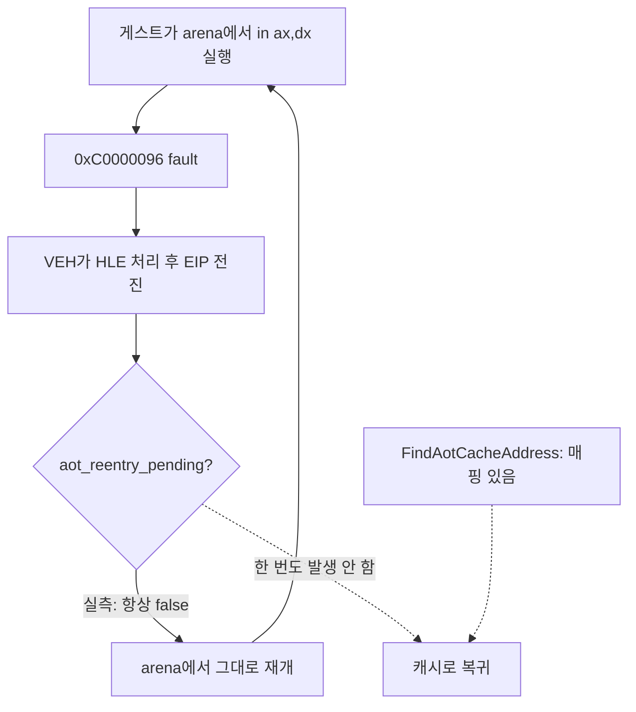

# 20260803-406 Port I/O arena 실행 원인 작업 로그 / Why Port I/O Runs in the Arena — Work Log

설계: [20260803-406](../design/20260803-406-port-io-arena-execution-cause.md)

작업 지시: [20260803-406](../work-orders/20260803-406-port-io-arena-execution-cause.md)

## 한국어

### 판정: 가설 D — 번역은 있는데 캐시로 돌아가지 않습니다

**번역 부재(C)는 기각됐습니다.** `REPIU_PORT_IO_CENSUS_MAPPING=1` 실행 3회 결과입니다.

| run | 프레임 | `0x0301DB22` count | cache | arena | **mapped** | **reentry** |
|---|---:|---:|---:|---:|---:|---:|
| 1 | 1 | 141,603 | 0 | 141,603 | 130,803 (92.4%) | **0** |
| **2** | **111** | **992,156** | **0** | **992,156** | **992,156 (100%)** | **0** |
| 3 | 1 | 222,367 | 0 | 222,367 | 213,567 (96.0%) | **0** |

**run-2에서는 992,156회 전부 AOT 캐시 매핑이 존재했고, 전부 arena에서 실행됐으며,
재진입이 한 번도 예약되지 않았습니다.** 2위 이하 주소도 같습니다(`mapped`가 `count`의
95~100%, `reentry` 0).

즉 이 코드는 **번역되어 있습니다.** 캐시에 들어갈 수 있는데 들어가지 않고, 들어가라고
지시하는 것도 없습니다.

`aot_reentry_pending`은 실행이 **캐시 경계에서 빠져나왔을 때** 세워집니다. 이 루프는
애초에 arena에서 돌고 있으므로 경계를 통해 나온 적이 없고, 따라서 예약도 없습니다.
Task 405에서 reentry funnel이 44,589건뿐인데 port I/O 예외가 1,034,948건이었던 것이
이것으로 설명됩니다.

### 비용

Task 405 측정 기준 이 축은 wall의 **41.9~49.7%**입니다. 루프가 캐시에서 돌면 그 안의
`in`은 dispatch slot을 타므로 예외 자체가 사라집니다.

### 검증

* Release 빌드 성공, `repiu_aot_probe` 종료 코드 0.
* **스위치 OFF 동작 불변 확인:** `mapped`/`reentry`가 0이고 `count`/`cache` 구조가
  Task 405와 동일합니다(최다 `0x0301DB22`, `cache` 0).
* 스위치 ON 3회에서 두 필드를 확보했습니다.
* pumpit1 45초 1회(스위치 OFF) **759 프레임**. 오늘 관측 범위 700~838 안이므로 회귀
  없습니다.
* 설계가 예고한 대로 ON 실행의 wall·프레임은 인용하지 않습니다.

### 다음 대상

**arena에서 HLE를 처리한 뒤, 다음 EIP에 캐시 매핑이 있으면 캐시로 진입하도록
하는 것**이 자연스러운 방향입니다. 다만 그대로 구현하면 안 되고 먼저 확인할 것이
있습니다.

1. **왜 애초에 arena에서 실행되고 있는가.** 이 루프에 처음 도달할 때 캐시로 들어가지
   못한 이유가 따로 있을 수 있습니다. 그 원인을 그대로 두고 복귀만 붙이면 같은 이탈이
   반복됩니다.
2. **중간 진입의 정확성.** 캐시 코드는 selector guard, segment fold, timer safe point를
   전제로 방출됩니다. 임의 지점 진입이 그 전제를 만족하는지 확인해야 합니다.
3. **Task 308 선례.** exception-free HLE가 progress `+1.64%`에 그친 적이 있으므로
   사전 등록 gate를 둡니다.

### 미확정

* 위 1번(최초 이탈 원인).
* 재번역이 요청 진입 주소를 address map에 남기지 못하는 조건(Task 404 이월).
* 격리 발생 조건.

---

## English

### Verdict: hypothesis D — the translation exists, execution just never returns

**Hypothesis C, missing translation, is rejected.** Three runs with
`REPIU_PORT_IO_CENSUS_MAPPING=1`:

| Run | Frames | `0x0301DB22` count | cache | arena | **mapped** | **reentry** |
|---|---:|---:|---:|---:|---:|---:|
| 1 | 1 | 141,603 | 0 | 141,603 | 130,803 (92.4%) | **0** |
| **2** | **111** | **992,156** | **0** | **992,156** | **992,156 (100%)** | **0** |
| 3 | 1 | 222,367 | 0 | 222,367 | 213,567 (96.0%) | **0** |

**In run 2 all 992,156 executions had a valid AOT cache mapping, all 992,156 executed in the
arena, and re-entry was never once scheduled.** Every other address behaves the same way,
with `mapped` at 95-100% of `count` and `reentry` at zero.

The code **is translated**. It could enter the cache and does not, and nothing tells it to.

`aot_reentry_pending` is set when execution leaves the cache **through a boundary**. This loop
is running in the arena to begin with, so it never left through a boundary and nothing is ever
scheduled. That explains Task 405's re-entry funnel showing only 44,589 attempts against
1,034,948 port I/O exceptions.

### Cost

On Task 405's measurements this axis is **41.9-49.7% of wall**. If the loop ran from the
cache, its `in` would take the dispatch slot and the exception would not exist at all.

### Verification

The Release build passed and the probe exited zero. **With the switch off** the behaviour is
unchanged: `mapped` and `reentry` read zero and the `count`/`cache` structure matches Task 405
exactly (top address `0x0301DB22`, `cache` zero). Three runs with it on produced the fields.
One 45-second pumpit1 run with the switch off rendered **759 frames**, inside today's 700-838
range, so no regression. As the design required, wall time and frame counts from the
switch-on runs are not quoted.

### Next target

The natural direction is **entering the cache after an arena-side HLE when the next EIP has a
mapping**, but three things come first. Why execution is in the arena at all — if the original
departure has its own cause, adding a return path only replays it. Whether entering mid-stream
is correct, since cache code is emitted assuming selector guards, folded segment bases, and
timer safe points. And Task 308's precedent, where exception-free HLE gained only 1.64% on
`progress`, which argues for a pre-registered gate.

### Unresolved

The original departure cause above; the condition under which a re-translation omits its
requested entry from the address map (carried from Task 404); and what decides whether
quarantine fires.
