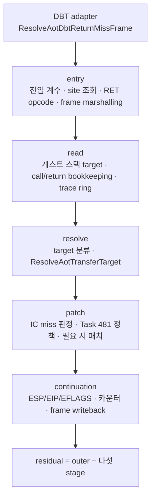

# Return 최적화 이후 병목 귀속 작업 로그

설계: [20260814-482-post-return-bottleneck-attribution.md](../design/20260814-482-post-return-bottleneck-attribution.md)

작업 지시: [20260814-482-post-return-bottleneck-attribution.md](../work-orders/20260814-482-post-return-bottleneck-attribution.md)

측정 절차: [return stage 귀속 가이드](../guides/return-stage-attribution.md)

## 1. 범위

Task 481 이후 `kAotReturn`은 `guest-run`의 16.5~17.5%이고 Glide gate는 22~24%인데, 두
bucket 모두 내부가 보이지 않았습니다. 이 작업은 **귀속 계측만** 추가합니다. 게스트
레지스터·메모리, cache layout, 해석된 target, patch 정책 중 어느 것도 바꾸지 않으며,
따라서 A/B 대상이 아니라 다음 최적화 대상을 고르기 위한 근거입니다.

설계 결정 2에 따라 Glide ordinal pass는 **기존** `REPIU_GLIDE_ORDINAL_TIME_PROFILE`
계측을 그대로 쓰므로 새 코드가 필요 없었고, 이 작업은 return stage pass 쪽만
구현했습니다.

## 2. 구현

| 파일 | 내용 |
|---|---|
| `include/repiu/platform/win32/aot_return_stage_profile.h` | stage enum, profile/snapshot 구조, opt-in 해석, 기록·순위 API, 두 RAII scope |
| `src/platform/win32/telemetry/aot_return_stage_profile.cpp` | 환경 변수, 표본 기록, clamp, snapshot, site 순위 |
| `aot_dbt_return_dispatch.cpp` | DBT adapter의 outer 창, entry stage(사이트 조회·frame marshalling), continuation stage(frame writeback) |
| `aot_runtime_dispatch.cpp` | `HandleAotReturnTransfer`의 다섯 stage 경계와 VEH 경로 outer 창 |
| `aot_return_patch_policy.{h,cpp}` | Task 481 정책에 site별 `bypass_count` 추가 (saturating 증가 1회) |
| `thread_context.h` · `execution_trampoline.h` | profile 소유와 attempt snapshot·site 목록 |
| `live_telemetry_snapshot.cpp` | teardown snapshot과 상위 16 site 순위 호출 |
| `main.cpp` | 종료 요약 5줄과 site별 줄 |
| `src/tools/aot_probe/aot_return_stage_profile_probe.{h,cpp}` | 합성 probe 8항목, `--return-stage-profile` |
| `CMakeLists.txt` | 새 소스 2개 등록 |

### 2.1 다섯 stage 경계

경계는 서로 겹치지 않습니다. 실패 경로에서 조기 반환해도 열려 있던 stage는 소멸자가
그 지점까지를 기록하므로 회계가 새지 않습니다.

### 2.2 outer 창을 두 곳에 두되 한 번만 세는 이유

같은 resolver에 DBT adapter(`Win32AotTransferOrigin::kHost`)와 VEH 경로가 모두
도달합니다. adapter에만 창을 두면 VEH return의 stage가 outer 없이 남고, resolver에만
두면 adapter의 site 조회가 residual 밖으로 빠집니다. 그래서 **양쪽 모두 창을 열되
`outer_depth`로 바깥 프레임만 기록**합니다. adapter로 들어온 return은 site 조회까지
포함한 창 하나로 세어지고, VEH로 직접 들어온 return은 자기 창으로 세어집니다.

### 2.3 residual은 실행 전체가 아니라 표본별로 계산합니다

`stage_total_cycles`를 profile에 누적해 두고, outer scope가 진입 시점 값을 기억했다가
종료 시점 값과의 **차이**를 뺍니다. 따라서 residual은 "이번 return의 창에서 이번
return의 stage를 뺀 몫"입니다. 창보다 stage 합이 큰 표본은 residual을 음수로 만들지
않고 `residual_clamp_count`로 셉니다. 끝 타임스탬프가 시작보다 앞선 표본(스레드 이동)은
`clamped_sample_count`로 세고 버립니다.

### 2.4 계측 off 비용

두 scope 모두 생성자 첫 줄에서 `AotReturnStageProfileEnabled()`(static bool)를 확인하고
반환합니다. 꺼져 있으면 RDTSC를 읽지 않고 profile에 아무것도 쓰지 않습니다. 정책의
site별 `bypass_count`만 gate 밖에서 증가하는데, 이미 같은 자리에서 전역
`bypass_count`를 증가시키고 있으므로 saturating 증가 하나가 늘 뿐이고 어떤 판단도
바꾸지 않습니다.

### 2.5 상위 16 site

Task 481 정책 상태(`miss_count`, `target_count`, `megamorphic`)에 이번에 추가한 site별
`bypass_count`를 합쳐, plan의 `guest_source`·`miss_cache_offset`과 함께 관측 수 순으로
정렬해 상위 16개를 출력합니다. 정렬과 형식화는 **게스트 스레드가 멈춘 뒤** teardown에서
한 번만 수행하며, hot path에는 map·allocation·lock·형식화 로그를 추가하지 않았습니다.
순위 로직은 `RankAotReturnStageSites()`로 분리해 probe가 직접 검증합니다.

## 3. 검증

* Win32 x86 **Debug/Release** `repiu_exe`, `repiu_aot_probe`, `repiu` 빌드 성공.
* **빌드 절차 함정 (이번에 실제로 겪음).** `build_win32_x86.ps1`에
  `-Target repiu_aot_probe repiu`처럼 타깃을 두 개 주면 **첫 번째만 빌드됩니다.**
  PowerShell이 `-File`로 스크립트를 호출할 때 배열 파라미터의 두 번째 값을 조용히
  버리기 때문이며, 최소 재현으로 확인했습니다(`TargetCount=1`). 그래서 첫 검증 실행이
  **어제자 `repiu.exe`로 돌아** stage 줄이 하나도 없었고, 그 부재로 이 문제를
  발견했습니다. 타깃은 한 번에 하나씩 지정하십시오.
* `repiu_aot_probe --return-stage-profile`: 8항목 전부 `true`
  (`toggle`, `accounting`, `snapshot`, `residual_clamp`, `sample_clamp`, `disabled`,
  `empty_census`, `top_n`).
  * `toggle` — `1|on|true`만 참, `nullptr`·빈 값·`0`·`off`·`false`·`yes`·`ON`은 거짓
    (fail-closed, 대소문자 접기 없음).
  * `accounting` — stage별 cycles/counts/max, `stage_total_cycles`, outer 합계와 최대,
    coverage, 표본별 residual 누적.
  * `residual_clamp` — 창보다 stage 합이 큰 표본은 residual을 0으로 두고 clamp만 셉니다.
    정확히 덮인 창은 clamp가 아닙니다.
  * `sample_clamp` — 역방향 타임스탬프는 cycles를 늘리지 않고 count만 남기며,
    `nullptr` profile은 무동작입니다.
  * `disabled` — scope는 호출자가 아니라 gate를 읽습니다. 환경 변수가 없으면 기록이
    없고, 있으면 기록이 있어야 통과합니다.
  * `empty_census` — 빈 정책, miss 없는 site, 정책이 plan보다 짧은 경우, 출력 포인터가
    `nullptr`인 경우.
  * `top_n` — 20개 site에서 상위 16개만, 관측 수 내림차순. 동률은 bypass 수, 그 다음
    site index 순.
* **gate 양쪽 상태에서 모두 통과.** 환경 변수가 없을 때와 `=1`일 때 Release probe를 각각
  돌려 8항목이 모두 `true`였습니다. `disabled` 항목이 두 상태에서 반대의 기대값을
  요구하므로, 이는 scope가 호출자가 아니라 gate를 읽는다는 직접 증거입니다.
* `repiu_aot_probe build/runtime_mounts/pumpit8/PIU/PIU.EXE` 전체 단정이 Debug와
  Release 모두 **exit 0**. 기존 `return_dispatch_site_index_all=true`,
  `return_patch_policy_all=true`, `coherence_all=true`가 그대로 유지됩니다.
  (`cache_executable=false`는 probe가 캐시를 실행 가능하게 만들지 않는 모드의 기존
  정보 줄이며 이번 변경과 무관합니다.)
* 신규 컴파일·링크 오류 없음. 기존 C4819 코드 페이지 경고만 남았습니다.

### 3.1 실행 검증 1회 — 계측이 값을 채우는지 (판정 아님)

Release `repiu.exe pumpit8`, wall 60초, vsync OFF, EEPROM 격리,
`REPIU_AOT_RETURN_STAGE_PROFILE=1` + `REPIU_EXECUTION_TIME_PROFILE=1`.
**같은 장면 3회 재현이 아니므로 어떤 성능 판정에도 쓰지 않습니다.**

건전성부터 통과했습니다 — return fallback 전 항목 0, site index `scans=0`,
clamp `residual/sample = 0/0`.

| 항목 | 값 |
|---|---:|
| returns (outer 창) | 43,197,279 |
| outer cycles | 71,256,668,879 (guest-run의 32.08%) |
| covered / coverage | 53,805,316,422 / **75.51%** |
| residual | 17,451,352,457 (return당 약 404 cycle) |
| outer per return | 약 1,650 cycle |

**내부 일관성 확인.** `read`·`resolve`·`patch`의 count 42,432,363이 정책 관측 수
42,432,363과 **정확히 일치**합니다. `entry`(85,629,642)와
`continuation`(84,864,726)은 adapter와 resolver 양쪽에 구간이 있어 return당 표본이
둘이며, 각각 43,197,279 + 42,432,363과 42,432,363 + 42,432,363으로 정확히 맞습니다.
`returns`와 42,432,363의 차이 764,916은 entry 검증에서 걸러진 return입니다.

| stage | cycles | covered 대비 | return당 |
|---|---:|---:|---:|
| `entry` | 13,184,123,097 | 24.50% | 약 305 |
| `read` | 4,123,752,421 | 7.66% | 약 97 |
| `resolve` | 16,529,883,644 | **30.72%** | 약 390 |
| `patch` | 16,182,246,704 | **30.08%** | 약 381 |
| `continuation` | 3,785,310,556 | 7.03% | 약 88 |

**이 1회 실행이 시사하는 것 (가설, 재현 필요).**

1. **기존 `kAotReturn` bucket은 return 비용을 과소 계상하고 있었습니다.** bucket은
   51,469,591,820인데 adapter까지 포함한 outer 창은 71,256,668,879로 **1.38배**입니다.
   차이는 `ResolveAotDbtReturnMissFrame`의 site 조회와 frame marshalling, 즉 resolver
   **밖**의 구간입니다. 2026-08-13 세션이 "핸들러가 VEH 밖으로 옮겨가 사각지대가
   생겼다"고 한 것과 같은 형태가 한 겹 더 있었던 셈입니다.
2. **`patch` 단계 비용은 패치가 아니라 miss 판정과 정책 순회입니다.** 이번 실행에서
   실제 패치는 317,719회로 관측의 **0.75%**뿐이고(Task 481 bypass 99.25%), 그런데도
   단계는 covered의 30%를 차지합니다. 즉 남은 것은 패치 **비용**이 아니라 return마다
   반드시 도는 `IsAotInlineCacheMiss` + `ObserveAotReturnPatchMiss`입니다. frontier
   항목 3(패치 **횟수** 축)이 가리키던 지점과 일치합니다.
3. **`resolve`의 총량과 최대값은 다른 원인입니다.** 총량은 return마다 도는 분류와
   `ResolveAotTransferTarget`이고, 최대값 40,610,256 cycle은 이 실행에서 266회뿐인
   dynamic translation(합계 1,788,463,921)이 그 창 안에서 일어난 결과입니다. 평균과
   최대를 같은 원인으로 읽으면 안 됩니다.

residual 24.49%는 계측 자신으로 보입니다. return당 404 cycle은 Task 481이 잰 비계측
단가 1,275 cycle과 이번 outer 단가 1,650 cycle의 차이와 같은 크기이며, 단계마다 RDTSC
두 번씩 return당 열두 번을 읽는 비용과 맞습니다.

### 3.2 pass 1 측정 완료 (2026-08-22, 사용자 3회 실행)

사용자가 `pass1.txt`~`pass3.txt`로 Glide ordinal pass를 3회 돌렸습니다(pumpit8 Release,
vsync OFF, 53~57초, 33.4k~36.2k 프레임). 분석 전문은
[Glide gate 비용 귀속 16절](../analysis/glide-gate-cost-attribution.md)에 있고, 요지는:

* 게이트 bucket(`guest-run`의 23.67~24.71%)의 **45.2~47.2%가 호스트에 닿지 않는
  crossing**입니다(`guest-run`의 10.7~11.6%).
* 게이트 진입의 **70.8~71.1%**가 setter elision 대상입니다. elision은 호스트 왕복만
  없앴고 crossing은 남아 회당 약 1,790 cycle을 씁니다.
* 설계의 **"중복 host 작업을 가진 지배적 ordinal" 분기는 해당 없음**입니다.
  `grTexSource`(26%)는 63~65%가 wake이고, `grBufferSwap`(15~17%)은 74~76%가 실제 present
  작업입니다.
* wake 단가 rendezvous당 6,513~7,352 cycle, host spin 33~36% miss(guest spin 1.0%).

세 실행의 프레임당 삼각형은 82.2 / 81.4 / 73.6으로 Task 478의 3% 규칙 밖이지만, 이
분석은 실행 간 비교가 아니라 실행 안 귀속이고 비중이 1포인트 이내로 재현되므로 결론은
유지됩니다. EEPROM은 실행별 격리가 없었습니다.

### 3.3 pass 2 측정 완료 (2026-08-22, 사용자 3회 실행)

`pass4~6.txt`(pumpit8 Release, vsync OFF, ordinal timing OFF, 33.3k~52.5k 프레임). 세 실행
모두 clamp `0/0`, `scans=0`, return fallback 0이고 coverage는 75.11 / 75.32 / 75.11%로
검증 실행과 일치합니다. 전문은
[return miss dispatch 분석](../analysis/aot-dbt-return-miss-dispatch.md).

* **return 비용은 알려진 것보다 1.39배 큽니다.** outer 창이 `guest-run`의 35.76 / 36.44 /
  36.38%, 기존 `kAotReturn` bucket이 25.63 / 26.18 / 26.07%로 비가 1.396 / 1.392 /
  1.395입니다. 계측을 뺀 실비용은 **약 27%**입니다. 검증 실행에서 가설로 적었던 1.38배가
  세 실행에서 그대로 재현됐습니다.
* **지배적 단계가 없습니다.** `resolve` 31.7%(약 356 cycle/return) · `patch` 27.5%(약 313)
  · `entry` 25.1%(약 282) · `read` 8.3%(약 93) · `continuation` 7.3%(약 82).
* **`patch` 단계는 "하지 않기로 결정"하는 비용입니다.** bypass 99.39~99.41%, 실제 패치
  0.59~0.62%인데 단계는 covered의 27.5~28.2%입니다. 검증 실행의 가설이 확인됐습니다.
* `resolve` 최대값(약 3,400만 cycle)은 실행당 305회뿐인 dynamic translation이고, 평균은
  `ResolveAotTransferTarget`(호출당 221~226 cycle)이 지배합니다.

### 3.4 작업 지시 8번 — 다음 구현 선택

두 pass를 합치면 `guest-run` 예산은 **return 약 27%**, **Glide gate 약 24%**(호스트
미도달 crossing 약 11%, wake 약 6%, 실제 GL 약 4.7%)입니다. 설계의 세 갈래 중
**"비용이 여러 stage에 고르게 퍼진 경우 → generated megamorphic direct-return table"**
분기를 선택합니다. 근거는 99.4%의 return이 megamorphic site에서 발생하고, 그 return이 결국
하는 일은 guest→cache target 조회 하나(221~226 cycle)인데 도달·복귀에 약 900 cycle을 더
쓴다는 것입니다. 상한은 `guest-run`의 15~20%이며, generation·retirement 정확성 경계를
별도 설계로 먼저 정리해야 합니다.

**선행 후보(낮은 위험):** megamorphic site에서 `IsAotInlineCacheMiss`를 건너뛰도록 정책
상태를 먼저 보는 순서 교체. 상한 약 7.5%, 국소 변경입니다.

순위와 근거는 [frontier 2026-08-22 새 순위](../analysis/current-execution-frontier.md)에
반영했습니다.

## 4. 남은 것

작업 지시 7~8번은 3.2~3.4절로 완료됐습니다. Task 482 자체는 여기서 닫히고, 3.4절이
고른 구현은 새 설계·작업 지시로 진행합니다. 절차는
[return stage 귀속 가이드](../guides/return-stage-attribution.md)에 있고, 요약하면:

1. Release·vsync OFF·EEPROM 실행별 격리로 **같은 구간을 3회** 재현합니다.
2. pass 1은 `REPIU_GLIDE_ORDINAL_TIME_PROFILE=1`, pass 2는
   `REPIU_AOT_RETURN_STAGE_PROFILE=1`로 **따로** 돌립니다. 두 계측을 같은 실행에서 켜면
   서로의 outer bucket을 오염시킵니다.
3. `scans=0`, return fallback 0, patch 성공률 100%를 먼저 확인하고, 계측 실행의 FPS는
   인용하지 않습니다.

이번 여섯 실행은 이 절차대로 수행됐고(EEPROM 격리만 제외), 결과는 3.2~3.4절에
있습니다.

결과가 나오면 다음 구현은 세 갈래 중 하나로 정해집니다 — 지배적 Glide ordinal의 HLE
최적화, 지배적 return stage의 국소 축소, 또는 비용이 고르게 퍼져 있을 때의 generated
megamorphic direct-return table 설계.

---

# Post-Return-Optimization Bottleneck Attribution Work Log

Design: [20260814-482-post-return-bottleneck-attribution.md](../design/20260814-482-post-return-bottleneck-attribution.md)

Work order: [20260814-482-post-return-bottleneck-attribution.md](../work-orders/20260814-482-post-return-bottleneck-attribution.md)

Procedure: [return-stage attribution guide](../guides/return-stage-attribution.md)

## 1. Scope

After Task 481, `kAotReturn` holds 16.5-17.5% of `guest-run` and the Glide gate 22-24%, but
neither bucket showed its interior. This task adds **attribution only**: it changes no guest
register or memory, no cache layout, no resolved target, and no patch policy, so it is evidence
for choosing the next optimization rather than a subject of A/B measurement.

Per design decision 2, the Glide-ordinal pass reuses the **existing**
`REPIU_GLIDE_ORDINAL_TIME_PROFILE` instrumentation and needed no new code, so this task
implemented the return-stage pass only.

## 2. Implementation

New `aot_return_stage_profile.{h,cpp}` own the stage enum, the profile and snapshot structures,
the opt-in resolution, the sample recorders, the site ranking, and two RAII scopes. The DBT
adapter opens the outer window and times entry validation and frame writeback;
`HandleAotReturnTransfer` carries the five stage boundaries and opens its own outer window for
the VEH path. The Task 481 policy gained a per-site `bypass_count`, the thread context owns the
profile, the execution attempt carries the snapshot and the ranked sites, teardown fills them,
and the shutdown summary prints five lines plus one line per ranked site. A synthetic probe
covers eight cases behind `--return-stage-profile`.

**The five stages** are entry validation (entry accounting, dispatch-site lookup, RET opcode
check, frame marshalling), the guest stack target read with call/return bookkeeping and the
trace ring, target classification with `ResolveAotTransferTarget`, the inline-cache miss test
with the Task 481 policy and optional patch, and guest continuation with the frame writeback.
They are mutually exclusive, and an early return on a failure path still records the open stage
up to that point, so the accounting does not leak.

**Two outer windows, counted once.** Both the DBT adapter (`Win32AotTransferOrigin::kHost`) and
the VEH path reach the same resolver. Instrumenting only the adapter would leave VEH returns
without an outer window; instrumenting only the resolver would push the adapter's site lookup
outside the residual. Both open a window, and `outer_depth` lets only the outer frame attribute.

**Residual is per sample, not per run.** The profile keeps a running `stage_total_cycles`; the
outer scope remembers it on entry and subtracts the delta on exit, so the residual is this
return's window minus this return's stages. A sample whose stages exceed its window increments
`residual_clamp_count` instead of underflowing, and a reversed timestamp increments
`clamped_sample_count` and is dropped.

**Cost while off.** Both scope constructors check the static gate first and return, reading no
timestamp and writing nothing. Only the per-site `bypass_count` increments outside the gate,
next to the global `bypass_count` the policy already incremented, and it changes no decision.

**Ranked sites** combine the Task 481 policy state with the new per-site bypass count and the
plan's `guest_source` and `miss_cache_offset`, sorted by observations and truncated to sixteen.
Sorting and formatting run once at teardown, after the guest thread has stopped;
`RankAotReturnStageSites()` is a separate function so the probe verifies it directly.

## 3. Verification

Win32 x86 Debug and Release builds of `repiu_exe`, `repiu_aot_probe`, and `repiu` succeeded.
One build-procedure pitfall showed up along the way: passing two targets to
`build_win32_x86.ps1` as `-Target repiu_aot_probe repiu` builds only the first, because
PowerShell silently drops the second value when binding an array parameter through `-File`
(confirmed with a minimal reproduction reporting `TargetCount=1`). The first validation run
therefore used yesterday's `repiu.exe` and printed no stage lines at all, which is how the
problem surfaced. Pass one target at a time.
`repiu_aot_probe --return-stage-profile` reported all eight checks true: toggle resolution
(fail-closed, no case folding), stage accounting, snapshot copying, residual clamping, reversed
sample clamping with an inert null profile, the disabled scope reading the gate rather than the
caller, the empty census cases (empty policy, a site that never missed, a policy shorter than
the plan, a null output pointer), and top-N ordering with its bypass and index tie-breaks. The
probe was run twice on Release, once with the environment variable unset and once with it set
to `1`, and passed both times; because the `disabled` check demands opposite outcomes in those
two states, that is direct evidence the scope reads the gate rather than the caller. The
complete `repiu_aot_probe build/runtime_mounts/pumpit8/PIU/PIU.EXE` assertion set exited zero on
both Debug and Release with `return_dispatch_site_index_all`, `return_patch_policy_all`, and
`coherence_all` still true. Only the existing C4819 code-page warnings remain.

## 4. Remaining work needs user runs

Work-order items 7 and 8 — collecting the two attribution passes and choosing the next
implementation from them — require real game runs and were not performed here. The procedure is
in the guide: reproduce the same section three times on Release with vsync off and a per-run
EEPROM copy; run pass 1 with `REPIU_GLIDE_ORDINAL_TIME_PROFILE=1` and pass 2 with
`REPIU_AOT_RETURN_STAGE_PROFILE=1` separately, because enabling both in one run contaminates
each other's outer bucket; and confirm `scans=0`, zero return fallbacks, and a 100% patch
success rate before reading anything, never citing an instrumented run's FPS.

The result then selects one of three paths: optimizing a dominant Glide ordinal's HLE path,
reducing a dominant return stage, or designing a generated megamorphic direct-return table when
the cost is spread evenly.

One 60-second Release run on pumpit8 confirmed the instrument populates: 43,197,279 returns,
71,256,668,879 outer cycles, 75.51% coverage, zero clamps, zero return fallbacks, and
`scans=0`, with `read`/`resolve`/`patch` counts matching the policy observation count exactly.
**It is a single scene and no judgement**, but it raises three hypotheses to test in the real
passes: the existing `kAotReturn` bucket undercounts return cost by a factor of 1.38 because the
adapter's site lookup and frame marshalling sit outside the resolver; the `patch` stage is 30% of
covered cycles even though only 0.75% of observations patched, so what remains is the per-return
miss test and policy walk rather than patching itself; and `resolve`'s total comes from the
per-return classification while its maximum comes from the 266 dynamic translations that landed
inside that window.
