# Linux 실행 엔진 작업 로그 (Stage 3)

설계: [20260822-503-linux-execution-engine.md](../design/20260822-503-linux-execution-engine.md)

작업 지시: [20260822-503-linux-execution-engine.md](../work-orders/20260822-503-linux-execution-engine.md)

## 3a — 레지스터 컨텍스트 추상화

### 1. 결과

`GuestCpuContext`가 생겼습니다. Windows에서는 `CONTEXT`의 별칭이라 **기존 코드가 한 줄도
바뀌지 않고**, Linux에서는 같은 필드 이름을 가진 구조체이며 `ucontext_t`와 왕복 변환됩니다.

| 파일 | 내용 |
|---|---|
| `include/repiu/platform/guest_cpu_context.h` | 별칭(Windows) / 구조체(그 외), `GuestFaultInfo` |
| `src/platform/linux/guest_cpu_context.cpp` | `ucontext_t` 변환, 폴트 주소·방향 추출 |
| `src/tools/aot_probe/guest_cpu_context_probe.cpp` | 왕복·폴트 정보 검증 |
| `.gitattributes` | `*.sh`를 LF로 고정 |

Linux i386 `repiu_core_probe` 10항목 전부 통과(종료 코드 0), Windows Debug `repiu`와
`repiu_core_probe` 회귀 없음(10항목 통과).

### 2. 필드 목록을 세어봤더니 설계에 빠진 것이 둘 있었습니다

설계는 "표준 i386 레지스터 집합"만 세었습니다. 구조체를 쓰고 나서 실제 사용처를
`CONTEXT`의 **모든** 멤버 이름으로 다시 세었더니 두 개가 더 나왔습니다.

| 멤버 | 사용처 | 처리 |
|---|---|---|
| `ContextFlags` | 7곳 | 구조체에 두되 Linux에서는 **무시**합니다 |
| `FloatSave` | 5곳 (`x87_context.cpp`) | `GuestFloatingSaveArea`로 **실제 변환**합니다 |

`ContextFlags`는 `GetThreadContext`/`SetThreadContext`에 "어느 부분을 다룰지" 알려주는
Windows API 인자입니다. 시그널은 기계 컨텍스트를 통째로 넘기므로 Linux에는 대응하는 개념이
없습니다. 그래도 필드를 둡니다 — **이 단계의 값이 "호출부를 고치지 않는다"에 있기 때문**에,
7곳을 편집해야 하는 예외를 만들면 그만큼 값이 깎입니다.

`FloatSave`는 다릅니다. 게스트 x87 스택에 float를 밀어 넣는 코드가 `StatusWord`·`TagWord`를
읽고 쓰고 `RegisterArea + top * 10`으로 레지스터를 직접 짚습니다. 실제 게스트 상태이므로
변환이 필요합니다. 다행히 glibc의 `_libc_fpstate`가 **FSAVE 이미지 그대로**이고 Windows의
`FLOATING_SAVE_AREA`도 같은 것이라, 재포맷 없이 필드 대 필드로 옮겨집니다.

**이걸 지금 찾은 것이 3a의 가장 큰 소득입니다.** 3c에서 엔진 소스가 Linux에서 컴파일되기
시작할 때 발견했다면, 이미 큰 변경 한가운데에서 구조체를 다시 설계해야 했을 겁니다.

### 3. 판단들

#### 3.1 `REG_UESP`를 읽고, 쓸 때는 둘 다 씁니다

i386 `mcontext_t`에는 스택 포인터가 `REG_ESP`와 `REG_UESP` 둘로 있습니다. 읽을 때는
`REG_UESP` — **중단된 사용자 스레드의 스택**을 뜻하도록 정의된 쪽입니다. 쓸 때는 둘 다
씁니다. 커널이 복원하는 것은 `UESP`뿐이지만, `ESP`를 낡은 값으로 남겨두면 같은 컨텍스트를
다시 읽는 쪽 — 이 프로세스 자신의 크래시 보고를 포함해 — 이 틀린 포인터를 봅니다.

#### 3.2 세그먼트 레지스터는 되돌려 쓰지 않습니다

읽기는 하지만 `StoreGuestCpuContext`는 쓰지 않습니다. 게스트 셀렉터는 엔진의 세그먼트
처리가 복원하고, 시그널 복귀에서 `CS`나 `SS`가 바뀌는 것은 재개가 아니라 폴트입니다.

#### 3.3 `fpregs`가 null인 것은 오류가 아닙니다

커널은 저장할 FPU 상태가 없으면 `fpregs`를 null로 둡니다. 이 경우 x87 절반은 그대로 두고
범용 레지스터만 옮깁니다. 변환 전체를 실패시키면 정상적인 컨텍스트가 치명적 오류로
바뀝니다. probe가 이 경우를 따로 확인합니다.

#### 3.4 i386이 아니면 조용히 읽는 대신 `false`를 돌려줍니다

엔진은 정의상 32비트 프로세스입니다. 그래도 다른 아키텍처로 빌드된 경우 잘못된 레이아웃을
읽고 그럴듯한 쓰레기를 돌려주는 대신 실패를 알립니다. 호출자는 이를 재개 불가로 다뤄야
합니다.

#### 3.5 호출부는 아직 하나도 옮기지 않았습니다

`CONTEXT`를 이름으로 쓰는 900여 곳은 그대로입니다. 지금 Windows에서만 이름을 바꾸면
**별칭이 컴파일된다는 것 말고는 아무것도 증명하지 못합니다** — 그 파일들은 Linux에서
컴파일되지 않으니까요. 실제 증명은 3c/3d에서 엔진 소스가 Linux 빌드에 들어올 때 나옵니다.
그 대신 이번에 한 것이 2절의 필드 목록 대조이고, 그것이 지금 할 수 있는 진짜 검증이었습니다.

### 4. 부수적으로 고친 것: `.sh`가 CRLF로 체크아웃되고 있었습니다

`build_linux_i386.sh`가 Linux에서 즉시 죽었습니다. `/usr/bin/env`가 인터프리터 이름을
`bash` 뒤에 캐리지 리턴이 붙은 것으로 읽어 "그런 파일이 없다"고 답합니다.

Stage 2에서는 잘 돌던 스크립트입니다. 원인은 이 저장소의 `core.autocrlf=true`로, 머지 후
다시 체크아웃되면서 스크립트가 CRLF로 바뀌었습니다. **Stage 2 때 돌아간 것은 그 파일이 아직
한 번도 체크아웃되지 않은 상태였기 때문**입니다.

`.gitattributes`에 `*.sh text eol=lf`를 넣어 고정했습니다. 이 항목이 없으면 Linux 빌드는
브랜치를 오갈 때마다 무작위로 깨집니다.

### 5. 검증

| 대상 | 결과 |
|---|---|
| Linux i386 `repiu_core_probe` 빌드 | 성공, `ELF 32-bit LSB pie executable, Intel 80386` |
| Linux i386 probe 실행 | `core_probe_total=10 failures=0`, 종료 코드 0 |
| `guest_cpu_context` probe (Linux) | 필드·왕복·폴트 정보 전부 `true` |
| Windows Debug `repiu` | 빌드 성공, 오류 0 |
| Windows Debug `repiu_core_probe` | `core_probe_total=10 failures=0` |

probe가 확인하는 것: 범용 레지스터 10개 + 세그먼트 6개의 왕복, `ESP`/`UESP` 동기화, x87
`ControlWord`·`StatusWord`·`TagWord`와 80바이트 레지스터 영역의 바이트 단위 왕복,
`fpregs`가 null인 경로, null 인자 거부, 그리고 `si_addr`와 `REG_ERR` 쓰기 비트에서 나오는
폴트 주소·방향.

### 6. 남은 것

3b(메모리 API), 3c(시그널 핸들러 — Linux에 실행 경로가 처음 생기는 단계), 3d(thunk 재작성과
실제 구동). 디버그 레지스터를 쓰는 `native_linear_span`은 Linux에서 비활성으로 남습니다.

## 3b — 메모리 API 추상화

### 1. 결과

`repiu::platform`에 가상 메모리 API가 생겼고, **Windows와 Linux 백엔드를 둘 다** 구현했습니다.
probe 하나가 양쪽에서 같은 소스로 돌며 같은 단정을 요구합니다 — 두 호스트 모두 11항목 통과.

| 파일 | 내용 |
|---|---|
| `include/repiu/platform/virtual_memory.h` | `MemoryProtection`, `MemoryRegion`, `MemoryReservation`, 6개 함수 |
| `src/platform/win32/virtual_memory_win32.cpp` | `VirtualAlloc`/`Protect`/`Query`/`Free` 백엔드 |
| `src/platform/linux/virtual_memory.cpp` | `mmap`/`mprotect`/`munmap` + 그림자 테이블 + `/proc/self/maps` |
| `src/tools/aot_probe/virtual_memory_probe.cpp` | 양쪽 공용 등가성 probe (7개 시나리오) |

### 2. Windows 백엔드를 만든 것이 이 단계의 핵심 결정입니다

Windows에는 이미 `Virtual*`가 있으니 백엔드가 필요 없어 보입니다. 그래도 만든 이유는
**probe 하나로 두 구현을 대조하기 위해서**입니다. 3a는 Linux 산출물이 변환 함수뿐이라
"Windows가 안 깨졌다"는 것 말고 증명할 게 별로 없었습니다. 3b는 다릅니다 — 같은 소스가 양쪽에서
돌면서 같은 답을 요구하므로, **차이가 있으면 반드시 드러납니다.**

실제로 드러났습니다. 아래 두 건은 probe가 없었다면 3d에서 게임을 돌리다 만났을 것들입니다.

### 3. probe가 잡은 진짜 차이 둘

#### 3.1 Windows는 `VirtualProtect`로 예약 메모리를 커밋할 수 없습니다 (크래시)

처음 설계에서는 "예약만 하고 나중에 보호값을 주면 쓸 수 있게 된다"고 봤습니다. Linux에서는
맞습니다 — 예약이 곧 `PROT_NONE` 매핑이고 `mprotect`가 그걸 살립니다. **Windows에서는
틀립니다.** `VirtualProtect`는 커밋되지 않은 페이지에서 그냥 실패하고, 그 뒤에 쓰면 접근
위반입니다. Windows probe가 종료 코드 5로 죽었고, 버퍼링된 stdout이 통째로 날아가 어디서
죽었는지도 안 보였습니다.

`CommitMemory`를 `ProtectMemory`와 **별도 함수로** 분리했습니다. Windows는
`VirtualAlloc(MEM_COMMIT)`, Linux는 `mprotect`입니다. 둘을 한 함수로 묶었다면 **한쪽에서는
동작하고 다른 쪽에서는 폴트나는 호출**이 남았을 겁니다.

#### 3.2 "예약 끝을 넘어가는 범위는 읽을 수 없다"는 이식 가능한 단정이 아닙니다

Linux에서 `range_spans_regions`가 실패했습니다. 원인은 구현이 아니라 **제 probe였습니다.**
예약 바로 뒤에 무엇이 있는지는 할당자가 정하는 것이고, 매핑되어 읽을 수 있는 경우가
정상입니다. 두 호스트 모두에서요.

probe를 약화시키는 대신 **의도가 같으면서 이식 가능한 단정으로 바꿨습니다** — 예약 안에
`kNoAccess` 구멍을 뚫고, 그 구멍을 가로지르는 범위가 거부되는지 봅니다. 이것이 원래 확인하려던
것("첫 리전만 보고 통과시키지 않는가")이고, 이웃이 뭐든 상관없이 성립합니다.

### 4. 조사가 설계를 셋 정정했습니다

설계는 `VirtualProtect` 47, `VirtualQuery` 15, `VirtualAlloc` 8이라 적었고 `VirtualFree`는
아예 없었습니다. 실제는 50 / 16 / 16 / **30**, 합 112곳입니다.

**`PAGE_GUARD`·`PAGE_WRITECOPY`·`PAGE_NOACCESS`를 `VirtualProtect`에 넘기는 곳은 없습니다.**
전부 "이 보호값이 읽기 가능한가"를 판정하는 **손으로 쓴 분류기 다섯 개** 안에만 있고, 그 다섯이
서로 다릅니다. 그래서 API가 비트마스크 대신 `readable`·`writable`·`executable`로 답합니다.
분류기 다섯 개가 하나로 줄어듭니다 — 이식 때문에 만든 계층이 **원래 있던 중복을 정리**합니다.

**이전 보호값은 실제로 소비됩니다.** 게스트 스토어 경로가 페이지를 쓰기 가능으로 바꾸고,
쓰고, 이전 값으로 되돌립니다. `mprotect`는 이전 값을 알려주지 않으므로 Linux 백엔드가 그림자
테이블에 기록합니다. 대안인 `/proc/self/maps` 파싱은 **게스트 스토어마다 파일을 여는 것**이라
논외입니다.

**`VirtualQuery`는 한 가지가 아니라 네 가지를 묻습니다** — 커밋 여부, 현재 보호값, 진단용 리전
경계, 그리고 게스트 스택 한계를 얻는 `AllocationBase`. 마지막 것 때문에 그림자 테이블이
보호 구간과 **예약을 따로** 추적합니다. 보호 변경은 리전을 쪼개지만 `allocation_base`는
예약 전체를 계속 가리켜야 합니다.

### 5. 판단들

#### 5.1 커밋되지 않은 예약은 양쪽에서 `committed=false`입니다

Windows는 `MEM_RESERVE`, Linux는 `PROT_NONE` 매핑입니다. 다른 메커니즘이지만 **같은 질문에
같은 답**을 주도록 맞췄습니다. 유일하게 갈리는 경우는 "커밋된 페이지를 일부러 `kNoAccess`로
보호한" 것인데, 이 프로젝트는 그런 보호를 요청하는 곳이 없습니다. 헤더에 적어 두었습니다.

#### 5.2 `kOther`는 요청할 수 없습니다

호스트가 보고한 낯선 보호값을 표현하는 값이지 요청하는 값이 아닙니다. 요청하면 거부합니다 —
낯선 값을 익숙한 값으로 반올림하면, 질의 결과를 그대로 되돌려 쓰는 코드가 **페이지 보호를
조용히 바꿔버립니다.**

#### 5.3 `/proc/self/maps` 파서는 할당하지 않습니다

`open`/`read`로 고정 8KB 버퍼에 읽고 줄 경계를 직접 넘깁니다. 3c에서 이 코드가 폴트 핸들러
안에서 불릴 수 있는데, 그때 iostream이나 `std::string`을 쓰고 있으면 곤란합니다. 그림자 조회는
애초에 할당이 없습니다.

#### 5.4 호출부는 이번에도 옮기지 않았습니다

3a와 같은 이유입니다. 112곳을 Windows에서만 새 API로 바꾸면 **그 파일들이 Linux에서
컴파일되지 않으므로** 아무것도 증명하지 못하고, 엔진에서 가장 예민한 부분에 큰 기계적 변경만
남습니다. API가 충분한지는 **112곳을 전부 읽어 목록으로 만든 것**과 등가성 probe로 확인했습니다.

### 6. 검증

| 대상 | 결과 |
|---|---|
| Windows Debug `repiu_core_probe` | `core_probe_total=11 failures=0`, 종료 코드 0 |
| Linux i386 `repiu_core_probe` | `core_probe_total=11 failures=0`, 종료 코드 0 |
| `virtual_memory` probe | 7개 시나리오 전부 `true`, **양쪽 출력 동일** |
| Windows Debug `repiu` | 빌드 성공, 오류 0 |

probe가 확인하는 것: 예약·질의·해제 왕복, 보호 변경과 이전 값 복원, 예약 일부만 보호했을 때
나머지가 실제로 그대로인지(SMC 감지가 하는 일), 커밋되지 않은 예약과 나중 커밋, 잘못된 인자와
점유된 주소 재예약의 거부, `kNoAccess` 구멍을 가로지르는 범위 거부, 그리고 rePIU가 만들지 않은
메모리(호스트 스택과 매핑되지 않은 주소).

### 7. 남은 것

3c(시그널 핸들러 — Linux에 실행 경로가 처음 생기는 단계), 3d(thunk 재작성과 실제 구동).
호출부 112곳 이전은 그 파일들이 Linux 빌드에 들어오는 시점에 함께 합니다.

## 3c — 시그널 기반 폴트 핸들러

### 1. 결과

**Linux에 실행 경로가 처음 생겼습니다.** 폴트를 받아 분류하고, 레지스터를 고쳐 재개하는
계층이 양쪽에 있고, probe가 **실제로 폴트를 일으켜** 왕복을 확인합니다. 양쪽 12항목 통과.

| 파일 | 내용 |
|---|---|
| `include/repiu/platform/fault_handler.h` | `FaultKind`, `FaultEvent`, `FaultDisposition`, 설치·해제 |
| `src/platform/win32/fault_handler_win32.cpp` | VEH 백엔드 |
| `src/platform/linux/fault_handler.cpp` | `sigaction` + `sigaltstack` 백엔드 |
| `src/tools/aot_probe/fault_handler_probe.cpp` | 읽기/쓰기 폴트, `int3` → 단일 스텝 왕복 |

**3a의 설계가 여기서 값을 냅니다.** Windows에서 `GuestCpuContext`가 `CONTEXT`이므로
`event.registers = exception_info->ContextRecord` 한 줄이고 **복사가 없습니다.** 필드 이름을
유지한 선택이 없었다면 이 계층은 매 폴트마다 900여 필드를 오가는 변환을 끼워야 했을 겁니다.

### 2. probe가 잡은 진짜 차이: `int3`의 `Eip`

Windows는 `breakpoint_eip_on_int3=0`, Linux는 통과 — 즉 **두 호스트가 `Eip`를 다르게
보고합니다.**

* Linux: `int3`는 트랩이므로 프로세서가 **다음 명령** 주소를 저장하고, 커널이 그대로 넘깁니다.
* Windows: 커널이 되감아 핸들러가 **`int3` 바이트 자체**를 봅니다.

어느 쪽에 맞출지는 취향이 아니라 **기존 엔진 코드가 정합니다.** `execution_trampoline.cpp`는
`*instruction == 0xCC`로 `Eip`의 바이트를 읽어 어느 경계인지 판별합니다. Windows 규약입니다.
그래서 **Linux 백엔드가 되감습니다.**

되감기는 앞 바이트가 실제로 `0xCC`일 때만 합니다. `raise(SIGTRAP)`이나 디버거에서 온 SIGTRAP은
`Eip`를 건드리면 안 됩니다.

결과적으로 규칙이 양쪽에서 하나가 됩니다 — **`Eip`는 `int3`를 가리키고, 지나가려면 핸들러가
직접 전진시킵니다.** 재개하면서 `Eip`를 그대로 두면 양쪽 모두 `int3`를 다시 실행합니다.

### 3. probe를 실제 폴트로 쓰는 것의 위험과 대처

이 단계는 다른 방법으로 검증할 수 없습니다. 폴트를 일으켜 재개해 봐야 압니다. 대신 위험이
둘 있고, 둘 다 설계로 막았습니다.

**멈추는 것이 실패보다 나쁩니다.** 재개하면서 아무것도 바꾸지 않으면 같은 명령이 영원히
반복됩니다. 그래서 핸들러의 모든 경로가 **전진을 보장**합니다 — 데이터 폴트는 접근 권한을
주고, 코드 폴트는 `Eip`를 옮깁니다. 여기에 진입 횟수 상한(64)을 두어, 예상 못 한 순환이
생기면 `ret`로 점프해 프로세스를 살린 채 실패로 보고합니다.

**크래시하면 아무것도 안 보입니다.** 첫 Windows 실행이 종료 코드 5로 죽었는데, 버퍼링된
stdout이 통째로 날아가 **어느 probe에서 죽었는지조차** 알 수 없었습니다. 그래서 왕복 세부를
개별 플래그로 출력하도록 계측을 남겼습니다. `breakpoint_eip_on_int3=0` 한 줄이 2절의 진단
전부였습니다.

### 4. 판단들

#### 4.1 `SA_NODEFER`를 답니다

기본값이면 핸들러 안에서 같은 시그널이 다시 오면 막힙니다. 엔진은 **핸들러 안에서
브레이크포인트를 심고 트랩 플래그를 겁니다** — 중첩이 예외가 아니라 정상 동작입니다.

#### 4.2 `SIGBUS`도 접근 위반으로 봅니다

커널이 `SIGSEGV`를 줄지 `SIGBUS`를 줄지는 상황에 따라 다르지만, 호출자에게는 **같은 사건**
입니다. 둘을 나누면 호출부마다 같은 처리를 두 번 쓰게 됩니다.

#### 4.3 `TRAP_TRACE`가 아니면 브레이크포인트입니다

`int3`가 `TRAP_BRKPT`로 올지 `SI_KERNEL`로 올지는 커널 판마다 다릅니다. 확실한 것은
`TRAP_TRACE`가 트랩 플래그라는 것뿐이므로, 그것만 단일 스텝으로 보고 나머지는 브레이크포인트로
분류합니다.

#### 4.4 핸들러를 두 개 설치하는 것은 거부합니다

누가 폴트의 주인인지 두 핸들러가 다투는 상황은 지원할 가치가 없습니다. 설치 전에 해제해야
합니다.

#### 4.5 `kNotHandled`는 진짜로 죽게 둡니다

Linux 백엔드는 기본 동작으로 되돌리고 시그널 마스크를 풀고 반환합니다. 그러면 같은 폴트가
잡아줄 사람 없이 다시 일어납니다 — **이 엔진이 일으키지 않았고 설명할 수도 없는 폴트에는
그것이 옳은 결말**입니다.

#### 4.6 그림자 테이블 락과 핸들러

핸들러 안에서 `ProtectMemory`를 부르면 3b의 뮤텍스를 잡습니다. 그 락은 **맵 조작과 시스템
콜 구간에서만** 잡히고 게스트 코드를 실행하는 동안에는 잡히지 않으므로, 동기 폴트가 락을 든
채 도착할 수 없습니다. 비동기 시그널을 다루게 되면 이 논증이 깨지므로 그때 다시 봐야 합니다.

### 5. 검증

| 대상 | 결과 |
|---|---|
| Windows Debug `repiu_core_probe` | `core_probe_total=12 failures=0`, 종료 0 |
| Linux i386 `repiu_core_probe` | `core_probe_total=12 failures=0`, 종료 0 |
| `fault_handler` probe | 3개 시나리오 전부 `true`, **양쪽 출력 동일** |
| 왕복 세부 | `breakpoint_eip_on_int3=1 single_step_eip_matched=1 returned=0x5a5a1234 entries=2` (양쪽) |
| Windows Debug `repiu` | 빌드 성공, 오류 0 |

핵심은 마지막 시나리오입니다. `int3` 도달 → 핸들러가 트랩 플래그 무장 → 다음 명령이 단일
스텝 트랩 → 해제 → `ret`까지 실행되어 `0x5A5A1234` 반환. **엔진이 게스트를 걸어가는 방식
그 자체**이고, 핸들러 진입은 정확히 2회입니다.

### 6. 남은 것

3d: naked thunk를 GAS로 재작성, `fs:[4]`·`fs:[8]` 28곳 확인(사라질 것으로 봅니다), 그리고
`execution_trampoline.cpp`의 디스패처와 나머지 호출부를 Linux 빌드로 들여 실제 구동.

## 3d-1 — 링크 방식과 스택 브리지

### 1. 결과

Linux 바이너리의 링크 방식이 정해졌고, 디스패치 thunk의 브리지가 GAS 매크로로 있으며,
**설계가 가설로 남겨둔 `fs:[4]`·`fs:[8]` 문제가 증거로 정리됐습니다.** 양쪽 13항목 통과.

| 파일 | 내용 |
|---|---|
| `CMakeLists.txt` | Linux 실행 파일을 non-PIE, 텍스트 0x40000000으로 링크 |
| `src/platform/linux/stack_bridge.inc.S` | 브리지 매크로 (Intel 문법) |
| `src/tools/aot_probe/stack_bridge_probe.{S,cpp}` | 같은 매크로를 전개한 계약 probe, Windows는 MSVC asm |
| `scripts/build_linux_i386.sh` | 어셈블러에도 `-m32` |

### 2. 먼저 측정했습니다 — 78개 중 46개가 이미 컴파일됩니다

3d를 어떻게 쪼갤지 추측하는 대신, `src/platform/win32`의 78개 소스를 GCC로 하나씩
`-fsyntax-only` 돌렸습니다.

| 결과 | 수 |
|---|---|
| 그대로 컴파일됨 | **46** |
| 실패 | 32 |

그리고 실패 32개 중 **24개가 헤더 하나에서 막힙니다** — `execution/thread_context.h`가
`<windows.h>`를 include하기 때문입니다. 그 헤더가 windows.h에서 쓰는 것은 **`HANDLE` 3회**
(번역 스레드 하나, 이벤트 둘)가 전부입니다. 나머지는 `aot_dbt_call_step_probe.h` 2개,
`breakpoint_evidence_win32.h` 1개.

**중간에 한 번 틀렸습니다.** 처음 7개 파일의 오류만 보고 "전부 windows.h에서 멈추니 이 측정은
쓸모없다"고 판단해 중단하려 했는데, 그 7개가 우연히 전부 `thread_context.h`를 끌어오는 `aot/`
파일이었을 뿐입니다. 끝까지 돌린 결과가 위 표이고, **46이라는 숫자가 3d 전체의 규모 인식을
바꿨습니다.**

남은 Win32 API 표면도 세었습니다. 교차 프로세스 진단(`GetCurrentProcess`,
`ReadProcessMemory`, `Get`/`SetThreadContext`, `SuspendThread`) 44곳, `GetLastError` 20곳,
시간 12곳, 스레드·이벤트 26곳. 진단 묶음은 텔레메트리와 크래시 보고용이라 **게임을 돌리는 데는
필요하지 않습니다.** 무거운 셋(`CONTEXT`·`Virtual*`·VEH)은 3a~3c가 이미 치웠습니다.

### 3. 링크 방식은 두 제약이 동시에 걸립니다

손으로 쓴 thunk는 전역을 직접 주소로 읽습니다. MSVC 원본이 그렇고, PIC 프롤로그를 끼우면
매크로가 원본과 대조되지 않습니다. 그런데 실측해 보니:

```
--- 기본(PIE) + asm의 절대 주소 ---
ld: warning: relocation against `g_value' in read-only section `.text'
ld: warning: creating DT_TEXTREL in a PIE
```

경고로 끝나 링크는 되지만, `DT_TEXTREL`은 **로더가 텍스트 세그먼트를 쓰기 가능하게 만든다는
뜻**입니다. 이 엔진은 페이지를 읽기+실행으로 보호해 쓰기를 예외로 잡아 SMC를 감지합니다.
텍스트가 쓰기 가능해지면 그 방식이 무너집니다. 받아들일 수 없습니다.

그렇다고 평범한 `-no-pie`도 안 됩니다 — i386 이미지가 0x08048000에 올라가는데, 그 주소는
게스트 재배치 범위 **0x01000000~0x09000000 안**입니다.

둘을 동시에 만족하는 것이 `-no-pie -Wl,-Ttext-segment=0x40000000`입니다.

```
pie_high: ELF 32-bit LSB executable
value=1234 addr=0x40004010
```

이 결정은 앞으로 쓸 모든 thunk의 전제이므로 실측 없이 넘어갈 수 없었습니다.

### 4. 다섯 개 thunk는 복사본 다섯이 아니라 인스턴스 다섯입니다

Windows의 다섯 디스패치 thunk는 **부르는 resolver 이름만 다릅니다.** 나머지 24줄은 글자까지
같습니다. GAS로 옮기면서 다섯 벌을 쓰면 다섯 곳에서 따로 틀릴 수 있으므로 매크로 하나로
만들었습니다.

Intel 문법을 쓴 것도 같은 이유입니다. **thunk의 전사 오류는 스스로 드러나지 않습니다** —
크래시하지 않고 레지스터 하나만 조용히 망가뜨립니다. 원본과 줄 단위로 대조할 수 있어야 합니다.

probe도 닮은 것을 새로 쓰지 않고 **같은 매크로를 전개**합니다. 여기서 틀린 것은 다섯 곳 모두에서
틀린 것입니다.

### 5. `fs:[4]`·`fs:[8]` 가설이 증거가 됐습니다

설계는 이 28곳이 Linux에서 사라질 것으로 봤습니다. 확인할 방법은 하나뿐입니다 — **전환된 호스트
스택 위에서 폴트를 일으켜** 3c 핸들러가 여전히 전달·재개하는지 보는 것입니다. Windows가 TIB를
바꾸는 이유가 정확히 그 상황이기 때문입니다.

probe가 그렇게 합니다. resolver가 호스트 스택 위에서 `kNoAccess` 페이지를 읽고, 핸들러가
접근을 허용해 재개시키고, 브리지가 정상 복귀합니다. 양쪽 모두 통과했고 **Linux는 스택 경계를
아무 데도 알리지 않았습니다.** `sigaltstack`이 그 자리를 대신합니다.

28곳은 Linux thunk에서 전부 사라집니다.

### 6. 판단들

#### 6.1 프레임 배치는 자기 정합으로 확인합니다

`pusha`는 밀기 전의 esp를 슬롯 3에 저장합니다. 따라서 `frame[3] == (uintptr)frame + 32`가
성립해야 하고, 이 한 줄이 배치 전체를 고정합니다. 배치가 틀리면 resolver가 **엉뚱한 레지스터를
고치게 되므로**, 크래시하지 않는 종류의 버그입니다.

#### 6.2 thunk를 값 반환으로 선언했습니다

resolver가 프레임의 저장된 EAX에 표식을 쓰고, `popa`가 그것을 적용하고, `ret`이 EAX를 남깁니다.
thunk를 `std::uint32_t` 반환으로 선언하면 **C++ 호출자가 그 표식을 반환값으로 읽습니다** —
"프레임 편집이 게스트 레지스터에 도달한다"를 asm 없이 확인하는 방법입니다.

#### 6.3 스택 전환은 resolver의 지역 변수 주소로 확인합니다

전환이 일어났는지 묻는 가장 직접적인 방법입니다. 지역 변수는 현재 스택에 잡히므로, 그 주소가
우리가 지정한 호스트 스택 범위 안이면 전환된 것입니다.

#### 6.4 어셈블러에도 `-m32`가 필요했습니다

빌드 스크립트가 C·CXX·링커에만 `-m32`를 주고 있었습니다. CMake의 ASM 언어는 CXX 플래그를
물려받지 않으므로 어셈블러가 64비트로 조립하며 `pusha is not supported in 64-bit mode`로
실패했습니다. **조용히 64비트 오브젝트를 만들지 않고 실패한 것이 다행**입니다.

### 7. 검증

| 대상 | 결과 |
|---|---|
| Windows Debug `repiu_core_probe` | `core_probe_total=13 failures=0`, 종료 0 |
| Linux i386 `repiu_core_probe` | `core_probe_total=13 failures=0`, 종료 0 |
| `stack_bridge` probe | 계약·호스트 스택 폴트 둘 다 `true`, **양쪽 출력 동일** |
| Linux 바이너리 | `ELF 32-bit LSB executable` (PIE 아님) |
| Windows Debug `repiu` | 빌드 성공, 오류 0 |

### 8. 남은 것

3d-2: `thread_context.h`의 `HANDLE` 3회를 걷어내면 실패 32개 중 24개가 풀립니다. 그 다음
진단 묶음(Linux 초기에는 비활성으로 둘 수 있습니다), 시간, 스레드·이벤트. 3d-3: 다섯 개 실제
thunk를 매크로로 인스턴스화하고 링크해 구동.

## 3d-2 — 헤더에서 `windows.h` 걷어내기

### 1. 결과

| 측정 | 이전 | 이후 |
|---|---|---|
| GCC로 컴파일되는 `src/platform/win32` 소스 | 46 / 78 | **52 / 78** |

숫자는 6개 늘었지만 **실패의 성격이 완전히 바뀐 것**이 이 단계의 결과입니다. 이전에는 32개
중 24개가 자기 코드와 무관하게 헤더 벽 하나에 막혀 있었습니다. 지금 남은 26개는 **전부 자기
코드에 진짜 Win32 API가 있는** 파일입니다. 즉 3d-3이 무엇을 상대하는지가 처음으로 보입니다.

| 이관 대상 | 규모 |
|---|---|
| 헤더 16개의 `CONTEXT` | 107 → `repiu::platform::GuestCpuContext` |
| 소스 22개의 `CONTEXT` | 155 |
| `EXCEPTION_POINTERS` (헤더) | 9 → 태그 전방 선언 |
| `HANDLE` | 3 → `void*` |
| `DWORD WINAPI` | 1 → Windows 전용으로 격리 |

Windows Debug `repiu` 빌드 오류 0, `repiu_core_probe` 13항목 통과 — **262곳을 옮겼는데
Windows에서는 아무것도 바뀌지 않았습니다.** 3a가 새 접근자 API 대신 별칭을 고른 이유가
이것이었고, 여기서 값을 냅니다.

### 2. "900여 곳"은 실제로 107곳이었습니다

3a에서 저는 `CONTEXT` 필드 접근이 900여 곳이라 적었고, 그래서 호출부 이관을 두 번 미뤘습니다.
실제로 고쳐야 했던 것은 **타입 이름 언급 107곳(헤더) + 155곳(소스)** 이고, `ctx->Eip` 같은
필드 접근은 **한 글자도 건드리지 않았습니다.** 3a의 약속이 정확히 그것이었는데, 저는 그 약속의
크기를 스스로 과대평가하고 있었습니다.

### 3. 남은 26개가 왜 남는가

| 이유 | 건수 |
|---|---|
| `Interlocked*` (원자 연산) | 49 |
| 자기 파일이 `windows.h`·`intrin.h`를 직접 include | 9개 파일 |
| `EXCEPTION_POINTERS` (의도적으로 미룸) | 8 |
| `VirtualProtect` (3b API는 있고 호출부만 미이관) | 8 |
| `DWORD`, `GetLastError` | 16 |

**`Interlocked*` 49곳은 3d-1의 API 조사가 놓친 것입니다.** 그때 저는 `GetTickCount` 같은
함수 이름을 열거했고 원자 연산 계열을 목록에 넣지 않았습니다. 컴파일이 알려줬습니다 —
grep보다 컴파일러가 낫다는 이 작업의 반복되는 교훈입니다.

통과로 넘어간 것 중에는 `aot_page_coherence_win32.cpp`가 있습니다. 자기수정 코드 감지의
본체이고, 설계가 "Windows write-watch 의존이라 재설계 필요"라고 **잘못 적었다가 정정한** 바로
그 파일입니다. 이제 Linux에서 그대로 컴파일됩니다.

### 4. 도중에 잡은 것

#### 4.1 일괄 치환이 조용히 코드를 망가뜨렸습니다

`native_fast_path.h`와 `native_linear_span.h`에는 이미 이런 것이 있었습니다.

```cpp
struct _CONTEXT;
using CONTEXT = _CONTEXT;
```

`windows.h`를 피하려고 태그로 전방 선언한 것 — **이 이식이 하려는 일과 같은 본능**입니다.
그런데 이름만 바꾸는 정규식이 이것을 `using repiu::platform::GuestCpuContext = _CONTEXT;`로
만들어 문법 오류가 됐습니다. Windows 빌드보다 Linux 측정이 먼저 잡아줬습니다.

이후 치환은 **주석 줄을 건너뛰도록** 고쳤습니다. 산문의 "CONTEXT"는 그대로 두는 것이 맞습니다.

#### 4.2 `NOMINMAX`이 헤더 하나를 통해 밀반입되고 있었습니다

`thread_context.h`가 `<windows.h>` 앞에서 `NOMINMAX`를 정의했고, 거의 모든 파일이 그 헤더를
포함했습니다. include를 걷어내자 `max` 매크로가 풀려나 이렇게 깨졌습니다.

```
aot_code_cache_win32.cpp(135,61): error C2589: '(': '::' 오른쪽에 잘못된 토큰
```

원인은 `std::numeric_limits<std::uint32_t>::max()`인데, **오류 메시지에는 `max`도
`NOMINMAX`도 나오지 않습니다.** CMake에 `add_compile_definitions(NOMINMAX)`로 명시했습니다.
프로젝트 전체가 원래 원하던 것이었고, 우연히 얻고 있었을 뿐입니다.

#### 4.3 전방 선언은 선언에만 충분합니다

`_CONTEXT`를 태그로 전방 선언한 헤더의 **정의 쪽**이 그 타입을 역참조하면
`invalid use of incomplete type`이 납니다(7건). 전에는 `windows.h`가 transitively 들어와
가려져 있었습니다. `timer_interrupt_boundary` 쌍을 `GuestCpuContext`로 옮겨 해결했습니다.

#### 4.4 죽인 컴파일러가 PDB를 오염시켰습니다

중간에 실패가 확정된 Windows 빌드를 멈췄는데, 래퍼만 죽고 `cl.exe` 두 개가 살아남아 같은
PDB를 두고 다투면서 다음 빌드가 `C1041`로 무더기 실패했습니다. 코드와 무관한 오류였습니다 —
남은 프로세스를 정리하고 PDB를 지워야 했습니다. **빌드를 중단할 때는 자식 프로세스까지
확인해야 합니다.**

### 5. 판단들

#### 5.1 `HANDLE`은 `void*`로 바꿨습니다

Windows에서 `HANDLE`은 `typedef void *HANDLE`입니다. **같은 타입**이므로 대입도 전달도
그대로 컴파일되고, 이 헤더가 `windows.h`에서 필요로 하던 유일한 것이 사라집니다. 스레드와
이벤트 API 자체는 여전히 Win32 전용이며, 이 변경은 그것에 대해 아무 말도 하지 않습니다.

#### 5.2 `DWORD WINAPI`는 추상화하지 않고 격리했습니다

`CreateThread`가 부르는 진입점이라 반환 타입과 호출 규약이 **OS의 것**입니다. 그 스레드를
이식하기 전에 이름만 중립화하면 거짓말이 됩니다. `#if defined(_WIN32)`로 묶고, 그 스레드가
이식될 때 평범한 함수가 되면서 가드가 사라지도록 남겼습니다.

#### 5.3 `.cpp`의 `EXCEPTION_POINTERS` 24곳은 그대로 뒀습니다

전부 예외 디스패처입니다. Windows에서는 헤더의 태그 전방 선언과 **같은 타입**이라 그대로
컴파일되고, Linux에서 필요한 것은 이름 치환이 아니라 3c의 `FaultEvent`로 옮기는 것입니다.
그건 디스패처 이관, 즉 3d-3입니다.

### 6. 검증

| 대상 | 결과 |
|---|---|
| Windows Debug `repiu` | 빌드 성공, 오류 0 |
| Windows Debug `repiu_core_probe` | `core_probe_total=13 failures=0` |
| Linux i386 컴파일 측정 | 52 / 78 (이전 46 / 78) |

### 7. 남은 것

3d-3: `Interlocked*` 49곳을 `std::atomic`으로, `VirtualProtect` 호출부를 3b API로,
예외 디스패처를 3c `FaultEvent`로. 교차 프로세스 진단 묶음은 Linux 초기에 비활성으로 둘 수
있습니다. 그 다음 다섯 개 실제 thunk를 매크로로 인스턴스화하고 링크해 구동.

## 3d-3 — 남은 Win32 API를 호출부에서 걷어내기

### 1. 결과

| 측정 | 3d-1 | 3d-2 | 3d-3 |
|---|---|---|---|
| GCC로 컴파일되는 `src/platform/win32` | 46 / 78 | 52 / 78 | **56 / 78** |

| 이관 | 규모 |
|---|---|
| `Interlocked*` → `repiu::platform::Atomic*` | 152곳 / 13파일 |
| 게스트 스토어 경로 → 3b `ProtectMemory` | 8곳 |
| `GetTickCount` → `MillisecondTicks` | 11곳 / 3파일 |
| `GetLocalTime`·`SYSTEMTIME` → `ReadLocalWallClock` | 3곳 |
| `LONG` 캐스트, `DWORD` 캐스트 | 6곳 |

Windows Debug `repiu` 빌드 오류 0, `repiu_core_probe` 13항목 통과.

### 2. `std::atomic`이 정답으로 보였지만 아니었습니다

`Interlocked*` 152곳을 보고 처음 떠오른 것은 `std::atomic`이었습니다. 실제로 같은 파일들이
자기 카운터에는 이미 `fetch_add(1U, std::memory_order_relaxed)`를 쓰고 있습니다.

그런데 대상이 이것이었습니다.

```cpp
struct Win32SharedLiveTelemetry
{
    volatile long host_phase = 0;
    volatile long heartbeat = 0;
```

**supervisor 프로세스가 매핑해서 읽는 고정 레이아웃**입니다. `std::atomic`으로 감쌌다면
컴파일은 통과하고, **다른 프로세스가 읽는 값이 조용히 달라졌을** 것입니다. 실행해도 즉시
드러나지 않는 종류입니다.

그래서 필드 타입은 건드리지 않고 **연산에만 이름을 붙였습니다.** 반환값 의미도 그대로
옮겼습니다 — `AtomicIncrement`는 증가 **후**, `AtomicExchange`는 저장 **전**. 실제로 그
값을 쓰는 호출부가 여럿입니다(`const long dump_index = ...Increment(&count)`).

구현은 인라인입니다. MSVC는 `<intrin.h>` 내장함수를 쓰는데, **이 헤더가 중립 위치에서
include되므로 `<windows.h>`를 끌고 오면 안 되기 때문**입니다.

### 3. 폭이 같다고 같은 타입이 아닙니다

`DWORD* registers[4] = { &ctx->Eax, ... }`를 `std::uint32_t*`로 바꿨다면 **Windows에서
깨졌을 것**입니다. `DWORD`는 `unsigned long`, `std::uint32_t`는 `unsigned int` — 둘 다
32비트지만 포인터가 호환되지 않습니다.

`decltype(win32_context->Eax)`로 **필드에게 직접 물어보게** 했습니다. 양쪽에서 맞고, 나중에
필드 타입이 바뀌어도 따라갑니다.

### 4. 시간은 호출부가 무엇을 묻는지 먼저 확인했습니다

`GetTickCount` 11곳이 **전부 두 읽기의 차이만** 씁니다 — 스냅샷이 얼마나 돌았는지, 게스트가
얼마나 조용했는지, 타임아웃이 지났는지. 절대 시각을 읽는 곳이 하나도 없다는 것이 교체를
가능하게 합니다. `GetTickCount`는 부팅부터, `steady_clock`은 미지의 기점부터 세는데, **빼기만
하는 호출자에게는 그 차이가 보이지 않습니다.**

32비트 폭은 일부러 유지했습니다. 약 49일마다 감기고 부호 없는 뺄셈이 감김을 넘어 올바른 답을
주는데, 넓히면 호출부가 이미 의존하는 산술이 바뀝니다.

### 5. 벽시계에서 나온 것: 쓰이지 않던 시드

`dos_int21_services.cpp`가 호스트의 요일을 읽어 시드로 쓰고 있었는데, **바로 다음 줄에서
중립 계산이 덮어씁니다.**

```cpp
std::uint8_t day_of_week = static_cast<std::uint8_t>(local_time.wDayOfWeek);
repiu::hle::CalculateDosDateDayOfWeek(date, &day_of_week);
```

게다가 그건 *호스트* 날짜의 요일이고 `date`는 롬셋 설정 오프셋만큼 이동됐을 수 있어 둘이
어긋납니다. 시드를 없앴습니다 — 구조체에 필드 하나를 안 만들어도 되고, 원래도 안 쓰이던
값입니다.

밀리초는 초 필드와 **같은 한 번의 읽기**에서 뽑습니다. 시계를 두 번 부르면 밀리초가 다른
초에 속할 수 있습니다.

윤초(`tm_sec == 60`)는 59로 눌렀습니다. DOS 인코딩에 자리가 없어 그대로 넘기면 게스트가 잘못
해석합니다.

### 6. 남은 22개가 왜 남는가

| 이유 | 규모 |
|---|---|
| 자기 파일이 `windows.h`·`intrin.h`를 직접 include | 9개 파일 |
| `EXCEPTION_POINTERS` — 예외 디스패처 | 8 |
| `ReadProcessMemory`로 자기 프로세스를 안전하게 읽기 | 1 블록 |
| 교차 프로세스 진단(`GetCurrentProcess` 등) | 34 |

**예외 디스패처가 남은 것의 중심입니다.** `execution_trampoline.cpp` 5,072줄과
`exception_rescue_win32`가 `EXCEPTION_POINTERS`를 역참조하고 `EXCEPTION_BREAKPOINT` 같은
상수를 씁니다. 3c의 `FaultEvent`로 옮기는 것은 이름 치환이 아니라 **디스패처 자체의 이관**
이고, 그 자체로 한 단계입니다.

`ReadProcessMemory(GetCurrentProcess(), ...)`는 진단이 아니라 **자기 메모리를 폴트 없이 읽는
기법**입니다. 3b의 `IsRangeReadable` + `memcpy`는 검사와 복사 사이가 갈라져 의미가 같지
않으므로, 대체가 아니라 설계가 필요합니다.

### 7. 검증

| 대상 | 결과 |
|---|---|
| Windows Debug `repiu` | 빌드 성공, 오류 0 |
| Windows Debug `repiu_core_probe` | `core_probe_total=13 failures=0` |
| Linux i386 컴파일 측정 | 56 / 78 (3d-2 시점 52) |

### 8. 남은 것

3d-4: 예외 디스패처를 3c `FaultEvent`로. 그 다음 자기 프로세스 안전 읽기, 교차 프로세스 진단
(Linux 초기에는 비활성 가능), 그리고 다섯 개 실제 thunk 인스턴스화 → 링크 → 구동.

## 3d-4 — 예외 디스패처를 `FaultEvent`로 (잎부터)

### 1. 결과

AOT 핸들러 **일곱 개**가 Win32 예외 구조체 대신 3c의 `FaultEvent`를 받습니다.
`aot_runtime_dispatch.cpp`에 `exception_info`가 한 곳도 남지 않았습니다.

| 측정 | 3d-1 | 3d-2 | 3d-3 | 3d-4 |
|---|---|---|---|---|
| GCC로 컴파일되는 `src/platform/win32` | 46 / 78 | 52 / 78 | 55 / 78 | **57 / 78** |

| 파일 | 내용 |
|---|---|
| `aot_runtime_dispatch.{h,cpp}` | 여섯 핸들러 시그니처·본문 |
| `boundary/timer_interrupt_boundary.{h,cpp}` | 일곱 번째, 먼저 옮겨 패턴 확인 |
| `aot/aot_dbt_{indirect,return}_dispatch.cpp` | 합성 예외 레코드 제거 |
| `execution/execution_trampoline.cpp` | 체인 전체가 이벤트 하나를 공유 |
| `platform/fault_handler.{h,cpp}` | `instruction_address`, 전이용 `MakeFaultEventFromWin32` |

Windows Debug `repiu` 빌드 오류 0, `repiu_core_probe` 13항목 통과.

### 2. 감사가 이 단계를 시그니처 교체로 만들었습니다

옮기기 전에 여섯 핸들러가 예외 구조체에서 **실제로 무엇을 읽는지** 함수 단위로 셌습니다.

| 핸들러 | 읽는 것 |
|---|---|
| `HandleAotGuestCodeWriteCompletion` | `ExceptionCode` |
| `HandleAotGuestCodeWriteFault` | `ExceptionCode`, `ExceptionInformation`, `NumberParameters` |
| `HandleAotConditionalTransfer` | `ExceptionCode` |
| `HandleAotIndirectTransfer` | `ExceptionCode` |
| `HandleAotReturnTransfer` | `ExceptionCode` |
| `HandleAotReentry` | `ExceptionCode`, `ExceptionAddress` |

**전부 `FaultEvent`가 이미 가진 것입니다.** 3c에 추가할 것이 하나도 없었습니다. 약 300곳이라는
숫자에 눌려 큰 재설계를 상상했지만, 잎 핸들러들은 코드 하나와 접근 정보만 봅니다.

### 3. `ExceptionAddress`는 측정으로 해결했습니다

Linux에는 대응물이 **없습니다** — `si_addr`는 SIGSEGV에서 *데이터* 주소지 명령 주소가
아닙니다. 둘이 달랐다면 사용처마다 따로 설계해야 했습니다.

주장 대신 재게 했습니다. Windows 백엔드는 예외 레코드에서, Linux는 `Eip`에서 채우고, probe가
네 가지 폴트 전부에서 비교합니다. Windows 값을 일부러 레코드에서 가져온 것은 **비교가
동어반복이 되지 않게** 하기 위해서입니다.

결과는 `instruction_address_matches=2/2` — 브레이크포인트·단일 스텝·읽기 폴트·쓰기 폴트
모두에서 일치. 그래서 모든 사용처가 `Eip` 하나로 끝납니다.

### 4. 합성 예외가 사라졌습니다

DBT 경로 두 곳이 디스패처에 먹이려고 `EXCEPTION_RECORD`와 `EXCEPTION_POINTERS`를 **직접
만들고** 있었습니다. 디스패처가 그것만 받아들이기 때문이었습니다.

`FaultEvent`로는 합성할 것이 없습니다 — 핸들러가 읽는 필드가 곧 이벤트의 필드입니다. Win32
타입 두 개가 그 경로에서 통째로 사라졌습니다.

### 5. 조립이 위로 올라갔습니다

첫 핸들러를 옮길 때 호출부에 이렇게 적었습니다 — *"핸들러가 하나씩 넘어올수록 이 조립이
디스패처 위쪽으로 올라가고, 결국 3c 백엔드로 빠져나간다."*

바로 다음 단계에서 절반이 일어났습니다. 일곱 개가 모두 넘어오자 체인 전체가 **이벤트 하나**를
공유하고, 조립은 `MakeFaultEventFromWin32` 한 번입니다. 분류 로직은 3c 백엔드에 두어 사본이
생기지 않게 했고, 헤더에 **전이용임을 명시**했습니다 — 디스패처 자신의 시그니처가 넘어오면
사라질 함수입니다.

### 6. Linux 측정이 Windows 빌드가 볼 수 없는 것을 잡았습니다

측정 숫자가 오르지 않아 파고들었더니, 제가 넣은 include가 이 위치에 있었습니다.

```cpp
#if defined(_WIN32)
#include <windows.h>
#include "repiu/platform/fault_handler.h"   // ← 가드 안
#endif
```

삽입 스크립트가 "마지막 `#include` 뒤"에 넣는데, **그 파일의 마지막 include가 조건부**였습니다.
Linux에서는 통째로 사라져 `FaultEvent`가 타입이 아니라는 오류 72건이 났습니다.

**Windows 빌드는 이것을 절대 잡을 수 없습니다.** 그쪽에서는 가드가 참이라 include가 정상으로
들어갑니다. 이번이 두 번째입니다 — 정규식이 `using CONTEXT = _CONTEXT;`를 망가뜨린 것도 Linux
측정이 먼저 잡았습니다. **두 호스트로 재는 것 자체가 검증 수단**이라는 뜻입니다.

### 7. 빌드가 잡아준 것 둘

400줄짜리 `HandleAotReentry`에서 `const DWORD code = ...`를 없앴는데 200줄 아래 사용처를
놓쳤습니다. 그리고 `BuildFaultEvent`를 호출부보다 아래에 정의했습니다. 둘 다 컴파일러가
즉시 잡는 종류였고, 정규식으로 밀어붙이지 않고 빌드를 돌린 것이 맞았습니다.

### 8. 검증

| 대상 | 결과 |
|---|---|
| Windows Debug `repiu` | 빌드 성공, 오류 0 |
| Windows Debug `repiu_core_probe` | `core_probe_total=13 failures=0` |
| `fault_handler` probe | `instruction_address_matches=2/2` (양쪽) |
| Linux i386 컴파일 측정 | 57 / 78 (3d-3 시점 55) |

### 9. 남은 것

디스패처 **본체**의 시그니처(`DispatchGuestException`이 `EXCEPTION_POINTERS`를 받는 것)와
`exception_rescue_win32`의 VEH 진입점. 잎이 다 넘어왔으므로 이제 자연스러운 시점입니다.
그 밖에 스레드·이벤트 API, 자기 프로세스 안전 읽기, 교차 프로세스 진단.

## 3d-5 — 디스패처 본체를 `FaultEvent`로

### 1. 결과

디스패처가 둘로 갈렸습니다.

```
LONG DispatchGuestException(EXCEPTION_POINTERS*)     ← 남은 유일한 Win32 모양
    Task 296 방어 → MakeFaultEventFromWin32 → 아래로
FaultDisposition DispatchGuestFault(FaultEvent&)     ← Windows 타입을 하나도 쓰지 않음
```

`execution_trampoline.cpp`의 `exception_info` 96곳 중 **15곳만** 남았고, 전부 위쪽 래퍼와
그 진단 함수입니다. 본체에서는 반환값 60곳, `ContextRecord` 18곳, `ExceptionCode` 20곳,
헬퍼 6개 시그니처가 바뀌었습니다.

| 측정 | 3d-2 | 3d-3 | 3d-4 | 3d-5 |
|---|---|---|---|---|
| GCC로 컴파일되는 `src/platform/win32` | 52 / 78 | 55 / 78 | 57 / 78 | **58 / 78** |

Windows Debug `repiu` 빌드 오류 0, `repiu_core_probe` 13항목 통과.

### 2. Task 296 방어는 아래로 내릴 수 없습니다

Windows가 **깨진 `EXCEPTION_POINTERS`를 건네는** 결함이 있습니다(게스트 스택에서 폴트가
디스패치될 때 TIB 스택 경계가 아직 호스트를 가리켜, 읽을 수 없는 `ContextRecord`가 옵니다).
역참조하면 원래 예외를 가리는 2차 접근 위반이 납니다.

이 검증은 **이벤트가 만들어진 뒤에는 할 것이 없고**, 3c 백엔드로도 못 옮깁니다 — 벡터드
핸들러만 보는 포인터에 관한 것이기 때문입니다. 그래서 Win32 래퍼에 남았고, 그것이 래퍼가
존재하는 이유입니다.

### 3. `GuestFaultInfo`가 표현할 수 없던 것이 있었습니다

이관 중 이 코드를 만났습니다.

```cpp
if (access_kind == 8 && is_aot_address)
```

`ExceptionInformation[0] == 8`은 **실행 시도**입니다 — 실행 불가 페이지에서 명령을 인출한
경우. 제 3a `GuestFaultInfo`는 `write_access` 불리언 하나라 읽기와 쓰기만 구분했고,
**실행은 "쓰기가 아님"으로 뭉개졌습니다.**

허구의 대비가 아닙니다. 게스트가 번역되지 않은 경로로 AOT 캐시 주소 범위에 분기해 들어온
것을 잡는 실제 사용처입니다. `execute_access`를 추가했습니다 — Windows는 접근 종류 8,
Linux는 페이지 폴트 오류 코드의 명령 인출 비트(0x10)입니다.

**이걸 찾은 경위가 중요합니다.** 일괄 치환이
`ExceptionInformation[0]` → `fault.access.fault_address[0]`처럼 첨자를 남겨 세 곳이
깨졌고, 손으로 고치는 과정에서 발견했습니다. 치환이 매끄럽게 성공했다면 `== 8` 비교가
`write_access`로 바뀌어 **조용히 틀린 코드**가 됐을 것입니다.

### 4. 빌드가 잡아준 다섯 곳

| 오류 | 원인 |
|---|---|
| `VirtualQuery(fault.instruction_address, ...)` | `ExceptionAddress`는 `void*`, `instruction_address`는 **값** |
| `memcpy(bytes, fault.instruction_address, ...)` | 같은 원인 |
| `__except (CaptureException(GetExceptionInformation(), ...))` | SEH 필터는 여전히 Win32 구조체를 준다 |
| `access_kind == 0` | 지운 지역 변수의 남은 사용처 |
| `HandleOriginalFatalBreakpoint(fault, win32_context, ...)` | 인자를 줄였는데 호출부 하나 누락 |

포인터를 값으로 바꾼 것이 컴파일러에 걸린 것이 다행입니다. C++가 암묵 변환을 막지 않았다면
`memcpy`가 주소 대신 값을 읽었을 것입니다.

`access_kind == 0`은 3d-4와 **같은 실수**입니다 — 지역 변수를 없앨 때 함수 끝까지 따라가지
않았습니다. 이번에는 `== 8`만 보고 `== 0`(읽기 폴트) 분기를 놓쳤습니다. 두 번 반복했으니
습관으로 굳혀야 합니다: **지역 변수를 지우면 그 이름을 파일 전체에서 검색한다.**

`__except` 필터는 옮길 수 없는 종류입니다. 구조적 예외 처리는 Windows 언어 확장이라
`GetExceptionInformation()`이 주는 것을 바꿀 수 없습니다. 그 자리에서 변환하게 두었고,
Linux에서는 아예 다른 구조가 필요할 지점입니다.

### 5. 검증

| 대상 | 결과 |
|---|---|
| Windows Debug `repiu` | 빌드 성공, 오류 0 |
| Windows Debug `repiu_core_probe` | `core_probe_total=13 failures=0` |
| Linux i386 컴파일 측정 | 58 / 78 (3d-4 시점 57) |

### 6. 남은 것

Win32 래퍼(Task 296 방어 + 이벤트 조립 + VEH 등록), 스레드·이벤트 API, 자기 프로세스
안전 읽기, 교차 프로세스 진단. 그 다음 다섯 개 실제 thunk 인스턴스화 → 링크 → 구동.

## 3d-6 — 번역 워커의 핸드셰이크

### 1. 결과

게스트 스레드와 AOT 번역 워커가 주고받는 신호가 `repiu::platform`으로 옮겨졌습니다.

| 파일 | 내용 |
|---|---|
| `include/repiu/platform/worker_signal.h` | 생성·소멸·신호·대기·리셋 |
| `src/platform/win32/worker_signal_win32.cpp` | 기존 자동 리셋 이벤트를 그대로 감쌈 |
| `src/platform/linux/worker_signal.cpp` | 조건 변수 + 플래그 |

`aot/aot_runtime_dispatch.cpp` — AOT 디스패치의 본체 — 가 Linux에서 컴파일됩니다.
측정은 **60 / 79**이고, 분모가 78에서 늘어난 것은 이 단계가 파일을 하나 추가했기 때문입니다
(그 파일은 Linux에서 빈 번역 단위라 자동으로 통과합니다). 실제로 넘어온 것은
`aot_runtime_dispatch.cpp` 하나입니다.

Windows Debug `repiu` 빌드 오류 0, `repiu_core_probe` 13항목 통과.

### 2. 자동 리셋은 이름이 아니라 하중을 받는 성질입니다

생성 지점이 `CreateEventA(nullptr, FALSE, FALSE, nullptr)`입니다 — manual reset이 FALSE이니
**자동 리셋**입니다. 무심코 수동 리셋으로 옮겼다면 컴파일도 되고 대부분 돌아갔을 것입니다.

그런데 그 차이가 정확히 이 핸드셰이크를 깨뜨립니다. 신호가 스스로 소비되지 않으면 **이전
요청의 완료 신호가 다음 요청을 만족시키고**, 게스트 스레드는 일어나지도 않은 번역을 읽습니다.
드물게, 부하가 높을 때만 나타나는 종류입니다.

Linux 구현이 `std::binary_semaphore`가 아닌 이유도 여기 있습니다. 세마포어는 **`Reset`을
답할 수 없습니다** — 소비할 waiter 없이 permit을 버릴 방법이 없는데, 이 코드는 요청을 보내기
전에 완료 신호를 지웁니다. 조건 변수 + 플래그는 셋 다 답합니다.

### 3. Windows 쪽은 한 글자도 바뀌지 않게 했습니다

Task 327이 이 경로의 **깨어남 지연을 사이클 단위로 측정**합니다. 신호 요청 직전에 T0를,
워커가 깨어나자마자 T1을 찍습니다. 추상화가 그 사이에 무언가를 끼워 넣으면 측정값이 조용히
달라집니다.

그래서 Windows 백엔드는 `CreateEventA`/`SetEvent`/`WaitForSingleObject`/`ResetEvent`를
같은 인자로 그대로 부릅니다.

### 4. 3d-2에서 미룬 것이 예정대로 풀렸습니다

3d-2 로그에 이렇게 적었습니다 — *"`DWORD WINAPI`는 `CreateThread`가 부르는 진입점이라
반환 타입과 호출 규약이 OS의 것입니다. 그 스레드가 이식될 때 평범한 함수가 되면서 가드가
사라집니다."*

그대로 됐습니다. 워커가 `int AotTranslationWorkerProc(void*)`가 되고 `#if defined(_WIN32)`
가드가 사라졌으며, `CreateThread`가 강제하는 시그니처는 **네 줄짜리 shim** 하나로 남았습니다.
종료 코드는 `int`로 살아남아 shim이 `DWORD`로 되돌립니다 — 값이 버려지지 않습니다.

### 5. 판단들

#### 5.1 신호를 `void*`로 주고받습니다

객체로 만들면 `ThreadContext`의 레이아웃과 수명 관리가 바뀌는데, 이 단계가 건드릴 구조가
아닙니다. 3d-2에서 `HANDLE`을 `void*`로 바꿔둔 덕에 **구조체를 재설계하지 않고** 옮길 수
있었습니다. 앞 단계의 최소 변경이 뒤 단계의 자유도가 됐습니다.

#### 5.2 `SignalWorker` 실패는 치명적으로 다룹니다

호출부가 이미 그렇게 하고 있었습니다(`aot_terminal_failure`). 신호를 보낼 수 없는 워커는
영원히 답하지 않으므로, 재시도할 것이 없습니다.

#### 5.3 대기에 타임아웃이 없습니다

원래 `INFINITE`였고 그대로 뒀습니다. 타임아웃을 넣으면 "번역이 늦다"와 "워커가 죽었다"를
구분해야 하는데, 지금 코드에는 그 구분을 쓸 곳이 없습니다.

### 6. 검증

| 대상 | 결과 |
|---|---|
| Windows Debug `repiu` | 빌드 성공, 오류 0 |
| Windows Debug `repiu_core_probe` | `core_probe_total=13 failures=0` |
| Linux i386 컴파일 측정 | 60 / 79 (3d-5 시점 58 / 78) |

### 7. 남은 것

Win32 래퍼(Task 296 방어 + VEH 등록), 워커 **스레드** 생성 자체, 자기 프로세스 안전 읽기,
교차 프로세스 진단, GL 헤더. 그 다음 다섯 thunk 인스턴스화 → 링크 → 구동.

## 3d-7 — 폴트를 일으키지 않는 읽기

### 1. 결과

두 단계에 걸쳐 "대체가 아니라 설계가 필요하다"고 미뤄둔 항목입니다.

| 파일 | 내용 |
|---|---|
| `include/repiu/platform/safe_memory_copy.h` | `CopyMemoryWithoutFaulting`, `SafeCopyResult` |
| `src/platform/win32/safe_memory_copy_win32.cpp` | 자기 프로세스 핸들에 `ReadProcessMemory` |
| `src/platform/linux/safe_memory_copy.cpp` | `process_vm_readv` |

측정은 **62 / 80**입니다. 분모가 79에서 늘어난 것은 이 단계가 Windows 백엔드 파일을 하나
추가했기 때문이고(Linux에서 빈 번역 단위라 자동 통과), 실제로 넘어온 것은
`cpu_emul/instruction_emulation.cpp` 하나입니다.

Windows Debug `repiu` 빌드 오류 0, `repiu_core_probe` 13항목 통과.

### 2. 함수 이름이 요구사항을 말하고 있었습니다

가장 오래 이 호출을 써온 함수 이름이 `CopyHostMemoryWithoutVehRecursion`입니다. **폴트를
일으키지 않고 실패를 반환하는** 읽기 — 벡터드 핸들러 안에서 폴트가 나면 그 핸들러가
재진입하기 때문입니다.

나머지 사용처도 같은 성질입니다. 크래시 보고가 EIP 주변 바이트, 게스트 스택 상단, 각
레지스터가 가리키는 문자열을 읽는데 — **이미 무언가 잘못돼서 보고 중이므로 그 주소들은
정의상 의심스럽습니다.** 평범한 복사는 보고를 2차 크래시로 만듭니다.

3d-3에서 "3b의 `IsRangeReadable` + `memcpy`는 검사와 복사 사이가 갈라져 의미가 같지
않다"고 적었던 이유가 이것입니다. 게다가 그 조합은 **부분 복사를 표현할 수 없습니다.**

Linux 대응물은 `process_vm_readv`입니다. 자기 프로세스에는 권한이 필요 없고, 읽을 수 없는
페이지에서 `SIGSEGV` 대신 `EFAULT`를 돌려줍니다 — 정확히 같은 성질입니다.

### 3. 반환값이 불리언이 아닌 이유

호출부 셋 중 둘이 **부분 복사를 그대로 씁니다** — "읽을 수 있는 만큼만 보고에 담는다".
성공/실패만 돌려줬다면 그 정보가 사라지고, 호출부는 전부 아니면 전무로 바뀌었을 것입니다.
크래시 보고에서는 절반이라도 있는 편이 낫습니다.

### 4. 정리하다 발견한 것: 남의 오류를 보고하고 있었습니다

`*windows_error = GetLastError()`가 같은 함수에 두 번 있었습니다. 첫 번째는 읽기 실패
뒤이니 맞습니다. **두 번째는 게스트 범위 검사 실패 뒤**였습니다.

그 검사는 호스트 API를 부르지 않으므로 마지막 오류를 설정하지 않습니다. 거기서 읽은 값은
**그 스레드에서 이전에 실패한 무언가가 남긴 값**이고, 크래시 보고에 실패 단계 2와 함께
무관한 오류 번호가 실려 왔다는 뜻입니다. 0으로 바꾸고 이유를 적었습니다.

일괄 치환이었다면 두 곳을 같이 바꾸고 지나갔을 것입니다. `count == 1` 단정이 걸려서 둘을
따로 보게 됐습니다.

### 5. 검증

| 대상 | 결과 |
|---|---|
| Windows Debug `repiu` | 빌드 성공, 오류 0 |
| Windows Debug `repiu_core_probe` | `core_probe_total=13 failures=0` |
| Linux i386 컴파일 측정 | 62 / 80 (3d-6 시점 60 / 79) |

### 6. 남은 것

Win32 래퍼(Task 296 방어 + VEH 등록), 워커 스레드 생성, 교차 프로세스 진단, GL 헤더.
그 다음 다섯 thunk 인스턴스화 → 링크 → 구동.

## 3d-8 — 남은 `windows.h` include와 사이클 카운터

### 0. 결과

측정 **63 / 80**(3d-7 시점 62). Windows Debug `repiu` 빌드 오류 0,
`repiu_core_probe` 13항목 통과.

### 1. 스캔이 또 틀렸고, 컴파일이 고쳤습니다

남은 실패의 절반이 "자기 파일이 `windows.h`를 include"였습니다. 앞 단계들에서 API를 여럿
옮겼으니 **필요 없는데 남아 있을 뿐**인 파일이 있으리라 보고, 각 파일이 실제로 쓰는 Win32
식별자를 세는 스캔을 짰습니다.

스캔이 "아무것도 필요 없음"이라 답한 셋에서 include를 지웠고, 컴파일해 보니 **셋 다
필요했습니다.**

| 파일 | 실제로 쓰는 것 |
|---|---|
| `input/win32_host_key_translation.cpp` | `VK_*` 가상 키 코드 |
| `io/jamma_input_timeline.cpp` | `GetAsyncKeyState` |
| `native_fast_path.cpp` | `GetEnvironmentVariableA` |

제가 만든 식별자 목록에 그것들이 없었을 뿐입니다. **이 작업에서 세 번째로 같은 교훈**입니다 —
Stage 1의 probe 의존성, 3d-1의 `Interlocked*` 누락, 그리고 이번. 큐레이션한 grep은 컴파일의
대체가 되지 못합니다. 되돌리고 파일별로 봤습니다.

### 2. 환경 변수는 의미가 미묘하게 달랐습니다

`native_fast_path.cpp`은 환경 변수 존재 확인 하나뿐이라 옮겼습니다. 다만 그대로는 아닙니다.

`GetEnvironmentVariableA(...) > 0`은 복사된 문자 수를 보므로 **존재하고 비어있지 않음**을
뜻합니다. `std::getenv(...) != nullptr`은 **존재만** 봅니다. Windows에서는 변수를 빈 문자열로
두는 것이 사실상 삭제라 차이가 드러나지 않지만, POSIX에서는 `FOO=`가 빈 문자열입니다.
`value[0] != '\0'` 검사를 명시적으로 넣었습니다.

앞의 두 파일은 진짜 호스트 입력 API(`VK_*`, `GetAsyncKeyState`)라 SDL로 옮기는 별도
작업입니다. 여기서 흉내 내면 거짓말이 됩니다.

### 3. 같은 여섯 줄이 일곱 파일에 있었습니다

`__rdtsc` 사이클 카운터를 `#if defined(_MSC_VER) && (defined(_M_IX86) || defined(_M_X64))`로
가드하고 `steady_clock`으로 폴백하는 관용구가 **일곱 벌 복사**돼 있었습니다. 그리고
`io/port_io_emulator.cpp`만 가드를 빠뜨려 Linux에서 `intrin.h`를 찾다 죽었습니다.

포트가 그 하나를 찾아준 김에 `ReadCycleCounter()` 하나로 모았습니다. 3b에서 읽기 가능 판정
분류기 다섯 개가 하나로 줄어든 것과 같은 종류 — **이식 때문에 만든 계층이 원래 있던 중복을
정리합니다.**

### 4. 고해상도 카운터

`QueryPerformanceCounter`/`Frequency`도 함께 옮겼습니다. 호출부가 마이크로초를 틱으로
환산했다 되돌리므로 **카운터와 주기를 쌍으로** 제공합니다.

Windows는 그대로 QPC를 부릅니다. Linux는 `steady_clock`의 나노초이고, 주기는 숫자를 적는
대신 `period::den / period::num`에서 파생시켰습니다 — 나노초라는 가정을 코드가 스스로
말하게 하는 편이 낫습니다.

### 5. 검증

| 대상 | 결과 |
|---|---|
| Windows Debug `repiu` | 빌드 성공, 오류 0 |
| Windows Debug `repiu_core_probe` | `core_probe_total=13 failures=0` |
| Linux i386 컴파일 측정 | 63 / 80 (3d-7 시점 62 / 80) |

### 6. 남은 것

Win32 래퍼(Task 296 방어 + VEH 등록), 워커 스레드 생성, 호스트 입력(`VK_*`,
`GetAsyncKeyState`) → SDL, 교차 프로세스 진단, GL 헤더.

## 3d-9 — 앞서 만든 계층이 회수되는 단계

### 1. 결과

| 파일 | 내용 |
|---|---|
| `exception/breakpoint_evidence_win32.cpp` | `IsReadableProtection` 삭제, `QueryMemory`로 |
| `native_linear_span.cpp` | 쓰기 가능 판정 → `region.writable`, 환경 변수 5곳, `FaultKind` |
| `native_fast_path.cpp` | 환경 변수 |
| `include/repiu/platform/host_environment.h` | 17곳에 복사돼 있던 관용구 |

측정 **65 / 80**(3d-8 시점 63). Windows Debug `repiu` 빌드 오류 0,
`repiu_core_probe` 13항목 통과.

### 2. 3b가 예고한 분류기 다섯 중 둘이 사라졌습니다

3b 로그에 이렇게 적었습니다 — *"`PAGE_GUARD`·`PAGE_WRITECOPY`·`PAGE_NOACCESS`를
`VirtualProtect`에 넘기는 곳은 없습니다. 전부 '이 보호값이 읽기 가능한가'를 판정하는 손으로
쓴 분류기 다섯 개 안에만 있고, 그 다섯이 서로 다릅니다."*

이번에 둘을 지웠습니다.

* `breakpoint_evidence_win32.cpp`의 `IsReadableProtection(DWORD)`는 **함수 자체가
  삭제**됐습니다. 호출부가 `QueryMemory(...).readable`을 보면 그만입니다.
* `native_linear_span.cpp`의 인라인 판정은 **쓰기** 쪽이었습니다 —
  `PAGE_READWRITE || PAGE_WRITECOPY || PAGE_EXECUTE_READWRITE || PAGE_EXECUTE_WRITECOPY`
  네 줄이 `region.writable` 한 단어가 됐습니다.

3b가 만들 때는 "언젠가 쓸 것"이었는데, 이제 회수되고 있습니다.

### 3. 진단과 제어 흐름을 분리했습니다

`LeaveNativeLinearSpan`이 예외 코드를 **두 용도로** 쓰고 있었습니다.

* `linear_span_last_cancel_code`에 기록 — 진단이므로 호스트의 숫자가 그대로 필요합니다.
* `== EXCEPTION_SINGLE_STEP` 비교 — **어느 호스트에서든 같은 질문**입니다.

둘을 갈라 `fault_kind`와 `host_code`를 함께 넘깁니다. 코드 하나로 두 가지를 하던 것이
이식 과정에서 드러난 셈입니다.

### 4. 같은 관용구가 이번엔 열일곱 곳

환경 변수 읽기가 `char value[16]` + `GetEnvironmentVariableA` + 길이 코드 해석으로 열일곱 곳에
있었습니다. `std::getenv`는 그 길이 코드를 주지 않으므로, 세 결과를 이름으로 구분해
`ReadEnvironmentSetting`에 모았습니다 — 없음 / 너무 김 / 값.

**호출부마다 길이 코드를 조금씩 다르게 해석하는 것**이 이런 중복의 흔한 결말이고, 실제로
`length == 0`만 보는 곳과 `length >= sizeof(value)`까지 보는 곳이 섞여 있었습니다.

의미 차이는 헤더에 적었습니다. Windows는 변수를 빈 값으로 두는 것이 삭제와 같아
`GetEnvironmentVariableA`가 둘을 구분한 적이 없지만 POSIX는 구분하므로, 빈 값을 없음으로
취급해 두 호스트가 같게 답하게 했습니다.

### 5. 제 실수: include를 먼저 지웠습니다

`native_linear_span.cpp`에서 `windows.h`를 지우고 그 파일의 환경 변수 읽기 **5개 중 1개만**
옮겨 Windows 빌드까지 깨뜨렸습니다.

순서가 틀렸습니다. **include를 지우기 전에 그 파일이 그것으로 무엇을 하는지 전부 세어야
합니다.** 3d-8에서 "큐레이션한 grep은 컴파일의 대체가 못 된다"고 적어놓고, 같은 파일에서
세지 않고 지웠습니다.

### 6. 검증

| 대상 | 결과 |
|---|---|
| Windows Debug `repiu` | 빌드 성공, 오류 0 |
| Windows Debug `repiu_core_probe` | `core_probe_total=13 failures=0` |
| Linux i386 컴파일 측정 | 65 / 80 (3d-8 시점 63 / 80) |

### 7. 남은 것

Win32 래퍼(Task 296 방어 + VEH 등록), 워커 스레드 생성, 호스트 입력(`VK_*`,
`GetAsyncKeyState`) → SDL, 교차 프로세스 진단, GL 헤더.

## 3d-10 — 렌더 백엔드와 MSVC 철자들

### 1. 결과

| 파일 | 내용 |
|---|---|
| `glide_opengl_backend.cpp` | SDL 헤더 가드 제거, `_mm_pause` |
| `boundary/linexe_glide_boundary.cpp` | `_stricmp` |

측정 **67 / 80**(3d-9 시점 65). Windows Debug `repiu` 빌드 오류 0,
`repiu_core_probe` 13항목 통과.

### 2. SDL 헤더가 Windows 전용으로 막혀 있었습니다

```cpp
#if defined(_WIN32)
#include <SDL3/SDL.h>
#include <SDL3/SDL_opengl.h>
#endif
```

SDL3는 **이 프로젝트의 크로스플랫폼 계층**입니다. 가드가 붙을 이유가 없었고, 붙은 이유는
단순합니다 — 이 파일이 다른 호스트에서 컴파일된 적이 없어 아무도 묻지 않았습니다.

Linux에서는 이 가드가 파일이 쓰는 **GL 선언을 전부 지워버렸고**, 그래서 오류가
`GLuint`·`glBindTexture`·`glTexParameteri`가 없다는 형태로 나타났습니다. GL 헤더를 찾는
문제처럼 보였지만 실제로는 **자기가 만든 가드**였습니다.

Stage 2에서 확인해 둔 것이 여기서 값을 냅니다. i386 SDL3 스택이 X11 비디오 + OpenGL 렌더로
이미 서 있으므로, 가드만 걷으면 5,000줄짜리 렌더 백엔드가 컴파일됩니다.

### 3. `_mm_pause`는 3d-8의 `__rdtsc`와 같은 모양이었습니다

헤더는 `#if defined(_MSC_VER)`로 가드돼 있는데 **호출은 가드가 없었습니다.** Windows에서는
가드가 참이라 영원히 드러나지 않습니다.

MSVC는 `<intrin.h>`에, GCC는 SSE2 인트린식과 함께 둡니다. 두 번째로 만난 같은 패턴이라
호출 쪽에도 가드를 달았습니다 — x86이 아닌 곳에서는 스핀 힌트가 없을 뿐 동작은 같습니다.

### 4. `_stricmp` 한 곳

MSVC 철자이고 POSIX는 `strcasecmp`입니다. 게스트가 오버레이 이름을 어떤 대소문자로 쓰든
맞춰야 하므로 대소문자 무시 비교 자체는 필요합니다.

짧은 ASCII 이름 둘을 비교하는 것뿐이라 직접 썼습니다. 로케일을 아는 라이브러리를 끌어오는
것은 잘못된 교환이고, 철자만 고르는 `#if`는 같은 질문을 두 번 답하는 셈입니다.

### 5. 검증

| 대상 | 결과 |
|---|---|
| Windows Debug `repiu` | 빌드 성공, 오류 0 |
| Windows Debug `repiu_core_probe` | `core_probe_total=13 failures=0` |
| Linux i386 컴파일 측정 | 67 / 80 (3d-9 시점 65 / 80) |

### 6. 남은 것

Win32 래퍼(Task 296 방어 + VEH 등록), 워커 스레드 생성, 호스트 입력(`VK_*`,
`GetAsyncKeyState`) → SDL, 교차 프로세스 진단, 그리고 다섯 개 DBT thunk(`__declspec(naked)`).

## 3d-11 — 다섯 DBT 디스패치 파일

### 1. 결과

다섯 `aot_dbt_*_dispatch.cpp`가 전부 Linux에서 컴파일됩니다.

| 항목 | 처리 |
|---|---|
| `__stdcall` × 5 | `REPIU_THUNK_RESOLVER_CALL` |
| `ContextFlags` 상수 × 2 | `kGuestCpuContextIntegerControlSegments` |
| `VirtualProtect` 쌍 | 3b `ProtectMemory` |
| `FlushInstructionCache` | `FlushInstructionCacheRange` |
| 환경 변수 1곳 | 3d-9 헬퍼 |

측정 **73 / 80**(3d-10 시점 67). 한 번에 여섯이 넘어온 것은 다섯 파일이 같은 형태였고
`FlushInstructionCache`가 그 밖의 파일도 함께 풀었기 때문입니다.

Windows Debug `repiu` 빌드 오류 0, `repiu_core_probe` 13항목 통과.

### 2. 다섯 파일이 예외 없이 균일했습니다

각각 `__stdcall` resolver 하나와 `__declspec(naked)` thunk 하나 — 셋도 넷도 아니고
**정확히 다섯 파일에 각각 하나씩**입니다. 3d-1에서 GAS 매크로를 만들며 "resolver 이름만
다르고 나머지 24줄이 글자까지 같다"고 기록한 것과 맞아떨어집니다.

이런 균일함은 매크로 하나로 다루기로 한 판단이 옳았다는 뒷받침이면서, 동시에 이번 이관이
다섯 번의 개별 작업이 아니라 한 번의 일괄 작업이 되게 했습니다.

### 3. 호출 규약을 Linux에서도 stdcall로 유지했습니다

thunk가 `mov esp, esi`로 스택을 직접 복원하므로 cdecl이어도 **동작은 합니다.** 그래도
stdcall을 유지한 이유가 둘입니다.

* 선언과 정의가 **서로** 맞아야 합니다. 한쪽만 바꾸면 ABI 불일치입니다.
* Windows 규약을 유지하면 **그 asm이 같은 asm**이 됩니다. 이 이식 전체가 "Windows 쪽 코드가
  한 바이트도 바뀌지 않는다"는 성질 위에 서 있고, 호출 규약은 그 성질의 일부입니다.

### 4. 3a의 결정이 값의 형태로 돌아왔습니다

3a는 `ContextFlags` 필드를 두되 Linux에서는 무시한다고 정했습니다. 이번에 부족했던 것은
필드가 아니라 **거기 넣을 값**이었습니다 — `CONTEXT_CONTROL | CONTEXT_INTEGER |
CONTEXT_SEGMENTS`.

처음에는 그 비트값(`0x00010001` 등)을 직접 적었다가 되돌렸습니다. **값을 베끼면 API가
바뀔 때 조용히 어긋납니다.** `guest_cpu_context.h`는 Windows에서 `<windows.h>`를 이미
포함하므로, 호스트의 매크로를 그대로 쓸 수 있었습니다.

### 5. `FlushInstructionCache`는 x86에서 거의 공짜지만 그래도 말해야 합니다

번역된 코드를 쓰고 제자리에서 패치하므로, 다시 실행되기 전에 프로세서에게 알려야 합니다.
x86은 명령 캐시가 데이터 쓰기와 일관되어 비용이 거의 없지만, **그 성질에 기대는 것보다
말하는 편이 맞습니다.** GCC·Clang의 `__builtin___clear_cache`가 대응합니다. 10곳이 넘어
계층에 넣었습니다.

### 6. 남은 것

thunk 자체는 아직 `#if defined(_MSC_VER)` 안이라 **Linux에서 주소가 nullptr**입니다.
3d-1의 GAS 매크로를 실제 다섯에 인스턴스화하는 것이 링크·구동으로 가는 마지막 asm 작업입니다.
그 밖에 Win32 래퍼, 워커 스레드 생성, 호스트 입력 → SDL, 교차 프로세스 진단.

## 3d-12 — 다섯 thunk를 GAS 매크로로 인스턴스화

### 1. 결과

다섯 디스패치 thunk가 Linux에서 실제 코드가 됐습니다. 3d-1의 매크로를 다섯 번 전개하고,
각 `.cpp`는 Linux에서 선언만 두고 `Get*ThunkAddress()`가 그 심볼을 돌려줍니다.

| 파일 | 내용 |
|---|---|
| `src/platform/linux/stack_bridge.inc.S` | `refusal` 매개변수, SysV 16바이트 정렬 |
| `src/platform/linux/aot_dbt_dispatch_thunks.S` | 다섯 인스턴스화 |
| `src/platform/win32/aot/aot_dbt_*_dispatch.cpp` × 5 | `__i386__`에서 심볼 선언과 주소 반환 |
| `src/tools/aot_probe/stack_bridge_probe.S` | 거절 경로 인스턴스화 + 사이트 모양 호출자 |
| `src/tools/aot_probe/stack_bridge_probe.cpp` | 거절 경로 probe, resolver를 stdcall로 |
| `CMakeLists.txt` | Linux 빌드에 thunk 어셈블리 추가 |

Windows Debug `repiu` 빌드 오류 0, `repiu_core_probe` 13항목 통과
(`stack_bridge_refusal_fallback=true`가 새로 붙었습니다). Linux i386 `repiu_core_probe`도
같은 13항목을 통과하며, `stack_bridge` 세 줄의 출력이 양쪽에서 같습니다.

### 2. "resolver 이름만 다르다"는 성공 경로만 본 것이었습니다

3d-1은 다섯 thunk가 "resolver 이름만 다르고 나머지 24줄이 글자까지 같다"고 기록했습니다.
그 관찰은 맞지만 **성공 경로에 한해서** 맞습니다. 컨텍스트가 없을 때의 경로까지 넣어 다시
세면 세 축에서 갈립니다.

| thunk | 컨텍스트가 없을 때 | `cld` | `fxsave` |
|---|---|---|---|
| direct_edge | 미스 주소 +15 | 있음 | 있음 |
| hle | +15 | 있음 | 있음 |
| return | +16 | **없음** | **없음** |
| indirect | +21 | **없음** | 있음 |
| glide_gate | `int 3` | 있음 | 있음 |

**매크로에는 이 경로가 아예 없었습니다.** 3d-1의 매크로는 컨텍스트가 없으면 `popa`·`popf`·
`ret`으로 그냥 돌아갑니다. probe가 그것으로 통과했던 이유는 probe의 호출자가 C 함수여서
"그냥 돌아가는 것"이 맞는 동작이었기 때문입니다.

### 3. 사이트는 자기 주소를 push하고 부릅니다

거절 경로가 왜 필요한지는 프레임을 세어보면 나옵니다. `pushf`·`pusha` 뒤의 `[esp+36]`은
`call`이 밀어 넣은 복귀 주소이고, `[esp+40]`은 사이트가 그 앞에 push한 디스패치 주소입니다.
resolver가 도는 경우에는 resolver가 `frame[9]`에 다음 갈 곳을 씁니다. **resolver가 돌지
않는데 그냥 `ret`하면 사이트가 밀어 넣은 메타데이터로 뛰어듭니다.**

그래서 `refusal`이 매개변수가 됐습니다 — `return`, `trap`, 또는 바이트 수. 다섯이 15, 15,
16, 21, `int3`로 답하는 것은 사이트 길이가 각각 다르기 때문이고, 공유 상수로 접을 수 있는
값이 아닙니다.

```mermaid
flowchart TD
    A[생성 코드: 사이트 주소 push, thunk call] --> B{컨텍스트가 있는가}
    B -->|있음| C[호스트 스택으로 전환, resolver 실행]
    C --> D[resolver가 frame&#91;9&#93;에 다음 주소를 씀]
    D --> E[popa/popf/ret]
    B -->|없음| F{refusal}
    F -->|바이트 수| G[frame&#91;9&#93; = frame&#91;10&#93; + n]
    G --> E
    F -->|trap| H[int3]
    F -->|return| E
```



### 4. probe는 통과하고 있었지만 ABI는 지켜지지 않았습니다

매크로를 다시 읽다 정렬이 어긋나 있는 것을 봤습니다. `and esp, -16` 다음 esp는 16의 배수인데,
인자 두 개를 push하면 `call` 시점에 8이 남습니다. System V i386은 **`call` 시점의 esp가 16의
배수**일 것을 요구합니다(그래야 복귀 주소가 밀린 뒤 피호출자 프레임이 정렬됩니다).

3d-1의 probe가 이것으로 통과한 것은 우연이 아닙니다. GCC는 정렬이 필요한 함수에서 스스로
`and esp, -16`을 넣기 때문에, 정렬되지 않은 호출자를 대부분 견딥니다. 견디지 못하는 경우는
`movaps`가 정렬된 지역을 짚을 때이고, **그건 지금 probe의 resolver가 아니라 앞으로 붙을
5,000줄짜리 진짜 resolver 쪽에서 납니다.** `sub esp, 8` 한 줄을 넣었습니다.

Windows 쪽은 그대로 뒀습니다. MSVC x86이 요구하는 것은 4바이트이고, 이 이식의 규칙은 Windows
코드를 바꾸지 않는 것입니다.

### 5. `return` thunk의 `fxsave`는 Linux에서만 필요합니다

다섯 중 `return`만 FPU 상태를 저장하지 않습니다. 그래도 Linux 인스턴스에는 들어갑니다. 같은
매크로라서가 아니라, **Linux에서는 실제로 필요하기 때문**입니다.

* MSVC x86은 부동소수 연산에 기본으로 SSE2를 씁니다. 그래서 Windows resolver는 게스트의 x87
  스택을 대개 건드리지 않고, `return` 경로가 저장 없이 지내온 것입니다.
* GCC i386은 기본이 `-mfpmath=387`입니다. resolver 안의 `double` 연산 하나가 게스트가 붙들고
  있는 x87 스택을 밀어냅니다.

정렬도 같은 자리에서 나옵니다. `fxsave`를 위한 `and esp, -16`이 없으면 4바이트 정렬된 스택
위에서 GCC 코드를 부르게 됩니다. `indirect` thunk가 "Glide 초기화가 FP를 많이 쓴다"며 저장을
넣은 것과 같은 이유가, Linux에서는 다섯 전부에 해당합니다.

### 6. `int3` 뒤에 무엇을 두는가

`glide_gate`는 컨텍스트가 없으면 `int 3`입니다. MSVC 원본은 거기서 끝나고 에필로그가 없어,
누가 그 트랩을 처리하고 재개하면 **다음 함수의 코드로 흘러듭니다.** Linux 인스턴스는 `int3`
뒤에 `popa`·`popf`·`ret`이 이어집니다.

"Windows와 같게"를 지키자면 아무것도 두지 않아야 하지만, 여기서 같게 할 대상은 **정의되지
않은 동작**입니다. 게이트 사이트는 컨텍스트가 있는 동안에만 심기므로 이 경로 자체가 엔진
불변식이 이미 깨진 상태를 뜻하고, 그때 흘러갈 곳이 있는 편이 낫습니다.

### 7. probe를 같은 ABI로 시험하게 했습니다

3d-11이 다섯 resolver를 stdcall로 정했는데 probe의 resolver는 cdecl이었습니다. 스택을 `esi`
에서 통째로 되돌리므로 **동작에는 차이가 없지만**, 그러면 매크로가 실제와 다른 규약으로
시험됩니다. `REPIU_THUNK_RESOLVER_CALL`로 맞췄습니다.

새 probe는 사이트 모양의 호출자를 asm으로 둡니다. 주소를 push하고 부르는 것까지가 계약이라
C에서는 표현할 수 없습니다. 착지점보다 15바이트 앞선 주소를 push하므로, `[esp+40]`을 읽고
15를 더해 `[esp+36]`에 쓴 경우에만 착지점에 도착합니다. 컨텍스트를 걸었을 때 같은
인스턴스가 정상적으로 브리지를 건너는 것도 함께 봅니다.

### 8. 검증

| 대상 | 결과 |
|---|---|
| Windows Debug `repiu` | 빌드 성공, 오류 0 |
| Windows Debug `repiu_core_probe` | `core_probe_total=13 failures=0` |
| Linux i386 `repiu_core_probe` | `core_probe_total=13 failures=0`, 종료 0 |
| `stack_bridge` probe | `contract`·`refusal_fallback`·`fault_on_host_stack` 전부 `true`, **양쪽 출력 동일** |
| 다섯 거절 델타 | `objdump`로 `0xf`, `0xf`, `0x10`, `0x15`, `int3` 확인 |
| 심볼 | 다섯 thunk 정의, resolver 다섯과 전역 둘만 미정의 |
| Linux i386 컴파일 측정 | 73 / 80 (3d-11과 같음) |

측정이 그대로인 것은 이 단계가 Win32 API를 걷어낸 것이 아니라 `__i386__` 분기에 선언을
더한 것이기 때문입니다. 숫자가 움직이지 않는 것이 예상된 결과입니다.

stdcall 이름 장식이 ELF에 없다는 3d-11의 판단도 확인됐습니다. `nm`이 보여준 미정의 심볼은
`ResolveAotDbtReturnMissFrame`이지 `_ResolveAotDbtReturnMissFrame@8`이 아닙니다.

### 9. 남은 것

thunk는 있지만 아직 **아무도 부르지 않습니다.** resolver가 든 다섯 `.cpp`가 Linux 빌드에
들어가야 하고, 그러려면 아직 컴파일되지 않는 7개가 정리돼야 합니다.

| 소스 | 성격 |
|---|---|
| `execution/execution_trampoline.cpp` | Win32 래퍼(Task 296 방어 + VEH 등록), 스레드 생성 |
| `exception/exception_rescue_win32.cpp` | VEH 진입점 |
| `input/win32_host_key_translation.cpp` | `VK_*`, `GetAsyncKeyState` → SDL |
| `io/jamma_input_timeline.cpp`, `io/port_io_emulator.cpp` | 호스트 입력·포트 |
| `native_phase_sampler.cpp`, `telemetry/live_telemetry_snapshot.cpp` | 교차 프로세스 진단 |


## 3d-13 — 호스트 키 폴링을 SDL로

### 1. 결과

`GetAsyncKeyState`가 저장소에서 사라졌습니다. 폴링 경로는 이제 `SDL_GetKeyboardState()`가
돌려주는 배열을 스캔코드로 인덱싱합니다.

| 파일 | 내용 |
|---|---|
| `include/repiu/input/host_key_binding.h` | `virtual_key`(int) → `scancode`(`SDL_Scancode`) |
| `include/repiu/input/jamma_input_bindings.h`, `src/input/jamma_input_bindings.cpp` | `ResolveJammaHostScancodes` |
| `src/platform/win32/input/win32_host_key_translation.{h,cpp}` | **삭제**(VK 변환표 포함 189줄) |
| `src/platform/win32/io/port_io_emulator.cpp` | 스캔 경로, `SDL_GetModState` |
| `src/platform/win32/io/jamma_input_timeline.cpp` | 같은 이관, `<windows.h>` 제거 |
| `src/platform/win32/input/active_jamma_bindings.{h,cpp}` | `ResolveActiveJammaScancodes` |
| `src/host/win32/main.cpp` | resolve 전에 SDL 비디오 초기화 |
| `src/tools/aot_probe/romset_config_probe.cpp` | 단정을 스캔코드로 |

Linux 측정 **75 / 79**. 실패가 7개에서 4개로 줄었습니다. 총계가 80에서 79가 된 것은
`win32_host_key_translation.cpp`가 사라졌기 때문이고, 그 파일도 실패 쪽에 있었습니다.
작업 지시가 예상한 "76 / 80"과 같은 뜻입니다 — 셋 중 둘이 넘어오고 하나는 없어졌습니다.

### 2. 계약 하나가 계획을 고쳤습니다

작업 지시 5번은 `SDL_EVENT_KEYMAP_CHANGED`에서 다시 resolve하라고 썼습니다. 그런데
`active_jamma_bindings.h`가 이렇게 말하고 있었습니다.

> 시작 시점에 한 번만 쓰고, 그 뒤로는 read-only. 그래서 게스트 스레드와 SDL 호스트 스레드가
> 락 없이 읽을 수 있다. **시작 이후에 도는 setter를 추가하려면 이 문장을 다시 보라.**

keymap 이벤트는 정확히 그 "시작 이후"이고, 그때 쓰면 게스트가 폴링하며 읽는 필드를 호스트
스레드가 고치게 됩니다. 필드를 원자적으로 만들거나 이중 버퍼로 바꾸면 되지만, 그건 3d-3이
`Interlocked*`에서 내린 판단과 같은 자리입니다 — **가장 뜨거운 경로의 자료 구조를 위해 계약을
바꾸는 일**이고, 이 단계가 청구할 값이 아닙니다.

대신 문제를 반대편에서 잡았습니다. 레이아웃 해석이 resolve 시점으로 옮겨간 것이 원인이므로,
**resolve 시점에 SDL이 레이아웃을 알고 있게** 만들면 됩니다. `SDL_GetScancodeFromKey`는
keymap이 없으면 SDL의 기본 레이아웃으로 답하고, keymap은 비디오 서브시스템이 올라올 때
생깁니다. 그래서 바인딩을 읽기 전에 `SDL_InitSubSystem(SDL_INIT_VIDEO)`를 부릅니다.
참조 카운트 방식이라 렌더 백엔드는 나중에 자기 몫으로 다시 초기화하고, 실패해도 치명적이지
않으며 레이아웃만 잃습니다.

이것이 사소하지 않은 이유는 **기본 바인딩의 P1이 문자 키**(`Q, E, S, Z, C`)이기 때문입니다.
설정 파일이 없는 실행에도 해당합니다.

```mermaid
flowchart LR
    A[SDL_InitSubSystem VIDEO] --> B[keymap 생성]
    B --> C[ResolveJammaHostScancodes]
    C --> D[alias.scancode]
    D --> E[게스트 스레드: key_state&#91;scancode&#93;]
    F[호스트 스레드: SDL_PumpEvents] --> G[key_state 갱신]
    G --> E
```



### 3. NumLock이 필요 없어졌습니다

기본 바인딩의 키패드 항목은 둘씩 짝지어 있습니다 — `Keypad7, Home`. 이유는 Windows가
**같은 물리 키를 NumLock 상태에 따라 다른 가상 키로 보고**하기 때문입니다. 키패드 7은
NumLock이 켜져 있으면 `VK_NUMPAD7`, 꺼져 있으면 `VK_HOME`입니다.

스캔코드는 물리 키를 가리키므로 이 구분이 없습니다. `SDL_SCANCODE_KP_7` 하나가 두 상태를
모두 덮고, 두 번째 alias는 이제 **전용 Home 키만** 가리킵니다 — 원래도 함께 덮고 있던 것입니다.
잃는 것은 없고 우연히 겹쳐 있던 두 의미가 갈라졌습니다.

`Keypad5, Clear`도 같습니다. `SDLK_CLEAR`가 이름표에 있는 이유가 NumLock 꺼진 키패드 5의
`VK_CLEAR`였는데, 이제 `SDL_SCANCODE_KP_5`가 그것을 덮습니다. `SDLK_CLEAR`는 `SDL_SCANCODE_CLEAR`
로 해석되어 그 키가 있는 키보드에서만 동작합니다. probe의 이름표 단정이 이것을 확인합니다 —
**모든 이름이 스캔코드로 해석되어야 한다**는 조건은 그대로 통과합니다.

역사적 매핑 probe는 그래서 VK 표를 스캔코드 표로 다시 썼습니다. 이 probe가 "설정 기능이
기본 동작을 바꾸지 않았다"를 지키는 유일한 장치이므로, 표현이 바뀌어도 **단정하는 사실은 같아야**
합니다.

### 4. 비용은 내려갑니다

Task 403이 `GetAsyncKeyState`를 포트 I/O 핸들러 본체의 99.21%로 지목했고, 그것이 이 이관의
출발점이었습니다. 키마다 부르던 Win32 호출이 배열 인덱싱이 됐고, 모디파이어 여섯 번 호출은
`SDL_GetModState()` 한 번이 됐습니다.

`g_jamma_key_query_count`는 남겼습니다. 세는 대상이 "Win32 호출"에서 "배열 읽기"로 바뀌었지만,
**같은 사건**을 세므로 Task 403의 측정과 나란히 놓을 수 있습니다. 그 카운터를 지웠다면 이관
전후를 비교할 방법이 없어집니다.

### 5. 도중에 드러난 것: probe 바이너리가 깨져 있었습니다

전체 빌드를 돌리자 `repiu_aot_probe`가 컴파일되지 않았습니다. 원인은 이번 변경이 아니라
3d-5와 3d-9이고, **하위 단계마다 `repiu`와 `repiu_core_probe`만 이름으로 지정해 빌드해서**
지금까지 드러나지 않았습니다. 별도 커밋으로 고쳤습니다.

교훈은 검증 절차 쪽입니다. 타깃을 이름으로 고르면 빠른 대신 목록에 없는 것은 보이지 않습니다.
릴리스 스크립트는 타깃을 지정하지 않으므로 언젠가는 잡혔겠지만, **이식 도중 여덟 단계 동안
깨진 채로 있었습니다.**

### 6. 검증

| 대상 | 결과 |
|---|---|
| Windows Debug 전체 빌드 | 오류 0 (`repiu_aot_probe` 포함) |
| Windows Debug `repiu_core_probe` | `core_probe_total=13 failures=0` |
| `repiu_aot_probe --romset-config` | `checks=94 failures=0` |
| `repiu_aot_probe` 전체 pass | 종료 0, `dbt_call_step_probe=true`, `linear_span_all=true` |
| Linux i386 `repiu_core_probe` | `core_probe_total=13 failures=0`, 종료 0 |
| Linux i386 컴파일 측정 | 75 / 79 (실패 7 → 4) |

### 7. 남은 것

| 소스 | 무엇이 막고 있는가 |
|---|---|
| `execution/execution_trampoline.cpp` | Win32 래퍼(Task 296 방어 + VEH 등록), 스레드 생성 |
| `exception/exception_rescue_win32.cpp` | VEH 진입점 |
| `native_phase_sampler.cpp`, `telemetry/live_telemetry_snapshot.cpp` | 교차 프로세스 진단 |

진단 둘은 게임을 돌리는 데 필요하지 않으므로 Linux 초기에는 비활성으로 둘 수 있습니다. 남는
것은 사실상 트램폴린과 VEH 진입점 둘이고, 그 둘이 넘어오면 다섯 resolver가 링크됩니다.

## 3d-14 — 트램폴린이 끌어오는 헤더 벽과 마지막 진단 출력

### 1. 결과

트램폴린의 실패가 **143개에서 84개**로 줄었고, 남은 84개는 **전부 자기 소스 안**입니다.
컴파일되는 소스는 **77 / 79**입니다.

| 파일 | 내용 |
|---|---|
| `exception/exception_rescue_win32.{h,cpp}` | VEH 진입점 두 선언과 정의에 울타리 |
| `telemetry/live_telemetry_snapshot.h` | 공유 메모리 RAII에 울타리, `CONTEXT` → `GuestCpuContext` |
| `execution/win32_thread_api.h` | 통째로 울타리 |
| `include/repiu/platform/host_error_stream.h`, `src/platform/host_error_stream.cpp` | CRT 없는 오류 스트림 쓰기 |
| `native_phase_sampler.cpp` | 마지막 `windows.h` 사용 제거, 샘플링 본체에 울타리 |

### 2. 스텁 하나가 측정을 가능하게 했습니다

`<windows.h>`는 **fatal error**라 그 뒤가 보이지 않습니다. 파일마다 "windows.h 없음" 한 줄만
나오면 무엇이 얼마나 필요한지 알 수 없습니다.

빈 `windows.h`를 만들어 include 경로 앞에 두자 컴파일이 계속 진행되면서 **진짜 의존이 전부
오류로** 드러났습니다. 저장소를 건드리지 않는 방법이라는 점도 중요합니다 — 측정하려고 소스를
고쳤다가 되돌리는 것보다 낫습니다.

| 소스 | 오류 | 어디에 |
|---|---|---|
| `execution_trampoline.cpp` | 143 | 본체 85, `win32_thread_api.h` 46, `live_telemetry_snapshot.h` 10, `exception_rescue_win32.h` 2 |
| `native_phase_sampler.cpp` | 9 | 전부 stderr 출력 한 함수 |

**3d-2와 같은 모양입니다.** 그때도 32개 중 24개가 헤더 하나였고, 이번에도 143개 중 58개가
헤더 셋입니다.

### 3. 울타리는 포기가 아니라 판정입니다

셋 다 "Linux로 옮긴다"가 아니라 "Windows 전용"으로 판정했고, 이유가 각각 다릅니다.

| 대상 | 왜 Windows 전용인가 | Linux의 대응물 |
|---|---|---|
| VEH 진입점 | 커널이 채운 구조체와 `AddVectoredExceptionHandler`가 받는 콜백 | 3c의 `InstallFaultHandler` |
| 공유 텔레메트리 매핑 | 다른 프로세스가 매핑하는 섹션 | 없음 — 게스트 구동에 불필요 |
| kernel32 스레드 테이블 | DLL에서 이름으로 찾아오는 함수들 | 3d-15에서 만들 중립 계층 |

특히 VEH 진입점은 **"옮길 것이 없다"가 정확한 답**입니다. 3d-5가 디스패처를
`DispatchGuestFault(FaultEvent&)`와 `DispatchGuestException(EXCEPTION_POINTERS*)` 둘로 갈라
놓았고, Linux의 폴트는 앞의 것에 **직접 도착**합니다. 뒤의 것은 Windows가 폴트를 건네는 방식
자체라서 상대편에 될 것이 없습니다.

### 4. `TerminateThread`는 다음 단계로 넘겼습니다

`win32_thread_api.h`의 여덟 멤버 중 엔진이 **구동에 실제로 쓰는 것은 셋**입니다 — 번역 워커
생성, 게스트 스레드 생성, 그리고 핸들 닫기. 나머지는 감시와 진단입니다.

`TerminateThread`만 다릅니다. 실행 감시견이 게스트 스레드가 정상적으로 멈추지 않을 때 쓰는
마지막 수단인데, `pthread_cancel`은 **같은 것이 아닙니다** — 취소 지점에서 작동하지만
`TerminateThread`는 묻지 않습니다. 울타리를 치면서 이 사실을 헤더에 적어 다음 단계로
넘겼습니다. **지금 정하면 호출부를 읽기 전에 정하는 것**이 됩니다.

### 5. `WriteFile`이 `fwrite`가 아니었던 이유

phase sampler는 `snprintf`로 문자열을 만들고 `WriteFile`로 내보냅니다. 처음에는 그냥
`std::fwrite`로 바꾸려다 멈췄습니다 — 이 파일은 **다른 스레드를 정지시켰다 재개하는**
샘플러이고, `snprintf`는 호출자의 버퍼에 쓰며 락을 잡지 않는 반면 stdio 경로는 잡습니다.
정지된 스레드가 들고 있을 수 있는 락을 기다리는 진단은 **측정 대상을 멈출 수 있는 진단**입니다.

그래서 중립 계층도 같은 모양으로 만들었습니다 — 쓰기 한 번, 버퍼링 없음, flush 없음.
Windows는 `WriteFile`, 그 밖은 `::write(STDERR_FILENO, ...)`입니다. 부분 쓰기와 실패를 보고하지
않는 것도 지금과 같습니다. 호출부가 전부 진단이라 어느 쪽으로도 할 일이 없습니다.

### 6. 샘플러는 Linux에서 비활성입니다

샘플링 본체는 원래 `#if defined(_M_IX86)` 안에 있었습니다. MSVC 전용 매크로라 GCC에서는 그냥
빠지는데, 그건 **우연이지 판정이 아니었습니다.** 울타리를 `_WIN32 && _M_IX86`으로 다시 쓰고
이유를 적었습니다 — 돌아가는 스레드를 세우고 밖에서 레지스터를 읽는 것은 Linux에서 디버거의
권한이고, 여기서 잃는 것은 실행 경로가 아니라 진단 하나입니다.

### 7. 검증

| 대상 | 결과 |
|---|---|
| Windows Debug 전체 빌드 | 오류 0 |
| Windows Debug `repiu_core_probe` | `core_probe_total=13 failures=0` |
| `repiu_aot_probe` 전체 pass | 종료 0, `dbt_call_step_probe=true`, `linear_span_all=true`, romset-config 94, nvram-path 14 |
| Linux i386 `repiu_core_probe` | `core_probe_total=13 failures=0`, 종료 0 |
| Linux 컴파일 측정 | 77 / 79 (3d-13 시점 75 / 79) |
| 트램폴린 남은 오류 | 84, **전부 자기 소스 안** |

### 8. 남은 것

`execution_trampoline.cpp` 84개와 `live_telemetry_snapshot.cpp`입니다. 트램폴린의 84개는
이미 만들어 둔 계층으로 대부분 덮입니다 — 환경 변수(3d-9), 가상 메모리(3b), 안전한 읽기(3d-7),
폴트 핸들러 등록(3c). 새로 필요한 것은 스레드 생성·대기 계층 하나이고, 그 안에서
`TerminateThread`를 어떻게 할지가 남은 설계 판단입니다.

## 3d-15 — 트램폴린 본체

### 1. 결과

`execution_trampoline.cpp`가 Linux에서 **오류 0으로 컴파일됩니다.** 측정은 **78 / 79**이고,
남은 하나는 교차 프로세스 텔레메트리입니다.

| 파일 | 내용 |
|---|---|
| `execution/execution_trampoline.cpp` | 2,000줄 울타리 해체, 3b·3c·3d-9 계층으로 이관, 울타리 넷 |
| `include/repiu/platform/host_thread.h`, `src/platform/host_thread.cpp` | 호스트 스레드 식별자 |

### 2. 84는 파일의 절반만 센 숫자였습니다

3d-14는 트램폴린의 실패가 84개이고 전부 자기 소스 안이라고 기록했습니다. 사실이었지만,
그 84개는 **파일의 뒷부분만** 센 것입니다. 108행부터 2094행까지 2,000줄이
`#if defined(_WIN32)` 하나에 묶여 있어 Linux 컴파일러가 아예 들여다보지 않았습니다.

**한 번 더 틀릴 뻔했습니다.** 처음에는 그 안쪽의 `_MSC_VER && _M_IX86` 울타리를 좁히면
된다고 보고 그렇게 고쳤는데, 오류 목록이 **한 글자도 바뀌지 않았습니다.** 안쪽 울타리는
바깥 `_WIN32` 울타리 안에 있어서 Linux에는 아무 영향이 없었기 때문입니다. 되돌리고
전처리 중첩을 실제로 그려본 뒤에야 벽의 위치를 알았습니다.

바깥 울타리를 연 사본으로 측정하니 **84 → 97**. 2,000줄이 숨기고 있던 것은 열세 개뿐이고,
그것도 psapi 모듈 열거 하나, `VirtualQuery` 둘, SEH 필터 상수 하나였습니다. 3d-2부터
3d-14까지가 이미 나머지를 다 걷어낸 뒤였습니다.

그 울타리는 Task 233의 파일 분해 작업이 만든 것이지 이식의 판단이 아니었습니다. **보호하려던
것보다 두 자릿수 넓었습니다.**

### 3. 3b가 예고한 다섯 분류기 중 셋째가 회수됐습니다

`IsHostPointerReadable` 22줄이 사라지고 `repiu::platform::IsRangeReadable`이 그 자리를
받았습니다. 같은 질문을 합니다 — 커밋됐는가, 읽을 수 있는가, guard page가 아닌가, 그리고
구간을 하나씩 넘어가며.

3b의 Win32 백엔드에는 이런 주석이 있습니다: "guard page는 읽을 수 있는 것이 아니다. 건드리면
guard violation이 먼저 나는데, 그것이 바로 호출자들이 피하려던 것이다." **그 호출자가
이것이었습니다.**

### 4. 두 필드는 Windows 숫자를 지켰습니다

`exception_fault_state`와 `exception_fault_protect`는 크래시 리포트가 hex로 찍고, 사람이
Windows 상수로 읽습니다. `MemoryRegion`의 중립 삼중항으로 바꾸면 **기존 리포트의 의미가
달라집니다.**

그래서 구간 정보(base·allocation_base·size)는 3b에서 받고, 이 두 필드만 울타리 안에서 원래
값을 채웁니다. Linux는 0으로 남깁니다 — **같은 칸에 다른 번호를 넣는 것이 비워 두는 것보다
나쁘기 때문입니다.** 3d-3이 `Interlocked*`에서 내린 판단과 같은 자리입니다.

### 5. 남긴 울타리 넷은 각각 이유가 다릅니다

| 울타리 | 왜 |
|---|---|
| 스레드 진입점 둘 | `CreateThread`가 반환형과 호출 규약을 정하고, 한쪽은 본체가 SEH `__try` |
| C++ 예외 덤프 | `0xE06D7363`은 MSVC가 throw에 쓰는 코드 — 게스트 폴트는 도달할 수 없음 |
| SEH 필터 반환 | `EXCEPTION_EXECUTE_HANDLER`는 그것을 부르는 `__except`에만 의미가 있음 |
| Task 296 방어 | 커널이 채운 구조체가 온전한지 검사하는 것 |

마지막 것이 이 이식의 성질을 잘 보여줍니다. 3d-5가 디스패처를 갈라 놓은 덕분에 Linux 폴트는
`DispatchGuestFault`에 **직접 도착**합니다. 그래서 Task 296 방어는 옮길 것이 아니라
**Windows에만 있는 것**입니다.

### 6. 예외 코드는 종류로, 호스트 코드는 기록으로

`RecordVehExceptionCensus`가 원시 코드 대신 `FaultEvent`를 받습니다. 분류는 `FaultKind`가
하고, 분류하지 못한 것을 이름 붙이는 "other" 버킷만 호스트의 숫자를 그대로 씁니다. 3d-5가
정한 원칙 그대로입니다 — **제어 흐름은 kind, 기록은 host_code.**

`kVisualCppThreadNameException` 같은 셋은 숫자로 남겼습니다. 그 위에서 갈라지는 제어 흐름이
없고, 상대편에 만들어 줄 것도 없기 때문입니다.

### 7. asm 셋은 선언만 나왔습니다

`CallGuestEntryWithStack`, `RecoverGuestStackException`, `RecoverHostStackException`은 선언이
울타리 밖으로, 정의는 안에 남았습니다. 3d-12 직전 다섯 thunk가 있던 자리와 같습니다.
Linux에서 아직 아무도 이 파일을 링크하지 않으므로 **미정의 심볼은 비용이 아니라 빚의
표시**입니다.

### 8. 검증

| 대상 | 결과 |
|---|---|
| Windows Debug 전체 빌드 | 오류 0 |
| Windows Debug `repiu_core_probe` | `core_probe_total=13 failures=0` |
| `repiu_aot_probe` 전체 pass | 종료 0, `dbt_call_step_probe=true`, `linear_span_all=true`, romset-config 94, nvram-path 14 |
| Linux 컴파일 측정 | **78 / 79** (3d-14 시점 77) |
| 트램폴린 | 97 → **0** |

### 9. 남은 것

`live_telemetry_snapshot.cpp` 하나이고 `<psapi.h>`에서 멈춥니다. 다른 프로세스가 매핑하는
텔레메트리라 게스트 구동에는 필요하지 않습니다.

구동까지 남은 것은 컴파일이 아니라 **링크와 asm**입니다. 다섯 dispatch thunk는 3d-12가 GAS로
썼지만 이 파일의 세 진입점은 아직입니다. 그중 `CallGuestEntryWithStack`이 게스트로 들어가는
스택 전환 자체이고, 그것이 서면 Linux에서 게스트 코드가 처음 실행됩니다.

## 3d-16 — 마지막 컴파일 단위, 환경 블록, 그리고 게스트로 들어가는 세 진입점

### 1. 결과

Linux 컴파일 측정이 **80 / 80**입니다. 실행 엔진의 모든 소스가 Linux에서 컴파일되고, 게스트로
들어가는 스택 전환과 폴트 복귀 두 진입점이 GAS로 서서 **링크되며 probe로 실제 동작합니다.**

| 파일 | 내용 |
|---|---|
| `telemetry/live_telemetry_snapshot.cpp` | 3d-14가 헤더에 그은 경계를 `.cpp`에도 적용, `WriteFile` 회수 |
| `include/repiu/platform/guest_stack_switch.h` | 필드 오프셋과 전역 선언, 어셈블리와 C++이 함께 읽음 |
| `src/platform/guest_stack_switch_state.cpp` | 그 전역의 정의. 모든 호스트에서 빌드됨 |
| `src/platform/linux/guest_stack_switch.S` | 세 진입점의 GAS 판 |
| `include/repiu/platform/host_environment.h` + 백엔드 둘 | 환경 블록 전체 열거 |
| `execution/execution_trampoline.cpp` | 전역 이관, 오프셋 매크로화, `BuildDosEnvironmentBlock` 계층화 |
| `tools/aot_probe/guest_stack_switch_probe.*` | 스택 전환과 폴트 복귀를 실제 심볼로 시험 |

측정의 분모가 79에서 80으로 는 것은 이 단계가 Windows 백엔드 파일 하나를 더했기 때문입니다.

### 2. 마지막 파일은 한 줄에서 막혀 있었습니다

`live_telemetry_snapshot.cpp`는 2,291줄이고, 크기만 보고 큰 작업으로 잡을 뻔했습니다.
**먼저 쟀습니다.** 실패는 `<psapi.h>` 한 줄에서 나는 fatal error 하나이고, 그 줄만 울타리에
넣은 사본으로 다시 재니 **오류 열일곱 개**가 네 곳에 몰려 있었습니다 —
`OpenSharedTelemetryMapping`, `PollThreadUntilExit`, `CaptureSuspendedThreadSnapshot`, 그리고
`WriteLiveTelemetrySnapshot` 안의 `WriteFile`.

3d-15가 2,000줄 울타리 뒤를 재서 "열세 개뿐"을 알아낸 것과 같은 방법이고, 같은 이유로
필요했습니다. **파일 크기는 이식 작업량의 지표가 아닙니다** — 3d-2부터 3d-15까지가 이미
나머지를 걷어냈기 때문입니다.

### 3. 울타리는 새로 긋지 않고 헤더를 따라갔습니다

3d-14가 이 파일의 헤더에서 이미 교차 프로세스 진단을 `#if defined(_WIN32)` 안에 넣었습니다.
`.cpp`는 그 선을 그대로 따라갑니다 — `SharedTelemetryMapping`,
`PollThreadUntilExit`, `CaptureSuspendedThreadSnapshot`. Linux에 대응물을 지어낼 이유가
없습니다. 마지막 것은 **같은 프로세스 안에서 다른 스레드를 정지시키고 레지스터를 읽는**
것인데, Linux에서는 ptrace 없이 불가능합니다.

`WriteLiveTelemetrySnapshot`의 `WriteFile`만은 울타리가 아니라 **회수** 대상이었습니다.
3d-14가 만든 `WriteHostErrorStream`이 정확히 이 모양 — 버퍼 하나, stdio 잠금 없는 쓰기 한 번,
버퍼링 없음 — 을 위해 존재하고, 그 근거였던 "정지시킨 스레드가 쥐고 있을 수 있는 잠금"이
바로 이 호출부의 상황입니다.

### 4. 찾다 보니: 부르는 곳이 없는 함수

`CaptureSuspendedThreadSnapshot`은 정의만 있고 선언도 호출도 없습니다. `static`이 아니라
외부 링키지를 가지므로 컴파일러가 경고하지 않았습니다. 이번 단계에서는 다른 Windows 전용
진단과 함께 울타리 안에 두기만 했습니다 — 지우는 것은 이 단계의 범위가 아니고, 의도를 확인한
뒤에 할 일입니다.

### 5. 남은 항목에 적히지 않은 격차

3d-15 지시 6번(`BuildDosEnvironmentBlock`의 POSIX `environ` 대응)이 이행되지 않았고, 그
사실이 작업 로그의 "남은 것"에도 없었습니다. 함수 전체가 `#if defined(_WIN32)` 안에 있어
Linux에서는 **빈 DOS 환경 블록**을 만들었습니다. 아직 이 파일이 Linux에서 링크되지 않아
드러나지 않았을 뿐입니다.

이런 종류가 3d-15가 남긴 다른 항목보다 나쁩니다. 컴파일이 막히는 것은 스스로 드러나지만,
**조용히 빈 값을 만드는 것은 구동해서 게스트가 이상하게 굴 때까지 드러나지 않습니다.**

3d-9의 `host_environment.h`는 변수 **하나**를 읽는 헤더 전용 inline이라 답이 되지 않습니다.
`ForEachEnvironmentEntry`는 선언만 헤더에 두고 백엔드를 양쪽에 뒀습니다 — Windows 구현이
`GetEnvironmentStringsA`를 쓰고, 그것은 3d-2가 헤더에서 걷어낸 `windows.h`를 도로 부르기
때문입니다.

**`_environ`을 쓰면 헤더 전용으로 끝낼 수 있었지만 택하지 않았습니다.** MSVC의 `_environ`은
CRT가 시작 시점에 만든 사본이라 이후의 `SetEnvironmentVariable`을 보지 못합니다. 한 구현으로
두 호스트를 덮으려고 Windows 동작을 바꾸는 것은 이 이식의 규칙에 어긋납니다. probe는 그
구분을 그대로 시험합니다 — `SetEnvironmentVariableA`로 변수를 심고 열거에서 찾습니다.

`=` 로 시작하는 항목(`cmd.exe`가 드라이브별 현재 디렉터리를 `=C:`로 기록합니다)은 이름이 비어
있는 채로 그대로 넘어갑니다. 원래 코드가 그렇게 하고 있었고, DOS 블록의 내용을 바꿀 이유가
없습니다.

### 6. 오프셋은 두 곳에 있었고 세 곳이 될 뻔했습니다

`StackSwitchCallState`의 필드 오프셋은 MSVC 쪽 `static_assert` 열한 개와 인라인 어셈블리 안의
리터럴로 **두 벌** 있었습니다. GAS 판을 그냥 쓰면 세 벌이 됩니다.

`.S`가 C 전처리기를 거친다는 점을 이용해 `include/repiu/platform/guest_stack_switch.h`에
`#define`으로 한 번만 뒀습니다. 어셈블리 두 벌과 C++ `static_assert`가 같은 숫자를 읽으므로,
구조체가 바뀌면 따라오지 않은 쪽이 **컴파일되지 않습니다.**

여기서 하나 드러났습니다. **어셈블리가 쓰는 오프셋 열다섯 개 중 네 개(44·48·52·56)는
`static_assert`가 없었습니다.** 게스트/호스트 스택 경계 네 필드인데, 어셈블리는 처음부터
쓰고 있었고 아무도 고정해 두지 않았습니다. 이번에 함께 넣었습니다.

### 7. 전역은 트램폴린 밖으로 나와야 했습니다

`g_recovery_host_fs`를 비롯한 여섯 개는 트램폴린의 **익명 네임스페이스** 안에 있었습니다.
읽는 것이 같은 번역 단위의 MSVC 인라인 어셈블리뿐일 때는 그것으로 충분합니다. GAS 판은
별도 오브젝트라 **심볼이 필요합니다.**

그래서 이 열한 개를 `src/platform/guest_stack_switch_state.cpp`로 옮겼습니다. 모든 호스트에서
빌드되는 파일이고, 그 덕분에 Linux 어셈블리가 **트램폴린 본체보다 먼저 링크됩니다.** 이것이
이 단계에서 실질적으로 새로운 부분입니다 — 지금까지 엔진 소스는 Linux에서 컴파일만 됐고,
링크된 것은 이번이 처음입니다.

### 8. `fxsave`는 여기에 없고, 이유는 3d-12의 것과 다릅니다

3d-12는 다섯 thunk가 Linux에서 FPU를 저장해야 한다고 판정했습니다. 근거는 GCC가 i386에서
x87로 계산하므로 **호스트 resolver 안의 `double` 하나가 게스트의 x87 스택을 밀어낸다**는
것이었습니다.

이 진입점이 부르는 것은 호스트 resolver가 아니라 **게스트**입니다. i386 System V ABI는
호출 경계에서 x87 스택이 비어 있을 것을 요구하므로 이 호출을 건너갈 호스트 x87 상태가
애초에 없습니다. 게스트가 도는 동안 FPU는 게스트 것이고, 그건 Windows에서도 마찬가지입니다.

같은 이유로 `and esp, -16` 정렬도 필요 없습니다. 정렬은 `fxsave`를 위한 것이었습니다.

### 9. 세그먼트 복원의 무게가 반대로 실립니다

Windows에서 `RecoverGuestStackException`의 `mov ds, ax` 계열은 이중 안전장치입니다 —
`RecoverToHost`가 재개할 컨텍스트에도 같은 선택자를 씁니다.

Linux에서는 3a의 `StoreGuestCpuContext`가 **세그먼트 레지스터를 되쓰지 않는다고 명시**합니다.
그래서 이 어셈블리가 호스트의 `%ds`·`%es`·`%fs`·`%gs`를 되돌리는 **유일한 경로**입니다.
틀리면 여기서 죽지 않고, 스레드 지역 저장소를 건드리는 **다음 호스트 코드**에서 죽습니다.

### 10. probe가 자기 구조체를 선언한 이유

엔진의 `StackSwitchCallState`는 `execution/thread_context.h`에 있고, 그 헤더는 Glide 백엔드부터
오디오 출력까지 Win32 실행 계층 전체를 끌어옵니다. 그걸 링크해야 하는 probe는 정작 어셈블리가
새로 생긴 Linux에서 돌 수 없습니다.

닮은 사본을 허용한 것이 아닙니다. 두 구조체가 **같은 헤더의 같은 오프셋에 같은 방식으로
고정**되고, 어셈블리도 거기서 피연산자를 읽습니다. 필드를 바꾸면 따라오지 않은 쪽이
컴파일되지 않습니다.

probe는 세 가지를 봅니다. 스택 전환이 실제로 일어나 게스트 진입점이 **받은 스택 위에서**
돌았는지, 호출 상태가 반환 주소 밑의 인자로 도착했는지, 그리고 게스트가 `ebx`·`esi`·`edi`를
`0xDEADBEEF`로 덮어도 호출자 프레임이 온전한지. 세 번째가 이 단계가 존재하는 이유입니다 —
게스트 스택 위에서 폴트를 내고 `RecoverGuestStackException`으로 복귀해 **2**를 받으며, 게스트가
폴트 다음 줄을 실행하지 **않았다는** 것까지 확인합니다.

같은 C++이 양쪽에서 돕니다. MSVC 인라인 어셈블리 구현과 GAS 구현이 **하나의 계약에** 매입니다.

### 11. 검증

| 대상 | 결과 |
|---|---|
| Windows Debug 전체 타깃 | 빌드 성공, 오류 없음 |
| Windows Debug `repiu_core_probe` | `core_probe_total=14 failures=0` |
| Linux i386 `repiu_core_probe` | `core_probe_total=14 failures=0`, exit 0 |
| `repiu_aot_probe` 전체 | exit 0, `dbt_call_step_probe=true`, `linear_span_all=true`, romset-config 94/0, nvram-path 14/0 |
| Linux i386 컴파일 측정 | **80 / 80** (3d-15 시점 78 / 79) |

새 probe 둘은 양쪽에서 처음부터 통과했습니다: `guest_stack_switch_all=true`,
`env_block_enumeration=true`.

### 12. 남은 것

컴파일과 어셈블리는 끝났습니다. 남은 것은 **링크**입니다.

Linux에서 링크되는 엔진 코드는 아직 `guest_stack_switch_state.cpp`와 두 어셈블리 파일뿐이고,
`execution_trampoline.cpp`를 포함한 나머지 79개 소스는 `if(WIN32)` 목록에 있습니다. 그 목록을
Linux로 옮기면 드러날 것은 컴파일 오류가 아니라 **미정의 심볼**입니다 — 로더, Glide 백엔드,
오디오 출력, 그리고 Win32 스레드 API 계층.

`repiu_aot_probe`의 `--timer-safe-point`처럼 이미지 없이 도는 단정들이 Linux에서 무엇을
요구하는지도 아직 보지 않았습니다.

## 3d-17 — 링크

### 1. 결과

**Linux i386에서 `repiu` 실행 파일이 링크됩니다.**

```
ELF 32-bit LSB executable, Intel 80386, dynamically linked
LOAD 0x40000000 R      LOAD 0x40009000 R E      LOAD 0x408cb7f0 RW
```

3d-1이 링크 방식에 건 세 조건이 로더에서도 그대로 성립합니다 — i386, `EXEC`(non-PIE), 텍스트
세그먼트가 0x40000000에 있어 게스트 재배치 범위 0x01000000~0x09000000 밖이고, 텍스트는 쓰기
가능하지 않습니다.

| 파일 | 내용 |
|---|---|
| `CMakeLists.txt` | 엔진 소스가 `if(WIN32)` 밖으로, miniz 정의, `GL`, Linux `repiu` 타깃 |
| `include/repiu/platform/host_process.h` + 백엔드 둘 | 자식 프로세스 재실행 |
| `include/repiu/platform/host_environment.h` + 백엔드 둘 | 환경 변수 쓰기 |
| `include/repiu/runtime/execution_timeout.h` | 무한 대기 상수의 중립 표기 |
| `src/host/win32/main.cpp` | 위 셋으로 이관, 오류 19 → 0 |

### 2. 측정이 "엔진은 이미 링크된다"고 답했습니다

링크가 무엇을 요구하는지 먼저 쟀습니다. 엔진 소스 80개를 전부 오브젝트로 만들어 Linux
라이브러리와 함께 링크하면 미정의 심볼이 **아홉 개**이고, **엔진 수준은 하나도 없습니다.**

| 미정의 | 무엇 | 원인 |
|---|---|---|
| `glBindTexture`·`glDeleteTextures`·`glTexParameteri` | Glide 백엔드 | `-lGL`이 명령줄에 없었을 뿐 |
| `mz_deflate*`·`mz_compress*` 아홉 | `rom_zip_archive.cpp` | miniz 헤더와 라이브러리의 불일치 |

이것이 3d-2부터 3d-16까지의 결과입니다. Win32 API가 전부 계층으로 옮겨졌거나 울타리 안에
들어갔고, **울타리 밖에서 울타리 안의 함수를 부르는 곳이 하나도 남지 않았다**는 뜻입니다. 그
성질은 컴파일로는 확인되지 않습니다 — 링크만이 확인합니다.

### 3. 로더 진입점은 산이 아니라 열아홉 개였습니다

`src/host/win32/main.cpp`는 5,577줄입니다. 처음 측정은 spdlog 헤더 하나에서 fatal error로
멈췄고, 그 헤더를 include 경로에 넣고 다시 재니 오류가 **열아홉 개**였습니다 — `INFINITE`
다섯, `_putenv_s` 하나, 나머지는 `CreateProcessA` 재실행 하나.

같은 함정을 세 번째로 만났습니다. 3d-15는 2,000줄 울타리 뒤에서, 3d-16은 `<psapi.h>` 한 줄
뒤에서, 이번에는 빠진 include 경로 뒤에서였습니다. **막고 있는 것 하나를 치우기 전에는 그
뒤의 숫자를 볼 수 없습니다.** 이번 단계에서 그 절차를 `scripts/measure_linux_engine_port.sh`와
[가이드](../guides/linux-engine-port-measurement.md)로 저장소에 남겼습니다.

### 4. miniz는 헤더와 라이브러리가 어긋나 있었습니다

`repiu_exe`는 miniz의 include 디렉터리만 가져가고 `MINIZ_NO_*` 정의는 가져가지 않습니다.
libchdr이 miniz를 `PRIVATE`로 링크해서 사용 요구사항이 전파되지 않고, 그래서 include 경로만
손으로 더해 둔 것입니다.

결과는 **헤더가 라이브러리에 없는 API를 설명하는** 상태입니다. MSVC는 쓰이지 않는 inline
래퍼를 버리지만 GCC는 실체화하고, 미정의 심볼 아홉 개가 됩니다. Windows에서 드러나지 않던
불일치를 Linux 링크가 잡았습니다.

정의를 여기에 다시 적지 않고 `miniz` 타깃의 `INTERFACE_COMPILE_DEFINITIONS`를 읽어 넘깁니다.
옵션은 miniz의 것이고, 그 결과를 베껴 두면 옵션이 하나 켜지는 순간 낡습니다.

### 5. 쓰기 쪽을 붙이자 읽기 쪽의 비대칭이 드러났습니다

`_putenv_s`는 3d-16의 짝처럼 보이지만 Windows 백엔드를 `SetEnvironmentVariableA`로 하면
**안 됩니다.**

이 계층은 Windows에서 읽기를 **두 군데에서** 합니다.

| 함수 | 무엇을 읽는가 |
|---|---|
| `ReadEnvironmentSetting` (3d-9) | `std::getenv` — CRT 사본 |
| `ForEachEnvironmentEntry` (3d-16) | `GetEnvironmentStringsA` — 프로세스 블록 |

`SetEnvironmentVariableA`는 둘째만 갱신하므로, 런처가 그렇게 심은 값은 엔진의
`ReadEnvironmentSetting` 호출부 열일곱 곳에서 보이지 않습니다. `_putenv_s`가 둘 다 갱신하고,
그래서 런처가 원래부터 그것을 쓰고 있었습니다 — **우연이 아니라 유일한 답이라서** 맞았던
것입니다. 기록해 두지 않으면 다음 사람이 "더 Win32다운" 함수로 바꿔 깨뜨릴 자리입니다.

### 6. `INFINITE`는 규약이 아니라 이름만 옮겼습니다

다섯 곳 중 하나만 `WaitForSingleObject` 인자이고, 나머지 넷은 로더가 **엔진 API를 건너
넘기는** 값입니다. 그 값이 API를 건너가는 이상 한쪽 호스트에만 있는 상수 이름을 달고 있을 수
없습니다.

`repiu/runtime/execution_timeout.h`에 중립 상수를 두고, Windows 대기 바로 옆에
`static_assert`로 `INFINITE`와 같음을 고정했습니다. 숫자가 같으므로 동작은 한 비트도 바뀌지
않고, **같다는 사실이 주석이 아니라 컴파일러의 단정**이 됩니다.

### 7. 자식 프로세스는 옮겼지만 근거는 확인하지 않았습니다

Task 500이 재실행 구조를 만든 이유는 GPU 드라이버가 게스트 주소 공간을 선점하기 때문입니다.
Task 502는 "Linux에도 같은 제약이 있는지는 실행 엔진이 생긴 뒤에 판단"으로 미뤘습니다.

엔진이 링크되는 지금도 **아직 돌려본 적이 없어 판단할 근거가 없습니다.** 그래서 동작만 같게
두었습니다 — Windows는 `CreateProcessA`, Linux는 `posix_spawn`이고, 명령줄과 argv를 계층에
**둘 다 넘깁니다.** 명령줄을 POSIX에서 다시 쪼개면 따옴표 규칙을 두 번 구현하게 되고, 두 번째
구현은 아무도 시험하지 않는 쪽입니다.

근거가 미측정이라는 사실을 설계와 `host_process.h`에 적었습니다. Linux가 이 우회를 필요로 하지
않는 것으로 밝혀지면 되돌릴 자리가 거기입니다.

### 8. 목록은 둘로 쪼개지 않았습니다

Linux 대응물이 있는 다섯 파일(`fault_handler_win32`, `virtual_memory_win32`,
`worker_signal_win32`, `safe_memory_copy_win32`, `host_environment_win32`)은 Linux에서 빈
오브젝트가 됩니다. 목록을 나누면 그 다섯만 `if(WIN32)`에 남길 수 있지만, 그러면 **새 파일마다
"어느 목록인가"를 묻게** 됩니다. 그 답은 이미 파일 안의 울타리에 있고, 두 곳에 같은 답을 두면
갈립니다.

### 9. 검증

| 대상 | 결과 |
|---|---|
| **Linux i386 `repiu`** | **링크됨** — ELF 32-bit `EXEC`, 텍스트 0x40000000, 쓰기 불가 |
| Linux i386 `repiu_core_probe` | `core_probe_total=14 failures=0`, exit 0 |
| Linux i386 컴파일 측정 | **81 / 81** (3d-16 시점 80 / 80) |
| Windows Debug 전체 타깃 | 빌드 성공, 오류 없음 |
| Windows Debug `repiu_core_probe` | `core_probe_total=14 failures=0` |
| `repiu_aot_probe` 전체 | exit 0, romset-config 94/0, nvram-path 14/0 |

### 10. 분모가 하나 늘었습니다

컴파일 측정이 80 / 80에서 **81 / 81**이 됐습니다. 이 단계가 `host_process_win32.cpp`를 더했기
때문이고, 파일을 더한 단계가 분모를 올리는 것은 3d-5·3d-6·3d-16과 같습니다. 실패는 여전히
0입니다.

### 11. 남은 것

**실행입니다.** 링크되는 것과 도는 것은 다른 일이고, 이 단계는 앞의 것만 주장합니다.

그 차이가 코드에 그대로 있습니다. `IsGuestStackSwitchSupported()`는 Linux에서 **false**를
돌려주고, 실행 드라이버의 게스트 스택 분기는 아직 `#if defined(_MSC_VER) && defined(_M_IX86)`
안이라 Linux에서는 `return 4`로 끝납니다. 즉 **로더는 서지만 엔진은 아직 게스트를 돌리지
않고 "지원하지 않음"으로 답합니다.** 링크가 확인해 준 것은 심볼이 다 있다는 것이지 경로가
있다는 것이 아닙니다.

그 밖에 처음 마주칠 것들도 이미 보입니다. Linux에서 게스트 스레드를 만드는 경로가
없습니다 — 3d-14가 kernel32 스레드 테이블을 울타리에 넣으면서 `TerminateThread`의 대응물
질문을 다음으로 넘겼고, 그 다음이 지금입니다. `PollThreadUntilExit`도 Windows 전용이라 호스트
폴 루프가 Linux에 없습니다. 오디오 출력 셋(`cd_audio_wave_out`, `ymz280b_audio_out`,
`piu10_mp3_audio_out`)은 컴파일되고 링크되지만 Linux에서는 아무 소리도 내지 않습니다.

그리고 자산 경로와 CHD 마운트는 설계가 **범위 밖**으로 둔 것이라, 실행을 시도하기 전에 그
결정을 다시 볼 필요가 있습니다.

## 3d-18 — 스레드 계층

### 1. 결과

`repiu::platform`에 스레드 생성·조회·대기·해제가 생겼습니다. 엔진이 만드는 스레드 둘(AOT
번역 워커와 게스트 스레드)과 호스트 폴 루프의 "아직 도는가"가 모두 이 계층을 지납니다.

| 파일 | 내용 |
|---|---|
| `include/repiu/platform/host_thread.h`, `src/platform/host_thread.cpp` | `HostThread`·`HostThreadStatus`와 네 함수, 양쪽 백엔드 |
| `execution/execution_trampoline.cpp` | 워커 thunk 중립화, 스레드 둘의 생성·종료 이관 |
| `telemetry/live_telemetry_snapshot.cpp` | 폴 루프가 `QueryHostThread`로 |
| `tools/aot_probe/host_thread_probe.*` | 양쪽에서 같은 계약 |

### 2. 표의 여덟 멤버는 세 무리였습니다

3d-14가 kernel32 스레드 테이블을 울타리에 넣으며 "셋이 구동에 필요하고 그 모양은 호출부에서
나와야 한다"고 적었습니다. 호출부를 읽으니 셋이 아니라 세 **무리**였습니다.

| 멤버 | 어디서 | 결과 |
|---|---|---|
| `create_thread`(2)·`close_handle`(2)·`get_last_error` | 워커와 게스트 스레드 | 계층으로 |
| `get_exit_code_thread` | 폴 루프의 "아직 도는가" | 계층으로 |
| `suspend_thread`·`get_thread_context`·`resume_thread` | 정지 스냅샷과 감시견 | 3d-19 |
| `terminate_thread` | 감시견 최후 수단 | 아래 4번 |

진입점 시그니처는 `std::uint32_t (*)(void*)`입니다 — Windows의 `DWORD WINAPI(LPVOID)`도
POSIX의 `void*(void*)`도 아닌, **호출부가 실제로 쓰는 모양**입니다. 그 덕에 3d-6이
`CreateThread` 때문에 썼던 워커 thunk의 울타리가 사라졌습니다.

### 3. `STILL_ACTIVE`는 잠재적 결함이었습니다

Windows의 `GetExitCodeThread`는 **도는 스레드에 259를 돌려주는데 259는 적법한 종료
코드이기도 합니다.** 엔진의 두 호출부가 `!= STILL_ACTIVE`로 판정하고 있었으므로, 게스트가
259로 끝나면 폴 루프는 타임아웃까지 계속 돌았을 것입니다.

`HostThreadStatus`가 `running`과 `exit_code`를 **따로** 답하고, Windows 백엔드는 길이 0의
대기로 먼저 갈라 모호함을 없앱니다. 3b가 보호 비트마스크 대신 `readable`을 돌려준 것과 같은
자리입니다.

**정확히 적자면 이것은 살아 있는 결함이 아니었습니다.** 스레드 프로시저가 돌려주는 값은
0·1·2·4·5이고 감시견은 0이나 3을 씁니다. 259가 나올 경로가 오늘은 없습니다. 고친 것은
**그 경로가 생겼을 때 조용히 틀릴 자리**이고, probe가 259를 돌려주는 스레드를 세워 그것을
단정으로 바꿉니다.

### 4. `TerminateThread`의 답은 "만들지 않는다"였습니다

3d-14가 이것을 "POSIX 대응물이 없는 하나"로 넘겼습니다. 호출부를 읽으니 질문 자체가
달랐습니다 — 그것은 **최후 수단**이고, 그 앞에 이미 우아한 경로가 있습니다. 스레드를
정지시키고 `RecoverToHost`로 컨텍스트를 복귀 진입점으로 돌린 뒤 재개하는 것입니다.

그 기제는 **3d-16이 Linux에서 이미 세웠고 probe로 확인했습니다.** Linux에서는 시그널로 같은
일을 할 수 있으므로, `TerminateThread`는 대응물을 찾을 자리가 아니라 **우아한 경로가 유일한
경로가 되는** 자리입니다. `pthread_cancel`은 답이 아닙니다 — 취소 지점에서만 작동하는데
게스트는 거기에 도달하지 않습니다.

### 5. 기록의 수명이 두 호스트에서 다릅니다

두 백엔드 모두 진입점과 인자를 담은 기록을 힙에 둡니다. 해제 시점은 다릅니다.

* Windows는 **트램폴린이 직접 지웁니다.** 진입점이 돌아온 뒤 그 기록을 읽는 것이 없기
  때문입니다 — 종료 코드는 핸들이 가리키는 커널 객체에 있습니다.
* POSIX는 `CloseHostThread`가 지웁니다. 완료 플래그와 종료 코드가 **그 기록 안에** 있고,
  기다리지 않는 조회가 그것을 읽기 때문입니다.

`pthread_t`가 종료 코드를 담지 않고 `pthread_join`은 기다린다는 것이 이 비대칭의 전부입니다.
폴 루프에 필요한 것은 **기다리지 않는 조회**입니다 — 그 사이에 Glide 명령을 펌프하고 타이머
틱을 전달해야 하기 때문입니다.

시한부 대기는 glibc의 `pthread_timedjoin_np`인데, 지속 시간이 아니라 **절대 시각**을
요구합니다. 이 함수에서 틀리기 쉬운 것은 그것 하나입니다.

### 6. POSIX는 스레드 번호를 밖에서 알려주지 않습니다

`CreateThread`는 스레드 번호를 out 인자로 주지만 `pthread_create`는 주지 않습니다. 번호를 아는
것은 그 스레드 자신뿐입니다(`gettid`). 그래서 `HostThread::id`는 Linux에서 0이고, 이것을 읽는
곳은 공유 텔레메트리 하나뿐인데 그 블록은 3d-16이 Windows 울타리 안에 넣었습니다. 엔진의
스레드 프로시저는 이미 자기 안에서 `CurrentThreadId()`를 컨텍스트에 씁니다 — 번호가 필요한
곳의 진짜 출처는 처음부터 그쪽이었습니다.

### 7. 놓친 것: 타입을 바꾸고 한 파일만 봤습니다

`aot_translation_thread`를 `void*`에서 `HostThread`로 바꾸면서 `execution_trampoline.cpp`만
grep했습니다. `aot_runtime_dispatch.cpp`에 `== nullptr` 비교가 셋 더 있었고, Linux 빌드가
잡았습니다. **필드 타입을 바꾸는 변경의 범위는 그 필드를 정의한 파일이 아니라 그 필드를 읽는
모든 파일입니다.**

셋은 반대편 호스트에서만 나왔습니다. `PollThreadUntilExit` 안에서 Win32 진단이 `HANDLE`을
받는 호출로 스레드를 표본합니다. 그 함수가 울타리 안이라 Linux는 볼 수 없었습니다. **두
호스트가 서로 다른 실수를 잡습니다** — 매번 양쪽을 빌드하는 이유입니다.

### 8. 검증

| 대상 | 결과 |
|---|---|
| Windows Debug 전체 타깃 | 빌드 성공, 오류 없음 |
| Windows Debug `repiu_core_probe` | `core_probe_total=15 failures=0` |
| Linux i386 `repiu_core_probe` | `core_probe_total=15 failures=0`, exit 0 |
| `repiu_aot_probe` 전체 | exit 0, romset-config 94/0, nvram-path 14/0 |
| Linux i386 `repiu` | 링크 유지 |
| Linux i386 컴파일 측정 | 81 / 81 유지 |

새 probe는 양쪽에서 같은 단정을 요구합니다 — 스레드가 돌았는지, 인자가 그대로 도착했는지,
스레드 번호가 호출자와 다른지, 도는 동안 조회가 `running`을 답하는지, 시한부 대기가 끝나지
않은 스레드에 대해 거짓을 돌려주는지, 종료 코드가 살아남는지, **259가 종료로 읽히는지**, 그리고
불가능한 요청을 거절하는지.

### 9. 남은 것

여전히 **실행**이고, 이번에 그 벽의 위치를 정확히 봤습니다.
`AttemptWin32GuestStackAotExecution`은 `#if !defined(_WIN32)`에서 곧바로
"minimal original entry execution requires Win32 host APIs"를 돌려주고 끝납니다. 그 아래
`#else` 블록 **890줄이 실행 드라이버 전체**이고, 지금까지의 이관은 그 블록이 무엇에
기대는지를 줄였을 뿐 블록 자체를 연 것이 아닙니다.

그 블록을 열려면 셋이 필요합니다 — Linux 게스트 스레드 프로시저(SEH `__try` 없이, 3c 핸들러가
`DispatchGuestFault`로 전달하고 처리되지 않은 폴트를 `RecoverToHost`로 되돌리는 형태),
`PollThreadUntilExit`에 해당하는 호스트 폴 루프, 그리고 `IsGuestStackSwitchSupported()`가
Linux에서 참이 되는 것. 감시견의 정지·재개도 그때 시그널로 답합니다.

## 3d-19 — 게스트를 Linux에서 돌린다

### 1. 결과

**게스트 코드가 Linux i386에서 실행됩니다.** DOS/4GW 샘플 하나가 `legacy` 백엔드로 돌았고,
Windows와 **같은 명령에서 멈춥니다.**

| 항목 | Linux | Windows |
|---|---|---|
| 폴트 총계 | **18** | **18** |
| 스레드 종료 코드 | 2 (복구 경로) | 2 |
| 저메모리 읽기 에뮬레이트 EIP | 0x0**1**00025A | 0x0**3**00025A |
| 멈춘 명령의 바이트 창 | `… 8E C1 89 D6 42 [26] 80 3E 00 …` | 동일 |
| focus offset / opcode | 0x10 / 0x80 | 동일 |
| blocker 메시지 | 동일 | 동일 |

주소 차이는 재배치 이미지 베이스뿐입니다(0x01000000 대 0x03000000). 오프셋 0x655·0x25A는
같습니다. 남은 blocker는 이 샘플의 세그먼트 오버라이드 명령을 분류기가 모르는 것이고,
**양쪽 호스트에 똑같이 있는 기존 엔진 한계**이지 이식 격차가 아닙니다.

### 2. 벽 뒤를 먼저 쟀습니다

| 벽 | 처음 | 끝 |
|---|---|---|
| 실행 드라이버 890줄 | 38 | 0 |
| `PollThreadUntilExit` 약 500줄 | 69 | 0 |

**폴 루프 측정은 두 번 걸렸습니다.** 첫 측정이 2를 보고했는데 그중 하나가 함수 **반환
타입**의 `DWORD`였습니다. 시그니처가 파싱되지 않으면 GCC는 본문 전체를 건너뜁니다. 가이드가
경고하는 함정의 **네 번째 형태**이고, 이번에는 헤더도 울타리도 아닌 함수 시그니처였습니다.

69도 대부분 한 원인의 파생이었습니다. `DWORD`로 선언된 지역 변수 일곱이 선언에서 실패하면
그것을 읽는 스물몇 곳이 전부 "선언되지 않음"이 됩니다. `MillisecondTicks()`가 돌려주는
타입에서 파생시키자 서른 몇 개가 한 번에 사라졌습니다.

### 3. 계층에 이미 있던 것들

측정이 지목한 것을 그대로 옮겼습니다 — 환경 읽기 여덟 곳(3d-9), `GetCurrentThreadId`(3d-15),
VEH 등록·해제(3c), 그리고 **3d-6이 놓쳤던 `SetEvent` 한 곳**. 같은 파일의 생성 쪽은 이미
`CreateWorkerSignal`을 쓰고 있었으니, 한 짝만 남아 있던 자리입니다.

`Sleep`에는 대응물이 없어 `YieldMilliseconds`를 만들었습니다. **0과 1을 같게 만들지
않았습니다** — 0은 양보이고(Task 366이 240Hz 경계 직전에 쓰는 이유가 있습니다) 1은 짧은
대기입니다(Task 333이 이 자리에서 무조건 sleep을 명령 대기로 바꿔 게이트 비용을 줄였습니다).
POSIX 쪽은 0이면 `sched_yield`, 그 외에는 `nanosleep`이고, **EINTR만** 재개합니다 — 다른
실패에서 무한히 재시도하면 이 함수가 조율하려던 루프를 멈추게 됩니다.

폴 루프의 반환 규약은 `HostPollOutcome` 열거형이 됐습니다. `WAIT_OBJECT_0`·`WAIT_TIMEOUT`·
`WAIT_FAILED`와 `WAIT_ABANDONED_0`을 작은 열거형처럼 쓰고 있었는데, **대기를 하지 않는 코드가
대기 상수를 쓰던 것**입니다. 3b가 `readable`을, 3d-18이 `running`을 답한 것과 같은 자리입니다.

### 4. 실행이 컴파일 측정으로는 볼 수 없는 벽을 찾았습니다

드라이버와 폴 루프를 0으로 만들고 실제로 돌리자 로더가 정확히 어디서 막히는지 말했습니다.

```
Win32 direct x86 execution: unsupported
Failed to probe fixed runtime range: Win32 runtime address probing requires Win32 host APIs
```

`runtime_memory_policy.cpp`에 같은 모양의 조기 반환이 **넷 더** 있었습니다. 이 파일은 컴파일
측정에서 **늘 통과했습니다** — 컴파일되고 조기 반환만 하기 때문입니다.

**이것이 이 단계의 가장 큰 교훈입니다.** 3d-15·16·17이 겪은 함정은 "막고 있는 것이 뒤의
숫자를 가린다"였고 답은 사본으로 재는 것이었습니다. 이번 것은 다릅니다 — **컴파일되는 코드가
아무것도 하지 않는 것은 어떤 컴파일 측정으로도 보이지 않습니다.** 그것을 찾은 것은 실행입니다.

### 5. 3b에 세 번째 상태를 더했습니다

그 probe가 묻는 것은 "이 범위를 예약할 수 있는가"인데, `MemoryRegion`은 **빈 주소 공간과
예약만 된 공간을 구분하지 못했습니다.** Windows는 `MEM_FREE`·`MEM_RESERVE`·`MEM_COMMIT` 셋을
보고하고 **첫째만** 예약이 성공합니다.

두 호스트가 여기서 가장 크게 갈렸습니다. Windows 질의는 빈 공간을 **설명**하는데, Linux
질의는 미매핑 주소에 대해 **실패**했습니다. `MemoryRegion::claimed`가 그 차이를 계층 안에서
흡수합니다 — 3b가 존재하는 이유가 그것입니다. Linux 백엔드는 미매핑 주소에 대해
`/proc/self/maps`에서 다음 매핑의 시작점을 찾아 **빈 구간의 범위**를 돌려줍니다.

`runtime_memory_policy.cpp`의 `Virtual*` 호출 아홉(`VirtualAlloc` 2, `VirtualFree` 4,
`VirtualProtect` 2, `VirtualQuery` 1)이 3b로 옮겨가고 조기 반환 넷이 사라졌습니다.

### 6. Linux 스레드 프로시저는 `__except`가 하던 일을 콜백에서 합니다

Windows 프로시저는 `__try`/`__except`로 감싸여 있고, VEH가 재개하지 않은 폴트를 SEH가
풀어냅니다. Linux에는 풀어낼 것이 없습니다 — 시그널 핸들러에서 돌아가면 폴트 명령을 다시
실행하고, 그러면 영원히 다시 폴트합니다.

그래서 3c 콜백이 `DispatchGuestFault`에 먼저 물어보고, 그것이 거절한 것을 `CaptureException`
으로 기록한 뒤 `RecoverToHost`로 게스트 컨텍스트를 복귀 진입점으로 돌립니다. 그러면
`CallGuestEntryWithStack`이 전환이 끝난 것처럼 돌아오고, 호출부가 읽는
`context->exception_caught`가 Windows와 같은 값이 됩니다. **이 왕복은 3d-16 probe가 엔진보다
먼저 확인했습니다.**

한 곳에서 Linux가 약합니다. 스택 전환을 쓰지 않는 직접 진입 경로에는 돌아갈 호스트 프레임이
없어, 그 경로의 미처리 폴트는 프로세스가 기본 동작을 받습니다. Windows의 `__except`는 그것도
잡습니다. 코드에 그렇게 적었습니다.

두 프로시저가 공유하는 것은 함수 둘로 뽑았습니다 — 호출 상태를 채우는 여섯 필드와 메모리
질의, 그리고 게스트가 남긴 것을 거두는 열네 줄. **복사하면 갈리는 정확히 그만큼의 코드**입니다.

### 7. 지원 판정이 컴파일러가 아니라 아키텍처를 묻습니다

`IsGuestStackSwitchSupported()`와 `IsDirectX86ExecutionSupported()`가 둘 다
`defined(_WIN32) && defined(_MSC_VER) && defined(_M_IX86)`였습니다. 묻는 것은 "이 스택 전환이
존재하는가"인데, **3d-16이 GAS로 쓴 뒤로는 컴파일러에 달려 있지 않습니다.** 32비트 x86이면
있습니다.

### 8. 범위에서 뺀 것 둘

**감시견의 강제 중단**은 울타리 안에 두었습니다. 3d-18이 Linux 답을 시그널로 정했지만, 그
경로는 예산이 만료되거나 창이 닫힐 때만 돌고 스스로 끝나는 실행은 도달하지 않습니다. Linux가
그 자리에 오면 게스트 스레드를 세우지 못한다고 로그에 적습니다.

**AOT 코드 캐시**는 되돌렸습니다. 배치 함수를 옮기다 이 파일에 Win32 메모리 호출이 **23곳**인
것을 보고 멈췄습니다 — 동적 번역 경로가 캐시를 쓰기 가능으로 바꾸고, 패치하고, 실행 가능으로
되돌리는 주기를 반복합니다. 절반만 옮긴 파일보다 다음 단계가 낫습니다. 그래서 Linux에서는
오늘 `REPIU_EXECUTION_BACKEND=legacy`가 필요합니다.

### 9. 검증

| 대상 | 결과 |
|---|---|
| **Linux i386 게스트 실행** | **샘플 실행됨**, Windows와 같은 명령에서 정지 |
| Linux i386 `repiu_core_probe` | `core_probe_total=15 failures=0`, exit 0 |
| Linux i386 `repiu` | 링크 유지 |
| Windows Debug 전체 타깃 | 빌드 성공, 오류 없음 |
| Windows Debug `repiu_core_probe` | `core_probe_total=15 failures=0` |
| `repiu_aot_probe` 전체 | exit 0, romset-config 94/0, nvram-path 14/0 |
| Linux i386 컴파일 측정 | 81 / 81 유지 |
| 같은 샘플 Windows 실행 | 폴트 18건, 같은 blocker |

`virtual_memory` probe에 항목이 하나 늘었습니다 — 예약만 된 공간이 `claimed`이면서
`committed`가 아니고, 커밋하면 둘째만 바뀐다는 단정입니다.

### 10. 두 호스트가 갈리는 지점 둘, 둘 다 설명됩니다

| 항목 | Linux | Windows | 이유 |
|---|---|---|---|
| 예외 코드 | `0x0000000B` | `0xC0000005` | 호스트 자신의 번호이고 기록용입니다. 제어 흐름은 `FaultKind`를 읽습니다(3d-5) |
| census 칸 | 18 / 0 | 17 / 1 | 18건 중 하나가 다른 칸에 들어갑니다. Windows에는 구분되는 코드가 있고 Linux에는 SIGSEGV뿐이며, 설계의 매핑 표가 예측한 그대로입니다 |

**총계와 정지 지점이 같다는 것이 요점입니다.** 3d-5가 디스패처를 가른 이유가 이것입니다 —
분류는 갈려도 결과가 같습니다.

### 11. 남은 것

1. **AOT 코드 캐시**(3d-20). 기본 백엔드 `dynamic`이 Linux에서 돌려면 필요합니다.
2. **감시견의 강제 중단**. 3d-18이 답을 정했고 구현만 남았습니다.
3. **자산 경로와 CHD 마운트**. 설계가 범위 밖에 둔 것이고, 게임을 돌리려면 그 결정을 다시
   봐야 합니다.
4. **오디오 셋**은 여전히 무음입니다.

## 3d-19a — 오디오는 이미 이식되어 있었습니다

### 1. 결과

Linux에서 소리 경로가 열립니다.

```
[repiu-ymz] YMZ280B ready through SDL3 at 88200 Hz
```

이전: `SDL YMZ280B stream creation failed: ALSA: Couldn't open audio device`.

**코드는 한 줄도 고치지 않았습니다.** 고친 것은 빌드 스크립트 하나이고, 나머지는 환경이었습니다.

### 2. 제가 틀렸습니다 — 이름을 보고 판단했습니다

3d-17·3d-19의 frontier 기록은 오디오 출력 셋을 "Linux 백엔드 없음, 무음"으로 적었습니다.
**틀렸습니다.**

| 파일 | `SDL_` 호출 | waveOut 호출 |
|---|---|---|
| `ymz280b_audio_out.cpp` | 16 | **0** |
| `piu10_mp3_audio_out.cpp` | 31 | **0** |
| `cd_audio_wave_out.cpp` | 24 | **0** |

`cd_audio_wave_out`은 **이름만** waveOut입니다. 이 설계 문서의 첫 절이 정확히 같은 실수를
기록하고 있습니다 — `Win32AotPageWriteWatchSet`이라는 이름을 보고 `GetWriteWatch`를 쓴다고
단정했다 틀린 것. 교훈이 이미 적혀 있는데 같은 함정에 빠졌습니다.

**이식 대상을 세는 일에서 이름은 증거가 아닙니다.**

### 3. 진짜 원인 둘, 겹쳐 있었습니다

**빌드 쪽.** `libpulse.pc`는 32비트 패키지가 설치하는 곳에만 있습니다.

```
/usr/lib/i386-linux-gnu/pkgconfig/libpulse.pc   ← 설치되는 곳
/usr/lib/x86_64-linux-gnu/pkgconfig             ← pkg-config가 찾는 곳
```

amd64 호스트의 pkg-config 기본 경로는 64비트 디렉터리만 봅니다. 그래서 SDL이
`Package 'libpulse' not found`를 보고하고 PulseAudio 백엔드를 빼고 컴파일합니다 —
**라이브러리가 디스크에 있는데도.** `apt install libpulse-dev:i386`만으로는 아무것도
바뀌지 않는 이유입니다.

빌드 스크립트가 `PKG_CONFIG_PATH`에 i386 디렉터리를 앞에 붙입니다. 기본값을 대체하지 않고
앞에 붙이는 이유는 원래 방식으로 찾히던 것이 그대로 찾혀야 하기 때문입니다.

**환경 쪽.** 그것을 고친 뒤에도 안 됐습니다. WSLg의 서비스가 죽어 있었습니다 —
`/mnt/wslg/.X11-unix/`가 비어 있고 `runtime-dir/`에 wayland 소켓이 없고
`pulseaudio.log`가 아예 없었습니다. `wsl --shutdown` 후 재시작하니 전부 돌아왔습니다.

### 4. 중간에 한 번 잘못 짚었습니다

PulseAudio를 붙인 뒤 기동이 멈춰서 **제 변경이 원인인가 의심했습니다.** 아니었습니다.

`SDL_VIDEODRIVER`를 강제해 갈랐습니다.

| 드라이버 | 결과 |
|---|---|
| 기본 / `x11` | 기동 정지 |
| `wayland` | 정상 실행 |
| `dummy` | 정상 실행 |

X11만 멈추는 것이고, 그때 `/mnt/wslg/.X11-unix/`는 비어 있었습니다 — 없는 소켓에 접속하고
있었던 것입니다. **변경을 의심하기 전에 환경을 확인해야 했습니다.**

### 5. 확인하지 않은 것

**소리가 실제로 들리는지는 확인할 수 없습니다.** SDL이 88200 Hz로 스트림을 열었고 ALSA
실패가 사라진 것까지가 여기서 측정 가능한 범위입니다. WSLg를 거쳐 Windows 오디오로
재생되는지는 사람이 들어야 합니다.

### 6. 검증

| 대상 | 결과 |
|---|---|
| SDL3 오디오 드라이버 | `alsa disk dummy pulseaudio(dynamic)` (이전: pulseaudio 없음) |
| YMZ280B 스트림 | `ready through SDL3 at 88200 Hz` |
| ALSA 실패 메시지 | 0건 (이전: 다수) |
| 게스트 실행 | 그대로 — 같은 지점에서 같은 정지 |

오디오가 붙어도 **9초 정지는 그대로입니다.** heartbeat 1,337,938, EIP 0x010F527A. 별개
문제입니다.

---

# Linux Execution Engine Work Log (Stage 3)

Design: [20260822-503-linux-execution-engine.md](../design/20260822-503-linux-execution-engine.md)

Work order: [20260822-503-linux-execution-engine.md](../work-orders/20260822-503-linux-execution-engine.md)

## 3a — Register context abstraction

### Result

`GuestCpuContext` exists: an alias for `CONTEXT` on Windows, so no existing line changed there, and
a structure with the same field names on Linux, converted to and from `ucontext_t`. The Linux i386
`repiu_core_probe` passes all ten checks with exit code 0, and the Windows Debug build of `repiu`
and `repiu_core_probe` shows no regression.

### Counting the fields found two the design had missed

The design counted only the standard i386 register set. Recounting the real uses against *every*
`CONTEXT` member turned up two more: `ContextFlags` at 7 sites and `FloatSave` at 5.

`ContextFlags` is a Windows API argument telling `GetThreadContext`/`SetThreadContext` which parts
of the structure to touch. A signal hands over the whole machine context at once, so Linux has no
counterpart — but the field stays anyway, because this sub-stage's whole value is that call sites
need no edit, and carving out seven exceptions spends exactly that value.

`FloatSave` is different. The helper that pushes a float onto the guest's x87 stack reads and writes
`StatusWord` and `TagWord` and indexes registers as `RegisterArea + top * 10`. That is real guest
state and has to be converted. glibc's `_libc_fpstate` is the FSAVE image, which is what Windows
calls `FLOATING_SAVE_AREA`, so the copy is field for field with no reformatting.

Finding this now is the most valuable thing 3a produced. Discovering it in 3c, once engine sources
had started compiling on Linux, would have meant redesigning the structure in the middle of a much
larger change.

### Judgement calls

**`REG_UESP` is read; both stack-pointer slots are written.** i386's `mcontext_t` carries the stack
pointer twice. Reads take `REG_UESP`, the one defined to mean the interrupted thread's stack. Writes
set both, because the kernel restores only `UESP` and a stale `ESP` would mislead anything reading
the context again — this process's own crash reporting included.

**Segment registers are read but never written back.** The guest's selectors are restored by the
engine's segment handling, and a signal return that changes `CS` or `SS` is a fault, not a resume.

**A null `fpregs` is not an error.** The kernel leaves it null when there is no FPU state to save;
the x87 half is then left alone and the general registers still move. Failing the whole conversion
would turn a normal context into a fatal one. The probe covers this path separately.

**A non-i386 build returns `false` rather than reading quietly.** The engine is a 32-bit process by
construction, but if a build lands elsewhere it should report failure rather than return plausible
garbage read out of the wrong layout.

**No call site has been migrated yet.** The ~900 uses of `CONTEXT` by name are untouched. Renaming
them on Windows alone would prove nothing beyond the alias compiling, since those files do not build
on Linux; the real proof arrives in 3c/3d when engine sources enter the Linux build. The field
audit above is what could genuinely be verified now, and it was done instead.

### Fixed along the way: `.sh` files were being checked out with CRLF

`build_linux_i386.sh` died immediately on Linux, with `/usr/bin/env` reading the interpreter name as
`bash` followed by a carriage return and reporting no such file. It had worked in Stage 2 only
because the file had not yet been re-checked-out; this repository sets `core.autocrlf=true`, and the
checkout after the merge converted it. `.gitattributes` now pins `*.sh` to LF. Without that entry
the Linux build breaks at random whenever branches are switched.

### Verification

The Linux i386 probe builds as an `ELF 32-bit LSB pie executable, Intel 80386` and reports
`core_probe_total=10 failures=0` with exit code 0; Windows Debug builds `repiu` with zero errors and
reports the same ten passes. The new probe covers the round trip of ten general and six segment
registers, `ESP`/`UESP` agreement, the x87 control, status, and tag words plus the 80-byte register
area byte for byte, the null-`fpregs` path, refusal of null arguments, and the fault address and
direction taken from `si_addr` and the `REG_ERR` write bit.

### Remaining

3b (memory API), 3c (the signal handler, where a Linux execution path first appears), and 3d (thunk
rewrite and a real run). `native_linear_span`, which needs the hardware debug registers, stays
disabled on Linux.

## 3b — Memory API abstraction

### Result

`repiu::platform` now carries a virtual memory API with backends for **both** hosts, and one probe
source runs on both and demands the same answers. Windows and Linux i386 each pass all eleven
checks.

### Writing a Windows backend was the decision that made this sub-stage work

Windows already has `Virtual*`, so a backend there looks redundant. It exists so that a single probe
can hold both implementations to the same promises. In 3a the only Linux artifact was a pair of
conversions, leaving little to prove beyond "Windows did not break". 3b is different: the same
source runs on both hosts and demands the same answers, so any divergence has to surface. Two did,
and both would otherwise have been met in 3d with a game running.

### The two real differences the probe caught

**Windows cannot commit reserved memory with `VirtualProtect`.** The design assumed that reserving
now and granting a protection later makes memory usable. That is true on Linux, where a reservation
is a `PROT_NONE` mapping and `mprotect` revives it, and false on Windows, where `VirtualProtect`
simply fails on uncommitted pages and the write afterwards is an access violation. The Windows probe
died with exit code 5, taking its buffered output with it, so it did not even report where. The fix
is `CommitMemory` as a function separate from `ProtectMemory` — `VirtualAlloc(MEM_COMMIT)` on
Windows, `mprotect` on Linux. Folding them together would have left a call that works on one host
and faults on the other.

**"A range running past the reservation is unreadable" is not a portable claim.** The Linux probe
failed `range_spans_regions`, and the fault was mine, not the implementation's: what sits after a
reservation is the allocator's business and may legitimately be mapped and readable, on either host.
Rather than weaken the check, it was replaced with one that tests the same intent portably — punch a
`kNoAccess` hole inside the reservation and require that a range crossing it be refused. That is
what the assertion was really for, and it holds regardless of what the neighbours are.

### The audit corrected the design three times

The design recorded 47 `VirtualProtect`, 15 `VirtualQuery`, and 8 `VirtualAlloc`, and omitted
`VirtualFree` altogether. The real figures are 50, 16, 16, and **30**: 112 sites.

No caller passes `PAGE_GUARD`, `PAGE_WRITECOPY`, or `PAGE_NOACCESS` to `VirtualProtect`. Those
appear only inside five hand-written classifiers answering "is this protection readable", and the
five disagree. So the API answers with `readable`, `writable`, and `executable` instead of a
bitmask, and the five collapse into one — a layer built for the port cleaning up duplication that
predates it.

The previous protection is genuinely consumed: the guest store path makes a page writable, writes,
and puts the old protection back. `mprotect` does not report it, so the Linux backend records what
it sets. The alternative, parsing `/proc/self/maps`, would mean opening a file on every guest store.

And `VirtualQuery` answers four questions, not one — commit state, current protection, region bounds
for diagnostics, and the `AllocationBase` the guest stack limit comes from. That last one is why the
shadow table tracks reservations separately from protection intervals: a protection change splits a
region, but `allocation_base` must keep naming the whole reservation.

### Judgement calls

**An uncommitted reservation reports `committed=false` on both hosts.** Windows says `MEM_RESERVE`,
Linux has a `PROT_NONE` mapping; different mechanisms, deliberately made to answer the same question
the same way. The single case where they would differ — a committed page deliberately protected
`kNoAccess` — does not arise here, and the header says so.

**`kOther` cannot be requested.** It describes an unfamiliar protection a host reported, and asking
for it is refused. Rounding an unfamiliar value to a familiar one would let code that feeds a query
result back into a protect call silently change a page's protection.

**The `/proc/self/maps` parser does not allocate.** It reads into a fixed 8 KiB buffer with `open`
and `read` and carries partial lines itself, because 3c may call this from a fault handler and
iostreams or `std::string` would be the wrong thing to be holding there. The shadow lookup allocates
nothing to begin with.

**Call sites were again not migrated.** For 3a's reason: switching 112 sites to the new API on
Windows alone proves nothing, since those files do not compile on Linux, and leaves a large
mechanical change in the most delicate part of the engine. What confirms the API is sufficient is
having read all 112 and written down what each asks, plus the equivalence probe.

### Verification

Windows Debug and Linux i386 both report `core_probe_total=11 failures=0` with exit code 0, and the
`virtual_memory` section is byte-identical between them. Windows Debug builds `repiu` with zero
errors. The probe covers reserve/query/release round trips, protection changes with restoration from
the reported previous value, protecting part of a reservation and confirming the rest is untouched
in fact as well as on paper (what the self-modifying-code detector does), uncommitted reservations
and committing later, refusal of bad arguments and of re-reserving an occupied address, refusal of a
range crossing a `kNoAccess` hole, and memory rePIU never mapped — the host stack and an unmapped
address.

### Remaining

3c (the signal handler, where a Linux execution path first appears) and 3d (thunk rewrite and a real
run). The 112 call sites move over when those files enter the Linux build.

## 3c — Signal-based fault handler

### Result

A Linux execution path exists for the first time: a layer that takes delivery of a fault, classifies
it, edits registers, and resumes, on both hosts, with a probe that raises real faults to prove the
round trip. Both hosts pass all twelve checks.

3a's design pays for itself here. Because `GuestCpuContext` is `CONTEXT` on Windows,
`event.registers = exception_info->ContextRecord` is the whole of it and nothing is copied. Without
that choice this layer would have had to marshal some 900 fields in and out on every fault.

### The real difference the probe caught: `Eip` at an `int3`

Windows reported `breakpoint_eip_on_int3=0` while Linux passed — the two hosts report `Eip`
differently. On Linux, `int3` is a trap, so the processor saves the address of the following
instruction and the kernel passes that through. On Windows the kernel rewinds it, so a handler sees
the `int3` byte itself.

Which convention wins is not a matter of taste: the existing engine decides it.
`execution_trampoline.cpp` reads the byte at `Eip` — `*instruction == 0xCC` — to work out which
boundary it hit, which is the Windows convention. So the Linux backend rewinds, and only when the
preceding byte really is `0xCC`, because a SIGTRAP from `raise` or a debugger must not have its `Eip`
moved.

The rule is then the same everywhere: `Eip` names the `int3`, and a handler that wants to continue
past it advances `Eip` itself. Resuming unchanged re-executes the `int3` on either host.

### Raising real faults in a probe: the risks, and what was done about them

Nothing else verifies this sub-stage — the only way to know a fault resumes is to raise one. Two
risks come with that, and both are handled by construction.

**Hanging is worse than failing.** Resuming without changing anything re-runs the faulting
instruction forever. Every path through the handler therefore guarantees progress: a data fault is
resolved by granting access, a code fault by moving `Eip`. On top of that an entry cap of 64 fires an
escape hatch that jumps to the `ret`, so an unforeseen loop ends as a reported failure with the
process intact.

**A crash shows nothing.** The first Windows run died with exit code 5 and took its buffered stdout
with it, so it did not even reveal which probe had failed. The round-trip details are now printed as
individual flags; the single line `breakpoint_eip_on_int3=0` was the entire diagnosis above.

### Judgement calls

**`SA_NODEFER` is set.** By default the same signal is blocked inside its own handler, but the engine
plants breakpoints and arms the trap flag from inside the handler, so nesting is normal operation
rather than an error.

**`SIGBUS` counts as an access violation.** Which of the two the kernel picks varies, and to a caller
it is the same event; separating them would mean writing the same handling twice at every site.

**Anything on SIGTRAP that is not `TRAP_TRACE` is a breakpoint.** Whether `int3` arrives as
`TRAP_BRKPT` or `SI_KERNEL` differs between kernels. What is certain is that `TRAP_TRACE` means the
trap flag, so that alone maps to a single step.

**Installing two handlers is refused.** Two handlers disagreeing about who owns a fault is not worth
supporting; a caller removes before installing.

**`kNotHandled` really does let the process die.** The Linux backend restores the default action,
unblocks the signal, and returns, so the same fault happens again with nothing to catch it — the
right ending for a fault this engine did not cause and cannot explain.

**The shadow table's lock and the handler.** Calling `ProtectMemory` from a handler takes 3b's mutex.
That lock is only ever held across map operations and a syscall, never while guest code runs, so a
synchronous fault cannot arrive while it is held. The argument breaks if asynchronous signals are
ever handled here, and would need revisiting then.

### Verification

Both hosts report `core_probe_total=12 failures=0` with exit code 0, and the `fault_handler` output
is identical between them, down to
`breakpoint_eip_on_int3=1 single_step_eip_matched=1 returned=0x5a5a1234 entries=2`. Windows Debug
builds `repiu` with zero errors.

The last scenario is the one that matters: reach a planted `int3`, arm the trap flag from inside the
handler, take the single step that follows, disarm, and let the code run to its `ret` returning
`0x5A5A1234` — the engine's own way of walking the guest, in exactly two handler entries.

### Remaining

3d: rewrite the naked thunks in GAS, check the 28 `fs:[4]`/`fs:[8]` sites (expected to disappear),
and bring the dispatcher in `execution_trampoline.cpp` and the remaining call sites into the Linux
build for a real run.

## 3d-1 — How the Linux binaries link, and the stack bridge

### Result

How the Linux binaries link is settled, the dispatch thunks' bridge exists as a GAS macro, and the
`fs:[4]`/`fs:[8]` question the design left as a hypothesis is now settled by evidence. Both hosts
pass all thirteen checks.

### Measuring first: 46 of 78 sources already compile

Rather than guess at how to slice 3d, every one of the 78 sources under `src/platform/win32` was run
through GCC with `-fsyntax-only`. Forty-six compile as they are; thirty-two fail. And of those
thirty-two, **twenty-four are stopped by a single header** — `execution/thread_context.h` includes
`<windows.h>`, and all it uses from it is `HANDLE`, three times: one translation thread and two
events. The rest are two files behind `aot_dbt_call_step_probe.h` and one behind
`breakpoint_evidence_win32.h`.

There was a wrong turn in the middle of this. Looking at the errors from the first seven files, I
concluded that everything simply stops at `windows.h` and the measurement was worthless — but those
seven happened to be `aot/` files that all pull in `thread_context.h`. Letting it finish produced the
table above, and the number 46 changed the sense of how large 3d actually is.

The remaining Win32 API surface was counted too: 44 calls in the cross-process diagnostics group
(`GetCurrentProcess`, `ReadProcessMemory`, `Get`/`SetThreadContext`, `SuspendThread`), 20
`GetLastError`, 12 for time, and 26 for threads and events. The diagnostics group serves telemetry
and crash reporting, so it is not needed to run a game. The heavy three — `CONTEXT`, `Virtual*`, and
the vectored handler — were already dealt with by 3a through 3c.

### The link settings, where two constraints bind at once

Hand-written thunks address globals directly, as the MSVC originals do; inserting a PIC prologue
would mean the macro no longer reads against them. But measurement showed what that costs in a PIE:

    ld: warning: relocation against `g_value' in read-only section `.text'
    ld: warning: creating DT_TEXTREL in a PIE

It links, with a warning — but `DT_TEXTREL` means the loader makes the text segment writable, and
this engine detects self-modifying code by protecting pages read-and-execute and catching the write
as a fault. A writable text segment defeats that, so it is not acceptable.

Plain `-no-pie` is no better: an i386 image lands at 0x08048000, inside the 0x01000000-0x09000000
range the guest's relocated image needs. `-no-pie -Wl,-Ttext-segment=0x40000000` satisfies both, and
was verified to produce a plain `ELF 32-bit LSB executable` with globals at 0x40004010. Every thunk
written from here on depends on this, which is why it was measured rather than assumed.

### Five thunks, five instantiations rather than five copies

The five Windows dispatch thunks differ only in the name of the resolver they call; the other
twenty-four lines are identical character for character. Transcribing them five times into GAS is
five chances to get it wrong, so they become one macro.

Intel syntax is chosen for the same reason. A transcription error in a thunk does not announce
itself — it does not crash, it quietly corrupts one register — so the macro has to be readable line
for line against the original. The probe expands that same macro rather than a lookalike written for
the occasion: whatever is wrong here is wrong in all five.

### The `fs:[4]`/`fs:[8]` hypothesis, settled

The design expected those 28 sites to disappear on Linux. There is only one way to find out: raise a
fault while on the switched host stack and see whether the 3c handler still delivers and resumes,
since that situation is exactly what the TIB writes exist for on Windows.

The probe does that — the resolver reads a `kNoAccess` page while running on the host stack, the
handler grants access and resumes, and the bridge returns normally. Both hosts pass, and Linux told
nothing anywhere about stack bounds. `sigaltstack` takes that role, and all 28 sites disappear from
the Linux thunks.

### Judgement calls

**The frame layout is checked by self-consistency.** `pusha` stores the pre-push stack pointer in
slot 3, so `frame[3]` must equal `frame + 32`. That one comparison pins the whole layout, and a wrong
layout is the kind of bug that does not crash: the resolver would simply edit the wrong register.

**The thunk is declared as returning a value.** The resolver writes a marker into the saved EAX slot,
`popa` applies it, and `ret` leaves it in EAX — so declaring the thunk `std::uint32_t` lets the C++
caller read that marker as the return value, confirming without any assembly that editing the frame
reaches the guest's registers.

**The stack switch is checked by the address of a local.** A local in the resolver lives on whichever
stack is current, so its address falling inside the designated host stack is the most direct evidence
the switch happened.

**The assembler needed `-m32` of its own.** The build script passed it to C, C++, and the linker, and
CMake's ASM language does not inherit the C++ flags, so the assembler was building for 64-bit and
failed on `pusha is not supported in 64-bit mode`. Failing was the good outcome; quietly producing a
64-bit object would not have been.

### Verification

Both hosts report `core_probe_total=13 failures=0` with exit code 0 and identical `stack_bridge`
output. The Linux binary is a plain `ELF 32-bit LSB executable`, not a PIE. Windows Debug builds
`repiu` with zero errors.

### Remaining

3d-2: removing the three `HANDLE` uses from `thread_context.h` unblocks 24 of the 32 failing sources;
then the diagnostics group, which can stay disabled on Linux at first, followed by time and
threads/events. 3d-3: instantiate the macro for the five real thunks, link, and run.

## 3d-2 — Getting `windows.h` out of the headers

### Result

Sources under `src/platform/win32` that compile under GCC went from 46 of 78 to **52 of 78**. Six
more is the smaller half of the result; the larger half is that the *character* of the failures
changed. Before, 24 of the 32 were stopped by a header wall having nothing to do with their own code.
The 26 that remain all fail on real Win32 API in their own source, which means what 3d-3 is up
against is finally visible.

What moved: 107 `CONTEXT` mentions across 16 headers and 155 across 22 sources became
`repiu::platform::GuestCpuContext`; 9 `EXCEPTION_POINTERS` became a forward declaration of the tag;
three `HANDLE` became `void*`; and one `DWORD WINAPI` was fenced off as Windows-only. Windows Debug
builds `repiu` with zero errors and `repiu_core_probe` still passes all thirteen — 262 sites moved
and nothing on Windows changed at all, which is exactly why 3a chose an alias over a new accessor
API.

### "Some 900 sites" was really 107

In 3a I recorded that `CONTEXT` field accesses numbered about 900, and deferred migrating call sites
twice on the strength of it. What actually needed editing was the type mentions — 107 in headers and
155 in sources — while `ctx->Eip` and its like were not touched at all. That was precisely 3a's
promise; I had been overestimating the size of my own guarantee.

### Why the remaining 26 remain

Forty-nine uses of `Interlocked*`, nine files including `windows.h` or `intrin.h` directly, eight
`EXCEPTION_POINTERS` deliberately left alone, eight `VirtualProtect` whose 3b replacement exists but
whose call sites have not moved, and sixteen `DWORD`/`GetLastError`.

The `Interlocked*` group is one 3d-1's API audit missed: that count enumerated named functions like
`GetTickCount` and never thought to look for the atomics. The compiler found them — the same lesson
this task keeps teaching, that compiling beats grepping.

Among the files that crossed over is `aot_page_coherence_win32.cpp`, the body of self-modifying-code
detection and the very file the design wrongly described as depending on Windows write-watch before
correcting itself. It now compiles under GCC unchanged.

### What went wrong along the way

**Bulk replacement quietly broke code.** `native_fast_path.h` and `native_linear_span.h` already
contained `struct _CONTEXT; using CONTEXT = _CONTEXT;` — forward declaring by tag to avoid
`windows.h`, the same instinct this port formalises. A regex that renames the word turned the alias
into a syntax error. The Linux measurement caught it before the Windows build did. Replacement now
skips comment lines, because prose should go on saying CONTEXT.

**`NOMINMAX` was being smuggled in through one header.** `thread_context.h` defined it before
including `<windows.h>`, and nearly everything included that header. Removing the include let the
`max` macro loose, and it broke `std::numeric_limits<std::uint32_t>::max()` with an error naming
neither `max` nor `NOMINMAX`. It is now declared in CMake, which is what was meant all along.

**A forward declaration is enough for a declaration only.** Where a header forward declared
`_CONTEXT` by tag, the definitions that dereference it failed with `invalid use of incomplete type`;
`windows.h` had been arriving transitively and hiding that. The `timer_interrupt_boundary` pair moved
to `GuestCpuContext`.

**Killing a build corrupted its PDB.** Stopping a Windows build that was certain to fail killed the
wrapper but left two `cl.exe` processes fighting over the same PDB, and the next build failed
wholesale with `C1041` — an error with nothing to do with the code. Stopping a build means checking
for its children.

### Judgement calls

**`HANDLE` became `void*`,** which on Windows is the same type, so every assignment and every call
still compiles while the header's only reason to include `windows.h` disappears. The thread and event
API is still Win32-only; this says nothing about that.

**`DWORD WINAPI` was fenced off rather than abstracted.** It is the entry point `CreateThread` calls,
so its return type and calling convention belong to the operating system. Neutralising the name
before porting the thread would be a lie; the guard disappears when the thread moves.

**The 24 `EXCEPTION_POINTERS` in sources were left alone.** They are all in the exception dispatcher,
they compile on Windows because the tag names the same type, and what Linux needs is not a rename but
moving them onto 3c's `FaultEvent` — which is the dispatcher migration, 3d-3.

### Remaining

3d-3: the 49 `Interlocked*` onto `std::atomic`, the `VirtualProtect` call sites onto the 3b API, and
the exception dispatcher onto 3c's `FaultEvent`. The cross-process diagnostics group can stay
disabled on Linux at first. Then instantiate the macro for the five real thunks, link, and run.

## 3d-3 — Getting the remaining Win32 API out of the call sites

### Result

Sources compiling under GCC went 46 → 52 → **56 of 78**. What moved: 152 `Interlocked*` calls across
13 files, the guest store path onto 3b's `ProtectMemory`, 11 `GetTickCount` readings, three
`GetLocalTime`/`SYSTEMTIME` uses, and six stray `LONG`/`DWORD` casts. Windows Debug builds `repiu`
with zero errors and `repiu_core_probe` still passes all thirteen.

### `std::atomic` looked like the answer and was not

152 `Interlocked*` calls suggest `std::atomic` immediately — the same files already use
`fetch_add(1U, std::memory_order_relaxed)` for their own counters. But the target is
`Win32SharedLiveTelemetry`, a fixed layout of `volatile long` that a second process maps and reads.
Wrapping those fields would have compiled cleanly and quietly changed what that other process sees,
which is not the kind of thing a test run reveals.

So the field types were left alone and only the operations were named. The return semantics came
across exactly — `AtomicIncrement` gives the value after, `AtomicExchange` the value before — because
several call sites use them. Both implementations are inline, and the Windows one uses the
`<intrin.h>` intrinsics rather than `<windows.h>`, since this header is included from
platform-neutral positions and must not drag the Win32 headers along.

### The same width is not the same type

`DWORD* registers[4] = { &ctx->Eax, ... }` would have broken on Windows if it had become
`std::uint32_t*`: `DWORD` is `unsigned long` and `std::uint32_t` is `unsigned int`, and their
pointers do not convert even though both are 32 bits. `decltype(win32_context->Eax)` asks the field
what it is, which is right on both hosts and follows the field if it ever changes.

### Time: what the call sites actually ask

All eleven `GetTickCount` readings take differences — how long a snapshot has run, how long the guest
has been quiet, whether a timeout has passed. None reads an absolute time, and that is what makes the
replacement possible at all: `GetTickCount` counts from boot and `steady_clock` from an unspecified
origin, a difference invisible to a caller that only subtracts. The 32-bit width is kept, because it
wraps about every 49 days and the call sites rely on unsigned subtraction being correct across the
wrap.

### A seed that was never used

`dos_int21_services.cpp` read the host's day of week and used it to seed a variable that the very
next line overwrites with `CalculateDosDateDayOfWeek`. Worse, the host's value describes the host's
date while `date` may have been shifted by the ROM set's configured offset, so the two can disagree.
The seed is gone, which also spared the neutral structure a field nothing wanted.

The milliseconds come from the same single reading as the seconds; calling the clock twice would let
them belong to different seconds. A leap second (`tm_sec == 60`) is clamped to 59, because the DOS
encoding has no room for it and passing it through would have the guest read it wrongly.

### Why the remaining 22 remain

Nine files include `windows.h` or `intrin.h` directly, eight uses are `EXCEPTION_POINTERS`, one block
uses `ReadProcessMemory` on its own process, and 34 belong to the cross-process diagnostics group.

The exception dispatcher is the centre of what is left: `execution_trampoline.cpp` at 5,072 lines and
`exception_rescue_win32` dereference `EXCEPTION_POINTERS` and use constants like
`EXCEPTION_BREAKPOINT`. Moving them onto 3c's `FaultEvent` is not a rename but the dispatcher
migration, which is a stage of its own.

`ReadProcessMemory(GetCurrentProcess(), ...)` is not diagnostics: it is how the engine reads its own
memory without faulting. 3b's `IsRangeReadable` plus `memcpy` splits the check from the copy and does
not mean the same thing, so that needs designing rather than substituting.

### Remaining

3d-4: the exception dispatcher onto 3c's `FaultEvent`. Then the safe self-read, the cross-process
diagnostics group (which can stay disabled on Linux at first), and finally instantiating the macro
for the five real thunks, linking, and running.

## 3d-4 — The exception dispatcher onto `FaultEvent`, from the leaves

### Result

Sources compiling under GCC went 46 → 52 → 55 → **57 of 78**. Seven AOT handlers now take 3c's
`FaultEvent` instead of Windows' exception structure, and `aot_runtime_dispatch.cpp` no longer
contains the word `exception_info`. The DBT paths that
fabricated an exception record to feed the dispatcher no longer fabricate anything, and the whole
handler chain shares one event. Windows Debug builds `repiu` with zero errors and `repiu_core_probe`
still passes all thirteen.

### The audit turned this into a signature change

Counting, per function, what each of the six handlers actually reads from the exception structure:
five read only `ExceptionCode`; the write-fault handler also reads `ExceptionInformation` and
`NumberParameters`; the reentry handler also reads `ExceptionAddress`. Every one of those is already
in `FaultEvent`, so 3c needed nothing added. The figure of roughly 300 reads had suggested a large
redesign, but the leaf handlers look at a code and an access, nothing more.

### `ExceptionAddress` was settled by measuring

Linux has no counterpart — `si_addr` is the *data* address for SIGSEGV, a different question — so if
it disagreed with `Eip` each use would need designing separately. Rather than assert, the Windows
backend fills the field from the exception record and Linux from `Eip`, and the probe compares them
on every fault. Taking the Windows value from the record is what keeps the comparison a measurement
rather than a tautology. It reports `instruction_address_matches=2/2` for the breakpoint and
single-step scenarios and the same for the two data faults, so every use of it becomes `Eip`.

### Nothing left to synthesise

Two DBT paths built an `EXCEPTION_RECORD` and an `EXCEPTION_POINTERS` purely because the dispatcher
would accept nothing else. With `FaultEvent` the fields a handler reads are the fields the event has,
so both Win32 types disappear from those paths.

### The construction rose, as predicted

The comment left at the first migrated call site said that as more handlers moved over, building the
event would rise to the top of the dispatcher and then out of it. Half of that happened one step
later: with all seven moved, the chain shares a single event built by one call to
`MakeFaultEventFromWin32`. That builder lives in the 3c backend so the classification exists once,
and the header marks it explicitly as transitional — it goes when the dispatcher's own signature
follows.

### The Linux measurement caught what the Windows build cannot

The count failed to rise, and the reason was an include of mine sitting inside a
`#if defined(_WIN32)` block: the insertion put it after the file's last `#include`, and that one was
conditional. On Linux it vanished, producing 72 errors saying `FaultEvent` does not name a type.

The Windows build can never catch this — there the guard is true and the include is present. This is
the second time the Linux measurement found something the Windows build could not, after the regex
that broke `using CONTEXT = _CONTEXT;`. Measuring on both hosts is itself the verification.

### Two things the build caught

Removing `const DWORD code = ...` from the 400-line `HandleAotReentry` missed a use 200 lines below,
and `BuildFaultEvent` was defined after the handler that calls it. Both are the kind a compiler
catches instantly, which is why the build was run rather than the regex trusted.

### Remaining

The dispatcher's own signature — `DispatchGuestException` still takes `EXCEPTION_POINTERS` — and the
vectored entry point in `exception_rescue_win32`. With the leaves moved, that is now the natural next
step. Beyond it: the thread and event API, the safe self-read, and the cross-process diagnostics.

## 3d-5 — The dispatcher body onto `FaultEvent`

### Result

Sources compiling under GCC went 57 → **58 of 78**. The dispatcher split in two:
`DispatchGuestException` keeps the Win32 shape — validating the
structure Windows handed over and building the event — while `DispatchGuestFault` holds the logic and
names no Windows type at all. Of the 96 `exception_info` uses in `execution_trampoline.cpp`, fifteen
remain, all in that wrapper and its diagnostics. The body changed 60 return dispositions, 18
`ContextRecord` reads, 20 `ExceptionCode` reads, and six helper signatures. Windows Debug builds
`repiu` with zero errors and `repiu_core_probe` still passes all thirteen.

### Task 296's defence cannot move down

Windows can hand a vectored handler a malformed `EXCEPTION_POINTERS` — an unreadable `ContextRecord`
when a fault is dispatched while the thread runs on the guest stack — and dereferencing it raises a
secondary access violation that masks the original. That check has nothing left to check once the
event exists, and it cannot move into the 3c backend either, because it concerns pointers only a
vectored handler ever sees. It stays in the wrapper, and it is why the wrapper exists.

### `GuestFaultInfo` could not express one of its call sites

The migration ran into `if (access_kind == 8 && is_aot_address)`. Access kind 8 is an *instruction
fetch* from a page that does not permit execution, and 3a's `GuestFaultInfo` carried a single
`write_access` boolean — so execute was flattened into "not a write". This is not a hypothetical
distinction: the site catches the guest branching into the AOT cache's address range through a path
the engine never translated. `execute_access` now joins it, from access kind 8 on Windows and the
instruction-fetch bit of the page-fault error code on Linux.

How it was found matters. The bulk replacement had turned `ExceptionInformation[0]` into
`fault.access.fault_address[0]`, leaving three sites broken, and repairing them by hand is what
surfaced the `== 8`. Had the replacement succeeded cleanly, that comparison would have become
`write_access` and been quietly wrong.

### Five things the build caught

`ExceptionAddress` was a `void*` and `instruction_address` is a value, so a `VirtualQuery` and a
`memcpy` that still treated it as a pointer failed to compile — which is the good outcome, since
`memcpy` would otherwise have read from an address made of the address. The `__except` filter still
receives Windows' structure, because structured exception handling is a language extension and
`GetExceptionInformation()` cannot be changed; it converts on the spot, and it is a place Linux will
need a different shape entirely.

And `access_kind == 0` was the same mistake as 3d-4: removing a local without following its name to
the end of the function. Twice now, so it becomes a rule — deleting a local means searching the file
for its name.

### Remaining

The Win32 wrapper (Task 296's defence, the event construction, and the vectored registration), the
thread and event API, the safe self-read, and the cross-process diagnostics. Then instantiating the
macro for the five real thunks, linking, and running.

## 3d-6 — The translation worker's handshake

### Result

The signals the guest thread and the AOT translation worker exchange now live in
`repiu::platform`: create, destroy, signal, wait, reset. The Windows backend wraps the existing
auto-reset events unchanged; Linux uses a condition variable and a flag.
`aot/aot_runtime_dispatch.cpp` — the body of AOT dispatch — now compiles on Linux. The measurement
reads 60 of 79; the denominator grew because this sub-stage added a file, which is an empty
translation unit on Linux and passes for free, so the one real crossing is
`aot_runtime_dispatch.cpp`. Windows Debug builds `repiu` with zero errors and `repiu_core_probe`
still passes all thirteen.

### Auto-reset is load-bearing, not incidental

The events are created with `CreateEventA(nullptr, FALSE, FALSE, nullptr)` — manual reset false, so
auto-reset. Carrying that over as a manual-reset signal would have compiled and mostly worked, and
would have broken this handshake precisely: if a signal does not consume itself, the completion from
one request satisfies the next, and the guest thread reads a translation that has not happened. That
is a failure that appears rarely and under load.

It is also why the Linux side is not `std::binary_semaphore`. A semaphore cannot answer `Reset`:
there is no way to discard a permit without a waiter to consume it, and this code clears the
completion signal before sending a request. A condition variable with a flag answers all three
operations.

### Windows was left byte for byte

Task 327 measures the wake latency of this path in cycles, taking T0 immediately before the signal
and T1 the moment the worker wakes. An abstraction that inserted anything between them would change
the measurement quietly, so the Windows backend calls `CreateEventA`, `SetEvent`,
`WaitForSingleObject`, and `ResetEvent` with the same arguments as before.

### What 3d-2 deferred came due exactly as written

The 3d-2 log said of `DWORD WINAPI`: it is the entry point `CreateThread` calls, so its return type
and calling convention belong to the operating system, and the guard disappears when the thread
moves. It did. The worker is now `int AotTranslationWorkerProc(void*)` with no guard, and the
signature `CreateThread` dictates survives as a four-line shim that casts the result back into a
thread exit code, so nothing is discarded.

### Judgement calls

**Signals are passed as `void*`.** Making them objects would change `ThreadContext`'s layout and
lifetime, which is not this sub-stage's business. Turning `HANDLE` into `void*` back in 3d-2 is what
made that avoidable — an earlier minimal change buying a later one its freedom.

**A failed signal is terminal.** The call sites already treated it that way, setting
`aot_terminal_failure`: a worker that cannot be signalled will never answer, so there is nothing to
retry.

**The wait has no timeout,** as it did not before. Adding one would mean distinguishing "translation
is slow" from "the worker died", and nothing in the code has a use for that distinction yet.

### Remaining

The Win32 wrapper (Task 296's defence and the vectored registration), creating the worker *thread*
itself, the safe self-read, the cross-process diagnostics, and the GL headers. Then instantiating the
macro for the five real thunks, linking, and running.

## 3d-7 — Reading without faulting

### Result

The item two earlier sub-stages deferred as needing design rather than substitution:
`CopyMemoryWithoutFaulting`, backed by `ReadProcessMemory` against this process on Windows and
`process_vm_readv` on Linux. The measurement reads 62 of 80 — the denominator grew again with this
sub-stage's Windows backend file, which is empty on Linux, so the one real crossing is
`cpu_emul/instruction_emulation.cpp`. Windows Debug builds `repiu` with zero errors and
`repiu_core_probe` still passes all thirteen.

### The requirement was written in a function name

The function that has used this longest is called `CopyHostMemoryWithoutVehRecursion`: a read that
reports failure instead of faulting, because a fault raised inside the vectored handler re-enters the
vectored handler.

The other call sites want the same property for a different reason. When a fault is being reported,
the crash record reads the bytes around EIP, the top of the guest stack, and the string each register
points at — from addresses that are suspect by definition, since something has already gone wrong. A
plain copy there turns a report into a second crash.

That is what 3d-3 meant by 3b's `IsRangeReadable` plus `memcpy` not meaning the same thing: it splits
the check from the copy, and it cannot express a partial read at all. `process_vm_readv` has exactly
the needed property — no privilege required against one's own process, and `EFAULT` instead of
`SIGSEGV` for an unreadable page.

### Why the result is not a boolean

Two of the three call sites use the partial copy directly — take as much as can be read and put that
in the report. A success/failure return would have thrown that away and made the callers all or
nothing, and in a crash report half the bytes beat none.

### Cleaning up found a foreign error being reported

`*windows_error = GetLastError()` appeared twice in the same function. After the read it is right.
After the *guest range check* it is not: that check calls no host API and sets no last error, so the
value read there was whatever had failed earlier on that thread — meaning crash reports have been
carrying an unrelated error number alongside failure stage 2. It is now zero, with the reason
recorded.

A bulk replacement would have changed both and moved on. The `count == 1` assertion failing is what
forced them to be looked at separately.

### Remaining

The Win32 wrapper (Task 296's defence and the vectored registration), creating the worker thread,
the cross-process diagnostics, and the GL headers. Then instantiating the macro for the five real
thunks, linking, and running.

## 3d-8 — The remaining `windows.h` includes, and the cycle counter

Sources compiling under GCC went 62 → **63 of 80**, with no Windows regression.

### The scan was wrong again, and compiling corrected it

Half the remaining failures were files including `windows.h` themselves. Since earlier sub-stages had
moved several APIs out, some of those includes were presumably left over, so a scan counted which
Win32 identifiers each file actually names.

It reported three as needing nothing, their includes came out, and all three then failed to compile:
`win32_host_key_translation.cpp` uses the `VK_*` virtual key codes, `jamma_input_timeline.cpp` uses
`GetAsyncKeyState`, and `native_fast_path.cpp` uses `GetEnvironmentVariableA`. None of those was on
the list I wrote.

That is the third time in this task — Stage 1's probe membership, 3d-1's missed `Interlocked*`, and
now this. A curated grep is not a substitute for compiling. The removals were reverted and the files
handled one at a time.

### The environment variable was subtly different

`native_fast_path.cpp` only checks whether a variable is set, so it moved — but not verbatim.
`GetEnvironmentVariableA(...) > 0` counts the characters copied, meaning present *and* non-empty,
while `std::getenv(...) != nullptr` means present alone. Windows treats setting a variable to the
empty string as deleting it, so the difference never showed there; on POSIX `FOO=` is an empty
string. The check for `\0` is therefore explicit rather than implied.

The other two use real host input APIs, and moving them to SDL is separate work. Imitating them here
would be a lie.

### The same six lines were in seven files

The cycle counter — `__rdtsc` guarded by `_MSC_VER` with a `steady_clock` fallback — was copied out
seven times, and `io/port_io_emulator.cpp` was the one that had left the guard off and so died
looking for `intrin.h` on Linux. Since the port found that one, all seven now call
`ReadCycleCounter()`. It is the same shape as 3b collapsing five hand-written readability
classifiers into one: a layer built for the port tidying duplication that predates it.

### The high-resolution counter

`QueryPerformanceCounter` and its frequency moved too, as a pair, because the callers convert
microseconds into ticks and back. Windows still calls QPC, so nothing about its timing changes.
Elsewhere it is `steady_clock`'s nanoseconds, with the frequency derived from `period::den /
period::num` rather than written as a number — better to let the code state the assumption than to
bake it in.

### Remaining

The Win32 wrapper (Task 296's defence and the vectored registration), creating the worker thread,
host input (`VK_*`, `GetAsyncKeyState`) onto SDL, the cross-process diagnostics, and the GL headers.

## 3d-9 — Where the earlier layers get collected

Sources compiling under GCC went 63 → **65 of 80**, with no Windows regression.

### Two of 3b's five classifiers are gone

The 3b log recorded that `PAGE_GUARD`, `PAGE_WRITECOPY`, and `PAGE_NOACCESS` never reach
`VirtualProtect` and appear only inside five hand-written classifiers of the same question, which
disagree with each other. Two of them went this sub-stage.

`IsReadableProtection(DWORD)` in `breakpoint_evidence_win32.cpp` was deleted outright — the caller
reads `QueryMemory(...).readable` instead. And the inline test in `native_linear_span.cpp` turned out
to be about *writing*: four lines of `PAGE_READWRITE || PAGE_WRITECOPY || PAGE_EXECUTE_READWRITE ||
PAGE_EXECUTE_WRITECOPY` became the word `region.writable`. What 3b built on the argument that it
would be needed is now being collected.

### Diagnostics and control flow pulled apart

`LeaveNativeLinearSpan` used the exception code for two things: recording it in the cancel
diagnostics, where the host's own number is what is wanted, and comparing it against
`EXCEPTION_SINGLE_STEP`, which is the same question on any host. It now takes `fault_kind` alongside
`host_code`. One value doing two jobs is the sort of thing a port surfaces.

### The same idiom, this time in seventeen places

Reading a setting from the environment was `char value[16]`, `GetEnvironmentVariableA`, and an
interpretation of the returned length, seventeen times over. `std::getenv` supplies no such length,
so the three outcomes are named in `ReadEnvironmentSetting` — absent, too long, value.

Callers interpreting that length slightly differently is how this kind of duplication usually ends,
and they did: some checked only `length == 0` while others also checked `length >= sizeof(value)`.
The header also records a real difference — Windows treats setting a variable to empty as deleting
it, so its API never distinguished that from absent, while POSIX does; an empty value is treated as
absent so both hosts answer alike.

### My mistake: the include came out first

In `native_linear_span.cpp` I removed `<windows.h>` and then migrated one of that file's five
environment reads, breaking the Windows build as well. The order was wrong: count what a file does
with an include before removing it. Having written in 3d-8 that a curated grep is no substitute for
compiling, I then deleted without counting in the very next file.

### Remaining

The Win32 wrapper (Task 296's defence and the vectored registration), creating the worker thread,
host input onto SDL, the cross-process diagnostics, and the GL headers.

## 3d-10 — The render backend, and some MSVC spellings

Sources compiling under GCC went 65 → **67 of 80**, with no Windows regression.

### SDL's headers were fenced off to Windows

    #if defined(_WIN32)
    #include <SDL3/SDL.h>
    #include <SDL3/SDL_opengl.h>
    #endif

SDL3 is this project's cross-platform layer; that guard had no reason to exist beyond the fact that
nothing had ever compiled this file anywhere else, so nobody had asked. On Linux it removed every GL
declaration the file uses, and the failure presented as missing `GLuint`, `glBindTexture`, and
`glTexParameteri` — as though the GL headers were the problem, when the file had hidden them from
itself.

Stage 2's groundwork is what makes the fix a deletion: the i386 SDL3 stack already stands up with
X11 video and OpenGL rendering, so dropping the guard is enough for five thousand lines of render
backend to compile.

### `_mm_pause` was 3d-8's `__rdtsc` again

The include was guarded by `_MSC_VER` while the call was not, which on Windows is invisible because
the guard is always true. MSVC keeps it in `<intrin.h>` and GCC with the SSE2 intrinsics. Meeting the
same shape a second time, the call site is now guarded too: off x86 there is simply no spin hint,
which changes nothing but the pause.

### One `_stricmp`

MSVC's spelling, where POSIX has `strcasecmp`. The comparison itself is needed — the guest names its
overlay in whatever case it likes — so it is written out rather than spelled conditionally. Two short
ASCII names do not justify pulling in a locale-aware library, and an `#if` choosing between two names
answers the same question twice.

### Remaining

The Win32 wrapper (Task 296's defence and the vectored registration), creating the worker thread,
host input onto SDL, the cross-process diagnostics, and the five DBT thunks with their
`__declspec(naked)` bodies.

## 3d-11 — The five DBT dispatch files

### Result

Sources compiling under GCC went 67 → **73 of 80** — six at once, because the five files were the
same shape and `FlushInstructionCacheRange` released others alongside them. All five
`aot_dbt_*_dispatch.cpp` compile on Linux. Five `__stdcall` declarations became
`REPIU_THUNK_RESOLVER_CALL`, two `ContextFlags` assignments took a named value, one
`VirtualProtect` pair moved onto 3b, `FlushInstructionCache` joined the platform layer, and one
environment read took 3d-9's helper. Windows Debug builds `repiu` with zero errors and
`repiu_core_probe` still passes all thirteen.

### The five files were uniform without exception

One `__stdcall` resolver and one `__declspec(naked)` thunk each — not three or four of them, exactly
one apiece in exactly five files, which matches what 3d-1 recorded when it made the GAS macro: they
differ only in the resolver's name, the other twenty-four lines being identical character for
character. That uniformity both vindicates treating them as one macro and turned this migration into
a single pass rather than five.

### stdcall was kept on Linux too

The thunk restores the stack pointer itself with `mov esp, esi`, so cdecl would have worked. It was
kept for two reasons: the declaration and the definition have to agree with each other, and keeping
the Windows convention means the assembly calling it is the same assembly — the property this whole
port rests on.

### 3a's decision came back as a value

3a kept the `ContextFlags` field and dropped its meaning on Linux. What was missing here was not the
field but what to put in it. The bit values were written out at first and then reverted: copying them
means drifting silently if the API ever changes, and `guest_cpu_context.h` already includes
`<windows.h>` on Windows, so the host's own macros could be used instead.

### Flushing the instruction cache is nearly free on x86 and still worth saying

The engine writes translated code and patches it in place, so it has to announce that before the
range runs again. x86 keeps its instruction cache coherent with data writes, so this costs almost
nothing — but relying on that is worse than stating it. GCC and Clang provide
`__builtin___clear_cache`, and with more than ten call sites it belongs in the layer.

### Remaining

The thunks themselves are still behind `#if defined(_MSC_VER)`, so their addresses are null on Linux.
Instantiating 3d-1's GAS macro for the real five is the last assembly step before linking and
running. Beyond that: the Win32 wrapper, creating the worker thread, host input onto SDL, and the
cross-process diagnostics.

## 3d-12 — Instantiating the five thunks from the GAS macro

### Result

The five dispatch thunks are real code on Linux: five expansions of 3d-1's macro, with each `.cpp`
keeping a declaration there and a `Get*ThunkAddress()` that returns that symbol.

| File | What changed |
|---|---|
| `src/platform/linux/stack_bridge.inc.S` | a `refusal` parameter, and System V's sixteen-byte alignment |
| `src/platform/linux/aot_dbt_dispatch_thunks.S` | the five instantiations |
| `src/platform/win32/aot/aot_dbt_*_dispatch.cpp` × 5 | the symbol and its address under `__i386__` |
| `src/tools/aot_probe/stack_bridge_probe.S` | a refusal instantiation and a site-shaped caller |
| `src/tools/aot_probe/stack_bridge_probe.cpp` | the refusal probe, and the resolver as stdcall |
| `CMakeLists.txt` | the thunk assembly in the Linux build |

Windows Debug `repiu` builds with no errors and `repiu_core_probe` passes 13 of 13, now including
`stack_bridge_refusal_fallback=true`. The Linux i386 `repiu_core_probe` passes the same 13, and the
three `stack_bridge` lines read identically on both hosts.

### "They differ only in which resolver they call" was the success path alone

3d-1 recorded that the five thunks differ only in a name and are otherwise identical to the
character. That is true of the success path. Counting them again with the no-context path included,
they diverge on three axes.

| thunk | With no context | `cld` | `fxsave` |
|---|---|---|---|
| direct_edge | miss address + 15 | yes | yes |
| hle | + 15 | yes | yes |
| return | + 16 | **no** | **no** |
| indirect | + 21 | **no** | yes |
| glide_gate | `int 3` | yes | yes |

The macro had no such path at all: with no context it did `popa`, `popf`, `ret` and went home. The
probe passed on that because the probe's caller is a C function, for which going home is the correct
answer.

### A site pushes its own address before it calls

Counting the frame shows why the refusal matters. After `pushf` and `pusha`, `[esp+36]` is the return
address `call` pushed and `[esp+40]` is the dispatch address the site pushed ahead of it. When the
resolver runs it writes the next destination into `frame[9]`; when it does not run and the thunk
simply returns, control lands in the metadata the site pushed.

So `refusal` became a parameter — `return`, `trap`, or a byte count. That the five answer with 15,
15, 16, 21 and an `int3` is a consequence of their sites being different lengths, and not something a
shared constant could fold together.

```mermaid
flowchart TD
    A[Generated code: push site address, call thunk] --> B{Is there a context}
    B -->|yes| C[Switch to the host stack, run the resolver]
    C --> D[Resolver writes the next address into frame&#91;9&#93;]
    D --> E[popa/popf/ret]
    B -->|no| F{refusal}
    F -->|byte count| G[frame&#91;9&#93; = frame&#91;10&#93; + n]
    G --> E
    F -->|trap| H[int3]
    F -->|return| E
```



### The probe was passing while the ABI was not being kept

Re-reading the macro turned up a misalignment. After `and esp, -16` the stack pointer is a multiple
of sixteen, and pushing the two arguments leaves eight at the `call`. System V i386 requires esp to
be a multiple of sixteen *at* the call, so that the callee's frame is aligned once the return address
has been pushed.

3d-1's probe passing anyway was not luck. GCC emits its own `and esp, -16` in functions that need
alignment, so it tolerates a misaligned caller nearly always; where it does not is an aligned SSE
access to a local, and that will come from the five-thousand-line resolvers still to be linked rather
than from the probe's. One `sub esp, 8` fixes it.

Windows was left alone: MSVC x86 asks for four bytes, and not changing the Windows code is this
port's rule.

### The `return` thunk needs `fxsave` on Linux even though it does not on Windows

Alone among the five, `return` saves no FPU state. The Linux instantiation saves it anyway — not
because it shares a macro, but because there it is needed.

* MSVC x86 uses SSE2 for floating point by default, so a Windows resolver mostly leaves the guest's
  x87 stack alone, which is how the return path has managed without saving it.
* GCC on i386 defaults to `-mfpmath=387`, where one `double` in the resolver displaces the x87 stack
  the guest is holding.

The alignment comes from the same place: without the `and esp, -16` that `fxsave` needs, GCC code
would be called on a four-byte-aligned stack. The reason the `indirect` thunk saves state — "Glide
init is FP-heavy" — applies to all five on Linux.

### What to put after the `int3`

`glide_gate` traps rather than resuming. The MSVC original ends there with no epilogue, so anything
that handled the trap and resumed would fall into the next function's code. The Linux instantiation
follows the `int3` with `popa`, `popf`, `ret`.

Matching Windows would mean putting nothing there, but what would be matched is undefined behaviour.
A gate site is only planted while a context exists, so reaching this path at all means an engine
invariant has already failed, and somewhere defined to go is better than not.

### Testing the macro against the ABI it is used with

3d-11 settled the five resolvers as stdcall while the probe's resolver was cdecl. Nothing breaks —
the stack is restored wholesale from `esi` either way — but the macro was being tested against a
convention it is not used with. It now uses `REPIU_THUNK_RESOLVER_CALL`.

The new probe puts a site-shaped caller in assembly, because pushing the address and calling is part
of the contract and cannot be written in C. It pushes an address fifteen bytes short of its landing
pad, so only a refusal that read `[esp+40]`, added fifteen and wrote `[esp+36]` arrives there. With a
context armed, the same instantiation is watched crossing the bridge normally.

### Verification

| Target | Result |
|---|---|
| Windows Debug `repiu` | builds, no errors |
| Windows Debug `repiu_core_probe` | `core_probe_total=13 failures=0` |
| Linux i386 `repiu_core_probe` | `core_probe_total=13 failures=0`, exit 0 |
| `stack_bridge` probe | `contract`, `refusal_fallback` and `fault_on_host_stack` all `true`, **identical output on both** |
| The five refusal deltas | `objdump` shows `0xf`, `0xf`, `0x10`, `0x15` and `int3` |
| Symbols | five thunks defined; only the five resolvers and two globals undefined |
| Linux i386 compile measurement | 73 of 80, unchanged from 3d-11 |

The measurement standing still is the expected result: this sub-stage removed no Win32 API, it added
a declaration under `__i386__`.

3d-11's reasoning about stdcall carrying no name decoration on ELF was confirmed as well: `nm`
reports the undefined symbol as `ResolveAotDbtReturnMissFrame`, not `_ResolveAotDbtReturnMissFrame@8`.

### Remaining

The thunks exist and nothing calls them yet. The five `.cpp` files holding their resolvers have to
join the Linux build, which waits on the seven that still do not compile.

| Source | What holds it |
|---|---|
| `execution/execution_trampoline.cpp` | the Win32 wrapper (Task 296's defence, VEH registration), thread creation |
| `exception/exception_rescue_win32.cpp` | the VEH entry point |
| `input/win32_host_key_translation.cpp` | `VK_*` and `GetAsyncKeyState`, to be moved onto SDL |
| `io/jamma_input_timeline.cpp`, `io/port_io_emulator.cpp` | host input and ports |
| `native_phase_sampler.cpp`, `telemetry/live_telemetry_snapshot.cpp` | the cross-process diagnostics |

## 3d-13 — Host key polling onto SDL

### Result

`GetAsyncKeyState` is gone from the repository. The polling path indexes the array
`SDL_GetKeyboardState()` returns, by scancode.

| File | What changed |
|---|---|
| `include/repiu/input/host_key_binding.h` | `virtual_key` (int) becomes `scancode` (`SDL_Scancode`) |
| `include/repiu/input/jamma_input_bindings.h`, `src/input/jamma_input_bindings.cpp` | `ResolveJammaHostScancodes` |
| `src/platform/win32/input/win32_host_key_translation.{h,cpp}` | **deleted**, 189 lines including the virtual-key table |
| `src/platform/win32/io/port_io_emulator.cpp` | the scan path, and `SDL_GetModState` |
| `src/platform/win32/io/jamma_input_timeline.cpp` | the same move, and `<windows.h>` gone |
| `src/platform/win32/input/active_jamma_bindings.{h,cpp}` | `ResolveActiveJammaScancodes` |
| `src/host/win32/main.cpp` | SDL video up before the resolve |
| `src/tools/aot_probe/romset_config_probe.cpp` | the assertions restated in scancodes |

The Linux measurement reads **75 of 79**, with failures down from seven to four. The total fell from
80 because `win32_host_key_translation.cpp` no longer exists, and it was one of the failures — which
is the same result the work order predicted as "76 of 80": of the three, two moved across and one
disappeared.

### One contract corrected the plan

Step 5 of the work order said to re-resolve on `SDL_EVENT_KEYMAP_CHANGED`. `active_jamma_bindings.h`
said otherwise:

> Written exactly once, from the host entry point ... Read-only from then on, which is why the guest
> thread and the SDL host thread can both read it with no lock. **Do not add a setter that runs after
> startup without revisiting that.**

A keymap event is precisely "after startup", and writing there would have the host thread editing
fields the guest is reading as it polls. Making them atomic or double-buffering the set would work,
but that is the decision 3d-3 already faced with `Interlocked*`: changing a contract for the sake of
a structure on the hottest path, and not a cost this sub-stage should charge.

So the problem was taken from the other end. What moves is *when* the layout is resolved, so the fix
is to have SDL know the layout by then. `SDL_GetScancodeFromKey` answers from SDL's default layout
when there is no keymap, and the keymap appears when the video subsystem comes up — so
`SDL_InitSubSystem(SDL_INIT_VIDEO)` now runs before the bindings are read. It is reference counted,
so the render backend still initializes video for itself later, and a failure costs the layout rather
than the run.

This is not a corner case: the built-in P1 defaults are letters — `Q, E, S, Z, C` — so it applies to
a run with no configuration file at all.

```mermaid
flowchart LR
    A[SDL_InitSubSystem VIDEO] --> B[keymap exists]
    B --> C[ResolveJammaHostScancodes]
    C --> D[alias.scancode]
    D --> E[guest thread: key_state&#91;scancode&#93;]
    F[host thread: SDL_PumpEvents] --> G[refreshes key_state]
    G --> E
```



### NumLock stopped mattering

The keypad entries in the defaults come in pairs — `Keypad7, Home` — because Windows reports the same
physical key under different virtual keys depending on NumLock: `VK_NUMPAD7` with it on, `VK_HOME`
with it off.

A scancode names the physical key, so that distinction is gone. `SDL_SCANCODE_KP_7` alone covers both
states, and the second alias now means only the dedicated Home key — which it always covered as well.
Nothing is lost; two meanings that happened to overlap have come apart.

`Keypad5, Clear` is the same story. `SDLK_CLEAR` is in the name table because NumLock-off keypad 5
reports `VK_CLEAR`, and `SDL_SCANCODE_KP_5` now covers that; `SDLK_CLEAR` resolves to
`SDL_SCANCODE_CLEAR` and works on keyboards that have such a key. The probe's name-table assertion
checks exactly this, and "every key name resolves to a scancode" still passes.

The historical-mapping probe was therefore restated as a scancode table. It is the only thing holding
configuration to not having changed the out-of-the-box behaviour, so the spelling could change but
the fact it asserts could not.

### The cost goes down

Task 403's measurement — `GetAsyncKeyState` as 99.21% of the port I/O handler's body — is what
started this. A per-key Win32 call became an array index, and six modifier calls became one
`SDL_GetModState()`.

`g_jamma_key_query_count` stays. What it counts changed from "Win32 calls" to "array reads", but it
counts the same *events*, so it can be put beside Task 403's figure. Deleting it would have left no
way to compare across the move.

### Found along the way: a probe binary that did not compile

Building everything showed `repiu_aot_probe` failing, and not because of this change: 3d-5 and 3d-9
changed two signatures and left its call sites behind. It stayed hidden because every sub-stage
verified by building `repiu` and `repiu_core_probe` **by name**, and this target is in neither list.
It is repaired in its own commit.

The lesson belongs to the verification procedure. Naming targets is faster and shows nothing outside
the list. The release script names none, so this would have surfaced eventually — but it sat broken
across eight sub-stages of the port.

### Verification

| Target | Result |
|---|---|
| Windows Debug, all targets | builds, no errors, `repiu_aot_probe` included |
| Windows Debug `repiu_core_probe` | `core_probe_total=13 failures=0` |
| `repiu_aot_probe --romset-config` | `checks=94 failures=0` |
| `repiu_aot_probe`, full pass | exit 0, `dbt_call_step_probe=true`, `linear_span_all=true` |
| Linux i386 `repiu_core_probe` | `core_probe_total=13 failures=0`, exit 0 |
| Linux i386 compile measurement | 75 of 79, failures 7 to 4 |

### Remaining

| Source | What holds it |
|---|---|
| `execution/execution_trampoline.cpp` | the Win32 wrapper (Task 296's defence, VEH registration), thread creation |
| `exception/exception_rescue_win32.cpp` | the VEH entry point |
| `native_phase_sampler.cpp`, `telemetry/live_telemetry_snapshot.cpp` | the cross-process diagnostics |

The two diagnostics are not needed to run the game and can start out disabled on Linux, which leaves
the trampoline and the VEH entry point. When those two come across, the five resolvers link.

## 3d-14 — The header wall the trampoline pulls in, and the last diagnostic write

### Result

The trampoline's failures fall from **143 to 84**, and all 84 are now **inside its own source**.
Sources that compile: **77 of 79**.

| File | What changed |
|---|---|
| `exception/exception_rescue_win32.{h,cpp}` | the two VEH declarations and the definition, fenced |
| `telemetry/live_telemetry_snapshot.h` | the shared-memory RAII fenced, `CONTEXT` to `GuestCpuContext` |
| `execution/win32_thread_api.h` | fenced whole |
| `include/repiu/platform/host_error_stream.h`, `src/platform/host_error_stream.cpp` | writing to the error stream without the CRT |
| `native_phase_sampler.cpp` | its last `windows.h` use gone, the sampling body fenced |

### One stub made the measurement possible

`<windows.h>` is a **fatal** error, so nothing behind it is visible. A file that reports only "no
windows.h" says nothing about what it needs or how much.

Putting an empty `windows.h` at the front of the include path let compilation continue and turned
every real dependency into an error of its own. That it leaves the repository untouched matters too:
it beats editing sources to measure them and then reverting.

| Source | Errors | Where |
|---|---|---|
| `execution_trampoline.cpp` | 143 | 85 in its body, 46 in `win32_thread_api.h`, 10 in `live_telemetry_snapshot.h`, 2 in `exception_rescue_win32.h` |
| `native_phase_sampler.cpp` | 9 | all in one function that writes to stderr |

**This is 3d-2's shape again**: there, 24 of 32 failures came from one header; here, 58 of 143 come
from three.

### A fence is a finding, not a surrender

All three were judged Windows-only rather than moved, and for three different reasons.

| Fenced | Why it is Windows-only | The Linux counterpart |
|---|---|---|
| the VEH entry | a structure the kernel fills in, and the callback `AddVectoredExceptionHandler` takes | 3c's `InstallFaultHandler` |
| the shared telemetry mapping | a section another process maps | none — not needed to run the guest |
| the kernel32 thread table | functions looked up by name in a DLL | the neutral layer 3d-15 builds |

For the VEH entry, "there is nothing to move" is the accurate answer. 3d-5 split the dispatcher into
`DispatchGuestFault(FaultEvent&)` and `DispatchGuestException(EXCEPTION_POINTERS*)`, and a Linux
fault arrives at the first **directly**. The second is the way Windows hands a fault over, so there
is nothing on the other host for it to become.

### `TerminateThread` was handed forward

Of the eight members of `win32_thread_api.h`, the engine needs **three to run**: create the
translation worker, create the guest thread, close the handles. The rest are watchdog and
diagnostics.

`TerminateThread` is the exception. It is the execution watchdog's last resort when the guest thread
will not stop gracefully, and `pthread_cancel` **is not the same thing** — it acts at cancellation
points, where `TerminateThread` does not ask. The fact was written into the header while fencing and
handed to the next sub-stage; deciding it now would mean deciding it before reading the call sites.

### Why the write was `WriteFile` and not `fwrite`

The phase sampler formats with `snprintf` and writes with `WriteFile`. Replacing that with
`std::fwrite` was the first move and was stopped: this file **suspends and resumes another thread**,
and `snprintf` writes into the caller's buffer and takes no lock while the stdio path does. A
diagnostic that can wait on a lock the suspended thread may hold is a diagnostic that can stop what
it is measuring.

So the neutral layer keeps the shape: one write, no buffering, nothing to flush. `WriteFile` on
Windows, `::write(STDERR_FILENO, ...)` elsewhere. Partial writes and failures go unreported, as they
already did — every caller is a diagnostic with nothing to do about either.

### The sampler is inert on Linux

The sampling body was already inside `#if defined(_M_IX86)`. That is an MSVC-only macro, so GCC drops
it — but by accident rather than by decision. The fence now reads `_WIN32 && _M_IX86` and says why:
stopping a running thread and reading its registers from outside is a debugger's privilege on Linux,
and what is lost here is a diagnostic, not a way to run.

### Verification

| Target | Result |
|---|---|
| Windows Debug, all targets | builds, no errors |
| Windows Debug `repiu_core_probe` | `core_probe_total=13 failures=0` |
| `repiu_aot_probe`, full pass | exit 0, `dbt_call_step_probe=true`, `linear_span_all=true`, romset-config 94, nvram-path 14 |
| Linux i386 `repiu_core_probe` | `core_probe_total=13 failures=0`, exit 0 |
| Linux compile measurement | 77 of 79, from 75 at 3d-13 |
| Trampoline errors remaining | 84, **all inside its own source** |

### Remaining

`execution_trampoline.cpp` with its 84, and `live_telemetry_snapshot.cpp`. Most of the 84 are covered
by layers that already exist — environment variables (3d-9), virtual memory (3b), reading without
faulting (3d-7), installing the fault handler (3c). What is missing is one layer for creating and
waiting on threads, and inside it the decision about `TerminateThread`.

## 3d-15 — The trampoline's body

### Result

`execution_trampoline.cpp` compiles on Linux with **no errors**. The measurement reads **78 of 79**,
and the one that remains is the cross-process telemetry.

| File | What changed |
|---|---|
| `execution/execution_trampoline.cpp` | the 2,000-line fence taken apart, call sites onto 3b, 3c and 3d-9, four fences left |
| `include/repiu/platform/host_thread.h`, `src/platform/host_thread.cpp` | the host's own thread identifier |

### 84 counted half the file

3d-14 recorded 84 failures, all inside the trampoline's own source. True, but those 84 were the
**back half** of the file: lines 108 to 2094, two thousand of them, sat inside one
`#if defined(_WIN32)` that the Linux compiler never looked inside.

**This nearly went wrong twice.** The first move was to narrow the `_MSC_VER && _M_IX86` fence within
that region — and the error list came back **character for character identical**, because the inner
fence sits inside the outer `_WIN32` one and narrowing it changes nothing on Linux. Only after
reverting that and actually drawing the preprocessor nesting did the wall's real position appear.

Measuring on a copy with the outer fence opened: **84 becomes 97**. Thirteen is all those 2,000 lines
were hiding, and they were one psapi module enumeration, two `VirtualQuery` sites and an SEH filter
constant, because 3d-2 through 3d-14 had already taken away the rest.

That fence came from Task 233's file decomposition rather than from this port. It was two orders of
magnitude wider than what it protected.

### The third of 3b's five classifiers, collected

Twenty-two lines of `IsHostPointerReadable` are gone and `repiu::platform::IsRangeReadable` stands in
their place, asking the same question: committed, readable, not a guard page, walking region by
region.

3b's Windows backend carries this comment: "A guard page is not readable: touching it raises a guard
violation first, which is precisely what the callers were trying to avoid." **This was that caller.**

### Two fields kept their Windows numbers

`exception_fault_state` and `exception_fault_protect` are printed as hex by the crash report, for a
person who reads them as Windows constants. Turning them into `MemoryRegion`'s neutral triple would
change what an existing report means.

So the region information — base, allocation base, size — comes from 3b, and only those two fields
are filled inside a fence with the host's own values, left zero on Linux. **The same fields holding
different numbers would be worse than empty ones**, which is where 3d-3 landed with `Interlocked*`.

### Four fences, four different reasons

| Fenced | Why |
|---|---|
| two thread entry points | `CreateThread` names the return type and convention, and one body is an SEH `__try` |
| the C++-exception dump | `0xE06D7363` is the code MSVC throws with; a guest fault cannot reach it |
| the SEH filter's return | `EXCEPTION_EXECUTE_HANDLER` means something only to the `__except` that calls it |
| the Task 296 defence | it checks that a structure the kernel filled in is well formed |

The last one shows what this port is like. Because 3d-5 split the dispatcher, a Linux fault reaches
`DispatchGuestFault` **directly**, which makes the Task 296 defence not something to port but
something that exists only on Windows.

### Kind decides, host code records

`RecordVehExceptionCensus` now takes the `FaultEvent` rather than a raw code. `FaultKind` picks the
bucket, and only the "other" bucket — the one that names what it could not classify — still uses the
host's number. That is 3d-5's rule exactly: **control flow reads the kind, the record reads
host_code.**

Three codes such as `kVisualCppThreadNameException` stay numbers, because no control flow branches on
them and there is no counterpart to invent.

### The three assembly entries came out as declarations

`CallGuestEntryWithStack`, `RecoverGuestStackException` and `RecoverHostStackException` are declared
outside the fence and defined inside it — where the five dispatch thunks stood just before 3d-12.
Nothing links this file on Linux yet, so **the undefined symbols are a marker of the debt** rather
than a cost.

### Verification

| Target | Result |
|---|---|
| Windows Debug, all targets | builds, no errors |
| Windows Debug `repiu_core_probe` | `core_probe_total=13 failures=0` |
| `repiu_aot_probe`, full pass | exit 0, `dbt_call_step_probe=true`, `linear_span_all=true`, romset-config 94, nvram-path 14 |
| Linux compile measurement | **78 of 79**, from 77 at 3d-14 |
| The trampoline | 97 to **0** |

### Remaining

`live_telemetry_snapshot.cpp`, which stops at `<psapi.h>`. It is telemetry another process maps, and
the guest does not need it to run.

What stands between here and a run is no longer compiling but **linking and assembly**. 3d-12 wrote
the five dispatch thunks in GAS; this file's three entries are still owed, and one of them,
`CallGuestEntryWithStack`, is the stack switch into the guest itself. When that stands, guest code
executes on Linux for the first time.

## 3d-16 — The last compile unit, the environment block, and the three entries into the guest

### Result

The Linux compile measurement reads **80 of 80**. Every source in the execution engine now compiles
on Linux, and the stack switch into the guest, with both fault-recovery entries, stands in GAS —
linked, and **exercised by a probe** rather than merely assembled.

| File | What changed |
|---|---|
| `telemetry/live_telemetry_snapshot.cpp` | the `.cpp` takes the boundary 3d-14 drew in the header; one `WriteFile` collected |
| `include/repiu/platform/guest_stack_switch.h` | field offsets and globals, read by the assembly and the C++ alike |
| `src/platform/guest_stack_switch_state.cpp` | the definitions behind them, built on every host |
| `src/platform/linux/guest_stack_switch.S` | the three entries in GAS |
| `include/repiu/platform/host_environment.h` and two backends | enumerating the whole environment |
| `execution/execution_trampoline.cpp` | globals moved out, offsets by macro, `BuildDosEnvironmentBlock` onto the layer |
| `tools/aot_probe/guest_stack_switch_probe.*` | the switch and the recovery, against the shipped symbols |

The denominator rose from 79 to 80 because this sub-stage added one Windows backend file.

### The last file was stopped by one line

`live_telemetry_snapshot.cpp` is 2,291 lines, and its size nearly bought it a large estimate.
**Measuring came first.** The failure is a single fatal error at `<psapi.h>`, and a copy with that
one line fenced reports **seventeen errors** gathered in four places: `OpenSharedTelemetryMapping`,
`PollThreadUntilExit`, `CaptureSuspendedThreadSnapshot`, and one `WriteFile` inside
`WriteLiveTelemetrySnapshot`.

This is the method 3d-15 used behind its 2,000-line fence to find thirteen, and it was needed for the
same reason. **File size is not a measure of porting work** when 3d-2 through 3d-15 have already
taken away everything else.

### The fences follow the header rather than a new line

3d-14 had already put this file's cross-process diagnostics behind `#if defined(_WIN32)` in the
header. The `.cpp` follows that same line — `SharedTelemetryMapping`, `PollThreadUntilExit`,
`CaptureSuspendedThreadSnapshot` — because there is no counterpart worth inventing. The last of them
**suspends another thread in the same process and reads its registers**, which Linux cannot do
without ptrace.

The `WriteFile` inside `WriteLiveTelemetrySnapshot` was the one thing to collect rather than fence.
3d-14 built `WriteHostErrorStream` for exactly this shape — one buffer, one unbuffered write, no
stdio lock — and the reason it gave, a lock the suspended thread might hold, describes this caller.

### Found along the way: a function nobody calls

`CaptureSuspendedThreadSnapshot` is defined and never declared or called. It is not `static`, so it
has external linkage and no compiler warns. This sub-stage only fenced it with the other Windows
diagnostics: deleting it is not this sub-stage's scope and is something to do after confirming what
it was for.

### The gap that was not in the remaining list

Item 6 of the 3d-15 order — the POSIX `environ` counterpart in `BuildDosEnvironmentBlock` — was not
carried out, and that did not reach the work log's remaining items either. The whole body sat inside
`#if defined(_WIN32)`, so on Linux it built an **empty DOS environment block**, invisible only
because nothing links this file there yet.

This kind of gap is worse than the others 3d-15 left. A file that will not compile says so;
**something that quietly produces an empty value says nothing until the guest misbehaves at run
time.**

3d-9's `host_environment.h` reads *one* variable as a header-only inline and does not cover it.
`ForEachEnvironmentEntry` is therefore declared in the header with a backend on each side, because
the Windows implementation uses `GetEnvironmentStringsA` and that would bring back the `windows.h`
3d-2 removed from the headers.

**`_environ` would have kept it header-only and was not taken.** MSVC's `_environ` is a copy the CRT
makes at startup and does not see a later `SetEnvironmentVariable`; changing Windows behaviour so one
implementation could serve both hosts is against this port's rule. The probe tests that distinction
directly: it plants a variable with `SetEnvironmentVariableA` and looks for it in the enumeration.

Entries beginning with `=` — `cmd.exe` records each drive's current directory as `=C:` — pass through
with an empty name, as they always have. There is no reason for this port to change what the DOS
block contains.

### The offsets were in two places and nearly became three

`StackSwitchCallState`'s field offsets existed **twice**: eleven MSVC `static_assert`s and literals
inside the inline assembly. Writing the GAS version straight would have made three.

Since a `.S` goes through the C preprocessor, they are defined once as `#define`s in
`include/repiu/platform/guest_stack_switch.h`. Two assemblies and the C++ `static_assert`s read the
same numbers, so changing the structure stops whichever side did not follow from compiling.

One thing surfaced doing it. **Four of the fifteen offsets the assembly uses (44, 48, 52, 56) had no
`static_assert` at all** — the four guest and host stack-bound fields, used by the assembly from the
start and pinned by nothing. They are asserted now.

### The globals had to come out of the trampoline

`g_recovery_host_fs` and its five neighbours lived in the trampoline's **anonymous namespace**. That
is enough while the only reader is MSVC inline assembly in the same translation unit. The GAS version
is a separate object and **needs a symbol**.

So all eleven moved to `src/platform/guest_stack_switch_state.cpp`, a file built on every host, which
is what lets the Linux assembly **link before the trampoline itself does**. That is what is
substantially new here: until now the engine's sources only compiled on Linux, and this is the first
of them to link.

### No `fxsave` here, and not for 3d-12's reason

3d-12 established that the five dispatch thunks must save FPU state on Linux, because GCC computes in
x87 on i386 and **one `double` inside a host resolver displaces the guest's x87 stack**.

What this entry calls is not a host resolver but the **guest**. The i386 System V ABI requires the
x87 stack to be empty at a call boundary, so there is no host x87 state crossing this call to lose.
The guest owns the FPU while it runs, on both hosts.

The `and esp, -16` alignment goes with it: that alignment existed for `fxsave`.

### The segment restores carry opposite weight

On Windows the `mov ds, ax` sequence in `RecoverGuestStackException` is a second belt — `RecoverToHost`
writes the same selectors into the context it resumes.

On Linux, 3a's `StoreGuestCpuContext` **states that segment registers are deliberately not written
back**. This assembly is therefore the **only** thing that restores the host's `%ds`, `%es`, `%fs`
and `%gs`. Getting it wrong does not fault here; it faults in the next host code to touch
thread-local storage.

### Why the probe declares its own structure

The engine's `StackSwitchCallState` lives in `execution/thread_context.h`, which drags in the whole
Win32 execution layer from the Glide backend to the audio outputs. A probe that had to link that
could not run on Linux, which is precisely where the assembly is new.

This is not a lookalike allowed to drift. Both structures are pinned **to the same offsets in the
same header by the same kind of assertion**, and the assembly reads its operands from there too.
Change a field and whichever side did not follow stops compiling.

The probe watches three things: that the switch happened and the guest entry ran **on the stack it
was given**, that the call state arrived as the argument beneath the return address, and that the
caller's frame survives a guest that overwrites `ebx`, `esi` and `edi` with `0xDEADBEEF`. Then the
one this sub-stage exists for: a fault taken on the guest stack, recovered through
`RecoverGuestStackException`, returning **2** — and the guest's next instruction demonstrably **not**
executed.

The same C++ runs on both hosts, which holds the MSVC implementation and the GAS one to a single
contract.

### Verification

| Target | Result |
|---|---|
| Windows Debug, all targets | builds, no errors |
| Windows Debug `repiu_core_probe` | `core_probe_total=14 failures=0` |
| Linux i386 `repiu_core_probe` | `core_probe_total=14 failures=0`, exit 0 |
| `repiu_aot_probe`, full pass | exit 0, `dbt_call_step_probe=true`, `linear_span_all=true`, romset-config 94/0, nvram-path 14/0 |
| Linux i386 compile measurement | **80 of 80**, from 78 of 79 at 3d-15 |

Both new probes passed first time on both hosts: `guest_stack_switch_all=true` and
`env_block_enumeration=true`.

### Remaining

Compiling is done and so is the assembly. What is left is **linking**.

The only engine code that links on Linux today is `guest_stack_switch_state.cpp` and the two assembly
files; the other 79 sources, `execution_trampoline.cpp` among them, are still in the `if(WIN32)`
list. Moving that list across will surface not compile errors but **undefined symbols** — the loader,
the Glide backend, the audio outputs, and the Win32 thread API layer.

Nor has anyone yet looked at what `repiu_aot_probe`'s image-free assertions, such as
`--timer-safe-point`, would require on Linux.

## 3d-17 — Linking

### Result

**The `repiu` executable links on Linux i386.**

```
ELF 32-bit LSB executable, Intel 80386, dynamically linked
LOAD 0x40000000 R      LOAD 0x40009000 R E      LOAD 0x408cb7f0 RW
```

The three conditions 3d-1 placed on the link hold for the loader too: i386, `EXEC` rather than `DYN`
so it is not a PIE, a text segment at 0x40000000 and therefore clear of the guest's
0x01000000-0x09000000 range, and text that is not writable.

| File | What changed |
|---|---|
| `CMakeLists.txt` | the engine sources leave `if(WIN32)`; miniz definitions; `GL`; a Linux `repiu` |
| `include/repiu/platform/host_process.h` and two backends | the child-process relaunch |
| `include/repiu/platform/host_environment.h` and two backends | writing an environment variable |
| `include/repiu/runtime/execution_timeout.h` | a neutral spelling for waiting forever |
| `src/host/win32/main.cpp` | onto those three; 19 errors to none |

### The measurement answered that the engine already linked

What linking asks for was measured first. Building all 80 engine sources into objects and linking
them against the Linux library leaves **nine** undefined symbols, and **none of them are the
engine's**.

| Undefined | What | Cause |
|---|---|---|
| `glBindTexture`, `glDeleteTextures`, `glTexParameteri` | the Glide backend | `-lGL` was never on the line |
| nine `mz_deflate*` / `mz_compress*` | `rom_zip_archive.cpp` | miniz's header and library disagree |

That is what 3d-2 through 3d-16 amount to. Every Win32 API moved into a layer or went behind a fence,
and **not one place is left where code outside a fence calls something inside one**. Compiling cannot
establish that property. Only linking can.

### The loader entry point was nineteen errors, not a mountain

`src/host/win32/main.cpp` is 5,577 lines. The first measurement stopped at a fatal error on one
spdlog header; with that header's directory on the include path it reported **nineteen** errors —
five `INFINITE`, one `_putenv_s`, and the rest a single `CreateProcessA` relaunch.

That is the same trap for the third time: 3d-15 met it behind a 2,000-line fence, 3d-16 behind a
single `<psapi.h>`, and this sub-stage behind a missing include directory. **The number behind an
obstruction is not visible until the obstruction is moved.** This sub-stage put that procedure into
the repository as `scripts/measure_linux_engine_port.sh` and its
[guide](../guides/linux-engine-port-measurement.md).

### miniz's header and its library disagreed

`repiu_exe` takes miniz's include directory without its `MINIZ_NO_*` definitions, because libchdr
links miniz `PRIVATE` so the usage requirements do not propagate and only the include path was added
back by hand.

The result is a **header describing an API the library does not contain**. MSVC discards the unused
inline wrappers; GCC materialises them, and nine symbols go undefined. An inconsistency invisible on
Windows was caught by the Linux link.

The definitions are not written out again here but read from the `miniz` target's
`INTERFACE_COMPILE_DEFINITIONS`. The options belong to miniz, and a copy of their consequences goes
stale the moment one is turned on.

### Adding the write half exposed an asymmetry in the read half

`_putenv_s` looks like 3d-16's counterpart, but the Windows backend **must not** be
`SetEnvironmentVariableA`.

This layer reads in **two** places on Windows.

| Function | What it reads |
|---|---|
| `ReadEnvironmentSetting` (3d-9) | `std::getenv` — the CRT's copy |
| `ForEachEnvironmentEntry` (3d-16) | `GetEnvironmentStringsA` — the process block |

`SetEnvironmentVariableA` updates only the second, so a value the launcher published that way would
be invisible to all seventeen `ReadEnvironmentSetting` call sites in the engine. `_putenv_s` updates
both, which is why the launcher already used it — right **because it is the only answer, not by
coincidence**. Unrecorded, this is exactly the place someone later "corrects" to the more Win32-looking
function and breaks.

### `INFINITE` changed spelling, not convention

One of the five sites is an argument to `WaitForSingleObject`. The other four are a value the loader
hands **across the engine's API**, and a value that crosses that API cannot carry the name of a
constant only one host has.

A neutral constant now holds it in `repiu/runtime/execution_timeout.h`, pinned to `INFINITE` by a
`static_assert` beside the Windows wait. The number is identical, so nothing behaves differently, and
**their being the same is now checked by the compiler rather than asserted in a comment**.

### The child process was carried across without confirming its reason

Task 500 built the relaunch because a GPU driver claims the address space the guest needs. Task 502
deferred the question of whether Linux has the same constraint until an execution engine existed.

With the engine linking but **never yet run, there is still nothing to decide on**. So only the
behaviour is matched: `CreateProcessA` on Windows, `posix_spawn` on Linux, with both the command line
and the argv handed to the layer. Splitting the command line back into arguments on POSIX would
implement the quoting rules a second time, and the second implementation is the one nothing tests.

That the rationale is unmeasured is written into the design and into `host_process.h`. If Linux turns
out not to need the detour, that is where it comes out.

### The list was not split in two

The five files with Linux counterparts — `fault_handler_win32`, `virtual_memory_win32`,
`worker_signal_win32`, `safe_memory_copy_win32`, `host_environment_win32` — compile to empty objects
on Linux. Splitting the list would keep those five inside `if(WIN32)`, at the cost of making **every
new file a question about which list it belongs in**. That answer already lives in the fence inside
the file, and the same answer kept in two places is the kind that diverges.

### Verification

| Target | Result |
|---|---|
| **Linux i386 `repiu`** | **links** — ELF 32-bit `EXEC`, text at 0x40000000, not writable |
| Linux i386 `repiu_core_probe` | `core_probe_total=14 failures=0`, exit 0 |
| Linux i386 compile measurement | **81 of 81** (80 of 80 at 3d-16) |
| Windows Debug, all targets | builds, no errors |
| Windows Debug `repiu_core_probe` | `core_probe_total=14 failures=0` |
| `repiu_aot_probe`, full pass | exit 0, romset-config 94/0, nvram-path 14/0 |

### The denominator rose by one

The compile measurement went from 80 of 80 to **81 of 81**, because this sub-stage added
`host_process_win32.cpp`. A sub-stage that adds a source raises the denominator, as 3d-5, 3d-6 and
3d-16 each did. Failures are still zero.

### Remaining

**Running.** Linking and running are different things, and this sub-stage claims only the first.

That difference is in the code, plainly. `IsGuestStackSwitchSupported()` returns **false** on Linux,
and the execution driver's guest-stack branch is still inside
`#if defined(_MSC_VER) && defined(_M_IX86)`, so on Linux it ends at `return 4`. The loader stands,
and the engine answers "not supported" rather than running the guest. What linking established is
that every symbol exists — not that a path does.

The rest of what a first attempt will meet is visible too. There is no path that creates the guest
thread on Linux: 3d-14 fenced the kernel32 thread table and handed the `TerminateThread` question forward,
and forward is now. `PollThreadUntilExit` is Windows-only too, so the host poll loop does not exist
there. The three audio outputs — `cd_audio_wave_out`, `ymz280b_audio_out`, `piu10_mp3_audio_out` —
compile and link but will make no sound on Linux.

And asset paths and the CHD mount are what the design placed **out of scope**, so that decision has
to be revisited before a run is attempted.

## 3d-18 — The thread layer

### Result

`repiu::platform` now creates a thread, asks whether it is still running, waits for it, and releases
it. Both threads the engine starts — the AOT translation worker and the guest thread — and the host
poll loop's "is it still running" go through that layer.

| File | What changed |
|---|---|
| `include/repiu/platform/host_thread.h`, `src/platform/host_thread.cpp` | `HostThread`, `HostThreadStatus` and four functions, on both hosts |
| `execution/execution_trampoline.cpp` | the worker thunk loses its Win32 shape; both threads move over |
| `telemetry/live_telemetry_snapshot.cpp` | the poll loop asks `QueryHostThread` |
| `tools/aot_probe/host_thread_probe.*` | the same contract on both hosts |

### The table's eight members were three groups

3d-14 wrote that three of the table's members are what running needs and that their shape had to come
from the call sites. Reading those call sites, it was three **groups** rather than three members.

| Member | Where | Outcome |
|---|---|---|
| `create_thread` (2), `close_handle` (2), `get_last_error` | the worker and the guest thread | into the layer |
| `get_exit_code_thread` | the poll loop's "still running" | into the layer |
| `suspend_thread`, `get_thread_context`, `resume_thread` | the suspended snapshot and the watchdog | 3d-19 |
| `terminate_thread` | the watchdog's last resort | below |

The entry signature is `std::uint32_t (*)(void*)` — neither Windows' `DWORD WINAPI(LPVOID)` nor
POSIX's `void*(void*)`, but **the shape the call sites use**. That alone took the fence off the
worker thunk 3d-6 wrote because `CreateThread` dictated its signature.

### `STILL_ACTIVE` was a latent defect

Windows' `GetExitCodeThread` **reports 259 for a running thread, and 259 is also a legal exit code**.
Both of the engine's call sites decided with `!= STILL_ACTIVE`, so a guest that exited with it would
have left the poll loop spinning until the timeout.

`HostThreadStatus` answers `running` and `exit_code` **separately**, and the Windows backend splits
on a zero-length wait so the ambiguity has nowhere to live. It is the same move 3b made when it
returned `readable` instead of a protection bitmask.

**Stated precisely, this was not a live defect.** The thread procedure returns 0, 1, 2, 4 or 5 and the
watchdog passes 0 or 3; nothing reaches 259 today. What is fixed is **where it would have gone quietly
wrong** if something did, and the probe stands a thread up that returns 259 to turn that into an
assertion.

### The answer for `TerminateThread` was not to build one

3d-14 handed it forward as "the one with no POSIX counterpart". Reading the call site changed the
question: it is the **last resort**, and a graceful path already runs ahead of it — suspend the
thread, point its context at the recovery entry with `RecoverToHost`, resume.

That mechanism **3d-16 already stood up and probed on Linux**. A signal does the same work there, so
`TerminateThread` is not a place to look for a counterpart but the place where **the graceful path
becomes the only path**. `pthread_cancel` is not the answer: it acts at cancellation points the guest
never reaches.

### The record's lifetime differs between the hosts

Both backends heap-allocate a record holding the real entry and its argument. They free it at
different moments.

* Windows lets the **trampoline delete it**, because nothing reads the record once the entry
  returns — the exit code lives in the kernel object the handle names.
* POSIX frees it in `CloseHostThread`, because the completion flag and the exit code live **inside
  that record** and a query that does not wait reads them there.

The whole asymmetry is that `pthread_t` holds no exit code and `pthread_join` waits. What the poll
loop needs is a query that **does not** wait, because it has Glide commands to pump and timer ticks
to deliver between questions.

For the bounded wait, glibc's `pthread_timedjoin_np` takes an **absolute time** rather than a
duration, which is the one thing about it that is easy to get wrong.

### POSIX does not name a thread from outside it

`CreateThread` reports the thread's number through an out parameter; `pthread_create` does not, and
only the thread itself can ask (`gettid`). So `HostThread::id` stays zero on Linux. The only reader
is the shared telemetry block, which 3d-16 put behind a Windows fence — and the engine's thread
procedure already writes `CurrentThreadId()` into its context, which was the real source all along.

### What I missed: changed a type and looked at one file

Changing `aot_translation_thread` from `void*` to `HostThread`, I grepped
`execution_trampoline.cpp` only. Three more `== nullptr` comparisons sat in
`aot_runtime_dispatch.cpp`, and the Linux build found them. **The reach of a field's type change is
every file that reads the field, not the file that declares it.**

Three more turned up only on the other host: inside `PollThreadUntilExit`, Win32 diagnostics sample
the thread with calls that take a `HANDLE`. Linux never saw them because that function is fenced.
Two hosts catch different mistakes, which is the argument for building both every time.

### Verification

| Target | Result |
|---|---|
| Windows Debug, all targets | builds, no errors |
| Windows Debug `repiu_core_probe` | `core_probe_total=15 failures=0` |
| Linux i386 `repiu_core_probe` | `core_probe_total=15 failures=0`, exit 0 |
| `repiu_aot_probe`, full pass | exit 0, romset-config 94/0, nvram-path 14/0 |
| Linux i386 `repiu` | still links |
| Linux i386 compile measurement | holds at 81 of 81 |

The new probe demands the same assertions on both hosts: that the thread ran, that the parameter
arrived unchanged, that its number differs from the caller's, that a query says `running` while it
runs, that a bounded wait on an unfinished thread reports failure rather than blocking or lying, that
the exit code survives, **that 259 reads as exited**, and that impossible requests are refused.

### Remaining

Still **running**, and this sub-stage located the wall exactly.
`AttemptWin32GuestStackAotExecution` returns at `#if !defined(_WIN32)` with "minimal original entry
execution requires Win32 host APIs". The `#else` block beneath it — **890 lines** — is the entire
execution driver, and everything moved so far has reduced what that block depends on without opening
it.

Opening it needs three things: a Linux guest thread procedure without the SEH `__try`, where the 3c
handler forwards to `DispatchGuestFault` and turns an unhandled fault back with `RecoverToHost`; a
host poll loop standing where `PollThreadUntilExit` does; and `IsGuestStackSwitchSupported()`
answering true on Linux. The watchdog's suspend and resume are answered with a signal at the same
time.

## 3d-19 — Running the guest on Linux

### Result

**Guest code executes on Linux i386.** One DOS/4GW sample ran under the `legacy` backend, and it
**stops at the same instruction as Windows.**

| Item | Linux | Windows |
|---|---|---|
| Faults in total | **18** | **18** |
| Thread exit code | 2 (the recovery path) | 2 |
| Low-memory read emulate EIP | 0x0**1**00025A | 0x0**3**00025A |
| Byte window at the stop | `… 8E C1 89 D6 42 [26] 80 3E 00 …` | identical |
| Focus offset / opcode | 0x10 / 0x80 | identical |
| Blocker message | identical | identical |

The addresses differ only by the relocated image base, 0x01000000 against 0x03000000; the offsets
0x655 and 0x25A are the same. The remaining blocker is the classifier not recognising this sample's
segment-override instruction — **an existing engine limit present on both hosts**, not a gap in the
port.

### The walls were measured first

| Wall | Start | End |
|---|---|---|
| the execution driver, 890 lines | 38 | 0 |
| `PollThreadUntilExit`, about 500 lines | 69 | 0 |

**The poll loop took two measurements.** The first reported 2, and one of those was `DWORD` in the
function's **return type**. A signature that will not parse makes GCC skip the whole body. That is
the **fourth shape** of the trap the guide warns about — not a header this time and not a fence, but
a function signature.

The 69 was mostly one cause propagating: seven locals declared `DWORD` fail at their declaration and
the twenty-odd places that read them all report "not declared". Deriving them from what
`MillisecondTicks()` returns took thirty-odd errors away at once.

### What the layers already had

The measurement named them, and they moved: eight environment reads (3d-9), `GetCurrentThreadId`
(3d-15), installing and removing the fault handler (3c), and **one `SetEvent` that 3d-6 had missed**
— the creation side in the same file already used `CreateWorkerSignal`, so it was half a pair left
standing.

`Sleep` had no counterpart, so `YieldMilliseconds` joins the time layer. **Zero and one were not
collapsed**: zero yields, which Task 366 uses in the last millisecond before a 240 Hz timer edge, and
one is a short wait, which is what Task 333 measured when it replaced an unconditional sleep here
with a command wait. The POSIX side uses `sched_yield` for zero and `nanosleep` otherwise, resuming
**only on EINTR** — retrying any other failure forever would hang the loop this function exists to
pace.

The poll loop's return convention became the `HostPollOutcome` enum. It had been using
`WAIT_OBJECT_0`, `WAIT_TIMEOUT`, `WAIT_FAILED` and `WAIT_ABANDONED_0` as a small enumeration —
**wait constants in code that does not wait.** The same place 3b answered `readable` and 3d-18
answered `running`.

### Running found a wall no compile measurement can see

With the driver and the poll loop at zero, the first real run said exactly where it stopped:

```
Win32 direct x86 execution: unsupported
Failed to probe fixed runtime range: Win32 runtime address probing requires Win32 host APIs
```

`runtime_memory_policy.cpp` held **four more** early returns of the same shape. That file had
**always passed** the compile measurement, because it compiles and merely returns early.

**This is the sub-stage's largest lesson.** The trap 3d-15, 3d-16 and 3d-17 met was an obstruction
hiding the numbers behind it, and the answer was to measure a copy. This one is different: **code
that compiles and does nothing is invisible to every compile measurement.** Running is what found it.

### A third state for 3b

What that probe asks is whether a range can be reserved, and `MemoryRegion` could not tell **free
address space from space that is merely reserved**. Windows reports `MEM_FREE`, `MEM_RESERVE` and
`MEM_COMMIT`, and only the first would accept a reservation.

This is where the two hosts diverged most sharply: a Windows query *describes* free space, while a
Linux query for an unmapped address *failed outright*. `MemoryRegion::claimed` absorbs that inside
the layer, which is what 3b exists for. The Linux backend now finds the next mapping in
`/proc/self/maps` and reports the extent of the free run.

Nine `Virtual*` calls in `runtime_memory_policy.cpp` — two `VirtualAlloc`, four `VirtualFree`, two
`VirtualProtect`, one `VirtualQuery` — moved onto 3b, and the four early returns went with them.

### The Linux thread procedure does `__except`'s work in a callback

The Windows procedure is wrapped in `__try`/`__except`, and SEH unwinds out of a fault the vectored
handler did not resume. Linux has nothing to unwind: returning from a signal handler re-executes the
faulting instruction, which would fault again forever.

So the 3c callback asks `DispatchGuestFault` first, and what it declines is recorded with
`CaptureException` and then pointed at the recovery entry with `RecoverToHost`.
`CallGuestEntryWithStack` returns as though the switch had completed, and `context->exception_caught`
— the field the caller reads — holds the same value as on Windows. **The 3d-16 probe exercised that
round trip before the engine used it.**

One place is weaker on Linux. The direct-entry path uses no stack switch and so has no host frame to
land on, which means an unhandled fault there lets the process take the default action. Windows'
`__except` catches that too. The code says so.

What the two procedures share came out as two functions: filling the call state, six fields and a
memory query, and collecting what the guest left, fourteen lines. **Exactly the amount of code that
drifts when it is copied.**

### The support tests ask about the architecture, not the compiler

`IsGuestStackSwitchSupported()` and `IsDirectX86ExecutionSupported()` both read
`defined(_WIN32) && defined(_MSC_VER) && defined(_M_IX86)`. What they ask is whether the stack switch
exists, and **since 3d-16 wrote it in GAS that no longer depends on the compiler.** It depends on
being 32-bit x86.

### Two things left out of scope

**The watchdog's forced interruption** stays fenced. 3d-18 settled that Linux answers it with a
signal, but that path runs only when a budget expires or the window closes, and a run that ends by
itself never reaches it. A Linux run that reaches it now says in the log that the guest thread was
not stopped.

**The AOT code cache was reverted.** Porting its placement function surfaced **23 Win32 memory calls**
in that file — the dynamic translation path cycles the cache between writable and executable around
every patch. A half-ported file is worse than a next sub-stage, so Linux needs
`REPIU_EXECUTION_BACKEND=legacy` today.

### Verification

| Target | Result |
|---|---|
| **Linux i386 guest execution** | **the sample runs**, stopping where Windows does |
| Linux i386 `repiu_core_probe` | `core_probe_total=15 failures=0`, exit 0 |
| Linux i386 `repiu` | still links |
| Windows Debug, all targets | builds, no errors |
| Windows Debug `repiu_core_probe` | `core_probe_total=15 failures=0` |
| `repiu_aot_probe`, full pass | exit 0, romset-config 94/0, nvram-path 14/0 |
| Linux i386 compile measurement | holds at 81 of 81 |
| The same sample on Windows | 18 faults, the same blocker |

The `virtual_memory` probe gained a scenario: reserved-but-uncommitted space reads as claimed and not
committed, and committing changes only the second answer.

### Where the hosts differ, and why both are right

| Item | Linux | Windows | Reason |
|---|---|---|---|
| Exception code | `0x0000000B` | `0xC0000005` | the host's own number, kept for the record; control flow reads `FaultKind` (3d-5) |
| Census bucket | 18 / 0 | 17 / 1 | one of the 18 lands elsewhere, because Windows has distinct codes where Linux has only SIGSEGV — exactly what the design's mapping table predicts |

**That the total and the stopping point match is the point.** It is what 3d-5 split the dispatcher
for: the classification may differ while the outcome does not.

### Remaining

1. **The AOT code cache** (3d-20), which the default `dynamic` backend needs on Linux.
2. **The watchdog's forced interruption**, where 3d-18 settled the answer and only the work is left.
3. **Asset paths and the CHD mount**, out of the design's scope and needing that decision revisited
   before the game itself can run.
4. **The three audio outputs** are still silent.

## 3d-19a — The audio was already ported

### Result

The sound path opens on Linux.

```
[repiu-ymz] YMZ280B ready through SDL3 at 88200 Hz
```

Previously: `SDL YMZ280B stream creation failed: ALSA: Couldn't open audio device`.

**Not one line of engine code changed.** One line of the build script did, and the rest was the
environment.

### I was wrong — I judged by the name

The frontier notes from 3d-17 and 3d-19 recorded the three audio outputs as "silent, no Linux
backend". **That was wrong.**

| File | `SDL_` calls | waveOut calls |
|---|---|---|
| `ymz280b_audio_out.cpp` | 16 | **0** |
| `piu10_mp3_audio_out.cpp` | 31 | **0** |
| `cd_audio_wave_out.cpp` | 24 | **0** |

Only the *name* `cd_audio_wave_out` says waveOut. This design document's own opening section records
exactly the same mistake — assuming `Win32AotPageWriteWatchSet` used `GetWriteWatch` because of its
name. The lesson was already written down and I walked into it again.

**When counting what a port has left to do, a name is not evidence.**

### Two real causes, stacked

**The build.** `libpulse.pc` only exists where the 32-bit package puts it:

```
/usr/lib/i386-linux-gnu/pkgconfig/libpulse.pc   <- installed here
/usr/lib/x86_64-linux-gnu/pkgconfig             <- searched here
```

pkg-config's default path on an amd64 host names only the 64-bit directory, so SDL reported
`Package 'libpulse' not found` and compiled the PulseAudio backend out — **with the library sitting
on disk.** That is why `apt install libpulse-dev:i386` on its own changes nothing.

The build script now prepends the i386 directory to `PKG_CONFIG_PATH`. Prepended rather than
replacing the default, so anything found the usual way still is.

**The environment.** Fixing that was not enough. WSLg's services were dead: `/mnt/wslg/.X11-unix/`
empty, no wayland socket in `runtime-dir/`, no `pulseaudio.log` at all. `wsl --shutdown` and a
restart brought all of it back.

### One wrong turn along the way

When startup hung after PulseAudio was enabled, **I suspected my own change.** It was not.

Forcing the video driver separated it:

| Driver | Result |
|---|---|
| default / `x11` | hangs at startup |
| `wayland` | runs |
| `dummy` | runs |

Only X11 hung, and `/mnt/wslg/.X11-unix/` was empty at the time — it was connecting to a socket that
was not there. **The environment should have been checked before the change was suspected.**

### Not established

**Whether sound is actually audible.** That SDL opened a stream at 88200 Hz and the ALSA failures
are gone is as far as measurement reaches here. Whether it reaches Windows audio through WSLg is for
a person to hear.

### Verification

| Target | Result |
|---|---|
| SDL3 audio drivers | `alsa disk dummy pulseaudio(dynamic)` (previously: no pulseaudio) |
| The YMZ280B stream | `ready through SDL3 at 88200 Hz` |
| ALSA failure messages | none (previously: many) |
| Guest execution | unchanged — the same stall at the same point |

Audio being connected does not move the **nine-second stall**: heartbeat 1,337,938, EIP
0x010F527A. A separate problem.
