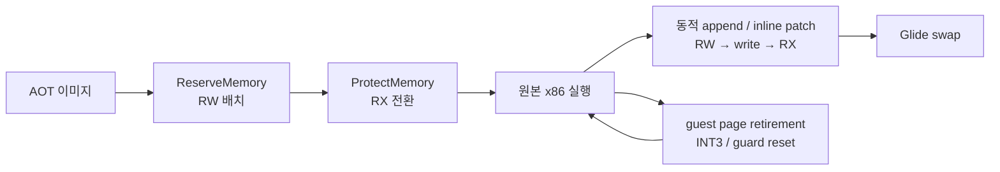

# Task 506 작업 로그 — Linux AOT 코드 캐시

설계: [20260827-506](../design/20260827-506-linux-aot-code-cache.md) ·
작업 지시: [20260827-506](../work-orders/20260827-506-linux-aot-code-cache.md) ·
frontier: [linux-port-frontier](../analysis/linux-port-frontier.md)

## 결과

**Linux 기본 `dynamic` AOT backend가 실제 게임 화면에 도달했습니다.** WSLg `pumpit1`은
약 45.1초에 첫 Glide 버퍼 스왑을 기록했고, 약 51.7초의 두 번째 스왑은
**69,263/307,200 non-black 픽셀**이었습니다. 80초대에는 40회 이상 스왑이 이어졌습니다.

## 구현

* `aot_code_cache_win32.cpp`의 배치, 동적 번역 append, segment 재해결, 인라인 캐시 패치,
  probe sentinel과 해제를 `ReserveMemory`, `ProtectMemory`, `ReleaseMemory`,
  `QueryMemory`, `FlushInstructionCacheRange`로 옮겼습니다.
* `aot_page_coherence_win32.cpp`의 page retirement와 guest write-watch를 같은 계층으로
  옮겼습니다. write-watch가 저장하는 이전 보호는 이제 Win32 비트마스크가 아니라
  `MemoryProtection`입니다.
* Task 503d-11에 이미 있던 `FlushInstructionCacheRange`를 재사용했습니다. 설계가 제안한 새
  헤더는 만들지 않았습니다. AOT patch window의 페이지 크기만 `SystemPageSize` 공용 질의로
  추가했습니다.
* Linux에서 아무것도 하지 않던 `requires Win32` 조기 반환 네 곳을 제거했습니다. 작업 뒤
  `rg "requires Win32" src`와 두 파일의 Win32 메모리 API 검색은 결과가 없습니다.

## 검증

| 대상 | 결과 |
|---|---|
| Linux i386 `repiu` | 빌드·링크 성공 |
| Linux `repiu_core_probe` | `core_probe_total=15`, failures 0 |
| DOS/4GW 샘플 legacy | exit 2, fault 18, focus 0x10, opcode 0x80 |
| DOS/4GW 샘플 dynamic | AOT 배치와 inline patch 실행, exit 2, focus 0x10, opcode 0x80 |
| `pumpit1` dynamic | 첫 swap 약 45.1초, 첫 non-black 약 51.7초, 이후 40회 이상 swap |

Windows Debug 빌드는 WSL에서 `powershell.exe`를 호출하려 했으나 이 환경의 WSL interop이
비활성이라 `Exec format error`로 실행할 수 없었습니다. Windows 회귀 검증은 미수행으로 남기며,
Linux에서는 공용 probe와 실제 AOT 실행 경로를 모두 검증했습니다.

## 남은 경계

렌더링 정확성은 이 작업 범위가 아닙니다. 또한 측정을 마치고 종료를 요청했을 때 프로세스가
TERM에 응답하지 않는 기존 Linux 종료 문제가 재현되었습니다. 검증용 PID 하나를 확인한 뒤
SIGKILL로 정리했습니다.
다음 Linux 포팅 단위는 감시견·창 닫힘·예산 만료를 `RecoverToHost`로 수렴시키는 종료 경로입니다.

---

# Task 506 work log — The Linux AOT code cache

Design: [20260827-506](../design/20260827-506-linux-aot-code-cache.md) ·
Work order: [20260827-506](../work-orders/20260827-506-linux-aot-code-cache.md) ·
Frontier: [linux-port-frontier](../analysis/linux-port-frontier.md)

## Result

**The default `dynamic` AOT backend reaches a real game screen on Linux.** WSLg `pumpit1` recorded
its first Glide buffer swap at about 45.1 seconds. The second, at about 51.7 seconds, contained
**69,263 non-black pixels out of 307,200**, and more than forty swaps followed by the 80-second mark.

## Implementation

* AOT placement, dynamic append, segment re-resolution, inline-cache patching, the probe sentinel,
  and release now use `ReserveMemory`, `ProtectMemory`, `ReleaseMemory`, `QueryMemory`, and
  `FlushInstructionCacheRange`.
* Page retirement and guest write watches use the same layer. Saved write-watch protection is a
  `MemoryProtection`, not a Win32 bitmask.
* The existing Task 503d-11 `FlushInstructionCacheRange` was reused instead of creating the extra
  header proposed by the design. Only the `SystemPageSize` layer query was added for patch windows.
* The four `requires Win32` early returns are gone. Searches for that text and for direct Win32
  memory APIs in the two AOT sources now return nothing.

## Verification

| Target | Result |
|---|---|
| Linux i386 `repiu` | built and linked |
| Linux `repiu_core_probe` | `core_probe_total=15`, zero failures |
| DOS/4GW sample, legacy | exit 2, 18 faults, focus 0x10, opcode 0x80 |
| DOS/4GW sample, dynamic | AOT placement and inline patches ran; exit 2, focus 0x10, opcode 0x80 |
| `pumpit1`, dynamic | first swap about 45.1 s; first non-black about 51.7 s; over forty swaps followed |

The Windows Debug build could not be run from this WSL environment: invoking `powershell.exe`
failed with `Exec format error`, indicating WSL interop is disabled. Windows regression verification
therefore remains unrun; Linux covered both the shared probes and the real AOT execution path.

## Remaining boundary

Rendering accuracy is outside this task. The existing Linux shutdown problem also reproduced: when
measurement ended and termination was requested, the process ignored TERM and the single verified
test PID had to be killed.
The next Linux port unit is to converge watchdog, window-close, and budget-expiry shutdown through
`RecoverToHost`.
