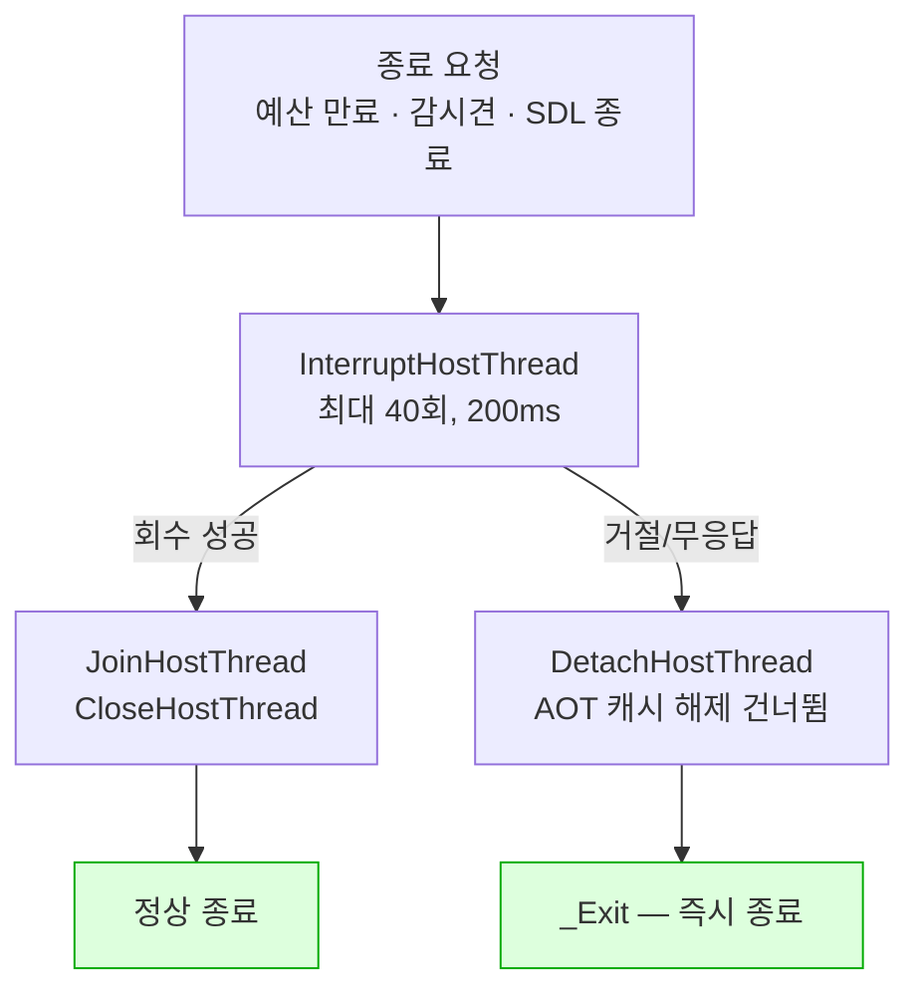

# Task 507 작업 로그 — Linux 종료 경로

설계: [20260827-507](../design/20260827-507-linux-shutdown-recovery.md) ·
작업 지시: [20260827-507](../work-orders/20260827-507-linux-shutdown-recovery.md) ·
frontier: [linux-port-frontier](../analysis/linux-port-frontier.md) ·
확인 절차: [linux-shutdown-check](../guides/linux-shutdown-check.md)

## 결과

**종료를 요청한 Linux `pumpit1` 실행이 스스로 끝납니다.** 예산 만료 5회, SIGTERM 3회 —
총 8회 모두 프로세스가 스스로 종료했습니다. 이전에는 SDL이 TERM을 종료 이벤트로 바꾼 뒤
`pthread_join`이 영원히 기다려, 종료를 요청받은 실행 자체가 매달렸습니다.

## 구현

* 종료 블록의 네 Win32 호출(`SuspendThread`/`GetThreadContext`/`SetThreadContext`/`ResumeThread`)을
  `InterruptHostThread`로 옮겼습니다. 콜백(`RecoverGuestThreadForShutdown`)은 EIP 검사와
  `RecoverToHost`만 하고, 할당이 필요한 메시지 구성은 호출한 스레드로 올렸습니다 — 콜백이
  Linux에서 대상 스레드의 시그널 핸들러 안에서 돈다는 계약 때문입니다.
* `host_thread.h`/`.cpp`에 `DetachHostThread`를 추가했습니다. Windows는 `CloseHandle`,
  POSIX는 `pthread_detach` 후 레코드를 **의도적으로 남깁니다** — 살아 있는 스레드가 끝날 때
  그 레코드에 씁니다.
* `live_telemetry_snapshot.cpp`의 `CopySnapshotFromContextRecord`를
  `defined(_M_IX86) || defined(__i386__)`로 맞췄습니다. MSVC 매크로만 걸려 있어 Linux에서
  타임아웃 스냅샷이 한 번도 채워진 적이 없었습니다.
* `repiu_core_probe`의 `host_thread` 스위트에 `ProbeDetachRunningThread`를 추가했습니다 —
  아직 도는 스레드를 `DetachHostThread`로 놓을 때 즉시 반환하는지 봅니다.

### 계획에 없던 두 가지 (검증 중 발견)

**하나. 회수 시도는 한 번으로 부족했습니다.** 게스트 스레드는 프레임 대부분을 HLE 호출이나
Glide 게이트 안에서 보내고, 그때 EIP는 정당하게 검사를 거절당합니다. 단발 시도는 `pumpit1`에서
거의 항상 거절로 끝났습니다. 200ms 시한으로 최대 40회(5ms 간격) 재시도하고, 각 재시도 사이에
`glide_backend.PumpHostCommands()`를 계속 돌립니다 — 게이트 안의 게스트는 호스트가 명령을
계속 처리해 줘야 빠져나오기 때문입니다. 계속 펌핑하지 않으면 루프가 예산을 전부 쓰면서 절대
못 움직이는 스레드를 보는 꼴이 됩니다.

**둘. 회수 거절 뒤 `DetachHostThread`만으로는 부족했습니다.** 처음 구현은 프로세스가 끝나긴
했지만 일정치 않았습니다 — 다섯 번 중 세 번이 매달렸습니다. 원인을 추적하니
`ReleaseWin32AotCodeCache`가 `main.cpp`에서 **무조건** 호출되고 있었습니다. 회수를 거절당한
게스트 스레드는 호스트 코드(HLE 호출) 안에서 계속 돌고 있었는데, 그 호출의 반환 주소가 AOT
캐시 안입니다 — 그 스레드가 돌아오면 방금 `munmap`된 메모리로 뛰어드는 것입니다. `attempt`에
`guest_thread_stopped` 필드를 추가해 이 경우 `main.cpp`의 해제를 건너뛰게 했더니 매달림
빈도는 줄었지만 없어지지 않았습니다(5회 중 1회). 남은 경로는 `main.cpp`로 돌아간 뒤의 다른
작업(보고 출력 등)이 같은 스레드와 계속 경합하는 것이었고, 근본 해법은 **회수를 거절당한
순간부터 이 프로세스의 나머지 작업 전체를 신뢰하지 않는 것**이었습니다. `guest_thread_stopped`가
거짓이면 종료 블록 안에서 곧바로 `std::_Exit`으로 프로세스를 끝냅니다 — 정적 소멸자와
`atexit`을 건너뛰고, 이후 어떤 코드도 그 스레드와 경합할 기회를 얻지 못합니다.

## 검증

| 대상 | 결과 |
|---|---|
| Linux i386 `repiu` | 빌드·링크 성공 |
| Linux `repiu_core_probe` | `core_probe_total=15`, failures 0, `host_thread_detach=true` 포함 |
| DOS/4GW 샘플 legacy/dynamic | exit 2, focus 0x10, opcode 0x80 — 3d-19 기준선과 일치 |
| **`pumpit1` 예산 만료 (5회)** | 5회 모두 프로세스 스스로 종료 (exit 0×2, exit 3×1, SIGTRAP×2) |
| **`pumpit1` SIGTERM (3회)** | 3회 모두 프로세스 스스로 종료 (exit 0×2, SIGTRAP×1) |

Windows Debug 빌드는 이 WSL 환경에서 `powershell.exe` 호출이 `Exec format error`로 실패해
506과 같은 이유로 실행할 수 없었습니다. Windows 회귀 검증은 미수행으로 남깁니다. 다만 507이
건드린 종료 블록의 Windows 분기(`TerminateThread` 최후 수단)는 호출 형태를 그대로 유지했고,
새로 추가된 `_Exit` 경로는 Windows에서 그 최후 수단마저 실패하는 극히 드문 경우에만 닿습니다.

## 남은 경계

**회수를 거절당한 실행이 SIGTRAP으로 끝나는 경우가 남습니다.** 8회 중 3회였습니다. 프로세스는
매달리지 않고 끝나므로 507의 완료 조건은 만족하지만, 정상 종료(`_Exit`)가 아니라 커널 기본
처분(코어 덤프)으로 끝나는 것은 다른 문제입니다. 추적한 원인은 이렇습니다 — 회수를 거절당한
게스트 스레드는 폴트 핸들러가 이미 제거된 뒤에도 계속 돌고, AOT 엔진이 정상적으로 심어 두는
다음 INT3/단일 스텝 트랩을 밟는 순간 받아 줄 핸들러가 없어 SIGTRAP의 커널 기본 처분(코어
덤프)이 실행됩니다. frontier 6절에 반영했습니다. 이것을 막으려면 폴트 핸들러를 게스트 스레드가
실제로 멈출 때까지 유지해야 하는데, 그러면 그 핸들러가 이미 해제된 AOT 캐시를 가리키는 회수
불가능한 EIP를 처리해야 하는 문제로 옮겨갑니다 — 507의 범위 밖입니다.

**핸들러가 반환하지 않는 근본 원인은 여전히 열려 있습니다.** frontier 6절의 항목이고, 507이
답하지 않습니다.

---

# Task 507 work log — The Linux shutdown path

Design: [20260827-507](../design/20260827-507-linux-shutdown-recovery.md) ·
Work order: [20260827-507](../work-orders/20260827-507-linux-shutdown-recovery.md) ·
Frontier: [linux-port-frontier](../analysis/linux-port-frontier.md) ·
Procedure: [linux-shutdown-check](../guides/linux-shutdown-check.md)

## Result

**A Linux `pumpit1` run asked to stop stops by itself.** Five budget-expiry runs, three SIGTERM
runs -- eight of eight ended the process by itself. Before this, SDL turned TERM into a quit event
and `pthread_join` waited forever, so a run asked to stop hung instead.

## Implementation

* The shutdown block's four Win32 calls moved onto `InterruptHostThread`. The callback
  (`RecoverGuestThreadForShutdown`) only tests EIP and calls `RecoverToHost`; message construction,
  which allocates, moved to the requesting thread -- required by the contract that this callback runs
  inside the target thread's own signal handler on Linux.
* `DetachHostThread` was added to `host_thread.h`/`.cpp`. Windows calls `CloseHandle`; POSIX calls
  `pthread_detach` and **deliberately keeps the record**, since a thread still alive writes into it
  when it ends.
* `CopySnapshotFromContextRecord` in `live_telemetry_snapshot.cpp` now reads
  `defined(_M_IX86) || defined(__i386__)`. Gated on MSVC's macro alone, the timeout snapshot had
  never been filled on Linux.
* `ProbeDetachRunningThread` was added to `repiu_core_probe`'s `host_thread` suite -- it checks that
  detaching a still-running thread returns immediately.

### Two things not in the plan (found during verification)

**One: a single recovery attempt was not enough.** The guest thread spends most of a frame inside an
HLE call or the Glide gate, where the EIP test correctly refuses it. A single attempt on `pumpit1`
was refused almost every time. The fix retries up to 40 times at a 200ms deadline each (5ms between
attempts), pumping `glide_backend.PumpHostCommands()` between retries -- a guest thread inside the
gate only leaves it if the host keeps servicing commands. Without that pumping the loop spends its
whole budget watching a thread that cannot move at all.

**Two: `DetachHostThread` alone was not enough after a refused recovery.** The first version ended the
process, but not reliably -- three of five runs hung. The cause traced to
`ReleaseWin32AotCodeCache`, called **unconditionally** in `main.cpp`. A guest thread that refused
recovery was still running inside host code (an HLE call), and that call's return address sits inside
the AOT cache -- so when it returned, it landed on memory that had just been `munmap`ed. Adding a
`guest_thread_stopped` field to `attempt` and gating that release on it reduced the hang but did not
remove it (one in five). What remained was other work back in `main.cpp` -- the report printing --
still racing the same thread, and the real fix was to **stop trusting any of this process's remaining
work once recovery has been refused.** When `guest_thread_stopped` is false, the shutdown block ends
the process immediately with `std::_Exit`, skipping static destructors and `atexit` handlers so
nothing downstream gets a chance to race that thread.

## Verification

| Target | Result |
|---|---|
| Linux i386 `repiu` | built and linked |
| Linux `repiu_core_probe` | `core_probe_total=15`, zero failures, including `host_thread_detach=true` |
| The DOS/4GW sample, legacy/dynamic | exit 2, focus 0x10, opcode 0x80 -- matches 3d-19's baseline |
| **`pumpit1`, budget expiry (5 runs)** | all 5 ended by themselves (exit 0 x2, exit 3 x1, SIGTRAP x2) |
| **`pumpit1`, SIGTERM (3 runs)** | all 3 ended by themselves (exit 0 x2, SIGTRAP x1) |

The Windows Debug build could not be run from this WSL environment -- `powershell.exe` fails with
`Exec format error`, the same reason 506 recorded. Windows regression verification remains unrun.
The Windows branch of the shutdown block this task touched (the `TerminateThread` last resort) kept
its call shape unchanged, and the new `_Exit` path is reached on Windows only in the rare case where
that last resort itself fails.

## Remaining boundary

**A run whose recovery is refused sometimes ends in a SIGTRAP instead of a clean exit** -- three of
eight. The process still does not hang, so 507's completion criterion holds, but ending via the
kernel's default disposition (a core dump) rather than `_Exit` is a different problem. The traced
cause: a guest thread that refused recovery keeps running after the fault handler has already been
removed, and the next INT3 or single-step trap the AOT engine plants in the ordinary course of
running -- there is nothing unusual about hitting one -- has no handler left to receive it, so
SIGTRAP's default disposition dumps core. Recorded in frontier section 6. Preventing it would mean
keeping the fault handler installed until the guest thread genuinely stops, which moves the problem
to that handler catching an EIP it cannot recover because the AOT cache behind it is already gone --
out of this task's scope.

**Why the handler does not return remains open.** That is frontier section 6's item, and 507 does not
answer it.
