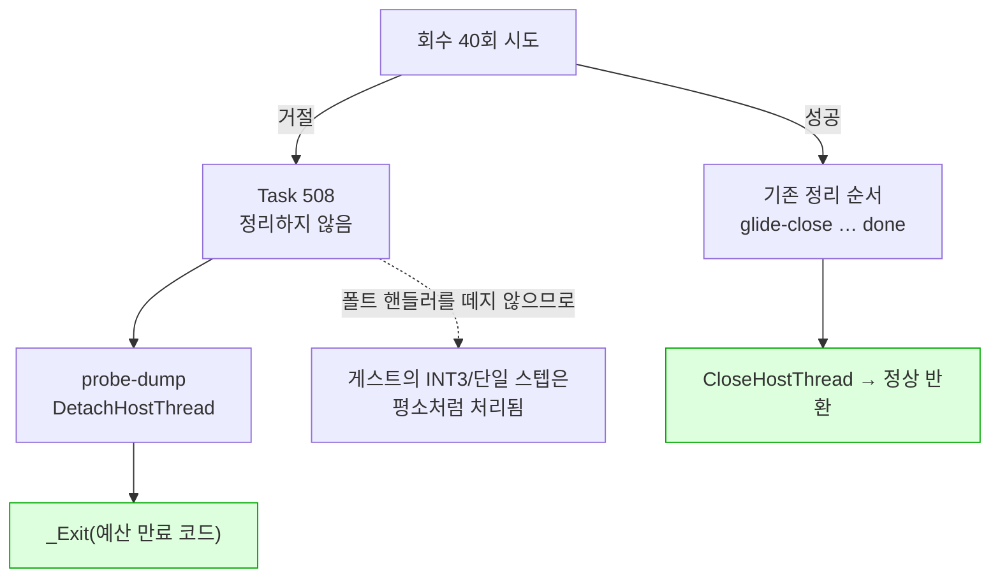

# Task 508 작업 로그 — 회수를 거절당한 종료

설계: [20260828-508](../design/20260828-508-refused-recovery-teardown.md) ·
작업 지시: [20260828-508](../work-orders/20260828-508-refused-recovery-teardown.md) ·
frontier: [linux-port-frontier](../analysis/linux-port-frontier.md) ·
확인 절차: [linux-shutdown-check](../guides/linux-shutdown-check.md)

## 결과

**회수를 거절당한 Linux 종료가 더 이상 코어를 덤프하지 않습니다.** 60초 예산 `pumpit1`
실행에서 수정 전 6회 중 6회가 회수를 거절당했고 그중 **2회가 SIGTRAP**으로 끝났습니다. 수정
후 같은 조건 6회에서 거절은 그대로 6회, **SIGTRAP은 0회**입니다. SIGTERM 3회도 3회 모두
거절된 갈래를 지나 `exit=0`으로 끝났습니다.

**Windows 회귀도 이번에는 실행했습니다.** 506·507이 WSL 안에서 작업해 미수행으로 남긴
항목이고, Windows Debug 빌드·probe 15/15·`pumpit1` 두 실행이 모두 기존과 같습니다.



## 근인 — 트랩이 아니라 순서였습니다

507이 남긴 경계는 "회수를 거절당한 실행이 SIGTRAP으로 끝나는 경우가 있다"였습니다. 508이
재현해서 확인한 것은 **어디서** 죽는가입니다.

종료 블록은 회수 성공 여부와 무관하게 같은 정리 순서를 밟고, 그 세 번째 단계가
`remove_vectored_handler()` → `RemoveFaultHandler()`입니다. Linux 구현이 SIGSEGV·SIGBUS·
SIGTRAP·SIGILL·SIGFPE 다섯의 처분을 `SIG_DFL`로 되돌리는데, 회수를 거절당했다는 것은 게스트
스레드가 **계속 돈다**는 뜻이고 `dynamic` backend는 정상 동작으로 INT3과 트랩 플래그를
심습니다.

507이 넣어 둔 단계 표시가 그대로 증거였습니다. **두 번의 SIGTRAP 모두 마지막 줄이
`step=translation-worker`** — `step=fault-handler` 바로 다음 단계입니다.

```
[repiu-shutdown] step=glide-close
[repiu-shutdown] step=fault-handler      ← 핸들러가 사라짐
[repiu-shutdown] step=translation-worker ← 마지막 줄
Trace/breakpoint trap (core dumped)
```

살아남은 네 실행은 `done`까지 찍고 `_Exit(3)`으로 끝났습니다. **차이는 그 짧은 창 안에서
트랩을 밟았는지 하나뿐이고**, 그것이 이 현상이 확률적으로 보인 이유입니다.

## 구현

`execution_trampoline.cpp` 종료 블록 한 곳입니다. 플랫폼 분기를 새로 만들지 않았습니다.

* `hotspot-dump` 뒤에서 `gracefully_interrupted`로 갈라, 거짓이면 **정리를 하지 않고**
  `probe-dump` → `DetachHostThread` → `immediate-exit` → `_Exit`으로 끝냅니다.
  `remove_vectored_handler()`를 부르지 않는 것이 수정의 전부이고 나머지는 그 결과입니다.
* 남긴 두 진단은 모두 파일로 나가는 것입니다. `probe-dump`는 이미 캡처된 바이트만 쓰므로
  도는 스레드와 경합하지 않습니다.
* `DetachHostThread`는 `_Exit` 앞이라 기능상 필요 없지만 남겼습니다 — 507이
  `CloseHostThread`의 join과 짝으로 세운 계약이고, 지우면 호출자 없는 함수가 하나 늘어납니다.
* 조기 종료가 생겼으므로 아래쪽 `if (gracefully_interrupted) Close… else Detach…` 갈림길이
  불필요해졌습니다. `CloseHostThread` 무조건 호출로 되돌리고, 끝의 `_Exit` 블록을 지웠습니다.
* Task 401 주석의 첫 문장("게스트 스레드가 멈췄으므로")이 507 이후 사실이 아니게 되어 있어
  같은 작업에서 정정했습니다. 그 주석이 말하는 **이유**(정리 도중 매달리는 것이 관측됐다)는
  그대로 유효합니다.
* `scripts/task508_refused_recovery_repro.sh`를 더했습니다. 실행 N회를 돌려 종료 상태와
  `[repiu-shutdown]` 줄을 모으고 마지막에 `runs= refused= sigtrap=`을 셉니다. **이 작업에서
  가장 오래 걸린 것이 거절을 재현하는 일이었으므로** 절차를 코드로 남기고,
  `linux-shutdown-check` 가이드에 2.4절로 넣었습니다 — 20초 예산은 이 갈래에 닿지 않는다는
  것이 요점입니다.

## 검증

### Linux (WSLg, Ubuntu 24.04, i386)

| 항목 | 결과 |
|---|---|
| `repiu` i386 빌드 | 성공 |
| `repiu_core_probe` | `core_probe_total=15`, 실패 0 |
| DOS/4GW 샘플 `legacy` | exit 2, focus offset 0x10, opcode 0x80 — 3d-19 기준선 |
| DOS/4GW 샘플 `dynamic` | 같음 |
| **60초 예산 6회 (수정 전)** | 거절 **6/6**, **SIGTRAP 2회** |
| **60초 예산 6회 (수정 후)** | 거절 **6/6**, **SIGTRAP 0회**, 전부 `exit=3` |
| 20초 예산 5회 | 회수 성공 5/5, `exit=0`, `glide-close`…`done` 순서 그대로 |
| **SIGTERM 3회** | 거절 3/3, `exit=0`, 전부 `gone` — 새 갈래를 실제로 지남 |

거절된 갈래를 지난 실행의 표시는 이렇습니다. **`fault-handler`가 없습니다.**

```
[repiu-shutdown] reason=exit-requested attempts=40 answered=1 recovered=0 stopped=0 failure=0 eip=0x40197AC2 gate=0
[repiu-shutdown] step=probe-dump
[repiu-shutdown] step=immediate-exit
```

20초 예산이 **회귀 시험으로서 의미가 있는 이유**는 그 다섯 번이 전부 회수에 성공하기
때문입니다(`refused=0`). 즉 기존 정리 순서가 손대지지 않았음을 같은 절차로 확인합니다.

### Windows (Debug)

506·507은 WSL 안에서 작업해 `powershell.exe`를 부를 수 없었고 Windows 회귀를 미수행으로
남겼습니다. 이번에는 Windows 호스트에서 작업해 **실행했습니다.**

| 항목 | 결과 |
|---|---|
| Debug 빌드 | 성공 |
| `repiu_core_probe` | `core_probe_total=15`, 실패 0 |
| `pumpit1` 20초 예산 | `recovered=1 stopped=1`, `glide-close`…`done`, `exit=0` |
| `pumpit1` 60초 예산 | `recovered=0`이지만 **`stopped=1`** — `TerminateThread`가 스레드를 세움 |

**60초 실행이 설계의 주장을 그대로 확인해 줍니다.** Windows도 렌더 루프에서는 40회 시도가
모두 거절됐지만(`eip=0x7710B90C`, ntdll), 최후 수단인 `TerminateThread`가 성공해 `stopped=1`이
되고 기존 정리 순서를 그대로 밟았습니다. **새 갈래는 Windows에서 그 최후 수단마저 실패할 때만
닿습니다.**

## 남은 경계

**회수가 거절되는 것 자체는 그대로입니다.** 60초 예산에서 6회 중 6회, SIGTERM 3회 중 3회가
거절됩니다. Linux에는 `TerminateThread`에 대응하는 것이 없으므로 게스트 스레드는 프로세스가
끝날 때 함께 사라집니다. 이것을 줄이려면 게스트가 호스트 코드 안에 있을 때 돌아갈 자리를
만들어야 하고, 별도 단위입니다.

**인터럽트 핸들러가 반환하지 않는 것**(frontier 6절)은 508이 답하지 않습니다.

**무엇이 그려지는지는 여전히 미확인입니다.** Task 506이 "별도 검증"으로 남긴 항목이고, 세
항목(505·506·507)이 닫히고 508까지 닫힌 지금 Linux 이식의 가장 큰 공백입니다.

---

# Task 508 work log — the refused-recovery shutdown

Design: [20260828-508](../design/20260828-508-refused-recovery-teardown.md) ·
Work order: [20260828-508](../work-orders/20260828-508-refused-recovery-teardown.md) ·
Frontier: [linux-port-frontier](../analysis/linux-port-frontier.md) ·
Procedure: [linux-shutdown-check](../guides/linux-shutdown-check.md)

## Result

**A Linux shutdown whose recovery was refused no longer dumps core.** On 60-second-budget `pumpit1`
runs, six of six were refused before the change and **two of them ended in SIGTRAP**. After the
change, under the same conditions, six of six were still refused and **none produced a SIGTRAP**.

## Root cause — the ordering, not the trap

The boundary 507 left was "a run whose recovery is refused sometimes ends in a SIGTRAP". What 508
reproduced and established is **where** it dies.

The shutdown block walks the same cleanup sequence whether or not recovery succeeded, and its third
step is `remove_vectored_handler()` calling `RemoveFaultHandler()`. The Linux implementation restores
the dispositions of SIGSEGV, SIGBUS, SIGTRAP, SIGILL and SIGFPE to `SIG_DFL` -- but a refused
recovery means the guest thread **keeps running**, and the `dynamic` backend plants INT3s and sets
the trap flag in the ordinary course of dispatching.

507's own step markers were the evidence. **Both SIGTRAPs printed `step=translation-worker` last** --
the step immediately after `step=fault-handler`.

```
[repiu-shutdown] step=glide-close
[repiu-shutdown] step=fault-handler      <- the handler goes here
[repiu-shutdown] step=translation-worker <- last line printed
Trace/breakpoint trap (core dumped)
```

The four runs that survived printed through `done` and ended with `_Exit(3)`. **The only difference
is whether the guest thread hit a trap inside that short window**, which is why the symptom looked
probabilistic.

## Implementation

One place: the shutdown block in `execution_trampoline.cpp`. No new platform branch.

* After `hotspot-dump`, branch on `gracefully_interrupted`. When it is false, **no cleanup runs**:
  `probe-dump`, then `DetachHostThread`, then `immediate-exit` and `_Exit`. Not calling
  `remove_vectored_handler()` is the whole of the fix; the rest follows from it.
* Both diagnostics kept are ones that write a file. `probe-dump` writes only bytes captured earlier,
  so it races nothing.
* `DetachHostThread` is functionally unnecessary before `_Exit` and was kept: it is the half of the
  pair 507 built against `CloseHostThread`'s join, and dropping it would leave a function with no
  callers.
* With the early exit in place, the `if (gracefully_interrupted) Close… else Detach…` fork below it
  became unnecessary. It is an unconditional `CloseHostThread` again, and the `_Exit` block at the
  end of the sequence is gone.
* The first sentence of a Task 401 comment ("the guest thread has stopped") stopped being true in
  507 and was corrected in the same task. The **reason** that comment gives -- a hang was observed
  inside the cleanup sequence -- still holds.
* `scripts/task508_refused_recovery_repro.sh` was added. It runs N runs, collects the exit status and
  the `[repiu-shutdown]` lines, and finishes with a `runs= refused= sigtrap=` count. **Reproducing a
  refusal was the longest part of this task**, so the procedure is in code, and section 2.4 of the
  `linux-shutdown-check` guide says the thing that matters: a 20-second budget never reaches this
  arm.

## Verification

### Linux (WSLg, Ubuntu 24.04, i386)

| Item | Result |
|---|---|
| `repiu` i386 build | succeeded |
| `repiu_core_probe` | `core_probe_total=15`, zero failures |
| The DOS/4GW sample, `legacy` | exit 2, focus offset 0x10, opcode 0x80 -- 3d-19's baseline |
| The DOS/4GW sample, `dynamic` | the same |
| **Six 60-second-budget runs (before)** | **6 of 6** refused, **two SIGTRAPs** |
| **Six 60-second-budget runs (after)** | **6 of 6** refused, **zero SIGTRAPs**, all `exit=3` |
| Five 20-second-budget runs | recovered 5 of 5, `exit=0`, `glide-close` … `done` unchanged |
| **Three SIGTERM runs** | refused 3 of 3, `exit=0`, all `gone` -- the new arm was actually taken |

The markers of a run that took the refused arm. **There is no `fault-handler`.**

```
[repiu-shutdown] reason=exit-requested attempts=40 answered=1 recovered=0 stopped=0 failure=0 eip=0x40197AC2 gate=0
[repiu-shutdown] step=probe-dump
[repiu-shutdown] step=immediate-exit
```

The 20-second runs **are meaningful as a regression check** precisely because all five recover
(`refused=0`), so the same procedure confirms that the existing cleanup sequence was left alone.

### Windows (Debug)

Tasks 506 and 507 worked from inside WSL, could not call `powershell.exe`, and left Windows
regression unrun. This task worked from the Windows host and **ran it**.

| Item | Result |
|---|---|
| Debug build | succeeded |
| `repiu_core_probe` | `core_probe_total=15`, zero failures |
| `pumpit1`, 20-second budget | `recovered=1 stopped=1`, `glide-close` … `done`, `exit=0` |
| `pumpit1`, 60-second budget | `recovered=0` but **`stopped=1`** -- `TerminateThread` stopped the thread |

**The 60-second run confirms the design's claim directly.** Windows also had all forty attempts
refused in the render loop (`eip=0x7710B90C`, ntdll), but the last resort, `TerminateThread`,
succeeded, so `stopped=1` and the existing cleanup sequence ran as before. **The new arm is reached
on Windows only if that last resort itself fails.**

## Remaining boundary

**Refusal itself is unchanged.** Six of six 60-second-budget runs and three of three SIGTERM runs are
refused. Linux has no counterpart to `TerminateThread`, so the guest thread goes when the process
does. Reducing this means giving the guest somewhere to return to while it is inside host code, and
that is a separate unit.

**Why the interrupt handler does not return** (frontier section 6) is not answered by 508.

**What is drawn is still unverified.** That is the item Task 506 left as "a separate verification",
and with 505 through 508 closed it is the largest remaining gap in the Linux port.
