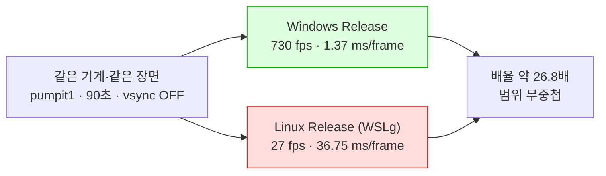

# Task 509 작업 로그 — Linux 실행 속도

설계: [20260828-509](../design/20260828-509-linux-execution-speed.md) ·
작업 지시: [20260828-509](../work-orders/20260828-509-linux-execution-speed.md) ·
frontier: [linux-port-frontier](../analysis/linux-port-frontier.md) ·
측정 절차: [execution-frame-rate-measurement](../guides/execution-frame-rate-measurement.md)

## 결과

**Linux는 Windows의 약 3.7%로 돕니다 — 약 26.8배 느립니다.** 같은 기계, 같은 장면
(`pumpit1`), 같은 예산(90초), vsync OFF, 양쪽 Release, 호스트당 3회입니다.

| 호스트 | fps (3회) | 평균 | 프레임당 |
|---|---|---:|---:|
| Windows Release | 743.91 · 737.46 · 708.79 | **730.05** | 1.37 ms |
| Linux Release (WSLg) | 26.22 · 27.76 · 27.65 | **27.21** | 36.75 ms |

**두 집단의 범위가 겹치지 않습니다** — Linux 최고 27.76, Windows 최저 708.79. 가장 보수적으로
잡아도(Windows 최저 ÷ Linux 최고) **25.5배**입니다.

프레임당으로 보면 Linux가 프레임마다 **35.4 ms를 더 씁니다.**

**기동은 원인이 아닙니다.** 양쪽 모두 `span_ms`가 88초로, 90초 예산 안에서 첫 프레임까지
2초 남짓입니다. 차이는 전부 렌더 루프 안에 있습니다.

### 부수 소견 — Debug 계수가 기동 시간을 가리고 있었습니다

Task 506이 기록한 "약 45.1초에 첫 스왑"은 **Debug 수치**였습니다. Release에서는 같은
`pumpit1`이 약 2초 만에 첫 프레임을 냅니다. 506의 값이 틀린 것이 아니라 Debug의 값이며,
"자산 디코드가 오래 걸린다"를 성질로 읽으면 안 됩니다.

### 이 숫자가 답하지 않는 것

* **어디가 느린지는 모릅니다.** 510의 일입니다.
* 배율에는 **컴파일러 차이(MSVC 대 GCC)** 와 **WSLg의 X11 한 겹**이 함께 들어 있습니다.
  둘을 분리한 적이 없습니다.
* 실제 데스크톱 Linux에서는 재지 않았습니다.

## 구현

* `glide_opengl_backend`에 표시된 프레임 **총계**와 **첫 프레임 시각**을 더했습니다. 기존
  `frame_rate_frame_count_`는 초마다 1로 리셋되므로 총계가 아닙니다 — 창 제목이 원하는 것과
  총계가 되어야 하는 것이 다릅니다.
* `[repiu-shutdown]` 줄에 `frames=`와 `span_ms=`를 실었습니다. **두 종료 갈래 모두가 지나는
  유일한 줄**이고, Linux에서 렌더까지 간 실행은 로더 요약을 내지 못하는 갈래로 가므로 여기가
  유일한 자리입니다. 락이 없는 이유는 두 값 모두 **호스트 스레드만 쓰기 때문**입니다 — 스왑을
  실행하는 스레드가 곧 종료 블록을 도는 스레드입니다.
* `REPIU_GLIDE_FRAME_RATE_LOG=1`이면 창 제목에 쓰는 것과 같은 값을 초당 한 줄 로그에 냅니다.
  env는 프레임마다가 아니라 `ResetFrameRateMeasurement()`에서 한 번 읽습니다.
* `scripts/task509_frame_rate_measure.sh`와 `docs/guides/execution-frame-rate-measurement.md`.

## 계획에 없던 것 — Release probe가 양쪽 호스트에서 실패합니다

측정 조건이 "Release, 양쪽 호스트"였고, **Linux Release는 이 프로젝트에서 처음** 빌드했습니다.
빌드는 성공했지만 그 다음이 그렇지 않았습니다.

| 호스트 | Debug probe | Release probe |
|---|---|---|
| Linux i386 | 15 / 15, 실패 0 | **segfault (exit 139)** |
| Windows | 15 / 15, 실패 0 | **15개 중 2개 실패** |

* **Linux**: `stdbuf`로 버퍼를 끄고 다시 돌려 위치를 좁혔습니다. `dos_file_handle_cache`가
  `dos_handle_cache_all=true`까지 찍은 뒤, **`== pit_timer ==` 헤더가 찍히기 전에** 죽습니다.
* **Windows**: `fault_handler_data_faults`와 `stack_bridge_contract` 둘입니다.

**둘 다 509의 변경과 무관합니다.** 같은 코드가 **Windows Debug에서는 15/15로 통과합니다** —
호스트가 아니라 구성이 가르는 문제입니다. 509가 건드린 것은 Glide backend의 프레임 카운터와 종료 줄
하나이고, 실패한 probe들은 그 경로를 지나지 않습니다. 그리고 **엔진 자체는 Release에서
정상입니다** — Linux Release `repiu`가 DOS/4GW 샘플을 `legacy`·`dynamic` 양쪽에서 3d-19
기준선(exit 2, focus offset 0x10, opcode 0x80) 그대로 통과합니다.

읽을 것은 이것입니다 — **probe 모음이 Release에서 검증된 적이 없습니다.** 이 저장소의 정확성
작업은 Debug에서, 성능 측정은 Release에서 해 왔고, probe는 늘 Debug 쪽에만 있었습니다.
별도 작업으로 올립니다.

## 검증

| 항목 | 결과 |
|---|---|
| Linux i386 **Release** 빌드 | **성공 — 이 프로젝트에서 처음** |
| Linux Release `repiu`, DOS/4GW 샘플 `legacy`/`dynamic` | exit 2, focus offset 0x10, opcode 0x80 — 3d-19 기준선 |
| Windows Release 빌드 | 성공 |
| 계측 자체 | 양쪽 호스트에서 `frames=`·`span_ms=`가 채워짐, 6회 모두 |
| **Windows probe (Debug, 509 변경 포함)** | **15 / 15, 실패 0** |
| Linux probe (Release) | **segfault** — 아래 |
| Windows probe (Release) | **2건 실패** — 아래 |

계측이 실제로 값을 채우는지는 여섯 실행 모두에서 확인했습니다. Linux 쪽 세 실행은 **회수
거절 갈래**(`exit=3`)로 갔는데도 줄이 나왔습니다 — 509가 이 자리를 고른 이유가 그것입니다.

## 남은 경계

* **어디가 느린가**는 열려 있습니다. 귀속 노브는 이미 있지만, **Windows의 순위를 Linux로
  옮겨 읽으면 안 됩니다** — 예외 전달·시그널·GL 드라이버가 다른 호스트입니다.
* **배율의 구성이 분리되지 않았습니다.** 컴파일러 차이와 WSLg의 X11 한 겹이 26.8배 안에
  같이 들어 있습니다. 실제 데스크톱 Linux 측정이 그 절반을 갈라 줍니다.
* **Release probe 실패 2건**(위)은 509의 변경과 무관하며 별도 작업입니다.

---

# Task 509 work log — Linux execution speed

Design: [20260828-509](../design/20260828-509-linux-execution-speed.md) ·
Work order: [20260828-509](../work-orders/20260828-509-linux-execution-speed.md) ·
Frontier: [linux-port-frontier](../analysis/linux-port-frontier.md) ·
Procedure: [execution-frame-rate-measurement](../guides/execution-frame-rate-measurement.md)

## Result

**Linux runs at about 3.7% of Windows -- roughly 26.8 times slower.** Same machine, same scene
(`pumpit1`), same budget (90 seconds), vsync off, Release on both, three runs per host.

| Host | fps (3 runs) | Mean | Per frame |
|---|---|---:|---:|
| Windows Release | 743.91 · 737.46 · 708.79 | **730.05** | 1.37 ms |
| Linux Release (WSLg) | 26.22 · 27.76 · 27.65 | **27.21** | 36.75 ms |

**The two groups do not overlap** -- Linux's best is 27.76, Windows' worst 708.79. Taken as
conservatively as the data allows (Windows' worst over Linux's best) it is still **25.5x**.

Per frame, Linux spends **35.4 ms more**.

**Start-up is not the cause.** `span_ms` is 88 seconds on both, so within a 90-second budget both
reach their first frame in about two seconds. The whole difference is inside the render loop.

### A side finding — the Debug factor was hiding the start-up time

The "first swap at about 45.1 seconds" Task 506 recorded was a **Debug** number. In Release the same
`pumpit1` produces its first frame in about two seconds. 506's value was not wrong; it was Debug's,
and "the asset decode takes a long time" must not be read as a property.

### What this number does not answer

* **Where it is slow is unknown.** That is 510's work.
* The factor contains both the **compiler difference (MSVC against GCC)** and **WSLg's extra layer of
  X11**. The two have never been separated.
* A real Linux desktop has not been measured.

## Implementation

* The presented-frame **total** and the **first frame's time** were added to `glide_opengl_backend`.
  The existing `frame_rate_frame_count_` resets to 1 every second and is not a total -- what a window
  title wants and what a total has to be are different things.
* `frames=` and `span_ms=` now ride on the `[repiu-shutdown]` line. It is **the one line both
  shutdown arms print**, and a Linux run that reaches rendering takes the arm that prints nothing
  else, so this is the only place available. There is no lock because both values are written **only
  on the host thread** -- the thread that performs the swap is the thread that runs the shutdown
  block.
* With `REPIU_GLIDE_FRAME_RATE_LOG=1`, the value that goes to the window title is also written once a
  second on the log. The environment is read once, in `ResetFrameRateMeasurement()`, not per frame.
* `scripts/task509_frame_rate_measure.sh` and `docs/guides/execution-frame-rate-measurement.md`.

## Not in the plan — the Release probe fails on both hosts

The measurement conditions said "Release on both hosts", and **a Linux Release build had never been
made in this project**. It built; what followed did not.

| Host | Debug probe | Release probe |
|---|---|---|
| Linux i386 | 15 of 15, zero failures | **segfault (exit 139)** |
| Windows | 15 of 15, zero failures | **2 of 15 failing** |

* **Linux**: rerun with `stdbuf` to remove buffering, which narrowed it. It dies after
  `dos_file_handle_cache` has printed `dos_handle_cache_all=true` and **before the `== pit_timer ==`
  header appears**.
* **Windows**: `fault_handler_data_faults` and `stack_bridge_contract`.

**Neither is related to 509's change.** The same code passes **15 of 15 on Windows Debug** -- what
separates them is the configuration, not the host. 509 touched frame counters in the Glide backend and one
shutdown line; the failing probes do not pass through either. And **the engine itself is fine in
Release** -- the Linux Release `repiu` passes the 3d-19 baseline (exit 2, focus offset 0x10, opcode
0x80) on both `legacy` and `dynamic`.

What this says is that **the probe suite has never been validated in Release.** Correctness work in
this repository happens on Debug and performance measurement on Release, and the probes have only
ever been on the Debug side. Raised as separate work.

## Verification

| Item | Result |
|---|---|
| Linux i386 **Release** build | **succeeded -- a first for this project** |
| Linux Release `repiu`, the DOS/4GW sample, `legacy`/`dynamic` | exit 2, focus offset 0x10, opcode 0x80 -- 3d-19's baseline |
| Windows Release build | succeeded |
| The instrument itself | `frames=` and `span_ms=` filled on both hosts, in all six runs |
| **Windows probe (Debug, with 509's change)** | **15 of 15, zero failures** |
| Linux probe (Release) | **segfault** -- see above |
| Windows probe (Release) | **two failures** -- see above |

That the instrument actually fills was confirmed in all six runs. The three Linux runs took the
**refused-recovery arm** (`exit=3`) and still produced the line -- which is why 509 chose that place.

## Remaining boundary

* **Where it is slow** is open. The attribution knobs exist, but **Windows' ranking must not be
  carried over and read as Linux's** -- different host, different exception delivery, signals and GL
  driver.
* **The factor has not been decomposed.** The compiler difference and WSLg's extra X11 layer are both
  inside the 26.8x. Measuring on a real Linux desktop splits off one half of it.
* The **two Release probe failures** above are unrelated to 509 and are separate work.
