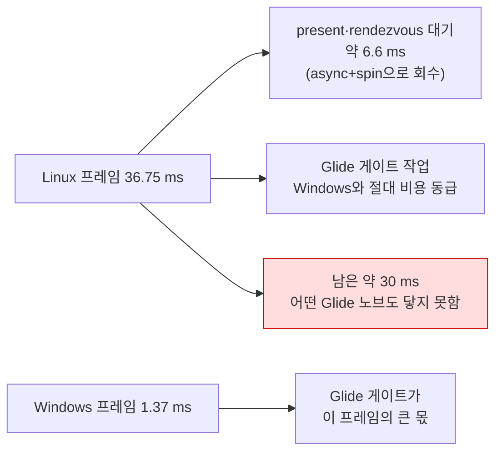

# Task 510 작업 로그 — Linux 속도의 첫 갈래

설계: [20260828-510](../design/20260828-510-linux-speed-first-split.md) ·
작업 지시: [20260828-510](../work-orders/20260828-510-linux-speed-first-split.md) ·
frontier: [linux-port-frontier](../analysis/linux-port-frontier.md) ·
측정 절차: [execution-frame-rate-measurement](../guides/execution-frame-rate-measurement.md)

## 결과 — Glide 게이트는 축이 아닙니다

**코드를 한 줄도 쓰지 않았습니다.** 이미 있는 노브 다섯 변인 × 3회, 양쪽 호스트에서
`pumpit1` Release, vsync OFF, 90초입니다.

| 변인 | fps (3회) | 평균 | 프레임당 | 기준선 대비 |
|---|---|---:|---:|---:|
| **Linux 기준선** | 26.22 · 27.76 · 27.65 | 27.21 | 36.75 ms | — |
| Linux `RENDEZVOUS_SPIN_US=2000` | 29.55 · 30.61 · 31.35 | 30.50 | 32.78 ms | **−3.97 ms** |
| Linux `ASYNC_PRESENT=1` | 33.70 · 31.02 · 33.78 | 32.83 | 30.46 ms | **−6.29 ms** |
| Linux 위 둘 동시 | 32.70 · 33.27 · 33.39 | 33.12 | 30.19 ms | −6.56 ms |
| Linux `SETTER_ELIDE=0` | 27.07 · 26.25 · 27.47 | 26.93 | 37.13 ms | +0.38 ms |
| Linux `DRAW_BATCH=0` | 29.06 · 26.38 · 28.97 | 28.14 | 35.54 ms | −1.21 ms |
| **Windows 기준선** | 743.91 · 737.46 · 708.79 | 730.05 | 1.37 ms | — |
| **Windows `SETTER_ELIDE=0`** | 528.29 · 533.82 · 534.75 | 532.29 | 1.88 ms | **+0.51 ms** |

### 널 결과를 양수로 바꾼 것은 대조군입니다

`SETTER_ELIDE=0`은 Linux에서 **−1.0%**였습니다. 이것만 보면 "호스트 왕복은 Linux에서
공짜"라고 읽게 되는데, 그 읽기는 틀렸습니다. **노브가 이 장면에서 아무 일도 안 했을
가능성**이 남아 있고, 그것을 가를 census는 아래 §"벽"의 뒤에 있습니다.

그래서 **같은 노브를 Windows에서 돌렸습니다.** 27.1% 떨어졌습니다 — 노브는 살아 있습니다.

| | Windows | Linux |
|---|---:|---:|
| `SETTER_ELIDE=0`의 프레임당 추가 비용 | **+0.51 ms** | **+0.38 ms** |
| 그것이 한 프레임에서 차지하는 몫 | **37%** | **1.0%** |

**같은 일을 되돌려 놓았는데 절대 비용이 사실상 같습니다.** Linux에서 보이지 않은 이유는 그
일이 싸서가 아니라 **프레임이 1.37 ms가 아니라 36.75 ms이기 때문**입니다.

이것이 이 작업의 방법론적 핵심입니다 — **배율이 26.8배인 곳에서 백분율로 비교하면 같은
비용이 한쪽에서 37%, 다른 쪽에서 1%로 보입니다.**

### 배제된 것

| 후보 | 판정 | 근거 |
|---|---|---|
| rendezvous 스레드 깨우기 지연 | **한 몫이나 지배항 아님** | spin 2000 µs가 3.97 ms 회수 |
| present가 임계 경로에 있음 | **한 몫이나 지배항 아님** | async present가 6.29 ms 회수 |
| 호스트 왕복 **횟수** | **아님** | elision OFF의 절대 비용이 Windows와 동급(+0.38 대 +0.51 ms) |
| 게이트 **크로싱 횟수** | **아님** | batch OFF가 오히려 1.21 ms 빨랐음(범위 겹침) |

두 노브는 **가산적이지 않습니다** — 동시 적용이 async 단독과 사실상 같습니다(30.19 대
30.46 ms). async present가 스왑 rendezvous 대기를 없애므로 spin의 이득을 흡수합니다.

### 남은 약 30 ms

회수 가능한 6.56 ms를 빼도 **프레임당 약 30 ms가 남고, 그것을 건드린 노브가 하나도
없습니다.** 최선의 조합으로도 Windows의 **22.0배** 느립니다.

**보조 정황(추정): 기동 구간은 26.8배가 아닙니다.** 509의 여섯 실행에서 양쪽 다
`attempts=40`이라 회수 루프의 몫이 같은데 `span_ms`가 Linux 87827~88102, Windows
88122~88227입니다. 첫 프레임까지가 300 ms 안쪽으로 다르고, 2초 남짓 위에서 약 10~15%입니다.
그 구간은 **스왑이 0회**인 구간, 곧 게스트 코드가 자산을 디코드하는 구간입니다. 기동에는
로더 준비와 파일 I/O도 섞여 있어 판정은 아니지만, **게스트 코드 실행 자체가 20배 느린 것은
아니라는** 방향을 가리킵니다.

## 벽 — 세밀한 귀속 계측은 Linux에서 출력되지 않습니다

이 작업이 A/B로 끝난 이유입니다.

`REPIU_GLIDE_ORDINAL_TIME_PROFILE`과 `REPIU_AOT_RETURN_STAGE_PROFILE`은 전부
`Win32MinimalExecutionAttempt`를 거쳐 `main.cpp`가 출력합니다. `attempt`를 채우는
`CopyThreadObservationToAttempt`의 주석이 전제를 그대로 적어 두었습니다.

> Task 333: read after the guest thread has stopped, so the backend's counters are quiescent
> and no lock is needed here.

**Linux에서 렌더까지 간 실행은 게스트 스레드가 멈추지 않습니다** — 509의 세 실행과 510의
열여덟 실행이 전부 `stopped=0`입니다. 그 갈래는 `CopyThreadObservationToAttempt`에 닿기 전에
`_Exit`으로 끝납니다(Task 508).

즉 **귀속 계측 전체가 "게스트 스레드가 멈춘다"를 전제로 서 있고, Linux는 그 전제를 만족하지
않습니다.** 509에서 프레임 수가 없던 것과 같은 뿌리입니다.

## 다음 — 벽을 치우는 것이 이제 정당화됩니다

설계가 계측을 만들기 전에 공짜인 것을 다 써 보라고 했고, 다 썼습니다. 남은 30 ms를 가르려면
**실행 중에 읽을 수 있는 귀속 보고**가 필요합니다.

후보 둘을 다음 단위에서 저울질합니다.

1. **회수 거절 갈래에서 압축 덤프.** 고정 버퍼 `snprintf`로 상위 N개 ordinal과 주요 bucket만
   냅니다. 할당도 해제도 없으므로 Task 508의 규칙(도는 스레드와 경합하는 일을 하지 말 것)을
   깨지 않습니다. 다만 i386에서 64비트 카운터 읽기는 찢어질 수 있고, 그것은 **진단으로
   허용 가능하되 명시해야** 합니다.
2. **게스트 스레드에서 주기 덤프.** 귀속 카운터는 게스트 스레드가 씁니다
   (`linexe_glide_boundary.cpp`의 게이트 핸들러). 프레임 경계에서 그 스레드가 직접 내면
   경합이 아예 없고, 시간별 값도 같이 얻습니다.

---

# Task 510 work log — the first split of Linux's speed

Design: [20260828-510](../design/20260828-510-linux-speed-first-split.md) ·
Work order: [20260828-510](../work-orders/20260828-510-linux-speed-first-split.md) ·
Frontier: [linux-port-frontier](../analysis/linux-port-frontier.md) ·
Procedure: [execution-frame-rate-measurement](../guides/execution-frame-rate-measurement.md)

## Result — the Glide gate is not the axis

**Not one line of code was written.** Five variables over knobs that already exist, three runs each,
`pumpit1` Release, vsync off, 90 seconds, on both hosts.

| Variable | fps (3 runs) | Mean | Per frame | vs baseline |
|---|---|---:|---:|---:|
| **Linux baseline** | 26.22 · 27.76 · 27.65 | 27.21 | 36.75 ms | — |
| Linux `RENDEZVOUS_SPIN_US=2000` | 29.55 · 30.61 · 31.35 | 30.50 | 32.78 ms | **−3.97 ms** |
| Linux `ASYNC_PRESENT=1` | 33.70 · 31.02 · 33.78 | 32.83 | 30.46 ms | **−6.29 ms** |
| Linux both together | 32.70 · 33.27 · 33.39 | 33.12 | 30.19 ms | −6.56 ms |
| Linux `SETTER_ELIDE=0` | 27.07 · 26.25 · 27.47 | 26.93 | 37.13 ms | +0.38 ms |
| Linux `DRAW_BATCH=0` | 29.06 · 26.38 · 28.97 | 28.14 | 35.54 ms | −1.21 ms |
| **Windows baseline** | 743.91 · 737.46 · 708.79 | 730.05 | 1.37 ms | — |
| **Windows `SETTER_ELIDE=0`** | 528.29 · 533.82 · 534.75 | 532.29 | 1.88 ms | **+0.51 ms** |

### The control is what turned a null result into a positive one

`SETTER_ELIDE=0` cost **−1.0%** on Linux. Read alone, that says "host round trips are free on
Linux", and that reading is wrong: **the knob may simply have done nothing in this scene**, and the
census that would separate the two is behind the wall described below.

So **the same knob was run on Windows.** It dropped 27.1% -- the knob is alive.

| | Windows | Linux |
|---|---:|---:|
| Cost per frame of `SETTER_ELIDE=0` | **+0.51 ms** | **+0.38 ms** |
| Share of one frame | **37%** | **1.0%** |

**The same work was put back and it costs essentially the same in absolute terms.** It is invisible
on Linux not because it is cheap there but because **the frame is 36.75 ms rather than 1.37 ms.**

That is this task's methodological point: **where the factor is 26.8x, comparing percentages makes
the same cost look like 37% on one host and 1% on the other.**

### Ruled out

| Candidate | Verdict | Evidence |
|---|---|---|
| Rendezvous thread wake latency | **a share, not the dominant term** | a 2000 µs spin recovers 3.97 ms |
| Present on the critical path | **a share, not the dominant term** | async present recovers 6.29 ms |
| The **number** of host round trips | **no** | elision off costs the same in absolute terms as on Windows (+0.38 against +0.51 ms) |
| The **number** of gate crossings | **no** | batching off was 1.21 ms *faster*, with overlapping ranges |

The two knobs are **not additive**: together they land where async present lands alone (30.19 against
30.46 ms), because async present removes the swap rendezvous wait that the spin was shortening.

### The remaining 30 ms

Even subtracting the 6.56 ms that is recoverable, **about 30 ms per frame is left and no knob touched
it.** The best combination is still **22.0x** slower than Windows.

**Supporting, inferred: start-up is not 26.8x.** In 509's six runs both hosts had `attempts=40`, so
the recovery loop contributes equally, and `span_ms` was 87827-88102 on Linux against 88122-88227 on
Windows. Time to the first frame therefore differs by under 300 ms, which on roughly two seconds is
about 10-15%. That stretch is the one with **zero swaps** -- guest code decoding assets. Start-up
also contains loader work and file I/O, so this is not a verdict, but it points away from guest code
execution itself being twenty times slower.

## The wall — the fine-grained attribution cannot be printed on Linux

This is why the task ended in A/B.

`REPIU_GLIDE_ORDINAL_TIME_PROFILE` and `REPIU_AOT_RETURN_STAGE_PROFILE` all travel through
`Win32MinimalExecutionAttempt` and are printed by `main.cpp`. The comment on
`CopyThreadObservationToAttempt`, which fills `attempt`, states the premise outright:

> Task 333: read after the guest thread has stopped, so the backend's counters are quiescent
> and no lock is needed here.

**A Linux run that reaches rendering does not stop its guest thread** -- all three of 509's runs and
all eighteen of 510's report `stopped=0`. That arm ends at `_Exit` before reaching
`CopyThreadObservationToAttempt` (Task 508).

So **the whole attribution apparatus stands on "the guest thread stops", and Linux does not satisfy
it.** Same root as the missing frame count in 509.

## Next — removing the wall is now justified

The design said to exhaust what is free before building an instrument. It is exhausted. Splitting the
remaining 30 ms needs **attribution that can be read while the run is going.**

Two candidates to weigh in the next unit:

1. **A compact dump on the refused arm.** Fixed-buffer `snprintf` of the top N ordinals and the main
   buckets. Nothing is allocated and nothing is freed, so Task 508's rule (do no work that races the
   running thread) holds. A 64-bit counter read can tear on i386, which is **acceptable for a
   diagnostic but has to be said**.
2. **A periodic dump from the guest thread.** The attribution counters are written by the guest
   thread (the gate handler in `linexe_glide_boundary.cpp`). Emitting from that thread at a frame
   boundary races nothing at all, and gives a value over time as well.
