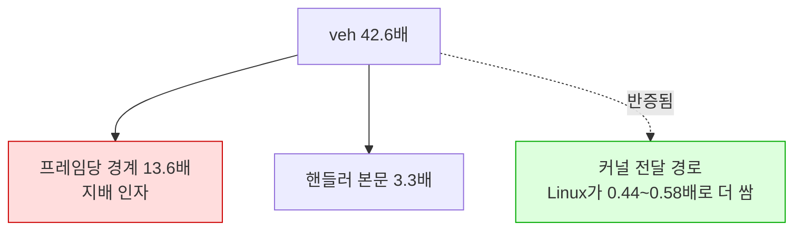

# Task 512 작업 로그 — 시그널 전달: 횟수인가 단가인가

설계: [20260828-512](../design/20260828-512-signal-delivery-count-or-price.md) ·
작업 지시: [20260828-512](../work-orders/20260828-512-signal-delivery-count-or-price.md) ·
frontier: [linux-port-frontier](../analysis/linux-port-frontier.md) ·
측정 절차: [execution-frame-rate-measurement](../guides/execution-frame-rate-measurement.md)

## 결과 — 둘 다입니다. 그리고 시그널 전달은 범인이 아닙니다

| | Windows | Linux | 배율 |
|---|---:|---:|---:|
| 프레임당 배달 | 18.8 | 256.3 | **13.6x** |
| 배달당 cycle (핸들러 본문) | 104,002 | 341,557 | **3.3x** |
| 곱 | | | **44.8x** |
| **커널 왕복 바닥 (`gap min`)** | 21,756 | **9,632** | **0.44x** |
| **커널 왕복 single-step 평균** | 28,185 | **16,466** | **0.58x** |

곱 44.8배가 511이 잰 `veh` 42.6배와 맞습니다 — 분해가 닫힙니다.

**가장 중요한 줄은 아래 둘입니다.** `gap`은 Task 372가 넣은 것으로 **핸들러가 나간 뒤 다음
진입까지**, 곧 커널의 전달 경로만 봅니다. 그 값이 **Linux에서 더 작습니다.** 바닥으로 0.44배,
single-step 평균으로 0.58배입니다.

**즉 Linux의 시그널 전달은 Windows의 예외 디스패치보다 두 배 이상 쌉니다.** 511이 축을
"시그널 전달"이라고 이름 붙였는데, **전달 자체는 오히려 Linux의 강점입니다.** 비싼 것은 그
주위입니다.



## 정규화를 정직하게 — 두 가지가 서로 다른 말을 합니다

| | Windows | Linux |
|---|---:|---:|
| **프레임당** 배달 | 18.8 | 256.3 (**13.6배 많음**) |
| **초당** 배달 | 12,951 | 7,732 (**40% 적음**) |
| `veh`가 `guest-run`에서 차지하는 몫 | 35.5% | 67.9% |

**초당으로는 Linux가 폴트를 더 적게 냅니다.** 프레임당 수치가 큰 것은 프레임이 24배 드물기
때문입니다.

어느 쪽이 하중을 지는가 — **프레임당이 맞습니다.** 한 프레임은 `grBufferSwap` 한 번이고 그
사이 게스트 코드는 같은 경로를 돕니다. 같은 일을 하는데 경계를 13.6배 더 밟는다면 그것은 실제
차이입니다. **다만 게임 로직이 프레임률에 따라 일을 줄이는 구조라면 이 전제가 깨집니다.
확인하지 않았습니다.**

초당 수치를 함께 적는 이유는, 이것만 보고 "Linux가 폴트를 더 많이 낸다"고 옮겨 적으면 틀리기
때문입니다.

## 구현

새로 세는 것이 **없습니다.** `counts`와 gap 배열은 이미 채워지고 있었고, 511의 보고기가 찍지
않았을 뿐입니다. `live_execution_profile_report.cpp`에 두 번째 줄 하나를 더했습니다.

```
[repiu-live-veh] #8 veh_count=617579 per_frame=263 cycles_per_veh=344198 gap_min=9472 gap_ss_mean=16427 gap_ss_count=22082
```

기존 줄과 합치지 않은 것은 한 줄이 길어지면 사람도 스크립트도 읽기 나빠지기 때문입니다.

## 값이 채워지는지 먼저 봤습니다

설계가 그렇게 하라고 적었고, 그대로 했습니다. 첫 실행에서 `veh_count`·`gap_min`·`gap_ss_count`가
모두 0이 아님을 확인한 뒤 해석을 시작했습니다. **이 세션에서 두 번 걸린 함정**이라 절차로
넣었습니다.

## 다음 — 왜 경계를 13.6배 더 밟는가

지배 인자는 **횟수**입니다. 그런데 그 초과분이 무엇인지가 아직 열려 있습니다.

**single-step은 아닙니다.** `gap_ss_count`가 Linux에서 전체 배달의 **3.6%**뿐인데 Windows는
**24.4%**입니다. 초과분은 breakpoint이거나 access violation입니다.

**유력 후보가 frontier 6절에 이미 적혀 있습니다** — 하드웨어 디버그 레지스터를 Linux 사용자
공간이 쓸 수 없어 `native_fast_path`·`native_region`·`native_linear_span` **셋이 모두
차단**되어 있습니다. 그 셋은 정확히 **트랩을 피하려고** 있는 경로입니다. 그것들이 꺼진 채로
도는 것이 초과 경계의 원인인지는 **측정된 적이 없습니다.**

이것이 다음 단위입니다. 그리고 3.3배인 핸들러 본문도 남아 있습니다 — 같은 코드가 왜 Linux에서
더 비싼지는 하위 버킷(`kVehPrologue`·`kAotReentry` 등)이 가릅니다.

---

# Task 512 work log — signal delivery: a count problem or a price problem

Design: [20260828-512](../design/20260828-512-signal-delivery-count-or-price.md) ·
Work order: [20260828-512](../work-orders/20260828-512-signal-delivery-count-or-price.md) ·
Frontier: [linux-port-frontier](../analysis/linux-port-frontier.md) ·
Procedure: [execution-frame-rate-measurement](../guides/execution-frame-rate-measurement.md)

## Result — both, and signal delivery is not the culprit

| | Windows | Linux | Factor |
|---|---:|---:|---:|
| Deliveries per frame | 18.8 | 256.3 | **13.6x** |
| Cycles per delivery (handler body) | 104,002 | 341,557 | **3.3x** |
| Product | | | **44.8x** |
| **Kernel round-trip floor (`gap min`)** | 21,756 | **9,632** | **0.44x** |
| **Kernel round-trip, single-step mean** | 28,185 | **16,466** | **0.58x** |

The product of 44.8x matches the 42.6x Task 511 measured for `veh` -- the decomposition closes.

**The two rows that matter most are the last two.** The `gap` is Task 372's: it measures **handler
exit to next entry**, which is the kernel's delivery path and nothing else. That value is **smaller
on Linux** -- 0.44x at the floor and 0.58x at the single-step mean.

**So Linux's signal delivery is more than twice as cheap as Windows' exception dispatch.** Task 511
named the axis "signal delivery"; **delivery itself turns out to be Linux's advantage.** What is
expensive is everything around it.

## Being honest about normalisation — two of them say different things

| | Windows | Linux |
|---|---:|---:|
| Deliveries **per frame** | 18.8 | 256.3 (**13.6x more**) |
| Deliveries **per second** | 12,951 | 7,732 (**40% fewer**) |
| `veh` share of `guest-run` | 35.5% | 67.9% |

**Per second, Linux takes fewer faults.** The per-frame figure is large because frames are 24x
rarer.

Which one is load-bearing -- **per frame is.** One frame is one `grBufferSwap`, and the guest code
between two of them walks the same path. Taking 13.6x more boundaries for the same work is a real
difference. **That premise breaks if the game logic sheds work at a low frame rate, which has not
been checked.**

The per-second figure is recorded because copying only the per-frame one forward as "Linux faults
more often" would be wrong.

## Implementation

**Nothing new is counted.** `counts` and the gap arrays already filled; 511's reporter simply did not
print them. One second line was added to `live_execution_profile_report.cpp`:

```
[repiu-live-veh] #8 veh_count=617579 per_frame=263 cycles_per_veh=344198 gap_min=9472 gap_ss_mean=16427 gap_ss_count=22082
```

It is not merged into the first line because one long line reads worse for both people and scripts.

## The values were checked for being filled first

The design said to, and it was done: the first run was confirmed to have non-zero `veh_count`,
`gap_min` and `gap_ss_count` before any interpretation began. **This session was caught twice by
exactly that**, so it went into the procedure.

## Next — why 13.6x more boundaries

The dominant factor is **count**, and what the excess consists of is still open.

**It is not single steps.** `gap_ss_count` is **3.6%** of Linux's deliveries against Windows'
**24.4%**. The excess is breakpoints or access violations.

**A strong candidate is already written down in the frontier's section 6**: Linux user space cannot
use the hardware debug registers, so `native_fast_path`, `native_region` and `native_linear_span` are
**all three blocked**. Those paths exist precisely **to avoid traps**. Whether running with them off
is what produces the excess boundaries has **never been measured**.

That is the next unit. The 3.3x handler body remains too -- why the same code costs more on Linux is
what the sub-buckets (`kVehPrologue`, `kAotReentry` and the rest) separate.
