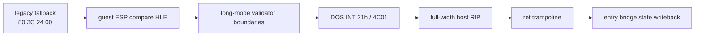

# 작업 로그 20260906-607 — Linux x64 ESP fault와 HLE 종료 경계

## 결과 요약

Task 606 이후 `0x010F1E0F`에서 발생하던 Linux x64 SIGSEGV를 공용 guest-ESP
memory-compare HLE로 해결했습니다. 이어서 DOS 종료 시 x64 signal resume가
i386 recovery `ud2`로 잘못 진입하던 SIGILL도 full-width host RIP와 `ret`
trampoline으로 해결했습니다.



## 확인한 원인

* `0x010F920C`는 AOT cache에 매핑되지 않은 legacy fallback entry였습니다.
* 원본 `80 3C 24 00`은 x64 long mode에서 guest ESP가 아니라 host RSP를
  참조하므로 잘못된 host 주소를 읽었습니다.
* long-mode classifier/lowerer 자체는 이미 `41 80 3C 27 00`을 생성하고
  있었습니다.
* 따라서 수정 대상은 특정 EIP나 원본 바이너리가 아니라 traced fallback의
  `/7 CMP r/m8,imm8` 처리였습니다.

## 구현 내용

1. `ReadGuestUInt8`을 추가하고 traced memory compare가 register 비교뿐 아니라
   immediate 비교(`80 /7`)를 처리하도록 확장했습니다. 주소는 guest ESP로
   계산하며 기존 subtraction flags 계산을 재사용합니다.
2. long-mode guarded segment-load와 segment-override memory-load의 emitted
   layout validator를 보강하고, emission probe에 실제 `MOV ES,AX` image와
   corruption rejection 검사를 추가했습니다.
3. AOT fallback, dynamic translation failure, coverage failure를 기본 출력에
   영향을 주지 않는 bounded opt-in diagnostics
   (`REPIU_AOT_FALLBACK_TRACE`)로 남겼습니다.
4. `FaultEvent::host_resume_address`와 Linux x64 `StoreHostInstructionPointer`
   를 추가했습니다. DOS HLE 종료 때만 signal context에 full-width RIP를
   기록하고, `RepiuLinuxX64GuestExit`의 `ret`가 cache call frame의 host
   return address를 소비하게 했습니다.
5. 종료 resume 시 TF/DF를 제거했습니다. 그렇지 않으면 single-step trace가
   종료 직후 다시 SIGTRAP을 만들고 trampoline stack을 잘못 소비합니다.
   i386 recovery path는 변경하지 않았습니다.

## 검증

빌드:

```text
wsl.exe -d Ubuntu-24.04 -- bash -lc "cd /mnt/e/MYWORK/Projects/rePIU && cmake --build build/linux_x64_debug --target repiu repiu_core_probe -j 2"
```

core probe:

```text
core_probe_total=23
core_probe_failures=0
core_probe_all=true
core_probe_skipped=2 stack_bridge guest_stack_switch
core_probe_host=x64 (Task 545: i386 assembly probes are not built)
```

실제 `pumpit2a` 실행에서는 다음을 확인했습니다.

```text
[repiu-dos-int] #5 int=21 ax=4C01
minimal execution thread exit code: 0
DOS termination captured: true
DOS termination AX/EIP/ESP: 0x4C01/0x010F1977/0x0158CC54
minimal execution message: original entry returned to host trampoline
```

최종 실행에는 `[repiu-fault]`, `Segmentation fault`, `Illegal instruction`,
또는 `core dumped`가 없었습니다. 이 결과는 현재 minimal execution이 DOS
종료 경계까지 안전하게 복귀한다는 뜻이며, 전체 게임플레이·입력·화면 루프가
Linux x64에서 완료되었다는 뜻은 아닙니다.

## 문서와 후속 frontier

* 설계: [20260906-607-linux-x64-esp-memory-fault](../design/20260906-607-linux-x64-esp-memory-fault.md)
* 작업 지시: [20260906-607-linux-x64-esp-memory-fault](../work-orders/20260906-607-linux-x64-esp-memory-fault.md)
* 누적 분석: [linux-port-frontier](../analysis/linux-port-frontier.md)

현재 남은 문제는 종료 trampoline이 아니라, 정상 종료 경계를 제외한 다음
guest 실행 frontier와 실제 interactive game path입니다.

# Work log 20260906-607 — Linux x64 ESP fault and HLE exit boundary

## Result

Task 606's Linux x64 SIGSEGV at `0x010F1E0F` is resolved through a shared
guest-ESP memory-compare HLE. The subsequent SIGILL, where DOS termination's
Linux signal resume entered the i386 recovery `ud2`, is resolved with a
full-width host RIP and a `ret` trampoline.

## Cause established

* `0x010F920C` was an AOT-unmapped legacy-fallback entry.
* In x64 long mode, the original `80 3C 24 00` read host RSP rather than guest
  ESP and therefore referenced the wrong host address.
* The long-mode classifier/lowerer already emitted `41 80 3C 27 00`.
* The target was therefore the shared traced fallback's `/7` `CMP r/m8,imm8`
  handling, not an EIP-specific exception or an original-binary patch.

## Implementation

1. Added `ReadGuestUInt8` and extended the traced memory compare to handle the
   immediate `80 /7` form. It calculates the address from guest ESP and reuses
   the existing subtraction-flag update.
2. Strengthened emitted-layout validation for long-mode guarded segment loads
   and segment-override memory loads. The emission probe now builds a real
   `MOV ES,AX` image and checks deliberate corruption rejection.
3. Added bounded opt-in diagnostics for AOT fallback, dynamic translation
   failure, and coverage failure under `REPIU_AOT_FALLBACK_TRACE`; default output
   is unchanged.
4. Added `FaultEvent::host_resume_address` and Linux x64
   `StoreHostInstructionPointer`. Only the DOS HLE exit path writes the
   full-width host RIP, and `RepiuLinuxX64GuestExit` uses `ret` to consume the
   host return address in the cache call frame.
5. Cleared TF/DF during exit resume. Otherwise the single-step trace generates
   SIGTRAP immediately after termination and consumes the trampoline stack
   incorrectly. The i386 recovery path remains unchanged.

## Verification

Build:

```text
wsl.exe -d Ubuntu-24.04 -- bash -lc "cd /mnt/e/MYWORK/Projects/rePIU && cmake --build build/linux_x64_debug --target repiu repiu_core_probe -j 2"
```

Core probe:

```text
core_probe_total=23
core_probe_failures=0
core_probe_all=true
core_probe_skipped=2 stack_bridge guest_stack_switch
core_probe_host=x64 (Task 545: i386 assembly probes are not built)
```

The real `pumpit2a` run reported:

```text
[repiu-dos-int] #5 int=21 ax=4C01
minimal execution thread exit code: 0
DOS termination captured: true
DOS termination AX/EIP/ESP: 0x4C01/0x010F1977/0x0158CC54
minimal execution message: original entry returned to host trampoline
```

The final run had no `[repiu-fault]`, `Segmentation fault`, `Illegal
instruction`, or `core dumped`. This proves that current minimal execution
returns safely at the DOS termination boundary; it does not claim completion of
the full Linux x64 gameplay, input, or presentation loop.

## References and next frontier

* Design: [20260906-607-linux-x64-esp-memory-fault](../design/20260906-607-linux-x64-esp-memory-fault.md)
* Work order: [20260906-607-linux-x64-esp-memory-fault](../work-orders/20260906-607-linux-x64-esp-memory-fault.md)
* Cumulative analysis: [linux-port-frontier](../analysis/linux-port-frontier.md)

The remaining issue is not the termination trampoline. The next frontier is the
next guest execution boundary outside the intentional termination path and the
real interactive game path.
