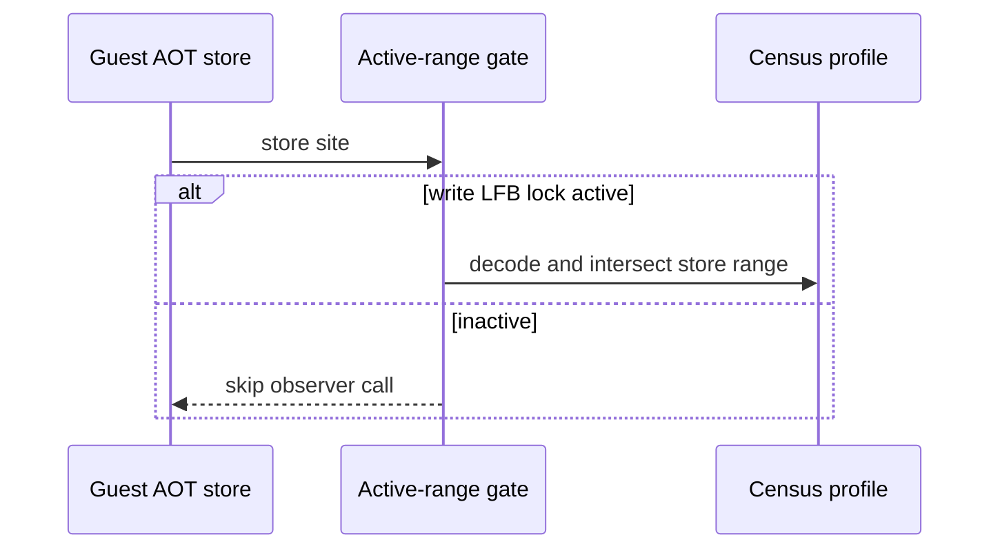

# Task 726 작업 로그 — Linux x64 LFB native-store census

## 결과

`REPIU_LINUX_X64_LFB_STORE_CENSUS=1|on|true` 기본 OFF 계측을 추가했습니다. write
`grLfbLock`이 노출한 guest staging range가 활성일 때만 Linux x64 AOT memory-write
observer call을 삽입합니다. observer는 명시적으로 decode된 store가 이 range와 겹치는
횟수·byte 수를 합산하며, guest memory, ABI, lock/unlock, decode/present 의미를 변경하지
않습니다.

30초 Linux x64 `pumpit2a` bounded run에서 28회 write lock, 27회 완료 unlock을 관찰했습니다.
마지막 lock은 timeout teardown 중 열려 있었습니다. observer/decoded store는 17,975,875건,
LFB 겹침 store는 2,073,600건, 겹침 byte는 8,294,400, store당 최대 겹침은 4 byte였습니다.
run은 clean timeout teardown까지 도달했고 `repiu-fault`가 없었습니다.

이 계측은 string/implicit store, decode 실패, non-AOT/HLE write를 세지 않으므로 전체 guest
write의 총량이 아닌 보수적 하한입니다. 같은 값을 재기록하는 명시적 store도 관찰하므로
Task 725의 byte-difference 결과를 보완하지만, readback 생략을 정당화하지는 않습니다.

## 검증

| 대상 | 결과 |
| --- | --- |
| Linux x64 Debug clean build | 성공 |
| Linux x64 `repiu_core_probe` | 30/30 통과 |
| Linux x64 30초 `pumpit2a` census | 정상 timeout teardown, `repiu-fault` 없음 |
| Win32 x86 Debug 전체 build | 성공, error 0건 |
| Win32 x86 `repiu_aot_probe --glide-lfb-native-store-census` | 통과 |
| Win32 x86 `repiu_core_probe` | 28개 중 1개 실패: 기존 `mode16_push_writes=false` |

Win32 core failure는 새 Linux x64 native observer가 컴파일되지 않는 플랫폼에서 재현되는
기존 synthetic failure입니다. 따라서 이번 변경의 성공 근거로 묶지 않았고, 별도 재현·수정
대상으로 유지합니다.

## English

### Task 726 work log — Linux x64 LFB native-store census

### Result

Added default-off `REPIU_LINUX_X64_LFB_STORE_CENSUS=1|on|true` instrumentation. A Linux
x64 AOT memory-write observer call is emitted only while a write `grLfbLock` has exposed
the guest staging range. The observer aggregates counts and bytes for explicitly decoded
stores intersecting that range, without changing guest memory, ABI, lock/unlock behavior,
or decode/present semantics.

A bounded 30-second Linux x64 `pumpit2a` run observed 28 write locks and 27 completed
unlocks; the last lock was open during timeout teardown. It recorded 17,975,875 observer/
decoded stores, 2,073,600 overlapping LFB stores, 8,294,400 overlapping bytes, and a
maximum 4-byte overlap per store. The run reached clean timeout teardown with no
`repiu-fault`.

The result is a conservative lower bound, not all guest writes: string/implicit stores,
decode failures, and non-AOT/HLE writes are not counted. It complements Task 725's byte-
difference census by observing explicit same-value stores, but it does not justify skipping
framebuffer readback.

### Verification

| Target | Result |
| --- | --- |
| Linux x64 Debug clean build | Passed |
| Linux x64 `repiu_core_probe` | 30/30 passed |
| Linux x64 30-second `pumpit2a` census | Clean timeout teardown, no `repiu-fault` |
| Full Win32 x86 Debug build | Passed, 0 errors |
| Win32 x86 `repiu_aot_probe --glide-lfb-native-store-census` | Passed |
| Win32 x86 `repiu_core_probe` | 1 of 28 failed: existing `mode16_push_writes=false` |

The Win32 core failure reproduces on a platform where the new Linux x64 native observer is
not compiled. It is not grouped as evidence of success for this change and remains a
separate reproduction and repair target.
