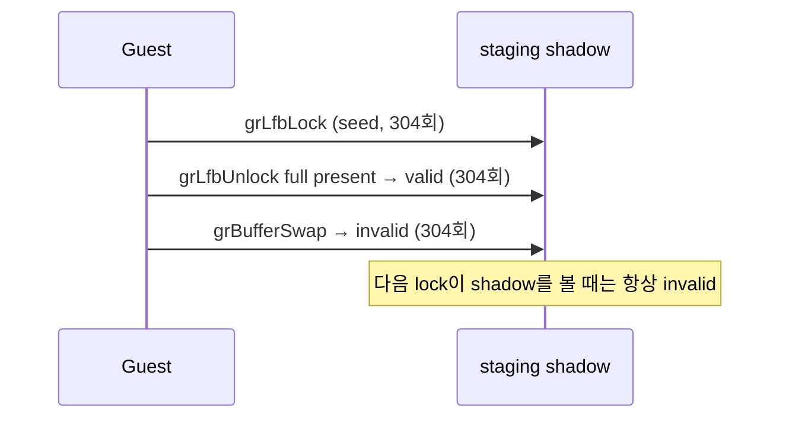

# Task 728 작업 로그 — LFB staging shadow 재사용과 그 반증

설계: [20260922-728](../design/20260922-728-linux-x64-lfb-staging-shadow-reuse.md)
작업 지시: [20260922-728](../work-orders/20260922-728-linux-x64-lfb-staging-shadow-reuse.md)

## 요약

staging shadow 재사용을 설계대로 구현하고 WSL에서 측정했습니다. **측정 결과 재사용은 한 번도
일어나지 않았고, 이 작업의 가설은 반증됐습니다.** 다만 그 반증이 원인을 정확히 짚어 주었고,
함께 확인된 두 가지 사실이 다음 설계를 가리킵니다.

## 구현한 것

`grLfbLock`이 write lock마다 수행하던 full framebuffer readback과 565 encode를, staging
surface가 이미 그 framebuffer를 담고 있다고 host가 증명할 수 있을 때 건너뛸 수 있게 했습니다.
근거는 `grLfbUnlock`이 staging surface **전체**를 present한다는 기존 사실입니다.

새 `GlideLfbStagingShadowState`는 그 사실을 buffer, color format, width, height와 함께 들고
있습니다. 무효화는 `GlideOrdinalPreservesLfbStagingShadow`라는 **기본값이 무효화인 allowlist**로
구현했으므로, 분류되지 않은 gate와 이후 추가될 gate는 자동으로 기존 seed 경로로 돌아갑니다.
flip된 present, 실패한 present, buffer·format·해상도 불일치도 모두 무효화입니다. 무효화 계수는
valid→invalid 전이에서만 올라가므로, 이미 무효인 상태에서 지나가는 gate가 수치를 채우지 않습니다.

Task 476의 region shadow가 같은 surface를 region gate 연속 호출에 대해 다루는 것과 달리, 이
shadow는 두 lock 사이의 state setter를 견디도록 설계했습니다.

`REPIU_GLIDE_LFB_STAGING_SHADOW_CENSUS=1|on|true`는 동작을 바꾸지 않고 재사용 가능했던 lock을
계수하고, `REPIU_GLIDE_LFB_STAGING_REUSE=1|on|true`는 실제로 seed를 건너뜁니다. 후자는 전자를
함의하며 둘 다 기본 OFF입니다.

## 측정 결과 — 가설은 반증됐습니다

WSL Ubuntu-24.04에서 30초 bounded `pumpit2a` census 관찰을 수행했습니다
(`REPIU_STALL_TIMEOUT_MS=0 REPIU_EXECUTION_TIMEOUT_MS=30000
REPIU_GLIDE_LFB_STAGING_SHADOW_CENSUS=1`). **재사용 가능 lock은 0건이었습니다.**

| 항목 | 값 |
|---|---:|
| write lock | 304 |
| 재사용 가능 | **0** |
| seed 수행 | 304 |
| unlock validate | 304 |
| 무효화 — swap gate | **304** |
| 무효화 — draw / clear / region / other | 0 / 0 / 0 / 0 |
| 무효화 — flipped-present / present-failed / surface-mismatch | 0 / 0 / 0 |

shadow는 매번 정상적으로 성립했고(validate 304), 예외 없이 `grBufferSwap` 하나에만 깨졌습니다.
게스트 LFB 경로는 `lock → write → unlock → grBufferSwap → lock`이며, unlock과 다음 lock 사이에
draw, clear, region write, 그 밖의 어떤 gate도 끼어들지 않습니다. "두 lock 사이의 state setter만
견디면 재사용할 수 있다"는 이 작업의 전제는 틀렸습니다. 장애물은 state setter가 아니라 프레임
경계 그 자체였습니다.

이 답을 얻기 위해 무효화 사유 `kGate`를 swap / draw / clear / region / other로 분해했습니다.
"재사용이 안 된다"만으로는 다음 행동을 정할 수 없고 "무엇이 막았는가"가 있어야 하기 때문입니다.

## 함께 확인된 사실 1 — readback 왕복은 무손실이 아니다

`ReadbackFramebuffer`는 논리 framebuffer의 1:1 복사가 아닙니다. window drawable 전체를 읽어
nearest-neighbor로 논리 해상도로 축소하고, `PresentLfbSurface`는 다시 확대합니다. drawable이
논리 해상도의 정수배가 아니면 present → readback 왕복이 원래 pixel을 복원하지 못합니다. 코드
판독으로 확인한 사실이며 게임 관찰로 측정한 값이 아닙니다.

## 함께 확인된 사실 2 — seed는 swap 뒤의 back buffer를 읽는다

swap은 실제 `SDL_GL_SwapWindow`이고, OpenGL 사양에서 swap 뒤 back buffer 내용은 **정의되지
않습니다**. 즉 304번의 seed는 모두 사양상 내용이 정의되지 않은 buffer를 읽었고, Task 724가 잰
readback 6,496,580,582 cycles가 그것을 가져오는 데 쓰였습니다. 이 드라이버에서는 실제로 무언가
보존됩니다 — 같은 관찰의 `grLfbLock seed #2`가 `framebuffer non-black=101340`을 보고했습니다.
그러나 이는 드라이버 동작이지 보장이 아닙니다.

## 다음 설계 후보 (구현하지 않음)

원본 3dfx 하드웨어에서 buffer swap은 page flip이므로, swap 뒤 back buffer는 **두 swap 전
프레임**을 담습니다. 따라서 shadow를 buffer마다 하나씩 쌍으로 두고 `grBufferSwap`에서 교환하면
lock N이 lock N-2의 내용을 재사용할 수 있습니다. 이는 지금보다 빠를 뿐 아니라, 사양상 정의되지
않은 GL back buffer를 읽는 것보다 원본 하드웨어 의미에 **더 가깝습니다**.

**이 작업에서는 구현하지 않았습니다.** 화면에 닿는 것을 바꾸는 변경이므로 별도 설계와 사용자
확인이 필요합니다.

## 검증

- Win32 x86 Debug 전체 빌드 성공.
- `repiu_aot_probe --glide-lfb-staging-shadow` 10개 그룹 전부 통과: policy, 무효화 gate 분류,
  보존 gate 분류, reuse 시퀀스, census-only 시퀀스, gate 무효화, gate 분류 범주,
  buffer·format·해상도 불일치, present 결과, 사유 이름.
- 인접 probe `--glide-lfb-timing`, `--glide-lfb-write-footprint`,
  `--glide-lfb-native-store-census` 통과.
- Win32 x86 `repiu_core_probe`: 28개 중 실패 0. Tasks 725~727이 기록한
  `mode16_push_writes=false` 실패는 이 빌드에서 재현되지 않았습니다. 이 작업은 그 그룹을 고치지
  않았으므로 해결의 증거가 아니라 재현되지 않았다는 기록입니다.
- WSL Ubuntu-24.04 Linux x64 Debug 빌드 성공, `repiu_core_probe` 30/30 통과.
- 위 census 관찰이 timeout 종료까지 fault 없이 완주하고 final report를 남겼습니다.

Linux 검증은 이제 VM(`192.168.198.132`)이 아니라 **WSL Ubuntu-24.04**에서 수행합니다.

## 남은 것

Task 727의 top-EIP 관찰은 여전히 미완입니다. 관찰은 `REPIU_EXECUTION_TIMEOUT_MS` 예산 만료나
SIGTERM으로 끝내야 final report가 남습니다(`docs/guides/linux-shutdown-check.md`).

---

# English

# Task 728 work log — LFB staging shadow reuse, and its refutation

Design: [20260922-728](../design/20260922-728-linux-x64-lfb-staging-shadow-reuse.md)
Work order: [20260922-728](../work-orders/20260922-728-linux-x64-lfb-staging-shadow-reuse.md)

## Summary

Staging shadow reuse was implemented as designed and then measured on WSL. **Reuse never fired
once, and this task's hypothesis is refuted.** The refutation did, however, name the cause
precisely, and two facts confirmed along the way point at the next design.

## What was implemented

The full framebuffer readback and 565 encode that `grLfbLock` ran for every write lock can now
be skipped when the host can prove the staging surface already holds that framebuffer. The
basis is an existing fact: `grLfbUnlock` presents the **entire** staging surface.

The new `GlideLfbStagingShadowState` holds that fact together with buffer, color format, width
and height. Invalidation is `GlideOrdinalPreservesLfbStagingShadow`, an **allowlist whose
default is to invalidate**, so unclassified gates and gates added later fall back to the
existing seed path automatically. A flipped present, a failed present, and any buffer, format or
resolution mismatch invalidate as well. Invalidation counters advance only on the valid-to-
invalid transition, so gates passing over an already-invalid shadow do not inflate them.

Unlike Task 476's region shadow, which covers the same surface across a burst of region gates,
this shadow was built to survive the state setters between two locks.

`REPIU_GLIDE_LFB_STAGING_SHADOW_CENSUS=1|on|true` counts reusable locks without changing
behavior; `REPIU_GLIDE_LFB_STAGING_REUSE=1|on|true` actually skips the seed. The latter implies
the former, and both are off by default.

## Measurement — the hypothesis is refuted

A 30-second bounded `pumpit2a` census observation ran on WSL Ubuntu-24.04
(`REPIU_STALL_TIMEOUT_MS=0 REPIU_EXECUTION_TIMEOUT_MS=30000
REPIU_GLIDE_LFB_STAGING_SHADOW_CENSUS=1`). **Zero locks were reusable.**

| Item | Value |
|---|---:|
| Write locks | 304 |
| Reusable | **0** |
| Seeds performed | 304 |
| Unlock validations | 304 |
| Invalidation, swap gate | **304** |
| Invalidation, draw / clear / region / other | 0 / 0 / 0 / 0 |
| Invalidation, flipped-present / present-failed / surface-mismatch | 0 / 0 / 0 |

The shadow was established correctly every time (304 validations) and broken by exactly one
thing, `grBufferSwap`. The guest LFB path is `lock -> write -> unlock -> grBufferSwap -> lock`,
with no draw, clear, region write or any other gate between an unlock and the next lock. This
task's premise -- that surviving the state setters between two locks would be enough -- was
wrong. The obstacle was never the state setters; it is the frame boundary itself.

Reaching that answer required splitting the `kGate` reason into swap, draw, clear, region and
other. "Reuse does not fire" does not tell anyone what to do next; "what stopped it" does.

## Fact confirmed along the way 1 — the readback round trip is not lossless

`ReadbackFramebuffer` is not a 1:1 copy of the logical framebuffer. It reads the whole window
drawable and nearest-neighbor downsamples to the logical resolution, and `PresentLfbSurface`
upscales again. When the drawable is not an integer multiple of the logical resolution, the
present-then-readback round trip does not restore the original pixel. This was established by
reading the code, not measured from a run.

## Fact confirmed along the way 2 — the seed reads a post-swap back buffer

The swap is a real `SDL_GL_SwapWindow`, and in the OpenGL specification the back buffer contents
after a swap are **undefined**. All 304 seeds therefore read a buffer the specification does not
define, and the 6,496,580,582 readback cycles Task 724 measured were spent fetching it. On this
driver something is in fact preserved -- the same observation's `grLfbLock seed #2` reported
`framebuffer non-black=101340` -- but that is driver behavior, not a guarantee.

## Candidate next design (not implemented)

On original 3dfx hardware a buffer swap is a page flip, so the post-swap back buffer holds the
frame from **two swaps earlier**. Keeping one shadow per buffer and exchanging them at
`grBufferSwap` would therefore let lock N reuse the content of lock N-2. That would be not only
faster than today but **closer to original hardware semantics** than reading a GL back buffer
the specification leaves undefined.

**It is not implemented here.** Because it changes what reaches the screen, it needs its own
design and the user's confirmation.

## Verification

- Full Win32 x86 Debug build succeeded.
- All ten groups of `repiu_aot_probe --glide-lfb-staging-shadow` passed: policy, invalidating-
  gate classification, preserving-gate classification, the reuse sequence, the census-only
  sequence, gate invalidation, gate categories, buffer/format/resolution mismatch, present
  outcomes, and reason names.
- The neighboring `--glide-lfb-timing`, `--glide-lfb-write-footprint` and
  `--glide-lfb-native-store-census` probes passed.
- Win32 x86 `repiu_core_probe`: zero failures of 28. The `mode16_push_writes=false` failure
  recorded by Tasks 725 through 727 did not reproduce in this build. This task did not change
  that group, so this records a non-reproduction rather than evidence of a fix.
- WSL Ubuntu-24.04 Linux x64 Debug build succeeded; `repiu_core_probe` passed 30/30.
- The census observation above ran to timeout termination without a fault and emitted its final
  report.

Linux verification now runs on **WSL Ubuntu-24.04**, not the VM (`192.168.198.132`).

## What remains

Task 727's top-EIP observation is still outstanding. Observations must be ended through
`REPIU_EXECUTION_TIMEOUT_MS` budget expiry or SIGTERM for the final report to survive
(`docs/guides/linux-shutdown-check.md`).
