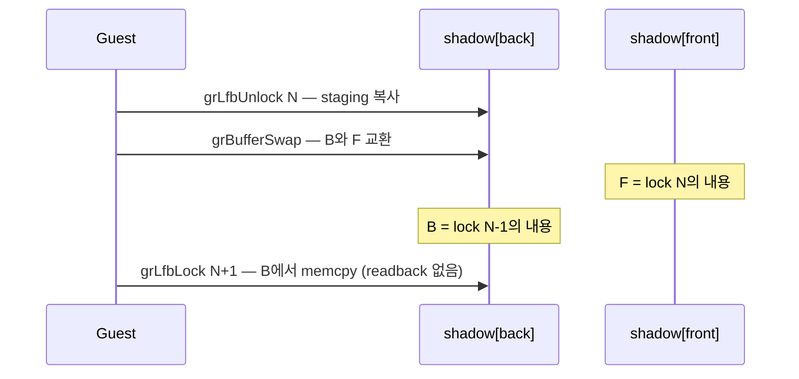

# Task 729 작업 로그 — LFB lock 구간 census와 buffer별 shadow 쌍

설계: [20260922-729](../design/20260922-729-lfb-lock-interval-and-buffer-pair-shadow.md)
작업 지시: [20260922-729](../work-orders/20260922-729-lfb-lock-interval-and-buffer-pair-shadow.md)

## 요약

Task 728이 남긴 후속 후보(buffer별 shadow 쌍)를 **측정 먼저, 구현 나중**의 순서로 진행했습니다.
1단계 census가 구현을 허락했고, 2단계 구현은 apply 모드에서 write-lock seed를 **304회에서 2회로
(99.3%)** 줄였습니다. 다만 apply 모드 3회 중 1회에서 원인 미확정 teardown segfault가 있어 기본값은
켜지 않습니다.

## 1단계 — 측정이 구현을 허락했다

30초 ordinal 계측에서 `grRenderBuffer`가 1회뿐이라 render target이 back buffer로 고정임을
확인했고, 새 `REPIU_GLIDE_LFB_LOCK_INTERVAL_CENSUS`로 unlock부터 다음 lock까지를 분류했습니다.

| 구간 | 수 |
|---|---:|
| **clean (swap만)** | **303** |
| cleared / drawn / region | 0 / 0 / 0 |
| first-lock | 1 |
| 구간당 swap | 최소 1, 최대 1 |

303개 구간 전부가 **정확히 swap 1회뿐**이었습니다. 작업 지시의 2단계 진입 조건(clean 구간이 0이
아닐 것)을 충족했습니다.

## 2단계 — buffer별 shadow 쌍

`GlideLfbStagingShadowState`를 color buffer마다 host 소유 565 복사본을 두는 구조로 바꿨습니다.

* `grBufferSwap`은 무효화가 아니라 **교환**입니다(page flip). Task 728과 달라진 핵심입니다.
* draw·clear는 render target의 복사본만, region과 미분류 gate는 둘 다 무효화합니다.
* 복사본은 staging surface 자체가 아니므로 Task 728의 `kLockHandoff` 무효화를 제거했습니다.
* 복사본 저장 실패는 `kStorageFailure`로 무효화하고 기존 seed 경로로 돌아갑니다.

### 측정

| 30초 `pumpit2a` | 값 |
|---|---:|
| census: 재사용 가능 lock | **302 / 304** (Task 728: 0) |
| census: 무효화 | clear 2, 그 외 0 |
| apply: 실제 재사용 | 302 |
| apply: seed 수행 | **2** (이전 304) |
| apply: LFB readback cycles | **46,943,841** (Task 724: 약 65억) |

### 화면 동일성

* 첫 8개 `grLfbUnlock` staging 내용이 기준 실행과 **바이트 수까지 동일**합니다.
* 1초 간격 장면 표본 23개에서 장면 순서, 검은 구간, 정지 화면이 일치합니다.
* 애니메이션 구간의 표본 차이는 표본 시점 흔들림으로 **추정**되지만, OFF 대 OFF 기준선이 없어
  **확정하지 않았습니다.**

## 미확정 — apply 모드 teardown segfault 1건

apply 모드 3회 중 1회(장면 표본 병용)가 예산 만료 직후 `elapsed_ms=30010`에
`signal=0xb rip=0x7efebb7bb210 rsp=0x7efebb7bb1f8`로 끝났습니다. `[repiu-shutdown]` 마커가 없어
종료 시퀀스 전 인터럽트 구간에서 죽었고, `rip`가 `rsp`+0x18이라 guest thread가 자기 스택 안으로
점프했습니다. 이 코드는 teardown 경로에 없고, Task 722의 timing 교란형 teardown fault와 같은
계열로 보이지만 **표본 1건으로는 인과를 판단할 수 없습니다.** 반복 실행으로 발생률을 비교해야
하며, 크래시 조사를 위한 반복 실행은 사용자 확인 후 진행합니다.

## 검증

- Win32 x86 Debug 전체 빌드 성공, core probe 28개 중 실패 0.
- `repiu_aot_probe --glide-lfb-staging-shadow` 14개 그룹 전부 통과(저장 왕복, swap 교환,
  page-flip 시퀀스, 대상 buffer별 무효화, render target 추적, 불일치 거부, 퇴화 surface 거부 포함).
- `repiu_aot_probe --glide-lfb-lock-interval` 9개 그룹 전부 통과.
- WSL Ubuntu-24.04 Linux x64 Debug 빌드 성공, core probe 30/30.
- WSL 관찰: ordinal 1회, interval census 1회, pair census 1회, apply 1회는 정상 종료.
  장면 표본 OFF 1회 정상, ON 1회 teardown segfault.

## 남은 것

1. teardown segfault의 귀속(OFF·ON 반복 비교).
2. OFF 대 OFF 장면 기준선.
3. 둘이 해소된 뒤 apply 기본값 검토.

## 후속 — teardown segfault 귀속 (사용자 승인 후 반복 실행)

같은 설정으로 reuse OFF·ON을 번갈아 5회씩 순차 실행했습니다. **OFF 3번째 실행이 같은 모양의
segfault로 죽었고**(rip=rsp+0x18, 예산 만료 순간, 종료 마커 없음), ON 5회는 모두 정상 종료하며
302/304 재사용을 재현했습니다. 이 설정에서 OFF 1/6, ON 1/6입니다. **크래시는 shadow 쌍과 무관한
기존 결함입니다.** Task 728 이전 로그 4건에도 같은 구간의 fault가 있었고, Task 727의 "외부 종료로
final report 없음"은 실제로 이 fault였습니다.

원인 후보는 x64 종료 회수 판정이 RIP 하위 32비트만 본다는 점이며, 아직 검증하지 않았습니다.
자세한 내용은 [linux-port-frontier](../analysis/linux-port-frontier.md)의 Task 729 후속 절에 있습니다.

---

# English

# Task 729 work log — LFB lock interval census and a per-buffer shadow pair

Design: [20260922-729](../design/20260922-729-lfb-lock-interval-and-buffer-pair-shadow.md)
Work order: [20260922-729](../work-orders/20260922-729-lfb-lock-interval-and-buffer-pair-shadow.md)

## Summary

The follow-on Task 728 left behind, a per-buffer shadow pair, was done **measurement first,
implementation second**. The stage 1 census allowed the implementation, and stage 2 cut write-lock
seeds in apply mode **from 304 to 2 (99.3%)**. One of three apply-mode runs hit a teardown
segfault whose cause is not established, so no default is turned on.

## Stage 1 — measurement allowed the implementation

A 30-second ordinal profile showed `grRenderBuffer` running once, fixing the render target on the
back buffer, and the new `REPIU_GLIDE_LFB_LOCK_INTERVAL_CENSUS` classified each span from an
unlock to the next lock: **303 clean (swaps only)**, 0 cleared, 0 drawn, 0 region, 1 first-lock,
with swaps per interval at minimum 1 and maximum 1. Every one of the 303 intervals held **exactly
one swap and nothing else**, meeting the work order's entry condition for stage 2.

## Stage 2 — a per-buffer shadow pair

`GlideLfbStagingShadowState` now keeps one host-owned 565 copy per color buffer.

* `grBufferSwap` is an **exchange**, not an invalidation -- the page flip. This is the change
  from Task 728.
* Draws and clears invalidate only the render target's copy; region and unclassified gates
  invalidate both.
* The copies are not the staging surface itself, so Task 728's `kLockHandoff` invalidation is
  removed.
* A copy that cannot be stored invalidates with `kStorageFailure` and falls back to the existing
  seed path.

### Measurement

| 30-second `pumpit2a` | Value |
|---|---:|
| Census: reusable locks | **302 / 304** (Task 728: 0) |
| Census: invalidations | clear 2, nothing else |
| Apply: actually reused | 302 |
| Apply: seeds performed | **2** (was 304) |
| Apply: LFB readback cycles | **46,943,841** (Task 724: about 6.5 billion) |

### Screen equality

* The first eight `grLfbUnlock` staging contents match the baseline run **down to the byte
  count**.
* Across 23 one-second scene samples, scene order, black gaps and still screens match.
* Differences in animated stretches are **inferred** to be sample-time jitter, but without an
  OFF-against-OFF baseline this is **not established.**

## Unresolved — one apply-mode teardown segfault

One of three apply-mode runs (with scene sampling) ended just after budget expiry, at
`elapsed_ms=30010`, with `signal=0xb rip=0x7efebb7bb210 rsp=0x7efebb7bb1f8`. With no
`[repiu-shutdown]` markers it died in the interrupt window before the shutdown sequence, and with
`rip` at `rsp`+0x18 the guest thread jumped into its own stack. This code is not on the teardown
path, and the fault looks like the timing-perturbed teardown fault Task 722 recorded, but **one
sample cannot establish cause.** Rates must be compared over repeated runs, and repeated runs for
a crash investigation proceed only after the user confirms.

## Verification

- Full Win32 x86 Debug build succeeded; core probe zero failures of 28.
- All 14 groups of `repiu_aot_probe --glide-lfb-staging-shadow` passed, including store round
  trip, swap exchange, the page-flip sequence, per-target invalidation, render-target tracking,
  mismatch rejection, and degenerate-surface refusal.
- All nine groups of `repiu_aot_probe --glide-lfb-lock-interval` passed.
- WSL Ubuntu-24.04 Linux x64 Debug build succeeded; core probe 30/30.
- WSL observations: one ordinal, one interval census, one pair census and one apply run ended
  cleanly. With scene sampling, the OFF run ended cleanly and the ON run hit the teardown
  segfault.

## What remains

1. Attribute the teardown segfault by comparing repeated OFF and ON runs.
2. An OFF-against-OFF scene baseline.
3. Once both are settled, consider the apply default.

## Follow-up — attributing the teardown segfault (repeated runs after user approval)

Reuse OFF and ON were run alternately and sequentially, five times each, under the same settings.
**OFF run 3 died with the same segfault** (rip at rsp+0x18, at budget expiry, no shutdown markers),
while all five ON runs ended cleanly and reproduced 302 of 304 reuses. This setting crashed 1 of 6
OFF and 1 of 6 ON. **The crash is a pre-existing defect unrelated to the shadow pair.** Four logs
from before Task 728 show a fault in the same window, and Task 727's "no final report because of
an external stop" was in fact this fault.

The candidate cause, not yet verified, is that the x64 shutdown recovery check reads only the low
32 bits of RIP. Details are in the Task 729 follow-up section of
[linux-port-frontier](../analysis/linux-port-frontier.md).
