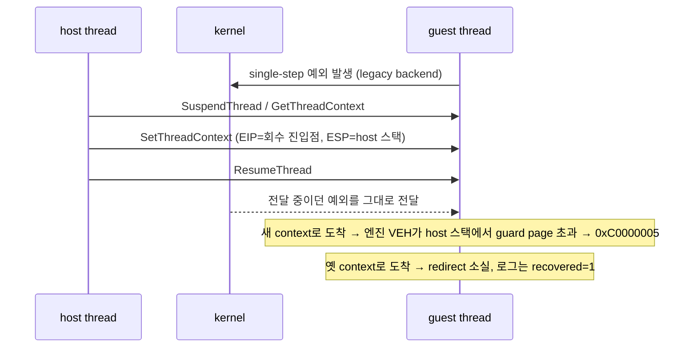

# Task 733 작업 로그 — Win32 legacy 종료 크래시 귀속과 수정

설계: [20260922-733](../design/20260922-733-win32-legacy-shutdown-crash-attribution.md)
작업 지시: [20260922-733](../work-orders/20260922-733-win32-legacy-shutdown-crash-attribution.md)

## 요약

Win32 pumpit1 legacy 실행(1초 예산)이 간헐적으로 0xC0000005로 죽던 원인을 찾아 고쳤습니다. 원인은
종료 회수가 guest thread를 멈추고 context를 바꾸는 순간 **커널이 이미 전달 중이던 예외**였습니다. 수정
뒤 40회 연속 정상 종료했고, 낡은 `test_all.ps1` 단정도 현재 동작에 맞췄습니다. 다만 `test_all.ps1`의
실제 end-to-end 실행은 이번 작업과 무관한 **VS 2026 toolchain 크래시**에서 멈췄습니다.

## 1~3단계 — 재현과 계측

사용자가 시작한 `6e5bcdf "temp commit"`의 `REPIU_SHUTDOWN_RECOVERY_TRACE=1` 진단을 빌드해 확인했습니다.
redirect 뒤 첫 예외만 기록하던 것을 4개까지 넓혔습니다(`07f0271`).

## 4단계 — 귀속

크래시 4회와 생존 실행을 비교했습니다.

* 크래시: context EIP=회수 진입점, ESP=host 스택인 single-step 뒤, index 3에서 guard page violation
  (0x80000001, ESP `0x0CC6E000`, 쓰기 대상 `0x0CC6DFFC`). host 스택은 guard page까지 약 7.7KB입니다.
* 생존: 옛 guest context로 도착해 guest에서 연속 single-step. **redirect가 사라졌는데도 `recovered=1`**로
  기록되는 거짓 보고였습니다.
* TF는 원인이 아닙니다. `RecoverToHost`가 이미 지우고, 크래시 실행 중 TF가 꺼진 경우도 있었습니다.

## 5단계 — 수정: redirect guard

`DecideShutdownRedirectGuard`(순수 함수)와 Win32 전용 guard VEH를 추가했습니다(`1ca11ca`). 종료 구간에만
설치되며 엔진 VEH보다 먼저 호출됩니다. redirect 뒤 guest thread에 도착한 예외 중 context EIP가
회수 진입점이거나 guest/cache 코드인 것에 `RecoverToHost`를 다시 적용하고 실행을 재개합니다.

처음에는 회수 진입점에서 single-step만 받았는데 24회 중 1회 크래시가 남았습니다. 회수 진입점의 첫
명령은 CS를 통한 전역 읽기라 fault할 수 없으므로, 그 위치에서 보고된 예외는 **모두** 전달 중이던 것입니다.
그래서 모든 예외 코드로 넓히고, 예상 밖의 반복을 막기 위해 진입점 재적용을 8회로 제한했습니다.

| 검증 | 결과 |
|---|---|
| 수정 전 (guest를 시작한 실행) | 약 16회 중 8회 crash/hang |
| 1차 수정 (single-step만) | 24회 중 23 정상, 1 crash |
| **최종 수정** | **30회 중 30 정상**, guard 개입 19회 (진입점 7, guest 12) |
| 최종 수정 + trace | 10회 중 10 정상, guard 개입 7회 |
| core probe | Win32 29/29, Linux x64 31/31 (판정표 포함) |

guard 개입 사례(trace 실행 01): context EIP=`0x10017DDC`(회수 진입점), ESP=host의 single-step이 도착했고,
guard가 재적용해 `step=done`까지 정상으로 끝났습니다. 이전에는 이 모양이 크래시였습니다.

## 6단계 — `test_all.ps1` 단정 갱신

수정 뒤 정상 실행 40회에 pumpit1 단정을 하나씩 대 보니, 실패는 모두 0/40으로 일관되었습니다.

* 결말 문구: `minimal execution attempt timed out`(Task 507 이전) →
  `(timeout reached|minimal execution attempt timed out)`으로 갱신.
* `DOS environment access observed: true` 외 2개 삭제. 이 관찰기는 instruction emulator를 거치는 DS 읽기만
  보는데, flat selector fold(Tasks 711~717) 이후 guest는 환경 블록을 native로 읽습니다(추정). 환경 블록
  자체와 그 뒤의 DOS path trace는 40/40 유지되므로 guest가 그 단계를 지났음은 확인됩니다.
* 예외로 멈추는 결말 묶음은 대안 결말이라 그대로 두었습니다(0/40이지만 판정에 영향 없음).

갱신한 스위트로는 40회 모두 통과 조건을 만족합니다.

## `test_all.ps1` end-to-end 실행 — 이번 작업과 무관한 차단

실제 `test_all.ps1 -SkipSetup`은 빌드는 성공했지만 **`dos4gw_hello` 단계에서 0xC0000005**로 멈췄습니다.

| binary | dos4gw_hello |
|---|---|
| `build\Debug\repiu.exe` (Visual Studio 17 2022, toolset v143) | 3/3 정상 |
| `build\win32_x86_debug\Debug\repiu.exe` (Visual Studio 18 2026, toolset v145) | **3/3 크래시** |

`build_win32_x86.ps1`은 설치된 가장 새 Visual Studio를 고르므로 `test_all.ps1`은 VS 2026으로 빌드합니다.
두 project의 설정은 toolset 외에 같았습니다. 크래시는 실행 시작 직후(shadow selector 예약 뒤, 첫
`[repiu-live]` 이전)이고 Task 733 코드는 종료 블록에서만 동작하므로 이번 수정과 무관합니다. 원인은
조사하지 않았습니다.

## 정정

* Task 732는 `test_all.ps1`이 "이 머신에 없는 빌드 트리를 가리킨다"고 기록했습니다. 실제로는
  `build_win32_x86.ps1`이 그 트리(`build\win32_x86_debug`)를 **직접 만듭니다.** 경로는 스위트 안에서
  일관되며, 이 머신의 작업 트리(`build\`)와 다를 뿐입니다.
* 앞선 반복에서 실행의 약 45%(19회 중 9회)가 `Failed to reserve an available relocated image base`로
  시작도 못 했지만, 이후 94회에서는 **0회**였습니다. 실패가 몰린 시기는 크래시한 프로세스가 좀비로 남아
  있던 시기와 겹치지만 원인은 확정하지 못했습니다.

## 남은 것

1. VS 2026(v145) toolchain으로 빌드한 binary가 실행 시작에 크래시하는 원인. 그 전까지 `test_all.ps1`을
   end-to-end로 돌리려면 VS 2022 generator를 쓰도록 `build_win32_x86.ps1`을 조정해야 합니다(정책 결정 필요).
2. 진단 trace(`REPIU_SHUTDOWN_RECOVERY_TRACE`)는 opt-in으로 남겼습니다.

---

# English

# Task 733 work log — attributing and fixing the Win32 legacy shutdown crash

Design: [20260922-733](../design/20260922-733-win32-legacy-shutdown-crash-attribution.md)
Work order: [20260922-733](../work-orders/20260922-733-win32-legacy-shutdown-crash-attribution.md)

## Summary

The intermittent 0xC0000005 in Win32 pumpit1 legacy runs (1-second budget) was attributed and fixed. The
cause was **an exception the kernel was already delivering** at the moment shutdown recovery suspended the
guest thread and rewrote its context. After the fix, 40 consecutive runs ended cleanly, and the stale
`test_all.ps1` assertions were brought up to current behavior. The real end-to-end `test_all.ps1` run,
however, stopped on a **VS 2026 toolchain crash** unrelated to this task.

## Stages 1-3 — reproduction and instrumentation

The `REPIU_SHUTDOWN_RECOVERY_TRACE=1` diagnostic from the user's `6e5bcdf "temp commit"` was built and
confirmed, and widened from the first exception after the redirect to the first four (`07f0271`).

## Stage 4 — attribution

In crashes, a single step arrived with context EIP at the recovery entry and ESP on the host stack,
followed at index 3 by a guard page violation (0x80000001, ESP `0x0CC6E000`, write target `0x0CC6DFFC`);
the host stack has about 7.7 KB above its guard page. In surviving runs the exception arrived with the old
guest context and the engine kept single-stepping the guest -- **the redirect was lost while the log said
`recovered=1`**. TF is not the cause: `RecoverToHost` already clears it, and a crashing run had TF clear.

## Stage 5 — fix: the redirect guard

`DecideShutdownRedirectGuard` (a pure function) and a Win32-only guard VEH were added (`1ca11ca`),
installed for the shutdown window only and called before the engine VEH. For exceptions reaching the guest
thread after the redirect whose context EIP is the recovery entry or guest/cache code, it reapplies
`RecoverToHost` and resumes. A first version taking only single steps at the entry still crashed once in
24 runs. The entry's first instruction is a global read through CS and cannot fault, so any exception
reported there was in flight; the rule was widened to every exception code, with reapplications at the
entry bounded at eight.

Results: before the fix, about 8 of 16 runs that started the guest crashed or hung; the first version, 23
of 24 clean; **the final version, 30 of 30 clean**, the guard intervening in 19 (entry 7, guest 12); with
trace, 10 of 10 clean, the guard intervening in 7. Core probes: Win32 29/29, Linux x64 31/31, including the
decision table. In traced run 01 a single step arrived at the recovery entry `0x10017DDC` on the host stack
-- the shape that used to crash -- and the guard reapplied the redirect; the run reached `step=done`.

## Stage 6 — updating the `test_all.ps1` assertions

Against 40 clean runs after the fix every failing pumpit1 assertion failed consistently (0/40). The ending
wording expected before Task 507 now accepts `(timeout reached|minimal execution attempt timed out)`. The
three `DOS environment access` assertions were removed: that observer sees only DS reads routed through the
instruction emulator, and since the flat-selector folds (Tasks 711-717) the guest reads its environment
natively (inferred); the environment block and the DOS path traces after it still hold 40/40. The
exception-ending set is an alternative outcome and was kept. With the updated suite all 40 runs meet the
pass condition.

## The end-to-end `test_all.ps1` run — blocked by something unrelated

`test_all.ps1 -SkipSetup` built successfully but stopped at **`dos4gw_hello` with 0xC0000005**.
`build\Debug\repiu.exe` (Visual Studio 17 2022, toolset v143) passed it 3 of 3;
`build\win32_x86_debug\Debug\repiu.exe` (Visual Studio 18 2026, toolset v145) **crashed 3 of 3**.
`build_win32_x86.ps1` picks the newest installed Visual Studio, so the suite builds with VS 2026. The two
projects' settings match apart from the toolset. The crash happens right after execution starts (after
shadow-selector reservation, before the first `[repiu-live]`), while Task 733's code runs only in the
shutdown block, so it is unrelated. Its cause was not investigated.

## Corrections

* Task 732 recorded that `test_all.ps1` "points at a build tree that does not exist on this machine". In
  fact `build_win32_x86.ps1` **creates** that tree (`build\win32_x86_debug`); the path is consistent within
  the suite and merely differs from this machine's working tree (`build\`).
* Earlier repetitions saw about 45% of runs (9 of 19) fail to start with `Failed to reserve an available
  relocated image base`; the following 94 runs had **none**. The failing stretch coincided with crashed
  processes lingering as zombies, but the cause is not established.

## What remains

1. Why a binary built with the VS 2026 (v145) toolchain crashes at execution start. Until then, running
   `test_all.ps1` end to end needs `build_win32_x86.ps1` to use the VS 2022 generator (a policy decision).
2. The diagnostic trace (`REPIU_SHUTDOWN_RECOVERY_TRACE`) stays as an opt-in.
