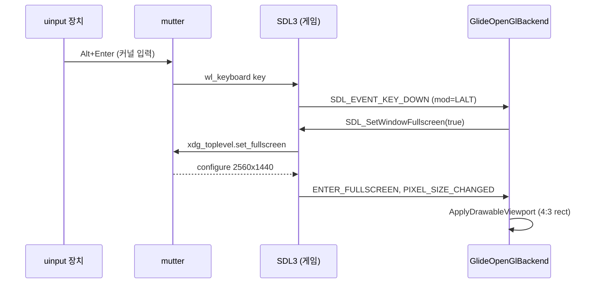
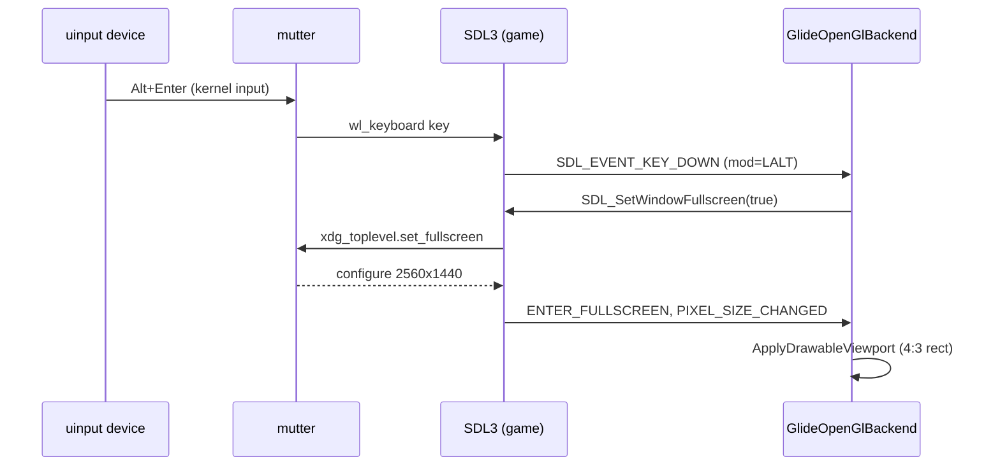

# Task 772 작업 로그: 최근 변경의 Linux 실기 검증

작업 지시: [20261005-772](../work-orders/20261005-772-linux-native-verification.md)

## 요약

v0.0.198~v0.0.201의 변경(Task 766~771)을 실제 Ubuntu 머신에서 확인했습니다. 코드는 바꾸지 않았습니다.

* **통과:** x64 Debug 빌드, core probe, 임시 빌드한 Win32 전용 probe 다섯 가지(Wayland·x11 모두), `--post-shader`
  세 경우, vsync 기본값, 실제 커널 입력으로 한 전체화면 왕복(Wayland·x11 각 6회), v0.0.200 릴리스 아카이브 두 개.
* **WSL에서 남긴 두 의문이 풀렸습니다.** NVIDIA에서는 `glide_letterbox_gl=true`이고(WSL의 false는 Mesa가 다음 swap에서야
  버퍼 크기를 바꾸기 때문), GNOME(mutter) Wayland에서는 전체화면 해제가 3~67 ms 안에 끝납니다(WSLg에서만 느렸음).
* **새로 찾은 결함(기존, 이번 변경과 무관):** Linux i386 Release는 vsync가 켜져 있으면 실행 도중 한 호스트 루프에 빠져
  타이머 tick을 대량으로 버리고 게임이 느려집니다. 60초 실행 4/4, 20초 실행 19회 중 6회에서 생겼고, v0.0.198에서도 같고,
  vsync를 끄면 60초 4/4 모두 생기지 않았습니다. x64는 한 번도 생기지 않았습니다. 별도 작업으로 넘깁니다.
* Task 755(WSL 음악 속도)의 판정값: 실기의 시계 어긋남은 −19 ppm, 0.5%를 넘은 초는 0입니다.

## 환경

Ubuntu 26.04.1 LTS, Linux 7.0.0-38, GNOME Wayland(`xwayland-native-scaling`, `scale-monitor-framebuffer`),
5120×2880 모니터 두 대(DP-3 주 모니터, HDMI-1, 배율 2), NVIDIA RTX 4090(595.91.07), cmake 4.2.3, g++ 15.2.0.
32비트 런타임은 일부만 있습니다(`libwayland-egl1:i386`, `libwayland-cursor0:i386`, libdecor i386 없음). 32비트
개발 툴체인(multilib)은 없어 i386을 로컬에서 빌드하지 못했습니다.

## 1. 빌드와 core probe

* `scripts/build_linux_x64.sh --config Debug`: exit 0, 31.6초. 경고 2개는 기존 파일
  (`execution_trampoline.cpp:158`, `x64/fault_handler_arch.cpp:88`).
* `repiu_core_probe`(DISPLAY·WAYLAND_DISPLAY 없이): exit 0, `launcher_command_line_options=true`,
  `launcher_all=true`, `core_probe_all=true`, false 없음.

## 2. Win32 전용 probe 임시 빌드

`repiu_aot_probe`와 `repiu_glide_render_probe`는 `if(WIN32)` 타깃이라, Task 769처럼 저장소 밖(scratchpad)에서
`launcher_probe.cpp`·`post_shader_probe.cpp`·`glide_letterbox_probe.cpp`와 작은 driver, 그리고 `#if defined(_WIN32)`만
`#if 1`로 바꾼 render probe 사본을 `build/linux_x64`의 정적 라이브러리에 `repiu`와 같은 링크 옵션으로 묶었습니다.
`-Wall -Wextra` 경고 없음.

| probe | 결과 |
|---|---|
| `--glide-letterbox` / `--post-shader` / `--launcher` | 모두 `*_all=true` |
| `--opengl-lfb` (wayland, x11) | `glide_render_probe=pass` |
| `--opengl-post-shader` (wayland) | 주사선·crt·none·상태 복원·`glide_letterbox_gl` 모두 true, 전체화면 `2560x1440`, viewport `320,0,1920,1440` |
| `--opengl-post-shader` (x11) | 같은 항목 모두 true, 전체화면 `5120x2806`, viewport `689,0,3741,2806` |

* **`glide_letterbox_gl`이 두 드라이버 모두 true입니다.** WSL(Mesa d3d12·llvmpipe)에서는 네 조합 모두 false였고,
  Task 769 로그는 그 원인을 "Mesa가 다음 swap에서야 back buffer 크기를 바꾼다"로 추정했습니다. NVIDIA의 GLX·EGL은 바로
  바꾸므로 같은 probe가 통과합니다. 추정이 맞다는 대조 결과입니다.
* x11의 `5120x2806`은 모니터(5120×2880)보다 74px(GNOME 상단 막대 높이) 작습니다. probe가 `SDL_SyncWindow` 직후 한 번만
  읽어서 전환 도중의 크기를 본 것으로 보입니다. 실제 게임(4절)에서는 5120×2880이 됩니다.

## 3. 실제 게임: `--post-shader`와 vsync

pumpit1, `build/linux_x64/repiu`(Debug), 기본 드라이버(wayland).

| 명령 | 결과 |
|---|---|
| `repiu pumpit1 --post-shader crt` (15초) | `Command line post shader: crt`, `[repiu-post] shader: crt (6 parameters)`, 487프레임 / 10,656 ms, exit 3 |
| `REPIU_POST_SHADER=none` + `repiu --post-shader=scanline pumpit1` | 커맨드라인이 이김: `shader: scanline (2 parameters)`, exit 3 |
| `repiu pumpit1 --post-shader` | `Command line: --post-shader needs a shader id …`, exit 1 |
| 환경 변수 없음 (20초) | swap interval `false/1/true/1`, 640프레임 / 15,475 ms |
| `REPIU_GLIDE_SWAP_INTERVAL=0` (20초) | `true/0/true/0`, 10,891프레임 / 15,595 ms |

* exit 3은 Linux x64가 시간 제한에서 거치는 기존 `immediate-exit` 경로입니다(Task 767 로그).
* 기본값의 약 41 fps는 Task 766(629/15,240)과 같은 수준이고, Win32(Task 769, 약 45 fps)와도 비슷합니다. 게임 자신의
  화면 갱신 속도로 보이며 이번 작업에서 더 따지지 않았습니다.

## 4. 전체화면: 실제 커널 입력으로 왕복

`/dev/uinput`(사용자 ACL rw)에 python-evdev로 가상 키보드와 절대 좌표 포인터를 만들어 입력을 넣었습니다. 합성 SDL
이벤트가 아니라 커널 → libinput → mutter → 클라이언트를 거치는 실제 입력입니다. 게임은 `SDL_EVENT_LOGGING=2`로 SDL
이벤트(타임스탬프 포함)를 남기게 했습니다(저장소 변경 없음). 다른 창에 입력이 가지 않도록, 포인터를 옮긴 뒤 게임
로그에 모션 이벤트가 찍히고 포커스를 얻은 것을 확인한 다음에만 클릭과 키를 보냈습니다.

순서: 더블클릭(진입) → 더블클릭(해제) → Alt+Enter(진입) → Alt+Enter(해제) → Alt+Enter(진입) → 전체화면 중 Alt+3
(무시되어야 함) → 더블클릭(해제). 각 3초 간격, pumpit1, `--post-shader crt`, 45초.

| 동작 | Wayland: 입력 → 전환 이벤트 | x11(XWayland): 입력 → 전환 이벤트 |
|---|---|---|
| 더블클릭 진입 | 41.0 ms, 2560×1440 | 128 ms, 5120×2880 |
| 더블클릭 해제 | 67.0 ms, 1280×960 | 43.4 ms, 1280×960 |
| Alt+Enter 진입 | 3.3 ms, 2560×1440 | 2.4 ms(크기 이벤트는 +100 ms), 5120×2880 |
| Alt+Enter 해제 | 3.4 ms, 1280×960 | 30.8 ms, 1280×960 |
| Alt+Enter 진입 | 5.5 ms | 3.5 ms |
| Alt+3 (전체화면 중) | 크기 변화 없음 | 크기 변화 없음 |
| 더블클릭 해제 | 64.1 ms | 32.7 ms |
| 실행 결과 | 1,950프레임 / 40,709 ms, exit 3 | 1,848프레임 / 40,613 ms, exit 3 |

* **WSLg에서 느렸던 해제가 GNOME에서는 즉시입니다.** Task 769 로그의 "WSLg compositor의 응답 문제로 보이며, 실제
  Wayland에서는 확인하지 않음"이 확인됐습니다. 여섯 번 모두 첫 시도에 전환됐습니다.
* 더블클릭 쪽 지연(41~128 ms)이 Alt+Enter보다 큰 것은 클릭 이벤트를 게임이 프레임마다 한 번 처리하기 때문으로 보입니다
  (확인하지 않음). 어느 쪽이든 체감되는 수준이 아닙니다.
* 관찰: Wayland에서 해제할 때마다 20~60 ms 동안 `WINDOW_MOVED 2560,0`·`DISPLAY_CHANGED 4`가 왔다가 `0,0`·디스플레이 3으로
  돌아옵니다. 창은 주 모니터에 남았습니다. SDL이 surface의 출력 진입·이탈을 위치로 보고하는 과도 현상으로 보입니다.
* 관찰: x11에서 해제할 때 한 번은 1280×1034(제목 막대만큼 큰 값)를 거쳐 0.3 ms 뒤 1280×960이 됐습니다.
* 관찰(HiDPI): 게임 창은 고밀도 픽셀을 요청하지 않으므로, Wayland에서는 논리 2560×1440으로 그리고 mutter가 2배로 키웁니다.
  x11(`xwayland-native-scaling`)에서는 물리 5120×2880으로 그리지만 창 모드는 물리 1280×960이라 화면에서 절반 크기로
  보입니다. 결함은 아니지만 5K 배율 2 환경에서 화질·크기가 드라이버마다 다릅니다.
* 관찰: x64 Wayland에서 `libdecor-gtk-WARNING: Failed to initialize GTK`, `Failed to load plugin 'libdecor-gtk.so'`가
  나옵니다. 정적 SDL이 GTK 플러그인을 쓰지 못하고 다른 플러그인으로 넘어간 것으로 보입니다. 제목 막대가 실제로 그려졌는지는
  눈으로 보지 않았습니다.
* 화면 캡처는 남기지 못했습니다. xdg-desktop-portal 스크린샷(비대화형)을 시도했더니 GNOME이 권한 확인 창을 띄웠고(5절의
  사고), 엔진의 캡처는 Win32 전용입니다. 그림의 4:3 유지는 2절 probe의 GL readback 검사로 대신합니다.

## 5. 사고: 막힌 포털이 게임 시작을 76초 늦췄습니다

4절의 캡처 시도에서 포털 요청이 사용자 응답을 기다리는 동안, x64 게임은 창을 열기까지 76초가 걸렸습니다(Release·Debug
모두, `busctl … portal.Settings ReadOne`도 타임아웃). SDL3가 초기화 때 포털 설정을 D-Bus로 읽으며 25초 타임아웃을
세 번 기다린 것으로 보입니다(추정). 사용자가 창을 닫은 뒤 바로 정상(20초 제한에 20.4초)으로 돌아왔습니다. 같은 시간대의
i386 실행은 늦지 않았습니다. 처음에는 i386 SDL에 D-Bus 지원이 없기 때문이라고 적었지만, CI가 `libdbus-1-dev:i386`을
설치하고 로컬 i386 구성도 `SDL_DBUS=ON`이므로 그 추정은 철회합니다. i386이 늦지 않은 이유는 미확정입니다. 이 구간의
측정값은 버리고 다시 쟀습니다.

## 6. v0.0.200 릴리스 아카이브

GitHub 릴리스 v0.0.200의 `linux-x64`, `linux-i386` 아카이브를 풀어 저장소 루트에서 실행했습니다. i386 아카이브를 실기에서
돌린 것은 처음입니다.

* `ldd`: 둘 다 빠진 라이브러리 없음(`libGL`, `libc`, NVIDIA GLVND).
* `repiu_core_probe`: 둘 다 `core_probe_all=true`. i386의 `shutdown_recovery_policy_wide_pointer=false`는 32비트
  포인터에서 당연한 정보성 값이며 `all` 판정에 들어가지 않습니다.
* pumpit1 + crt, 20초: x64 786·778프레임(이후 4회 784~790), i386 748프레임. 둘 다 interval `false/1/true/1`,
  GL renderer RTX 4090.
* **i386은 기본으로 x11(XWayland)을 씁니다.** `SDL_VIDEO_DRIVER=wayland`로 강제하면 `wayland not available`로 Glide가
  dummy로 넘어가 0프레임입니다. 이 머신에 `libwayland-egl1:i386`·`libwayland-cursor0:i386`이 없기 때문이며,
  [릴리스 가이드](../guides/release-and-ci.md)의 i386 패키지 목록에는 이미 들어 있습니다. i386 x11에서는 refresh가 0.00으로
  보고됩니다(x64 Wayland 60.00). 페이싱은 어느 쪽도 쓰지 않습니다.
* 종료 코드는 0 또는 3이었고 Task 767의 139(SIGSEGV)는 이번 실행들에서는 나오지 않았습니다.

### 6.1 결함: i386에서 vsync가 켜져 있으면 호스트 루프에 빠진다

v0.0.200 i386 20초 실행 15회 중 5회가 느렸습니다(117·108·399·551·648프레임, 정상은 748~760). 117프레임 실행은 같은
파일명으로 덮어써 지표가 남지 않았습니다. 지표가 남은 느린 실행 네 번은 모두 타이머 tick을 대량으로 버렸고(`dropped`
725~3,017, 정상은 20~21) backlog가 상한 64에 닿았습니다.

| 조건 | 실행 | 루프에 빠짐 | 프레임 |
|---|---|---|---|
| v0.0.200 i386, vsync(기본), 20초 | 15 | 5 (로그가 남은 넷은 3.8·8.6·14.0·17.5초에 진입) | 117·108·399·551·648 / 정상 748~760 |
| v0.0.200 i386, vsync, 60초 | 2 | 2 (16.1·47.7초) | 792·1,612 |
| v0.0.198 i386(CI 아티팩트), vsync, 60초 | 2 | 2 (15.5·46.3초) | 651·1,673 |
| v0.0.198 i386, vsync, 20초 | 4 | 1 (5.6초) | 211 / 정상 773~783 |
| v0.0.200 i386, `REPIU_GLIDE_SWAP_INTERVAL=0`, 60초 | 4 | 0 | 2,094~2,107, dropped 21~22 |
| v0.0.200 x64, vsync, 20초 | 6 | 0 | 778~790 |

* 느린 실행의 `[repiu-sample]`은 모두 게스트 코드 밖의 같은 호스트 주소 `0x40151153`(v0.0.198에서는 같은 바이트 열이
  `0x4015023a`) 근처에 있습니다. 한 번 들어가면 실행이 끝날 때까지 나오지 못하고, 들어가는 시점이 이를수록 프레임이
  적습니다. 정상 실행에는 이 주소의 샘플이 하나도 없습니다.
* 그 코드는 16바이트 항목 배열을 처음부터 훑으며 `*(u32*)(base + entry[+4])`를 인자와 비교하고, 같은 것을 출력 vector에
  넣는 루프입니다. 바깥 루프는 48바이트 레코드(안에 vector begin/end)를 하나씩 넘깁니다. strip된 바이너리라 함수 이름은
  모릅니다.
* 느린 실행에서는 AOT timer safe-point 주입이 345회(정상 약 4,200)로 줄고, pumpit1의 CD 오디오가 시작하지 못했습니다.
* **확인됨:** v0.0.198에서도 생기므로 Task 767~771이 만든 회귀가 아닙니다. vsync를 끄면 60초 4/4에서 생기지 않았습니다.
  x64(cache 모델)에서는 생기지 않았습니다.
* **미확정:** 그 루프가 어느 하위 시스템인지, vsync가 왜 방아쇠가 되는지(swap이 vblank를 기다리는 동안 tick이 쌓이는 것과의
  관계), Win32(같은 direct 모델)에서도 생기는지. 심볼이 있는 i386 빌드(multilib 패키지 설치)가 필요해 별도 작업으로 넘깁니다.
  Task 762 로그의 "Linux i386은 WSL에서 4~13 fps"가 같은 현상인지도 그때 봅니다.

## 7. Task 755 후속: 실기의 시계

pumpitea, x64 Debug, 40초: `host clock raw-against-steady … steady/-19/-20/37/0` — 전체 −19 ppm, 최악의 1초 −20 ppm,
0.5%를 넘은 초 0/37. MP3 `decoded 548`, `pcm-empty 0`, `starvation 1`. pumpit1 실행들도 −18~−19 ppm이었습니다.
WSL에서는 같은 줄이 +5.4%, 71초 중 71초 초과였습니다. Task 755의 기준대로 실기에서는 시계 끌림이 없습니다. 음악이 귀로
정상 속도인지는 사람이 들어 확인해야 하며 이번에는 하지 않았습니다.

## 하지 않은 것

* i386 로컬 빌드(multilib 없음, 설치에 sudo 필요).
* 롬셋 없이 `repiu --post-shader crt`로 런처를 여는 경로(GUI 조작 필요).
* 화면 캡처와 눈으로 하는 확인(4절).
* Win32 빌드(이 머신은 Linux).

## 8. 후속 조사: i386 결함의 원인 좁히기

사용자가 32비트 개발 패키지(`g++-multilib`, CI와 같은 `:i386` 헤더들, `libdecor-0-plugin-1-cairo:i386`)를 설치했습니다.
`CFLAGS=-g CXXFLAGS=-g scripts/build_linux_i386.sh --config Release --static-runtime --build-dir build/linux_i386_release_g`로
빌드했습니다(1분 41초, 새 경고 없음). 스크립트가 `CMAKE_CXX_FLAGS=-m32`를 넘겨 `-g`는 들어가지 않았지만, strip하지 않아
함수 심볼로 충분했습니다.

### 재현 조건

* 패키지를 설치한 뒤에는 CI v0.0.200 바이너리를 `SDL_VIDEO_DRIVER=x11`로 강제해도 60초 2회 모두 정상이었습니다. 처음 재현됐을
  때는 SDL이 Wayland 초기화에 실패하고 x11로 넘어가던 상태였으므로, `WAYLAND_DISPLAY=repiu-none`으로 그 경로를 흉내 냈습니다.
  그 조건에서 로컬 빌드(일부는 임시 계측 포함)는 60초 실행 21회 중 5회가 느린 상태에 들어갔고, 1회는 경계였습니다
  (1,464프레임, dropped 42).
* 이 조건이 직접 원인인지는 확인하지 않았습니다. 아래의 구조로 보면 조건보다 CPU 여유가 더 중요해 보입니다.

### 확인됨

* **루프는 [`ActivateGlideGateDirectTarget`](../../src/engine/aot/aot_dbt_glide_gate_dispatch.cpp)입니다.** 샘플 주소
  `0x401A9171`이 이 함수의 indirect inline cache site 탐색 안쪽 루프이고, 코드 캐시에서 값을 읽는 load 바로 뒤입니다. CI
  바이너리에서 본 루프와 모양이 같습니다(48바이트 site, 16바이트 entry, entry의 +4가 `target_immediate_offset`).
* 이 함수는 AOT 코드 캐시 경계의 breakpoint에서 재진입할 때 목적지가 Glide gate이면 매번 불립니다
  ([`HandleAotReentry`](../../src/engine/aot/aot_runtime_dispatch.cpp)). 한 번 부를 때마다 site 약 7,100개(읽기 약 2.8만 번)와
  fixup 약 10만 개를 훑고, 코드 캐시 전체(16 MB)에 `mprotect`를 두 번 합니다.
* 임시 계측(조사 뒤 되돌림)으로 잰 정상 상태 비용: **호출당 약 160 µs**(site 탐색 약 45 µs, 나머지 약 115 µs), 2초에
  약 1.1만 번. content 패치는 0개이고 fixup은 1~10개가 모입니다. (처음에는 "같은 값으로 다시 쓴다"고 적었지만 재지 않은
  추정이었고 틀렸습니다. [Task 773](20261005-773-glide-gate-relink-cost.md)이 확인한 대로 그 slot들은 rel32 범위 검사에 걸려
  한 번도 쓰이지 않았습니다.)
* **정상 상태에서도 게스트 스레드는 CPU 99.4%로 포화되어 있습니다**(`/proc/<pid>/task` 1초 간격, 20~40초 평균). 메인
  스레드는 16.7%, 오디오 등 나머지는 1% 미만입니다. 호출 수와 회당 비용으로 보면 그중 약 88%가 이 함수입니다.
* 느린 상태(1 ms 기준으로 계측한 실행, dropped 922)에서는 같은 호출이 1~4 ms로 늘고, 탐색 도중 비자발적 문맥 전환이 4~7번 일어납니다(정상은 0). 페이지 폴트는
  0입니다. 즉 게스트 스레드가 탐색 도중 CPU를 빼앗기고 있습니다. CPU affinity나 우선순위를 바꾸는 코드는 저장소에 없습니다.
* 느린 구간의 Glide 호출은 오히려 정상의 6분의 1 수준이므로(예: `_GRDRAWTRIANGLE` 3,642 대 41,665), Glide 호출이 폭주하는
  현상은 아닙니다.

### 추정

* 게스트 스레드가 여유 없이 포화된 상태에서는, 외부 부하로 잠깐 CPU를 빼앗기기만 해도 타이머 tick이 밀립니다.
* **철회:** 처음에는 Task 750의 swap 대기(`ContinueGlideSwapWait`)가 되먹임을 만든다고 적었습니다. direct 모델은
  `InjectsTicksDuringSwapWait()`가 false라 그 경로를 타지 않으므로(실행 로그도 `swap wait ticks 0/0`) 틀린 추정입니다. vsync가
  왜 방아쇠였는지는 확인하지 못했고, Task 773의 수정 뒤에는 포화 자체가 사라져 재현되지 않습니다.

### 미확정

* Linux i386에서는 왜 Glide 호출마다 같은 경계 breakpoint를 다시 밟는가(Task 517~527이 남긴 질문). Windows에서는 다시
  밟지 않습니다.
* 그 breakpoint가 어떤 경로(`direct-edge`, `address-map`, `block-fallthrough`)로 찾아지는가.

### 고치는 방향 (별도 작업에서 설계)

1. **비용을 없애기:** 같은 경계·gate 쌍은 한 번 적용한 뒤 다시 탐색하지 않게 하고, 실제로 바꿀 것이 없으면 `mprotect`와
   flush를 건너뛰고, fixup을 gate 주소로 미리 색인합니다. 의미는 그대로이고 회당 160 µs를 크게 줄입니다.
2. **원인을 없애기:** Glide 호출이 경계 breakpoint를 다시 밟지 않도록 Windows와 같은 상태로 만듭니다. 효과가 더 크지만
   원인 조사가 먼저 필요합니다.

---

# Task 772 Work Log: Verifying Recent Changes on Real Linux Hardware

Work order: [20261005-772](../work-orders/20261005-772-linux-native-verification.md)

## Summary

The changes of v0.0.198 to v0.0.201 (Tasks 766 to 771) were checked on a real Ubuntu machine. No code changed.

* **Passed:** the x64 Debug build, the core probe, the five Win32-only probes built ad hoc (under Wayland and x11), the
  three `--post-shader` cases, the vsync default, fullscreen round trips driven by real kernel input (six each under
  Wayland and x11), and both v0.0.200 release archives.
* **Two questions left by WSL are answered.** On NVIDIA `glide_letterbox_gl=true` (WSL's false came from Mesa resizing
  the buffer only at the next swap), and on GNOME (mutter) Wayland leaving fullscreen takes 3 to 67 ms (only WSLg was
  slow).
* **A defect found (existing, unrelated to these changes):** with vsync on, Linux i386 Release falls into one host
  loop mid-run, drops timer ticks in bulk and the game slows. It happened in 4 of 4 60-second runs and 6 of 19
  20-second runs, the same on v0.0.198, and in none of 4 60-second runs with vsync off. x64 never showed it. It goes to
  a task of its own.
* Task 755 (music speed on WSL): the clock on real hardware drifts −19 ppm, with no second over 0.5%.

## Environment

Ubuntu 26.04.1 LTS, Linux 7.0.0-38, GNOME Wayland (`xwayland-native-scaling`, `scale-monitor-framebuffer`), two
5120×2880 monitors (DP-3 primary, HDMI-1, scale 2), NVIDIA RTX 4090 (595.91.07), cmake 4.2.3, g++ 15.2.0. The 32-bit
runtime is partial (no `libwayland-egl1:i386`, `libwayland-cursor0:i386` or i386 libdecor). There is no 32-bit
development toolchain (multilib), so i386 could not be built locally.

## 1. Build and core probe

* `scripts/build_linux_x64.sh --config Debug`: exit 0 in 31.6 s. The two warnings are in existing files
  (`execution_trampoline.cpp:158`, `x64/fault_handler_arch.cpp:88`).
* `repiu_core_probe` (with no DISPLAY or WAYLAND_DISPLAY): exit 0, `launcher_command_line_options=true`,
  `launcher_all=true`, `core_probe_all=true`, nothing false.

## 2. Ad hoc build of the Win32-only probes

`repiu_aot_probe` and `repiu_glide_render_probe` are `if(WIN32)` targets, so, as in Task 769, `launcher_probe.cpp`,
`post_shader_probe.cpp`, `glide_letterbox_probe.cpp` with a small driver, and a copy of the render probe with only
`#if defined(_WIN32)` turned into `#if 1`, were linked outside the repository (in the scratchpad) against the static
libraries of `build/linux_x64` with `repiu`'s link options. No `-Wall -Wextra` warnings.

| Probe | Result |
|---|---|
| `--glide-letterbox` / `--post-shader` / `--launcher` | all `*_all=true` |
| `--opengl-lfb` (wayland, x11) | `glide_render_probe=pass` |
| `--opengl-post-shader` (wayland) | scanlines, crt, none, state restore and `glide_letterbox_gl` all true; fullscreen `2560x1440`, viewport `320,0,1920,1440` |
| `--opengl-post-shader` (x11) | the same all true; fullscreen `5120x2806`, viewport `689,0,3741,2806` |

* **`glide_letterbox_gl` is true under both drivers.** Under WSL (Mesa d3d12 and llvmpipe) it was false in all four
  combinations, and the Task 769 log put that down to Mesa resizing the back buffer only at the next swap. NVIDIA's GLX
  and EGL resize at once, so the same probe passes: the contrast that confirms the explanation.
* x11's `5120x2806` is 74 px (the GNOME top bar) short of the monitor's 5120×2880. The probe reads once right after
  `SDL_SyncWindow` and apparently saw a size mid-transition; the real game (section 4) reaches 5120×2880.

## 3. Real game: `--post-shader` and vsync

pumpit1, `build/linux_x64/repiu` (Debug), default driver (wayland).

| Command | Result |
|---|---|
| `repiu pumpit1 --post-shader crt` (15 s) | `Command line post shader: crt`, `[repiu-post] shader: crt (6 parameters)`, 487 frames in 10,656 ms, exit 3 |
| `REPIU_POST_SHADER=none` with `repiu --post-shader=scanline pumpit1` | the command line wins: `shader: scanline (2 parameters)`, exit 3 |
| `repiu pumpit1 --post-shader` | `Command line: --post-shader needs a shader id …`, exit 1 |
| no variable (20 s) | swap interval `false/1/true/1`, 640 frames in 15,475 ms |
| `REPIU_GLIDE_SWAP_INTERVAL=0` (20 s) | `true/0/true/0`, 10,891 frames in 15,595 ms |

* Exit 3 is the existing `immediate-exit` path Linux x64 takes at the time limit (Task 767 log).
* The default's roughly 41 fps matches Task 766 (629 in 15,240 ms) and is close to Win32 (Task 769, about 45 fps). It
  looks like the game's own update rate and was not pursued here.

## 4. Fullscreen: round trips with real kernel input

A virtual keyboard and an absolute pointer were created on `/dev/uinput` (user ACL rw) with python-evdev. This is real
input through kernel → libinput → mutter → client, not synthesised SDL events. The game logged SDL events with
timestamps through `SDL_EVENT_LOGGING=2` (no repository change). So that no input could reach another window, clicks
and keys were sent only after the game's log showed motion events and focus following the pointer move.

Sequence: double click (in) → double click (out) → Alt+Enter (in) → Alt+Enter (out) → Alt+Enter (in) → Alt+3 while
fullscreen (must be ignored) → double click (out). Three seconds apart, pumpit1, `--post-shader crt`, 45 s.

| Action | Wayland: input → transition event | x11 (XWayland): input → transition event |
|---|---|---|
| double click in | 41.0 ms, 2560×1440 | 128 ms, 5120×2880 |
| double click out | 67.0 ms, 1280×960 | 43.4 ms, 1280×960 |
| Alt+Enter in | 3.3 ms, 2560×1440 | 2.4 ms (size event +100 ms), 5120×2880 |
| Alt+Enter out | 3.4 ms, 1280×960 | 30.8 ms, 1280×960 |
| Alt+Enter in | 5.5 ms | 3.5 ms |
| Alt+3 (fullscreen) | no size change | no size change |
| double click out | 64.1 ms | 32.7 ms |
| Run | 1,950 frames in 40,709 ms, exit 3 | 1,848 frames in 40,613 ms, exit 3 |

* **Leaving fullscreen, slow on WSLg, is immediate on GNOME.** This settles the Task 769 log's "looks like the WSLg
  compositor; a real Wayland desktop was not checked". All six transitions happened at the first attempt.
* The double click's larger delay (41 to 128 ms) than Alt+Enter's is probably because the game handles the click
  once a frame (not verified). Neither is noticeable.
* Observation: on Wayland, every exit brings `WINDOW_MOVED 2560,0` and `DISPLAY_CHANGED 4` for 20 to 60 ms before
  `0,0` and display 3 return; the window stayed on the primary monitor. It looks like SDL reporting the surface's output
  enter/leave as a position, a transient.
* Observation: on x11, one exit passed through 1280×1034 (taller by a title bar) and reached 1280×960 0.3 ms later.
* Observation (HiDPI): the game window does not ask for high pixel density, so on Wayland it draws at logical
  2560×1440 and mutter doubles it. On x11 (`xwayland-native-scaling`) it draws at the physical 5120×2880, but its
  windowed size is a physical 1280×960, half the size on screen. Not a defect, but on a scale-2 5K setup quality and
  size differ by driver.
* Observation: x64 under Wayland prints `libdecor-gtk-WARNING: Failed to initialize GTK` and `Failed to load plugin
  'libdecor-gtk.so'`. The static SDL apparently cannot use the GTK plugin and moves on to another; whether a title bar
  was drawn was not looked at.
* No screen capture was kept. A non-interactive xdg-desktop-portal screenshot made GNOME open a permission dialog (the
  incident of section 5), and the engine's capture is Win32 only. The kept 4:3 picture rests on section 2's GL readback
  checks instead.

## 5. Incident: a blocked portal delayed game start by 76 s

While section 4's capture request waited for the user's answer, the x64 game took 76 s to open its window (Release and
Debug alike; `busctl … portal.Settings ReadOne` timed out too). SDL3 seems to read portal settings over D-Bus at
initialisation and wait out a 25-second timeout three times (inferred). Once the user closed the dialog it was normal
again (20.4 s for a 20-second limit). An i386 run in the same period was not delayed. That was first put down to an
i386 SDL without D-Bus support, but CI installs `libdbus-1-dev:i386` and the local i386 configuration reports
`SDL_DBUS=ON`, so that inference is withdrawn; why i386 was not delayed is unresolved. Measurements from that period were
discarded and taken again.

## 6. v0.0.200 release archives

The `linux-x64` and `linux-i386` archives of GitHub release v0.0.200 were unpacked and run from the repository root.
This is the first run of the i386 archive on real hardware.

* `ldd`: nothing missing in either (`libGL`, `libc`, NVIDIA GLVND).
* `repiu_core_probe`: `core_probe_all=true` in both. i386's `shutdown_recovery_policy_wide_pointer=false` is the
  informational value expected of 32-bit pointers and is not part of `all`.
* pumpit1 with crt, 20 s: x64 786 and 778 frames (784 to 790 in four more runs), i386 748. Both interval
  `false/1/true/1`, GL renderer RTX 4090.
* **i386 uses x11 (XWayland) by default.** Forced to `SDL_VIDEO_DRIVER=wayland` it reports `wayland not available`,
  Glide falls back to the dummy and draws 0 frames. This machine lacks `libwayland-egl1:i386` and
  `libwayland-cursor0:i386`, which the [release guide](../guides/release-and-ci.md)'s i386 package list already names.
  Under i386 x11 the refresh reads 0.00 (x64 Wayland 60.00); neither uses pacing.
* Exit codes were 0 or 3; Task 767's 139 (SIGSEGV) did not occur in these runs.

### 6.1 Defect: with vsync on, i386 falls into a host loop

Five of fifteen 20-second v0.0.200 i386 runs were slow (117, 108, 399, 551 and 648 frames against 748 to 760). The
117-frame run's log was overwritten under the same file name, so it left no counters. The four slow runs with logs all
dropped timer ticks in bulk (`dropped` 725 to 3,017 against 20 to 21) with the backlog at its cap of 64.

| Condition | Runs | Fell into the loop | Frames |
|---|---|---|---|
| v0.0.200 i386, vsync (default), 20 s | 15 | 5 (the four with logs entering at 3.8, 8.6, 14.0, 17.5 s) | 117, 108, 399, 551, 648 / normal 748–760 |
| v0.0.200 i386, vsync, 60 s | 2 | 2 (16.1, 47.7 s) | 792, 1,612 |
| v0.0.198 i386 (CI artifact), vsync, 60 s | 2 | 2 (15.5, 46.3 s) | 651, 1,673 |
| v0.0.198 i386, vsync, 20 s | 4 | 1 (5.6 s) | 211 / normal 773–783 |
| v0.0.200 i386, `REPIU_GLIDE_SWAP_INTERVAL=0`, 60 s | 4 | 0 | 2,094–2,107, dropped 21–22 |
| v0.0.200 x64, vsync, 20 s | 6 | 0 | 778–790 |

* Every `[repiu-sample]` of a slow run sits near one host address outside guest code, `0x40151153` (the same byte
  sequence is at `0x4015023a` in v0.0.198). Once in, the run never leaves, and the earlier it enters the fewer frames
  it draws. Normal runs have no sample at that address.
* The code walks an array of 16-byte entries from the start, compares `*(u32*)(base + entry[+4])` with an argument and
  pushes matches into an output vector; the outer loop steps through 48-byte records that hold a vector begin/end. The
  binary is stripped, so the function's name is unknown.
* In a slow run the AOT timer safe-point injections fall to 345 (about 4,200 normally) and pumpit1's CD audio never
  starts.
* **Confirmed:** it happens on v0.0.198 too, so Tasks 767 to 771 did not cause it. With vsync off it did not happen in
  4 of 4 60-second runs. It did not happen on x64 (the cache model).
* **Unresolved:** which subsystem the loop belongs to, why vsync triggers it (its relation to ticks piling up while
  the swap waits for vblank), and whether Win32 (the same direct model) shows it. A symbolised i386 build (multilib
  packages installed) is needed, so it goes to a task of its own, which will also see whether the Task 762 log's "Linux
  i386 runs at 4 to 13 fps under WSL" is the same thing.

## 7. Task 755 follow-up: the clock on real hardware

pumpitea, x64 Debug, 40 s: `host clock raw-against-steady … steady/-19/-20/37/0`: −19 ppm overall, −20 ppm in the
worst second, 0 of 37 seconds over 0.5%. MP3 `decoded 548`, `pcm-empty 0`, `starvation 1`. The pumpit1 runs showed −18
to −19 ppm as well. Under WSL the same line read +5.4% with 71 of 71 seconds over. By Task 755's measure, real hardware
has no clock drag. Whether the music sounds right by ear needs a person listening and was not done here.

## Not done

* A local i386 build (no multilib; installing it needs sudo).
* Opening the launcher with `repiu --post-shader crt` and no ROM set (needs GUI operation).
* Screen captures and checks by eye (section 4).
* A Win32 build (this machine is Linux).

## 8. Follow-up: narrowing down the i386 defect

The user installed the 32-bit development packages (`g++-multilib`, the same `:i386` headers as CI,
`libdecor-0-plugin-1-cairo:i386`). The build was
`CFLAGS=-g CXXFLAGS=-g scripts/build_linux_i386.sh --config Release --static-runtime --build-dir build/linux_i386_release_g`
(1 min 41 s, no new warnings). The script passes `CMAKE_CXX_FLAGS=-m32`, so `-g` did not take, but the binary is not
stripped and its function symbols were enough.

### Reproduction

* With the packages installed, the CI v0.0.200 binary forced to `SDL_VIDEO_DRIVER=x11` ran normally in two 60-second
  runs. When the defect first reproduced, SDL was failing its Wayland initialisation and falling back to x11, so that
  path was imitated with `WAYLAND_DISPLAY=repiu-none`. Under it the local build (some runs with temporary
  instrumentation) entered the slow state in 5 of 21 60-second runs, with one borderline run (1,464 frames, dropped 42).
* Whether that condition is a direct cause was not checked. By the structure below, CPU headroom matters more.

### Confirmed

* **The loop is [`ActivateGlideGateDirectTarget`](../../src/engine/aot/aot_dbt_glide_gate_dispatch.cpp).** The sample
  address `0x401A9171` is the inner loop of its scan of indirect inline cache sites, right after the load that reads the
  code cache. It has the same shape as the loop in the CI binary (48-byte site, 16-byte entry, `target_immediate_offset`
  at entry +4).
* It is called on every reentry from an AOT code cache boundary breakpoint whose target is a Glide gate
  ([`HandleAotReentry`](../../src/engine/aot/aot_runtime_dispatch.cpp)). Each call walks about 7,100 sites (about
  28,000 reads) and about 100,000 fixups and runs `mprotect` twice over the whole 16 MB code cache.
* Measured with temporary instrumentation (reverted afterwards), in the normal state: **about 160 µs a call** (about
  45 µs for the site scan, about 115 µs for the rest), about 11,000 calls every 2 s. There are 0 content patches and 1 to
  10 fixups collected. (This first said they were "rewritten with the same value"; that was an unmeasured inference and
  wrong. As [Task 773](20261005-773-glide-gate-relink-cost.md) established, those slots failed the rel32 range check and
  were never written.)
* **Even in the normal state the guest thread is saturated at 99.4% CPU** (`/proc/<pid>/task` once a second, 20–40 s
  average). The main thread uses 16.7% and the rest, audio included, under 1%. By call count and cost, about 88% of that
  is this function.
* In the slow state (the run instrumented at a 1 ms threshold, dropped 922) the same call grows to 1–4 ms with 4 to 7 involuntary context switches during the scan (0
  normally) and no page faults: the guest thread is losing the CPU mid-scan. Nothing in the repository sets CPU
  affinity or priority.
* Glide calls in the slow stretch are about a sixth of normal (for example `_GRDRAWTRIANGLE` 3,642 against 41,665), so
  this is not a storm of Glide calls.

### Inferred

* With the guest thread saturated and no headroom, losing the CPU briefly to outside load is enough for timer ticks to
  fall behind.
* **Withdrawn:** this first said Task 750's swap wait (`ContinueGlideSwapWait`) creates a feedback. The direct model
  answers false to `InjectsTicksDuringSwapWait()` and never takes that path (the run logs read `swap wait ticks 0/0`), so
  the inference was wrong. Why vsync was the trigger was not established; after Task 773's fix the saturation itself is
  gone and the state no longer reproduces.

### Unresolved

* Why Linux i386 hits the same boundary breakpoint again on every Glide call (the question Tasks 517 to 527 left);
  Windows does not.
* Which lookup (`direct-edge`, `address-map`, `block-fallthrough`) finds that breakpoint.

### Directions for a fix (designed in a task of its own)

1. **Remove the cost:** do not scan again for a boundary and gate pair already applied, skip `mprotect` and the flush
   when nothing changes, and index the fixups by gate address. Same meaning, far less than 160 µs a call.
2. **Remove the cause:** keep Glide calls from hitting the boundary breakpoint again, as on Windows. Larger effect, but
   the cause has to be found first.
