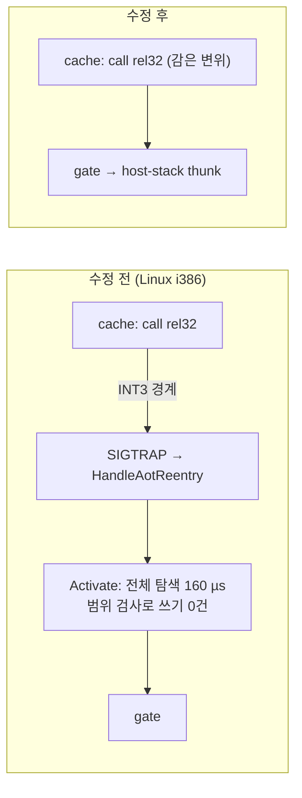
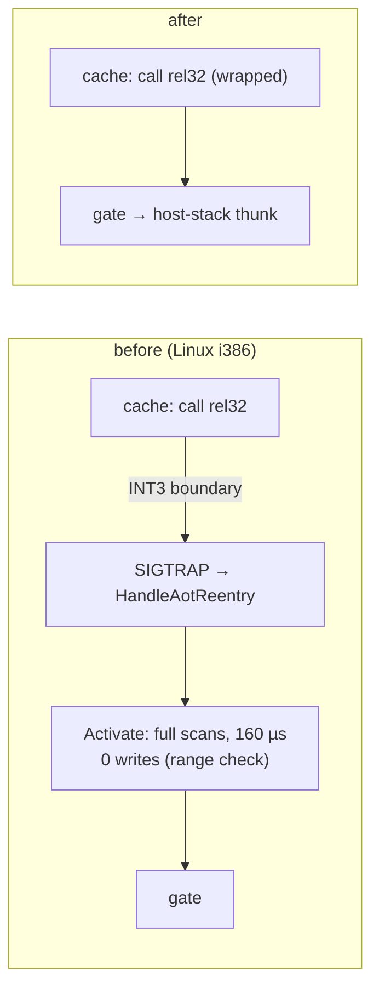

# Task 773 작업 로그: Glide gate 재연결 — 비용을 없애고, Linux i386에서 실제로 잇기

설계: [20261005-773](../design/20261005-773-glide-gate-relink-cost.md) ·
작업 지시: [20261005-773](../work-orders/20261005-773-glide-gate-relink-cost.md) ·
선행: [Task 772 로그 8절](20261005-772-linux-native-verification.md)

## 요약

Linux i386에서 Glide 호출마다 breakpoint를 밟던 원인을 찾아 고쳤습니다. gate로 가는 `call rel32`를 고쳐 쓰는 코드가 변위를
64비트로 계산해 `int32` 범위 밖이면 건너뛰었는데, Linux i386은 코드 캐시(`0xE8…`)와 gate(`0x01…`)가 2 GiB 넘게 떨어져 있어
**한 번도 쓰지 못했습니다.** 32비트 명령 포인터는 2³²로 감기므로 그 검사는 direct 모델에 필요 없습니다. 감아 쓰게 하자 pumpit1은
60초에 약 1,990프레임에서 3,190프레임이 되고, 게스트 스레드 CPU는 99.4%에서 16.3%로 내려갔습니다. 다만 느린 상태가 없어진 것은
아닙니다(처음 9회는 0회였지만 이후 측정에서 다시 나옴, 아래 "추가 확인"). Task 517~527이 남긴 질문의 답입니다.

## 바꾼 것

* `include/repiu/engine/aot_glide_gate_fixup_index.h`, `src/engine/aot_glide_gate_fixup_index.cpp`(신규):
  gate로 가는 fixup의 색인(`EnsureAotGlideGateFixupIndex`, `FindAotGlideGateFixupOffsets`)과 쓸 slot을 고르는 순수 함수
  `CollectGlideGateFixupWrites`(이미 같은 값은 제외, `wraps_at_32_bits`면 변위를 2³²로 감음).
* `AotCodeCachePlacement::glide_gate_fixup_index`.
* `ActivateGlideGateDirectTarget`: 아무것도 찾을 수 없던 inline cache site 탐색을 제거, fixup 전체 탐색을 색인 조회로 교체,
  쓸 것이 없으면 보호 변경·flush 없이 반환, direct 모델에서는 감은 변위를 씀. `relinked`·`fixup` 카운터는 실제로 쓴 수.
* probe `glide_gate_fixup_index`(core probe와 Win32 AOT probe `--glide-gate-fixup-index`).
* `ARCHITECTURE.md`, 설계, [linux-port-frontier.md](../analysis/linux-port-frontier.md), Task 772 로그의 틀린 추정 두 곳 정정.

## 경과: probe가 원인을 드러냈습니다

처음 설계는 "같은 결과, 낮은 비용"이었고, 모은 slot이 "이미 같은 값을 담고 있다"고 가정했습니다. probe를 Linux i386의 실제
주소 모양(캐시 `0xE8021000`, gate는 낮은 주소)으로 쓰자 `writes_first=false`가 나왔습니다. 쓸 slot이 하나도 없었습니다. 범위
검사가 전부 건너뛰고 있었기 때문입니다. 그 가정은 재지 않은 것이었고 Task 772 로그에도 사실처럼 적혀 있어 함께 고쳤습니다.

## 검증

* 빌드: Linux x64 Debug, Linux i386 Release(`build/linux_i386_release_g`) 모두 exit 0, 새 경고 없음.
* `repiu_core_probe`: x64·i386 모두 `glide_gate_fixup_index_all=true`, `core_probe_all=true`.
* 실기(Ubuntu 26.04, RTX 4090), Linux i386 Release, pumpit1 60초:

| 조건 | 수정 전 (Task 772) | 수정 후 |
|---|---|---|
| x11(Wayland 실패 후 전환), vsync | 약 1,975~1,995프레임, 21회 중 5회 느린 상태(337~1,373) | 3,188~3,196프레임, 9회 중 느린 상태 0, dropped 21~22 |
| 게스트 스레드 CPU (20~40초 평균) | 99.4% | 16.3% (메인 스레드 5.4%) |
| Activate 호출 | 2초에 약 1.1만 번 | 60초에 148번 |
| breakpoint 없는 gate 진입(`clean`/`entry`) | 0 / 158,304 | 453,117 / 460,651 |
| `REPIU_GLIDE_SWAP_INTERVAL=0` | 2,094~2,107프레임 | 53,197프레임 |
| `REPIU_AOT_DBT_GLIDE_GATE_DISPATCH=0` (30초) | — | 1,385프레임 (끄면 이전 수준, opt-out 동작) |

* 다른 롬셋(i386, x11, vsync): pumpit8 60초 439 → 3,288프레임. pumpitea 40초는 v0.0.200이 640·641·236·504(4회 중 2회 느림),
  수정 후 1,615~1,708(5회)·1,449(dropped 933).
* Linux x64 Debug pumpit1 20초: 639·636프레임(Task 772의 640과 같음). cache 모델은 `wraps_at_32_bits=false`라 쓰는 값이 같습니다.
* 수정 후의 Activate 회당 비용은 따로 재지 않았습니다(호출이 60초에 148번이라 의미가 없어짐).

## 남은 것

* **pumpitea의 다른 느린 상태(미확정).** 수정 후 60초 실행 한 번이 63프레임(dropped 10,101)이었습니다. 샘플은
  `GlideOpenGlBackend::SpinForRendezvousHint`에 모였고 breakpoint가 435,242번이었습니다. v0.0.200에도 느린 실행이 있었으므로 새로
  생긴 것은 아니지만 원인은 다릅니다. 별도 작업이 필요합니다.
* **i386 + Wayland(NVIDIA)에서 창을 열지 못합니다(기존, 이 작업과 무관).** 32비트 Wayland 패키지를 설치하자 SDL이 Wayland를
  고르고 `eglCreateWindowSurface`가 실패해 Glide가 dummy로 넘어갑니다(0프레임). 수정 전 빌드도 같습니다. 패키지가 없을 때는
  x11로 넘어가 동작했으므로, 지금은 `SDL_VIDEO_DRIVER=x11`이 필요합니다. 창 생성 실패 시 x11로 다시 시도하는 처리가 필요해 보입니다.
* **Win32 확인.** 이 머신에서 빌드할 수 없습니다. Win32는 변위가 원래 범위 안이라 쓰는 값은 같고, 달라지는 것은 같은 값을 다시
  쓰지 않는 것과 죽은 탐색 제거뿐입니다. 빌드와 `repiu_aot_probe --glide-gate-fixup-index`, pumpit1 실행 확인이 필요합니다.
* 간접 호출로 gate에 가는 경우(`elsewhere` 6,699 / 60초)는 여전히 경계를 거칩니다. 전체의 1.5%입니다.
* 엔진의 다른 rel32 범위 검사에 같은 가정이 있는지는 보지 않았습니다.

## 추가 확인 (같은 날): 3D 가속과, 수정 후에도 남은 느린 상태

**i386의 3D 가속은 동작합니다(x11).** 실행 중인 i386 프로세스의 `/proc/<pid>/maps`에 32비트 `libGLX_nvidia.so.595.91.07`,
`libnvidia-glcore.so.595.91.07`, `libnvidia-tls.so.595.91.07`이 올라와 있고 Mesa·llvmpipe는 없습니다. `nvidia-smi pmon`에 그
프로세스가 GPU 0의 그래픽(G) 클라이언트로 나오며, 로그의 renderer는 `NVIDIA GeForce RTX 4090/PCIe/SSE2`입니다. Wayland에서는 위에
적은 대로 창을 열지 못해 GL 자체가 없습니다(dummy).

**위 요약의 "느린 상태 9회 중 0회"는 그 조용한 시간대에만 맞습니다.** 그 뒤(Chrome이 CPU 32~36%를 쓰는 동안) 25초 실행을
다시 재니 수정 빌드에서도 느린 상태가 나왔습니다. 샘플은 `SpinForRendezvousHint`에 모이고 tick이 대량으로 버려집니다
(`due/injected/dropped` 5,860/2,137/3,723). pumpitea에서 본 것과 같은 모양입니다.

| 구간 (순서대로) | 수정 빌드 | v0.0.200 i386 | 비고 |
|---|---|---|---|
| x11 강제, 연속 10회 | 7회 느림 (29~845프레임, 정상 약 1,112) | — | |
| `WAYLAND_DISPLAY=repiu-none`, 연속 6회 | 3회 느림 | — | |
| 그 직후 연속 6회 | — | 0회 (912~925프레임) | x64 Release 9회도 0회 (1,084~1,092) |
| 교대 6쌍 | 1회 느림 | 0회 (887~892) | |
| gate 직접 호출 켬·끔 교대 8쌍 | 켬 0회 | — | 끔(`REPIU_AOT_DBT_GLIDE_GATE_DISPATCH=0`) 0회, 1,111~1,117프레임 |

* **확인됨:** 수정 빌드는 느린 상태에 들어갈 수 있습니다(합계 38회 중 11회). 같은 기간 v0.0.200 i386은 12회 중 0회였습니다.
* **미확정:** 느린 실행이 시간대에 몰려 있어(처음 16회에 10회, 이후 22회에 1회) 수정이 원인인지 그때의 외부 부하가 원인인지 이
  자료로는 가릴 수 없습니다. v0.0.200도 Task 772에서는 다른 모양(Activate 루프)의 느린 상태를 보였습니다.
* **추정:** 수정 전에는 Glide 호출마다의 breakpoint가 밀린 타이머 tick을 넣을 기회였는데, 직접 호출이 되면서 그 기회가 사라져
  safe point에만 의존하게 됐을 수 있습니다. 확인하지 않았습니다.
* 참고: gate 직접 호출을 끄면 비싼 탐색도 돌지 않으므로(Activate가 바로 반환) 수정 빌드의 정상 속도와 같은 프레임이 나옵니다.

**따라서 머지 전에 이 느린 상태의 조사가 필요합니다.** 부하를 일부러 건 상태에서 켬·끔·v0.0.200을 교대로 충분히 재고,
느린 실행의 tick 전달 경로(`deferred` 사유)를 봐야 합니다.

## 느린 상태의 정체 (#6, 같은 날)

Issue: [#6](https://github.com/nworkers/rePIU/issues/6)

**느린 상태는 이 작업의 변경 때문이 아닙니다. 게임 창이 화면에 보이지 않을 때 생깁니다.** 컴포지터는 숨겨진 창의 vsync swap을
약 1 fps로 늦추고, direct 모델(i386)은 swap이 끝날 때까지 게스트 스레드가 gate 안에서 기다리며 그동안 타이머 tick을 받지 못합니다.
backlog 상한(64)을 넘은 tick은 버려지고 게임의 시간이 느려집니다.

실험: pumpit1 34초, `SDL_VIDEO_DRIVER=x11`, 9초 뒤 Xlib `XIconifyWindow`로 창을 12초 동안 최소화했다가 복원.

| 빌드 | 프레임 | tick due / injected / dropped |
|---|---|---|
| i386 수정 빌드, 최소화 없음 | 1,636 | dropped 21 |
| i386 수정 빌드 (gate 직접 호출 켬) | 474 | 8,121 / 3,665 / 4,455 |
| i386 수정 빌드, 직접 호출 끔 | 474 | 7,917 / 3,673 / 4,244 |
| i386 v0.0.200 | 454 | 7,955 / 3,709 / 4,246 |
| i386 수정 빌드, `REPIU_GLIDE_SWAP_INTERVAL=0` | 39,180 | 7,890 / 7,868 / 22 |
| x64 v0.0.200 (x11) | 461 | 8,052 / 8,025 / 27 |

* **확인됨:** vsync를 켠 i386은 세 빌드 모두 같은 양의 tick을 버립니다. vsync를 끄면 버리지 않습니다. x64는 프레임은 같이 줄지만
  tick은 버리지 않습니다. cache 모델은 swap을 기다리는 동안 밀린 tick을 주입하기 때문입니다(Task 750,
  `InjectsTicksDuringSwapWait()`; direct 모델에서는 false).
* **확인됨:** 부하 없이도 직접 호출 끔(26프레임)과 v0.0.200(35프레임)이 느린 상태에 들어갔고, 12코어 CPU 부하로는 어느 빌드도
  느린 상태에 들어가지 않았습니다(켬 974~1,020, 끔 952~998, v0.0.200 599~611프레임 / 22초).
* **추정:** 앞선 측정들에서 느린 실행이 시간대에 몰린 것은, 사용자가 같은 모니터에서 다른 창으로 작업하는 동안 게임 창이 가려졌기
  때문으로 보입니다. 최소화는 확인했고, 다른 창에 완전히 가려진 경우도 같은지는 프로그램으로 만들 수 없어 확인하지 못했습니다.
* **이 로그와 Task 772 로그의 정정:** Task 772가 "호스트 루프에 빠져 느려진다"고 적은 느린 상태도 같은 현상이었을 가능성이 높습니다.
  수정 전 빌드는 게스트 스레드가 시간의 88%를 Activate에서 썼으므로 샘플이 거기에 찍혔을 뿐입니다. Activate 비용과 gate 미연결은
  실제 결함이었고 그 수정 효과(1,990 → 3,190프레임)는 그대로지만, **느린 상태의 원인은 아니었습니다.** 위 "9회 중 0회"와 "38회 중
  11회"는 창이 보였는지의 차이입니다.

남은 일(#6): direct 모델에서 swap이 막혀 있는 동안에도 tick이 전달되게 하는 것. 후보는 (1) Task 750의 swap 대기 tick 주입을 direct
모델에서 동작하게 하기(Win32에서 첫 주입이 call로 돌아오지 못한 문제를 풀어야 함), (2) direct 모델에도 async present 적용,
(3) 창이 숨겨진 동안 swap interval을 0으로 두기입니다. 설계에서 정합니다.

---

# Task 773 Work Log: The Glide Gate Relink — Removing Its Cost, and Making It Link on Linux i386

Design: [20261005-773](../design/20261005-773-glide-gate-relink-cost.md) ·
Work order: [20261005-773](../work-orders/20261005-773-glide-gate-relink-cost.md) ·
Prior: [Task 772 log, section 8](20261005-772-linux-native-verification.md)

## Summary

The reason every Glide call hit a breakpoint on Linux i386 is found and fixed. The code that rewrites a `call rel32` to
go to the gate computed the displacement in 64 bits and skipped it when it fell outside `int32`; on Linux i386 the code
cache (`0xE8…`) and the gates (`0x01…`) are more than 2 GiB apart, so **it never wrote once.** A 32-bit instruction
pointer wraps at 2³², so the check is not needed on the direct model. With the wrapped displacement written, pumpit1 goes
from about 1,990 to 3,190 frames in 60 s and the guest thread from 99.4% to 16.3% CPU. The slow state is not gone,
though: 0 of the first 9 runs, but it came back in later measurements ("Further checks" below). This answers the question Tasks 517 to 527 left.

## Changes

* `include/repiu/engine/aot_glide_gate_fixup_index.h`, `src/engine/aot_glide_gate_fixup_index.cpp` (new): the index of
  fixups going to gates (`EnsureAotGlideGateFixupIndex`, `FindAotGlideGateFixupOffsets`) and the pure function that
  picks the slots to write, `CollectGlideGateFixupWrites` (slots already holding the value are left out; with
  `wraps_at_32_bits` the displacement wraps at 2³²).
* `AotCodeCachePlacement::glide_gate_fixup_index`.
* `ActivateGlideGateDirectTarget`: the inline cache site scan that could find nothing is removed, the walk over every
  fixup becomes an index lookup, a call with nothing to write returns without a protection change or flush, and the
  direct model writes the wrapped displacement. The `relinked` and `fixup` counters count actual writes.
* The `glide_gate_fixup_index` probe (core probe, and `--glide-gate-fixup-index` in the Win32 AOT probe).
* `ARCHITECTURE.md`, the design, [linux-port-frontier.md](../analysis/linux-port-frontier.md), and two wrong inferences
  corrected in the Task 772 log.

## How it went: the probe exposed the cause

The first design was "same result, lower cost" and assumed the collected slots "already hold the same value". Written
with Linux i386's real address shape (cache at `0xE8021000`, gates low), the probe reported `writes_first=false`: no slot
to write at all, because the range check skipped every one. The assumption had never been measured, and the Task 772 log
stated it as fact, so that was corrected too.

## Verification

* Builds: Linux x64 Debug and Linux i386 Release (`build/linux_i386_release_g`), both exit 0 with no new warnings.
* `repiu_core_probe`: `glide_gate_fixup_index_all=true` and `core_probe_all=true` on x64 and i386.
* Real hardware (Ubuntu 26.04, RTX 4090), Linux i386 Release, pumpit1 for 60 s:

| Condition | Before (Task 772) | After |
|---|---|---|
| x11 (after Wayland fails), vsync | about 1,975–1,995 frames; slow state in 5 of 21 runs (337–1,373) | 3,188–3,196 frames; slow state in 0 of 9; dropped 21–22 |
| Guest thread CPU (20–40 s average) | 99.4% | 16.3% (main thread 5.4%) |
| Activate calls | about 11,000 every 2 s | 148 in 60 s |
| Gate entries without a breakpoint (`clean`/`entry`) | 0 / 158,304 | 453,117 / 460,651 |
| `REPIU_GLIDE_SWAP_INTERVAL=0` | 2,094–2,107 frames | 53,197 frames |
| `REPIU_AOT_DBT_GLIDE_GATE_DISPATCH=0` (30 s) | — | 1,385 frames (the earlier level; the opt-out works) |

* Other ROM sets (i386, x11, vsync): pumpit8 in 60 s, 439 → 3,288 frames. pumpitea in 40 s: v0.0.200 gave 640, 641, 236
  and 504 (2 of 4 slow); after, 1,615–1,708 (five runs) and 1,449 (dropped 933).
* Linux x64 Debug, pumpit1 for 20 s: 639 and 636 frames (Task 772: 640). The cache model passes
  `wraps_at_32_bits=false`, so the bytes written are the same.
* The per-call cost of Activate after the change was not measured (with 148 calls in 60 s it no longer matters).

## Left

* **Another slow state in pumpitea (unresolved).** One 60-second run after the change drew 63 frames (dropped 10,101).
  Its samples sat in `GlideOpenGlBackend::SpinForRendezvousHint`, with 435,242 breakpoints. v0.0.200 had slow runs too,
  so it is not new, but its cause is different and needs a task of its own.
* **i386 under Wayland (NVIDIA) cannot open its window (existing, unrelated).** With the 32-bit Wayland packages
  installed SDL picks Wayland, `eglCreateWindowSurface` fails and Glide falls back to the dummy (0 frames); the build
  before this change does the same. Without the packages it fell back to x11 and ran, so `SDL_VIDEO_DRIVER=x11` is
  needed for now. Retrying on x11 when the window cannot be created looks necessary.
* **Win32.** It cannot be built on this machine. On Win32 the displacement was in range anyway, so the bytes written
  are the same; what changes is not rewriting equal values and the removed dead scan. The build,
  `repiu_aot_probe --glide-gate-fixup-index` and a pumpit1 run need checking.
* Gates reached by indirect calls (`elsewhere`, 6,699 in 60 s) still cross the boundary: 1.5% of the total.
* Whether the engine's other rel32 range checks carry the same assumption was not examined.

## Further checks (same day): 3D acceleration, and a slow state that remains

**3D acceleration works on i386 (x11).** The running i386 process maps the 32-bit `libGLX_nvidia.so.595.91.07`,
`libnvidia-glcore.so.595.91.07` and `libnvidia-tls.so.595.91.07` (`/proc/<pid>/maps`) and no Mesa or llvmpipe;
`nvidia-smi pmon` lists it as a graphics (G) client of GPU 0; the log's renderer is `NVIDIA GeForce RTX 4090/PCIe/SSE2`.
Under Wayland it cannot open its window, as said above, and has no GL at all (dummy).

**The summary's "slow state in 0 of 9 runs" holds only for that quiet period.** Measured again later with 25-second
runs (while Chrome used 32–36% CPU), the changed build did enter a slow state. Its samples sit in
`SpinForRendezvousHint` and ticks are dropped in bulk (`due/injected/dropped` 5,860/2,137/3,723), the shape seen in
pumpitea.

| Stretch (in order) | Changed build | v0.0.200 i386 | Note |
|---|---|---|---|
| forced x11, 10 in a row | 7 slow (29–845 frames; normal about 1,112) | — | |
| `WAYLAND_DISPLAY=repiu-none`, 6 in a row | 3 slow | — | |
| right after, 6 in a row | — | 0 (912–925 frames) | x64 Release: 0 of 9 (1,084–1,092) |
| 6 alternating pairs | 1 slow | 0 (887–892) | |
| gate dispatch on/off, 8 alternating pairs | on: 0 | — | off (`REPIU_AOT_DBT_GLIDE_GATE_DISPATCH=0`): 0, 1,111–1,117 frames |

* **Confirmed:** the changed build can enter a slow state (11 of 38 runs). Over the same period v0.0.200 i386 showed 0 of
  12.
* **Unresolved:** the slow runs cluster in time (10 of the first 16, 1 of the next 22), so this data cannot tell whether
  the change or the outside load of that moment is the cause. v0.0.200 had its own slow state of a different shape (the
  Activate loop) in Task 772.
* **Inferred:** before the change, the breakpoint on every Glide call was a chance to inject owed timer ticks; with direct
  calls that chance is gone and delivery may rest on safe points alone. Not verified.
* Note: with gate dispatch off the costly scans do not run either (Activate returns at once), so it draws the same frames
  as the changed build at normal speed.

**So this slow state needs investigating before a merge**: enough alternating runs of on, off and v0.0.200 under
deliberate load, and the tick delivery path (the reasons behind `deferred`) of a slow run.

## What the slow state is (#6, same day)

Issue: [#6](https://github.com/nworkers/rePIU/issues/6)

**The slow state does not come from this task's change. It happens when the game window is not visible.** The compositor
slows a hidden window's vsync swaps to about 1 fps, and on the direct model (i386) the guest thread waits inside the gate
until the swap finishes and receives no timer tick meanwhile. Ticks beyond the backlog cap (64) are dropped and the game's
time slows.

Experiment: pumpit1 for 34 s, `SDL_VIDEO_DRIVER=x11`; after 9 s the window is minimised with Xlib `XIconifyWindow` for 12 s
and then restored.

| Build | Frames | Ticks due / injected / dropped |
|---|---|---|
| i386 changed build, not minimised | 1,636 | dropped 21 |
| i386 changed build (gate dispatch on) | 474 | 8,121 / 3,665 / 4,455 |
| i386 changed build, dispatch off | 474 | 7,917 / 3,673 / 4,244 |
| i386 v0.0.200 | 454 | 7,955 / 3,709 / 4,246 |
| i386 changed build, `REPIU_GLIDE_SWAP_INTERVAL=0` | 39,180 | 7,890 / 7,868 / 22 |
| x64 v0.0.200 (x11) | 461 | 8,052 / 8,025 / 27 |

* **Confirmed:** with vsync on, all three i386 builds drop the same amount of ticks; with vsync off none are dropped. x64
  loses the same frames but drops no ticks, because the cache model injects owed ticks while it waits for the swap (Task
  750, `InjectsTicksDuringSwapWait()`; false on the direct model).
* **Confirmed:** with no load, dispatch-off (26 frames) and v0.0.200 (35 frames) entered the slow state too, and a 12-core
  CPU load put no build into it (on 974–1,020, off 952–998, v0.0.200 599–611 frames in 22 s).
* **Inferred:** the slow runs of the earlier measurements cluster in time because the game window was covered while the
  user worked in other windows on the same monitor. Minimising is confirmed; whether a window fully covered by another
  behaves the same could not be produced by program and was not checked.
* **Correction to this log and the Task 772 log:** the slow state Task 772 described as "falling into a host loop" was very
  likely this same thing. Before the fix the guest thread spent 88% of its time in Activate, so that is simply where the
  samples landed. The cost of Activate and the unlinked gates were real defects and the gain from fixing them (1,990 →
  3,190 frames) stands, but **they were not the cause of the slow state.** The "0 of 9" and "11 of 38" above differ by
  whether the window was visible.

Left for #6: delivering ticks on the direct model while the swap is blocked. Candidates are (1) making Task 750's swap-wait
tick injection work on the direct model (the first injection not returning to the call, seen on Win32, has to be solved),
(2) async present on the direct model as well, and (3) a swap interval of 0 while the window is hidden. The design decides.
