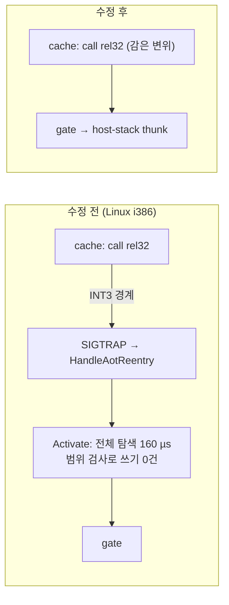
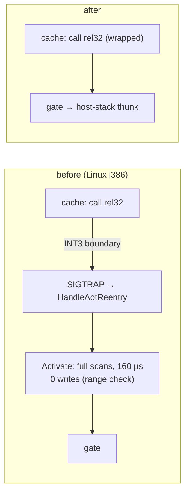

# Task 773 작업 로그: Glide gate 재연결 — 비용을 없애고, Linux i386에서 실제로 잇기

설계: [20261005-773](../design/20261005-773-glide-gate-relink-cost.md) ·
작업 지시: [20261005-773](../work-orders/20261005-773-glide-gate-relink-cost.md) ·
선행: [Task 772 로그 8절](20261005-772-linux-native-verification.md)

## 요약

Linux i386에서 Glide 호출마다 breakpoint를 밟던 원인을 찾아 고쳤습니다. gate로 가는 `call rel32`를 고쳐 쓰는 코드가 변위를
64비트로 계산해 `int32` 범위 밖이면 건너뛰었는데, Linux i386은 코드 캐시(`0xE8…`)와 gate(`0x01…`)가 2 GiB 넘게 떨어져 있어
**한 번도 쓰지 못했습니다.** 32비트 명령 포인터는 2³²로 감기므로 그 검사는 direct 모델에 필요 없습니다. 감아 쓰게 하자 pumpit1은
60초에 약 1,990프레임에서 3,190프레임이 되고, 게스트 스레드 CPU는 99.4%에서 16.3%로 내려갔으며, Task 772의 느린 상태는 9회 중
0회였습니다. Task 517~527이 남긴 질문의 답입니다.

## 바꾼 것

* `include/repiu/engine/aot_glide_gate_fixup_index.h`, `src/engine/aot_glide_gate_fixup_index.cpp`(신규):
  gate로 가는 fixup의 색인(`EnsureAotGlideGateFixupIndex`, `FindAotGlideGateFixupOffsets`)과 쓸 slot을 고르는 순수 함수
  `CollectGlideGateFixupWrites`(이미 같은 값은 제외, `wraps_at_32_bits`면 변위를 2³²로 감음).
* `AotCodeCachePlacement::glide_gate_fixup_index`.
* `ActivateGlideGateDirectTarget`: 아무것도 찾을 수 없던 inline cache site 탐색을 제거, fixup 전체 탐색을 색인 조회로 교체,
  쓸 것이 없으면 보호 변경·flush 없이 반환, direct 모델에서는 감은 변위를 씀. `relinked`·`fixup` 카운터는 실제로 쓴 수.
* probe `glide_gate_fixup_index`(core probe와 Win32 AOT probe `--glide-gate-fixup-index`).
* `ARCHITECTURE.md`, 설계, [linux-port-frontier.md](../analysis/linux-port-frontier.md), Task 772 로그의 틀린 추정 두 곳 정정.

## 경과: probe가 원인을 드러냈습니다

처음 설계는 "같은 결과, 낮은 비용"이었고, 모은 slot이 "이미 같은 값을 담고 있다"고 가정했습니다. probe를 Linux i386의 실제
주소 모양(캐시 `0xE8021000`, gate는 낮은 주소)으로 쓰자 `writes_first=false`가 나왔습니다. 쓸 slot이 하나도 없었습니다. 범위
검사가 전부 건너뛰고 있었기 때문입니다. 그 가정은 재지 않은 것이었고 Task 772 로그에도 사실처럼 적혀 있어 함께 고쳤습니다.

## 검증

* 빌드: Linux x64 Debug, Linux i386 Release(`build/linux_i386_release_g`) 모두 exit 0, 새 경고 없음.
* `repiu_core_probe`: x64·i386 모두 `glide_gate_fixup_index_all=true`, `core_probe_all=true`.
* 실기(Ubuntu 26.04, RTX 4090), Linux i386 Release, pumpit1 60초:

| 조건 | 수정 전 (Task 772) | 수정 후 |
|---|---|---|
| x11(Wayland 실패 후 전환), vsync | 약 1,975~1,995프레임, 21회 중 5회 느린 상태(337~1,373) | 3,188~3,196프레임, 9회 중 느린 상태 0, dropped 21~22 |
| 게스트 스레드 CPU (20~40초 평균) | 99.4% | 16.3% (메인 스레드 5.4%) |
| Activate 호출 | 2초에 약 1.1만 번 | 60초에 148번 |
| breakpoint 없는 gate 진입(`clean`/`entry`) | 0 / 158,304 | 453,117 / 460,651 |
| `REPIU_GLIDE_SWAP_INTERVAL=0` | 2,094~2,107프레임 | 53,197프레임 |
| `REPIU_AOT_DBT_GLIDE_GATE_DISPATCH=0` (30초) | — | 1,385프레임 (끄면 이전 수준, opt-out 동작) |

* 다른 롬셋(i386, x11, vsync): pumpit8 60초 439 → 3,288프레임. pumpitea 40초는 v0.0.200이 640·641·236·504(4회 중 2회 느림),
  수정 후 1,615~1,708(5회)·1,449(dropped 933).
* Linux x64 Debug pumpit1 20초: 639·636프레임(Task 772의 640과 같음). cache 모델은 `wraps_at_32_bits=false`라 쓰는 값이 같습니다.
* 수정 후의 Activate 회당 비용은 따로 재지 않았습니다(호출이 60초에 148번이라 의미가 없어짐).

## 남은 것

* **pumpitea의 다른 느린 상태(미확정).** 수정 후 60초 실행 한 번이 63프레임(dropped 10,101)이었습니다. 샘플은
  `GlideOpenGlBackend::SpinForRendezvousHint`에 모였고 breakpoint가 435,242번이었습니다. v0.0.200에도 느린 실행이 있었으므로 새로
  생긴 것은 아니지만 원인은 다릅니다. 별도 작업이 필요합니다.
* **i386 + Wayland(NVIDIA)에서 창을 열지 못합니다(기존, 이 작업과 무관).** 32비트 Wayland 패키지를 설치하자 SDL이 Wayland를
  고르고 `eglCreateWindowSurface`가 실패해 Glide가 dummy로 넘어갑니다(0프레임). 수정 전 빌드도 같습니다. 패키지가 없을 때는
  x11로 넘어가 동작했으므로, 지금은 `SDL_VIDEO_DRIVER=x11`이 필요합니다. 창 생성 실패 시 x11로 다시 시도하는 처리가 필요해 보입니다.
* **Win32 확인.** 이 머신에서 빌드할 수 없습니다. Win32는 변위가 원래 범위 안이라 쓰는 값은 같고, 달라지는 것은 같은 값을 다시
  쓰지 않는 것과 죽은 탐색 제거뿐입니다. 빌드와 `repiu_aot_probe --glide-gate-fixup-index`, pumpit1 실행 확인이 필요합니다.
* 간접 호출로 gate에 가는 경우(`elsewhere` 6,699 / 60초)는 여전히 경계를 거칩니다. 전체의 1.5%입니다.
* 엔진의 다른 rel32 범위 검사에 같은 가정이 있는지는 보지 않았습니다.

---

# Task 773 Work Log: The Glide Gate Relink — Removing Its Cost, and Making It Link on Linux i386

Design: [20261005-773](../design/20261005-773-glide-gate-relink-cost.md) ·
Work order: [20261005-773](../work-orders/20261005-773-glide-gate-relink-cost.md) ·
Prior: [Task 772 log, section 8](20261005-772-linux-native-verification.md)

## Summary

The reason every Glide call hit a breakpoint on Linux i386 is found and fixed. The code that rewrites a `call rel32` to
go to the gate computed the displacement in 64 bits and skipped it when it fell outside `int32`; on Linux i386 the code
cache (`0xE8…`) and the gates (`0x01…`) are more than 2 GiB apart, so **it never wrote once.** A 32-bit instruction
pointer wraps at 2³², so the check is not needed on the direct model. With the wrapped displacement written, pumpit1 goes
from about 1,990 to 3,190 frames in 60 s, the guest thread from 99.4% to 16.3% CPU, and Task 772's slow state appeared in
0 of 9 runs. This answers the question Tasks 517 to 527 left.

## Changes

* `include/repiu/engine/aot_glide_gate_fixup_index.h`, `src/engine/aot_glide_gate_fixup_index.cpp` (new): the index of
  fixups going to gates (`EnsureAotGlideGateFixupIndex`, `FindAotGlideGateFixupOffsets`) and the pure function that
  picks the slots to write, `CollectGlideGateFixupWrites` (slots already holding the value are left out; with
  `wraps_at_32_bits` the displacement wraps at 2³²).
* `AotCodeCachePlacement::glide_gate_fixup_index`.
* `ActivateGlideGateDirectTarget`: the inline cache site scan that could find nothing is removed, the walk over every
  fixup becomes an index lookup, a call with nothing to write returns without a protection change or flush, and the
  direct model writes the wrapped displacement. The `relinked` and `fixup` counters count actual writes.
* The `glide_gate_fixup_index` probe (core probe, and `--glide-gate-fixup-index` in the Win32 AOT probe).
* `ARCHITECTURE.md`, the design, [linux-port-frontier.md](../analysis/linux-port-frontier.md), and two wrong inferences
  corrected in the Task 772 log.

## How it went: the probe exposed the cause

The first design was "same result, lower cost" and assumed the collected slots "already hold the same value". Written
with Linux i386's real address shape (cache at `0xE8021000`, gates low), the probe reported `writes_first=false`: no slot
to write at all, because the range check skipped every one. The assumption had never been measured, and the Task 772 log
stated it as fact, so that was corrected too.

## Verification

* Builds: Linux x64 Debug and Linux i386 Release (`build/linux_i386_release_g`), both exit 0 with no new warnings.
* `repiu_core_probe`: `glide_gate_fixup_index_all=true` and `core_probe_all=true` on x64 and i386.
* Real hardware (Ubuntu 26.04, RTX 4090), Linux i386 Release, pumpit1 for 60 s:

| Condition | Before (Task 772) | After |
|---|---|---|
| x11 (after Wayland fails), vsync | about 1,975–1,995 frames; slow state in 5 of 21 runs (337–1,373) | 3,188–3,196 frames; slow state in 0 of 9; dropped 21–22 |
| Guest thread CPU (20–40 s average) | 99.4% | 16.3% (main thread 5.4%) |
| Activate calls | about 11,000 every 2 s | 148 in 60 s |
| Gate entries without a breakpoint (`clean`/`entry`) | 0 / 158,304 | 453,117 / 460,651 |
| `REPIU_GLIDE_SWAP_INTERVAL=0` | 2,094–2,107 frames | 53,197 frames |
| `REPIU_AOT_DBT_GLIDE_GATE_DISPATCH=0` (30 s) | — | 1,385 frames (the earlier level; the opt-out works) |

* Other ROM sets (i386, x11, vsync): pumpit8 in 60 s, 439 → 3,288 frames. pumpitea in 40 s: v0.0.200 gave 640, 641, 236
  and 504 (2 of 4 slow); after, 1,615–1,708 (five runs) and 1,449 (dropped 933).
* Linux x64 Debug, pumpit1 for 20 s: 639 and 636 frames (Task 772: 640). The cache model passes
  `wraps_at_32_bits=false`, so the bytes written are the same.
* The per-call cost of Activate after the change was not measured (with 148 calls in 60 s it no longer matters).

## Left

* **Another slow state in pumpitea (unresolved).** One 60-second run after the change drew 63 frames (dropped 10,101).
  Its samples sat in `GlideOpenGlBackend::SpinForRendezvousHint`, with 435,242 breakpoints. v0.0.200 had slow runs too,
  so it is not new, but its cause is different and needs a task of its own.
* **i386 under Wayland (NVIDIA) cannot open its window (existing, unrelated).** With the 32-bit Wayland packages
  installed SDL picks Wayland, `eglCreateWindowSurface` fails and Glide falls back to the dummy (0 frames); the build
  before this change does the same. Without the packages it fell back to x11 and ran, so `SDL_VIDEO_DRIVER=x11` is
  needed for now. Retrying on x11 when the window cannot be created looks necessary.
* **Win32.** It cannot be built on this machine. On Win32 the displacement was in range anyway, so the bytes written
  are the same; what changes is not rewriting equal values and the removed dead scan. The build,
  `repiu_aot_probe --glide-gate-fixup-index` and a pumpit1 run need checking.
* Gates reached by indirect calls (`elsewhere`, 6,699 in 60 s) still cross the boundary: 1.5% of the total.
* Whether the engine's other rel32 range checks carry the same assumption was not examined.
