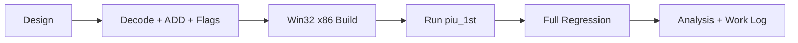

# Shadow memory `03 /r` ADD 작업 지시

## 작업

1. parity와 32-bit ADD flag 갱신 helper를 추가한다.
2. shadow source 전용 `03 /r` handler를 구현한다.
3. single-step과 access-violation dispatch 양쪽에 연결한다.
4. 다음 실행 지점에 맞춰 테스트와 analysis 문서를 갱신한다.
5. 빌드·전체 테스트 후 작업 로그와 커밋을 남긴다.

# Shadow-Memory `03 /r` ADD Work Order

Add helpers for parity and 32-bit ADD flags, implement a shadow-source-only `03 /r` handler, connect it to both dispatch paths, update tests and analysis for the next observation, then build, run the regression suite, log, and commit.
