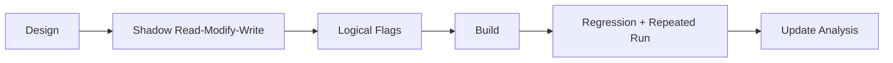

# Shadow memory `83 /1` OR 작업 지시

## 작업

1. logical-result flag helper를 추가한다.
2. shadow destination 전용 `83 /1` handler를 구현한다.
3. 두 exception dispatch 경로에 연결하고 store diagnostic을 갱신한다.
4. 테스트의 timing-dependent 마지막 store 조건을 새 명령까지 허용한다.
5. 다음 blocker를 analysis와 작업 로그에 기록한다.

# Shadow-Memory `83 /1` OR Work Order

Add logical-result flag handling, implement a shadow-destination-only `83 /1` handler, connect both exception dispatch paths, record the read-modify-write, update timing-dependent regression expectations, and document the next blocker.
