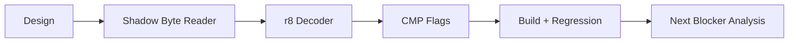

# Shadow memory `38 /r` byte CMP 작업 지시

## 작업

1. shadow byte read helper와 8-bit register decoder를 추가한다.
2. byte subtraction flag helper를 구현한다.
3. shadow source 전용 `38 /r` handler를 두 dispatch 경로에 연결한다.
4. 테스트와 analysis의 다음 관측점을 갱신한다.
5. 빌드·전체 테스트·반복 실행 후 작업 로그와 커밋을 남긴다.

# Shadow-Memory `38 /r` Byte CMP Work Order

Add a shadow-byte reader, byte-register decoder, and byte-subtraction flag helper; connect a shadow-source-only `38 /r` handler to both dispatch paths; update regression and analysis observations; then build, test, run bounded repetitions, log, and commit.
