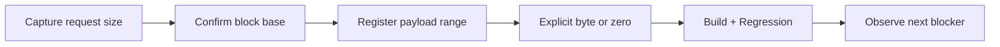

# Bounded shadow zero backing 작업 지시

## 작업

1. ThreadContext에 확인된 `0x2C`/`0x1008` pending allocation size와 zero-backed payload range를 추가한다.
2. DS zero-page load와 shadow OR를 연결해 bounded range를 등록한다.
3. byte/dword shadow read가 explicit value를 우선하고 range fallback 0을 사용하도록 한다.
4. 테스트·architecture·analysis를 갱신한다.
5. 빌드·전체 테스트·반복 실행 후 작업 로그와 커밋을 남긴다.

# Bounded Shadow Zero Backing Work Order

Track only the confirmed `0x2C`/`0x1008` allocator sizes and a bounded zero-backed payload range, connect the DS-zero-page probe to shadow OR block confirmation, make byte/dword shadow reads prefer explicit bytes and otherwise use range-backed zero, update documentation, then build, run regressions, observe the next frontier, log, and commit.
