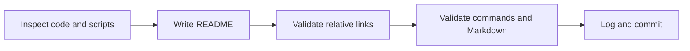

# 프로젝트 README 작업 지시

## 작업

1. 프로젝트 목적과 실험 단계 상태를 간결하게 설명한다.
2. 핵심 구조와 HLE 실행 흐름을 Mermaid로 도식화한다.
3. Windows x86 요구 사항, 원본 자산 정책, setup/build/run/test/analyzer 명령을 작성한다.
4. 분석·지식 기반·아키텍처·작업 규칙 문서를 상대 링크로 연결한다.
5. maintainer와 간결한 기여 절차를 현재 저장소 정보에 맞게 기록한다.
6. 내부 링크, Markdown fence, 파일 크기와 변경 범위를 검증한다.

# Project README Work Order

Create an accurate, scannable root README covering purpose, benefits, architecture, prerequisites, asset policy, setup, build, usage, tests, analysis, support, maintainership, and contribution. Validate every repository-relative link, example command, Markdown fence, and the final file size before logging and committing the task.
