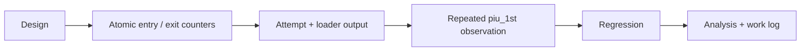

# Exception dispatch liveness 진단 작업 지시

## 작업

1. `ThreadContext`와 `Win32MinimalExecutionAttempt`에 exception dispatch entry/exit, last EIP 관측값을 추가한다.
2. vectored handler의 유효한 모든 return 경로를 RAII scope로 계수한다.
3. loader에 entry, exit, outstanding count와 last EIP를 출력한다.
4. `piu_1st` 반복 실행으로 quiet timeout이 handler 내부 정체인지 분류한다.
5. 전체 regression과 Markdown/diff 검증을 수행한다.
6. architecture, analysis와 작업 로그를 갱신하고 커밋한다.

# Exception Dispatch Liveness Diagnostic Work Order

Add atomic exception-dispatch entry/exit and last-EIP observations, cover all valid vectored-handler returns with an RAII scope, expose the counts through the execution attempt and loader, classify repeated `piu_1st` quiet timeouts, run the full regression suite, update architecture and analysis documentation, and commit the completed task.
