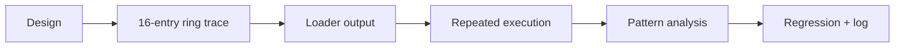

# Allocator probe bounded trace 작업 지시

## 작업

1. public attempt 구조에 allocator probe trace entry/observation을 추가한다.
2. `HandleTracedMemoryLoadInstruction`의 exact `+0xF7A71` 경로를 전후 상태와 결과로 기록한다.
3. 최근 16개 entry를 chronological sequence로 출력한다.
4. 반복 실행에서 EAX/ESI/pending pattern을 분석한다.
5. regression에 trace 존재 검증을 추가하고 전체 test를 수행한다.
6. architecture, analysis, 작업 로그를 갱신하고 커밋한다.

# Allocator Probe Bounded Trace Work Order

Add a public fixed-capacity allocator-probe observation, record exact `0xF7A71` before/after state and result in a latest-16 ring, print entries chronologically, analyze repeated execution patterns, add regression coverage, run the complete test suite, update architecture and analysis documentation, and commit the task.
