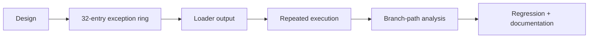

# Allocator control-flow exception trace 작업 지시

## 작업

1. allocator range exception trace 구조를 public attempt에 추가한다.
2. vectored handler 진입 시 validated allocator range 사건을 기록한다.
3. 최신 32개를 chronological order로 출력한다.
4. 반복 실행에서 probe와 OR 사이 exception sequence를 분석한다.
5. regression summary 검증과 전체 test를 수행한다.
6. architecture, analysis, 작업 로그를 갱신하고 커밋한다.

# Allocator Control-Flow Exception Trace Work Order

Add a public latest-32 allocator-range exception ring, record validated vectored-handler entries, print retained events chronologically, analyze repeated execution between probe and header OR, add regression summary checks, run the complete tests, update architecture and analysis documentation, and commit the task.
