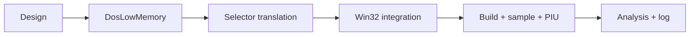

# DPMI selector와 low-memory model 작업 지시

## 작업

1. 공용 `DosLowMemory` fixed backing과 checked API를 추가한다.
2. `SelectorTable`에 checked linear translation을 추가한다.
3. trampoline `ThreadContext`에 두 runtime state를 통합한다.
4. segment load 시 provisional descriptor를 등록한다.
5. DS/FS/generic low-memory read를 selector translation 기반으로 교체한다.
6. CMake, architecture, analysis와 regression을 갱신하고 검증·커밋한다.

# DPMI Selector and Low-Memory Model Work Order

Add shared fixed DOS low-memory backing, checked selector translation, integrate both into the Win32 thread context, register provisional descriptors on observed segment loads, route DS/FS/generic low-memory reads through translation, update CMake and documentation, verify sample and PIU paths, and commit the task.
