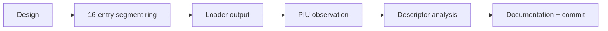

# Segment load provenance 작업 지시

1. segment-load trace 구조를 execution attempt에 추가한다.
2. 기존 segment load 기록 경로에서 ring을 갱신한다.
3. loader chronological 출력을 추가한다.
4. PIU 실행으로 selector/register sequence를 분석한다.
5. 문서와 검증 결과를 갱신하고 커밋한다.

# Segment Load Provenance Work Order

Add a latest-16 segment-load ring to the execution attempt, update it from the existing record path, print chronological loader output, analyze PIU selector/register sequence, update documentation and verification results, and commit the task.
