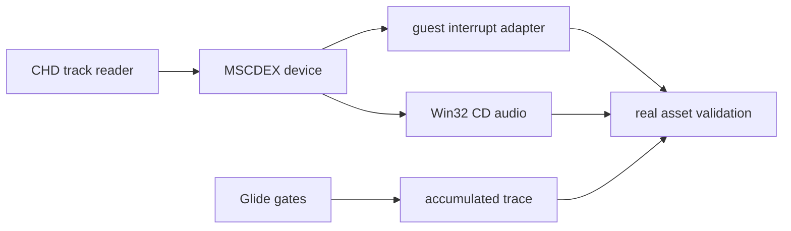

# MSCDEX CHD CD 오디오 및 Glide trace 작업 지시

1. CHD CHT2/CHTR track metadata와 raw CD frame reader를 공용 모듈로 분리합니다.
2. MSCDEX 설치 확인, device request, IOCTL, play/stop/resume 상태기를 구현합니다.
3. Win32 waveOut CD-DA backend를 별도 파일로 구현하고 loader 실행 인자에 CHD 경로를 연결합니다.
4. DPMI `INT 31h AX=0300h, BL=2Fh` frame의 `ES:BX` request packet을 안전하게 변환합니다.
5. Glide ordinal별 count와 first-argument trace를 추가합니다.
6. 실제 `pumpit1` CHD로 빌드와 실행을 검증하고 analysis/KB/architecture 및 작업 로그를 갱신합니다.
7. 하나의 작업 커밋으로 남깁니다.

# MSCDEX CHD CD Audio and Glide Trace Work Order

Separate CHD track reading, implement the MSCDEX request state machine and Win32 CD-DA output, connect the real-mode request packet safely, add accumulated Glide gate tracing, validate with the real `pumpit1` assets, update architecture/analysis/KB/work-log documentation, and commit the completed task.
