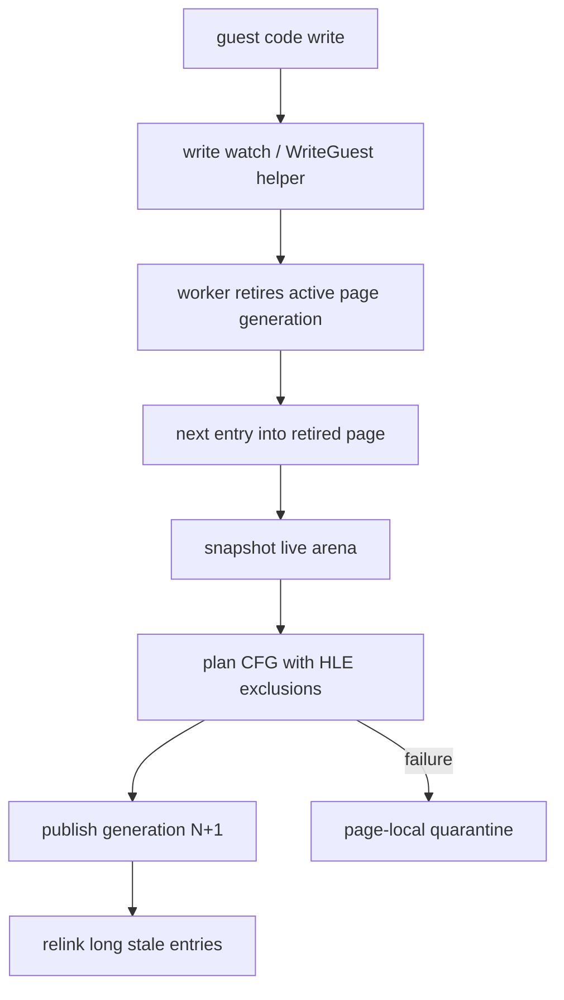

# AOT self-modifying page 일관성 작업 지시

## 구현 순서

선택된 generation 우선, page-local quarantine fallback 정책을 다음 순서로
구현합니다.

1. hot address-map entry 형식은 유지하고 별도 병렬 metadata에 active/generation
   상태를 둡니다.
2. translated instruction이 있는 guest page와 address-map index 관계를 관리합니다.
3. worker에 guest-page retirement operation을 추가하여 해당 page의 active cache
   entry 첫 바이트를 RX→RW→RX 아래 `INT3`로 바꿉니다.
4. native guest/cache store용 page write-watch와 `WriteGuest*` HLE helper를
   translated-byte overlap 보고에 연결합니다.
5. 다른 page에서 수정된 retired target으로 다음 진입할 때 live arena snapshot에서
   새 generation을 append합니다.
6. 5바이트 이상 stale entry는 최신 generation으로 `E9 rel32` relink하고, 짧은
   entry는 provenance `INT3` trap으로 유지합니다.
7. same-page/unknown-source modification 또는 translation, capacity, publication
   실패는 해당 page만 quarantine하고 legacy single-step으로 전환합니다.
8. retirement, generation publish/failure, relink, retired trap, quarantine,
   마지막 write/page/generation telemetry를 추가합니다.
9. 동적 번역 계획에 일반적인 HLE-owned guest 제외 범위를 전달합니다.
10. LINEXE/Glide 합성 gate를 제외하고 incoming edge를 guest HLE boundary로
    남깁니다.
11. page index, retirement, write-watch를 `aot_page_coherence_win32` 전용 파일로
    분리하고 cache와 trampoline에는 orchestration/adapter만 남깁니다.
12. PIU 주소, Glide export, 특정 byte signature를 조건으로 사용하지 않고 legacy와
    static-AOT backend를 보존합니다.

## 검증 기준

* Win32 x86 Debug build와 기존 AOT probe가 성공해야 합니다.
* coherence probe의 retirement, provenance, live snapshot, generation, relink,
  repeated retirement, HLE excluded boundary 결과가 모두 true여야 합니다.
* PIU `aot-dynamic`에서 GETPROCADDR 반복이 사라지고 Glide HLE gate가 진입해야
  합니다.
* PIU 정상 경로는 generation failure와 quarantine 없이 진행해야 합니다.
* copied `UD2` illegal instruction이 재발하지 않아야 합니다.
* 같은 시간의 이전 AOT 진행률과 비교해 정상 hot path의 큰 회귀가 없어야 합니다.
* OpenWatcom 전체 suite를 재실행하지 못하면 이유와 대체 probe 범위를 작업 로그에
  기록합니다.

# AOT Self-modifying Page Coherency Work Order

## Implementation Sequence

Implement the selected generation-first policy with page-local quarantine as its
fail-closed fallback.

1. Preserve the hot address-map entry layout and keep active/generation state in
   parallel metadata.
2. Index the guest pages covered by translated instructions and their address-map
   entries.
3. Add a worker retirement operation that replaces the first byte of active cache
   entries with `INT3` under RX-to-RW-to-RX protection.
4. Connect native guest/cache store write-watches and `WriteGuest*` HLE helpers to
   translated-byte overlap reporting.
5. On the next entry into a page modified from another page, append a new
   generation from a live arena snapshot.
6. Relink stale entries of at least five bytes with `E9 rel32`; retain shorter
   entries as provenance `INT3` traps.
7. Quarantine only the affected page for same-page or unknown-source modification,
   translation failure, capacity exhaustion, or unsafe publication.
8. Add telemetry for retirement, generation publication/failure, relinking,
   retired traps, quarantine, and the last write/page/generation.
9. Pass generic HLE-owned excluded guest ranges into dynamic translation plans.
10. Exclude synthetic LINEXE/Glide gates and leave incoming edges as guest HLE
    boundaries.
11. Extract page indexing, retirement, and write-watch mechanics into dedicated
    `aot_page_coherence_win32` files, leaving orchestration and adapters in the
    cache and trampoline modules.
12. Preserve legacy and static-AOT backends without conditions based on PIU
    addresses, Glide export names, or byte signatures.

## Verification Criteria

* The Win32 x86 Debug build and existing AOT probe must succeed.
* Coherence retirement, provenance, live snapshot, generation, relink, repeated
  retirement, and HLE-excluded-boundary checks must all be true.
* PIU `aot-dynamic` must stop repeating GETPROCADDR and enter the Glide HLE gate.
* The normal PIU path must have no generation failure or quarantine.
* A copied-`UD2` illegal instruction must not recur.
* Equal-duration comparison must show no large regression in the normal AOT hot
  path.
* If the full OpenWatcom suite is not rerun, the work log must record the reason
  and the substitute probe coverage.
