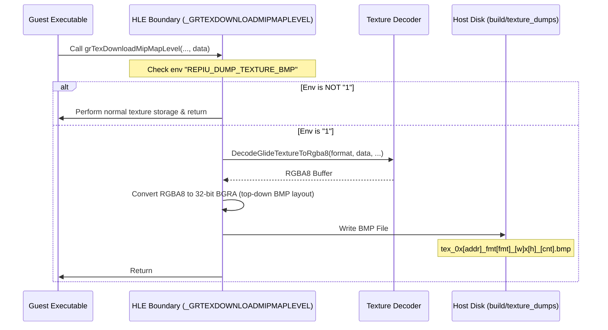

# 20260721-257-texture-bmp-dump

## 개요 (Overview)

현재 텍스처 데이터가 정상적으로 처리되고 있는지 확인하기 위해, 텍스처 로드 시점(`_GRTEXDOWNLOADMIPMAPLEVEL@32`)에 원본 게스트 버퍼를 복제 및 디코딩하여 BMP 파일로 덤프하는 진단 기능을 추가한다.
To verify if texture data is processed correctly, we implement a diagnostic feature that copies, decodes, and dumps the original guest texture buffer to a BMP file at texture load time (`_GRTEXDOWNLOADMIPMAPLEVEL@32`).

---

## 설계 및 동작 흐름 (Design & Execution Flow)

이 기능은 오버헤드를 막기 위해 환경변수 `REPIU_DUMP_TEXTURE_BMP=1`이 명시적으로 세팅되었을 때만 작동한다.
To prevent overhead, this feature runs only when the environment variable `REPIU_DUMP_TEXTURE_BMP=1` is explicitly set.

---

## 작업 항목 (Tasks)

1. **linexe_glide_boundary.cpp 수정**:
   - `DumpTextureToBmp` 헬퍼 함수를 구현하여 RGBA8 버퍼를 Windows 32비트 BGRA BMP 형식으로 변환하여 저장하는 로직 작성.
   - `_GRTEXDOWNLOADMIPMAPLEVEL@32` 게이트 핸들러에 `REPIU_DUMP_TEXTURE_BMP` 환경변수 확인 루틴 추가.
   - 조건 만족 시 `DecodeGlideTextureToRgba8`을 호출하여 텍스처 차원과 데이터 덤프를 생성.
   - 디렉토리 생성(`build/texture_dumps/`) 및 덤프 파일 저장.
2. **빌드 및 수동 검증**:
   - `REPIU_DUMP_TEXTURE_BMP=1` 환경변수와 함께 덤프 결과를 수동 테스트하여 이미지 유효성 확인.

---

## Tasks (English)

1. **Modify linexe_glide_boundary.cpp**:
   - Implement `DumpTextureToBmp` helper function to convert RGBA8 buffer to Windows 32-bit BGRA BMP.
   - In `_GRTEXDOWNLOADMIPMAPLEVEL@32`, check `REPIU_DUMP_TEXTURE_BMP`.
   - Call `DecodeGlideTextureToRgba8`, ensure the destination directory `build/texture_dumps/` exists, and write the BMP dump file.
2. **Build & Manual Verification**:
   - Manually test texture rendering with `REPIU_DUMP_TEXTURE_BMP=1` to confirm valid image dumps.
