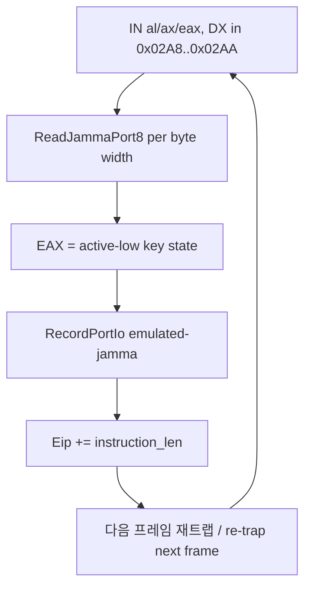

# 20260721-327-jamma-input-poll-eip-advance

## 개요 (Overview)

JAMMA 입력 포트(`0x02A8`/`0x02A9`/`0x02AA`) 읽기 처리를 NOP 자기수정 방식에서
매 폴링마다 EIP를 전진시키는 방식으로 교체하여, key press/release가 프레임
단위로 게임에 반영되도록 수정합니다.
Switch JAMMA input port read handling from self-modifying NOP patching to
per-poll EIP advancement so key press/release transitions are reflected to the
game on every frame.

관련 설계: `docs/design/20260721-327-jamma-input-poll-eip-advance.md`

---

## 변경 대상 (Scope)

* `src/platform/win32/io/port_io_emulator.cpp`
  - `HandlePortIoInstruction`의 JAMMA 입력 branch에서 `apply_nop_patch();` →
    `win32_context->Eip += instruction_len;`
* `docs/analysis/piu-io-port-specification.md`
  - 입력 포트가 EEPROM과 동일하게 NOP 패치 없이 EIP 전진으로 재평가됨을 반영.

---

## 제어 흐름 (Control Flow)

---

## 완료 조건 (Acceptance)

1. 입력 branch가 guest IN 명령을 파괴하지 않고 EIP만 전진한다.
2. 초기화/쓰기/deferred 경로의 NOP 패치 동작은 변경되지 않는다.
3. 설계·분석·작업로그 문서가 함께 갱신된다.

## 검증 절차 (Verification)

* Linux 컨테이너: MSVC/Win32 SDK 부재로 전체 빌드 불가 → 작업 로그에 사유 기록.
* Windows 권장 절차: `build_win32_x86.ps1` 재빌드 후 `pumpit1` 구동, 발판 키
  press/release가 지속적으로 반영되고 무입력 시 idle로 복귀하는지 확인.
