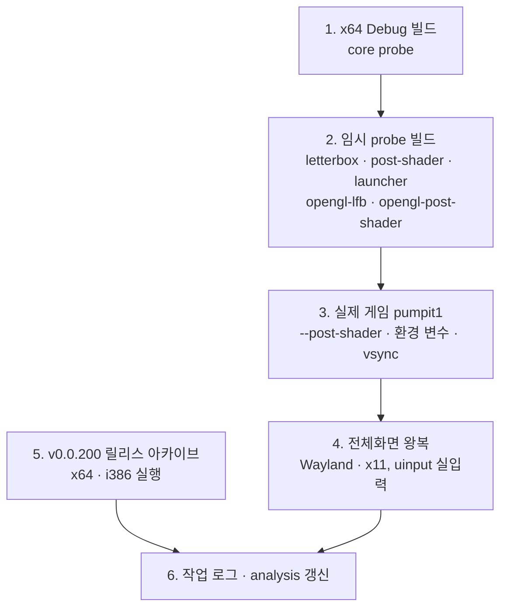
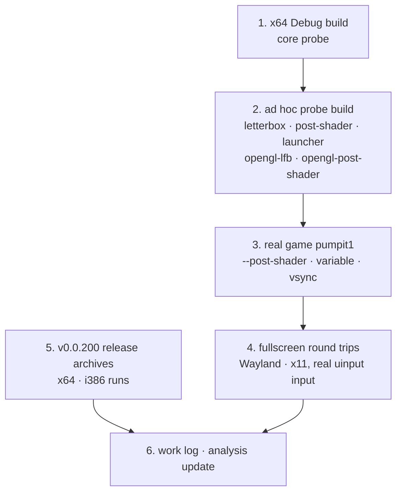

# Task 772 작업 지시: 최근 변경의 Linux 실기 검증

대상: v0.0.198 ~ v0.0.201 (Task 766 vsync 기본값, 767 Linux 릴리스 아카이브, 768 후처리 shader,
769 전체화면 전환과 4:3 유지, 771 `--post-shader`).
근거: 각 작업의 Linux 확인이 WSL(WSLg, d3d12/llvmpipe)에서만 이뤄졌거나, WSLg에서 판단을 보류한 항목이 남아 있습니다.
[Task 769 로그](../work-logs/20261004-769-fullscreen-toggle-and-aspect.md)의 "GNOME 같은 실제 Wayland에서는
확인하지 않았습니다", [Task 767 로그](../work-logs/20261003-767-linux-release-artifacts.md)의 "i386 로컬 빌드 못 함"이
대표적입니다.

코드 변경 없는 검증 작업이므로 설계 문서는 따로 두지 않습니다. 결함이 나오면 그 결함마다 별도 작업으로 설계부터 시작합니다.

## 환경

Ubuntu 26.04.1 LTS, Linux 7.0.0-38, GNOME Wayland(XWayland `:0`), NVIDIA RTX 4090(드라이버 595.91.07),
12코어, `/dev/uinput` 사용자 ACL rw. 32비트 런타임 패키지(`libc6:i386`, `libegl1:i386` 등)는 있고 32비트 개발
툴체인(multilib)은 없습니다.

## 절차

1. `scripts/build_linux_x64.sh --config Debug`로 `build/linux_x64` 전체 빌드, `repiu_core_probe` 실행
   (`launcher_command_line_options` 포함).
2. `repiu_aot_probe`·`repiu_glide_render_probe`는 `if(WIN32)` 타깃이므로 Task 769처럼 저장소 밖(scratchpad)에서
   probe 소스를 `librepiu_exe.a`에 링크해 임시로 빌드합니다. `--glide-letterbox`, `--post-shader`, `--launcher`,
   `--opengl-lfb`, `--opengl-post-shader`를 `SDL_VIDEO_DRIVER=wayland`(NVIDIA EGL)와 `x11`(XWayland GLX)에서 실행합니다.
   WSL에서 false였던 `glide_letterbox_gl`이 NVIDIA에서 어떤지 봅니다.
3. pumpit1(Debug): `--post-shader crt`, `REPIU_POST_SHADER=none` + `--post-shader=scanline`, 값 없는 `--post-shader`
   (exit 1). 기본 vsync에서 frame 수가 디스플레이에 묶이는지 봅니다.
4. 전체화면: `/dev/uinput` 가상 키보드·포인터로 실제 커널 입력을 넣어 Wayland와 x11 각각에서 `Alt+Enter` 진입,
   더블클릭 해제, `Alt+Enter` 왕복을 하고 창 크기 로그와 화면 캡처로 확인합니다. WSLg에서 느렸던 Wayland 해제가
   GNOME(mutter)에서 바로 되는지가 핵심입니다.
5. GitHub 릴리스 v0.0.200의 `linux-x64`, `linux-i386` 아카이브를 풀어 pumpit1을 실행합니다(i386은 이 머신에서 처음).
6. 작업 로그를 쓰고, 확인된 사실을 [linux-port-frontier.md](../analysis/linux-port-frontier.md) 등에 반영합니다.

## 완료 조건

각 항목의 결과(통과·실패·실행 불가와 이유)가 작업 로그에 증거와 함께 남습니다.

---

# Task 772 Work Order: Verifying Recent Changes on Real Linux Hardware

Scope: v0.0.198 to v0.0.201 (Task 766 vsync default, 767 Linux release archives, 768 post-processing shaders,
769 fullscreen toggle with a kept 4:3 picture, 771 `--post-shader`).
Rationale: the Linux checks of these tasks ran under WSL (WSLg, d3d12/llvmpipe) only, or left items open because of
WSLg. Examples are "a real Wayland desktop (GNOME etc.) was not checked" in the
[Task 769 log](../work-logs/20261004-769-fullscreen-toggle-and-aspect.md) and "no local i386 build" in the
[Task 767 log](../work-logs/20261003-767-linux-release-artifacts.md).

This is a verification task with no code change, so it has no design document. A defect it finds starts a task of its
own, beginning with a design.

## Environment

Ubuntu 26.04.1 LTS, Linux 7.0.0-38, GNOME Wayland (XWayland on `:0`), NVIDIA RTX 4090 (driver 595.91.07), 12 cores,
user ACL rw on `/dev/uinput`. 32-bit runtime packages (`libc6:i386`, `libegl1:i386` and so on) are installed; the
32-bit development toolchain (multilib) is not.

## Steps

1. Build all of `build/linux_x64` with `scripts/build_linux_x64.sh --config Debug` and run `repiu_core_probe`
   (including `launcher_command_line_options`).
2. `repiu_aot_probe` and `repiu_glide_render_probe` are `if(WIN32)` targets, so, as in Task 769, build the probe sources
   against `librepiu_exe.a` outside the repository (in the scratchpad). Run `--glide-letterbox`, `--post-shader`,
   `--launcher`, `--opengl-lfb` and `--opengl-post-shader` with `SDL_VIDEO_DRIVER=wayland` (NVIDIA EGL) and `x11`
   (XWayland GLX). See what `glide_letterbox_gl`, false under WSL, does on NVIDIA.
3. pumpit1 (Debug): `--post-shader crt`, `REPIU_POST_SHADER=none` with `--post-shader=scanline`, and `--post-shader`
   with no value (exit 1). See whether the frame count is tied to the display under the default vsync.
4. Fullscreen: feed real kernel input through a `/dev/uinput` virtual keyboard and pointer, under Wayland and x11:
   `Alt+Enter` in, double click out, an `Alt+Enter` round trip, checked by the window-size log and screen captures.
   The key question is whether leaving fullscreen, slow on WSLg Wayland, is immediate on GNOME (mutter).
5. Unpack the `linux-x64` and `linux-i386` archives of GitHub release v0.0.200 and run pumpit1 (i386 for the first time
   on this machine).
6. Write the work log and carry confirmed facts into [linux-port-frontier.md](../analysis/linux-port-frontier.md) and
   related topics.

## Done when

Every item's result (pass, fail, or not runnable and why) is in the work log with its evidence.
